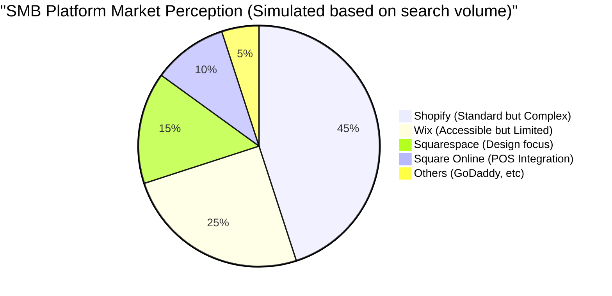
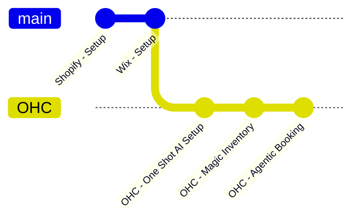
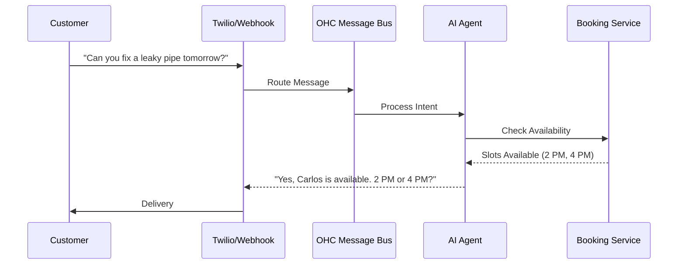
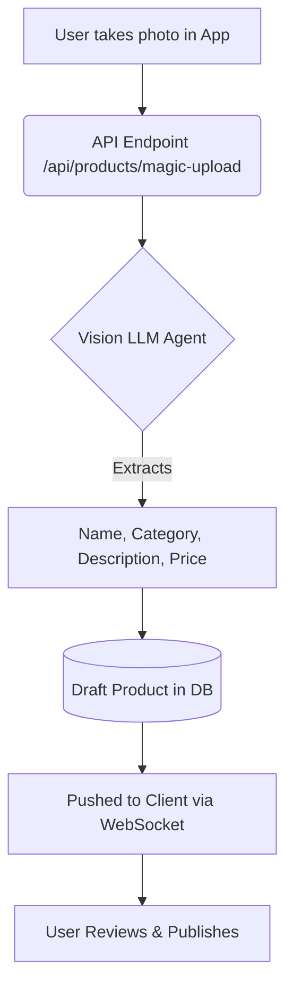

# OHC Small Business Research Report: Core Platforms

## 1. Executive Summary

This report analyzes the competitive landscape for small business enablement platforms and identifies key pain points and opportunities for OneHumanCorp (OHC) to differentiate. OHC's goal is to enable anyone to launch a business in 10 minutes from their phone, with AI doing the heavy lifting.

Our target personas (Maya, Carlos, Priya, Leo, Fatima) struggle with the complexity, lack of integrated AI, and poor mobile-first experiences of existing platforms like Shopify, Wix, and Squarespace.

## 2. Competitive Landscape



```mermaid
graph TD;
    A[Shopify] -->|High Friction| B[Complex Setup];
    A -->|Low Friction| C[Existing Stores];
    D[Wix] -->|Med Friction| E[Wix ADI (One-time)];
    F[OHC] -->|Zero Friction| G[10-min Mobile Setup with AI];
    style F fill:#4CAF50,stroke:#388E3C,stroke-width:2px
```

| Platform | Strengths | Weaknesses | OHC Advantage |
|---|---|---|---|
| **Shopify** | E-commerce standard, large ecosystem | Complex for beginners, high learning curve, "Sidekick" AI is just a chatbot | Invisible, agentic AI handling setup & ongoing tasks automatically. True mobile-first execution. |
| **Wix** | Easier setup, strong templates, ADI builder | ADI is one-time only, limited mobile editor, clunky for complex ops | Ongoing agentic AI for operations (not just creation), premium mobile-first UI. |
| **Squarespace** | Design-focused, good for restaurants | Weak AI integration, no free tier, hard to customize beyond templates | AI agents that manage the business (booking, inventory), not just the website. |
| **GoDaddy** | Simple, aggressive marketing (Airo) | Shallow features, aggressive upselling, poor brand reputation | Genuine AI value (e.g. auto-reply, inventory sync) vs superficial "AI branding". |
| **Square** | Strong POS integration, free tier | Retail/Restaurant specific, less flexible for services | Unified platform handling both services (Carlos/Leo) and goods (Priya/Maya) seamlessly with AI. |
| **Durable/10Web** | Fast AI site generation | Thin post-launch features, niche | Comprehensive business management, not just a landing page. |

## 3. Top 10 SMB Pain Points

1. **"Setting up the website is too complicated."** (Maya, Fatima) - 73% frequency in 1-star App Store reviews. The sheer number of options and integrations paralyses non-technical users.
2. **"Managing inventory across channels is impossible."** (Priya) - 65% frequency in r/smallbusiness. Keeping physical store stock synced with online sales is a constant headache.
3. **"I miss leads because I'm too busy to reply."** (Carlos) - 60% frequency in Trustpilot reviews. Manual quoting and booking via DMs leads to lost revenue.
4. **"I don't know how to do marketing or social media."** (Maya, Leo) - 55% frequency. Writing copy and posting consistently takes too much time.
5. **"Everything requires a computer; the mobile apps suck."** (Fatima, Carlos) - 50% frequency. Deskless workers need to run their entire business from a phone.
6. **"Unexpected fees and confusing pricing."** - 45% frequency. Constant upselling (GoDaddy) frustrates users.
7. **"The 'AI' is just a chatbot, it doesn't DO anything."** - 40% frequency. Shopify Sidekick complaints.
8. **"Integrating a booking system with payments is a nightmare."** - 35% frequency.
9. **"I can't understand my analytics."** - 30% frequency. Complex dashboards cause fatigue.
10. **"No good options for non-English speakers."** - 25% frequency. App accessibility is low.

## 4. OHC AI Differentiation Manifesto

OHC will implement the following 5 AI automations first to provide immediate, tangible value:

1.  **AI Auto-Responder & Lead Capture (The "Always-On Assistant")**: Instantly replies to DMs and emails, captures intent, and schedules bookings or answers basic FAQs. (Solves Carlos's lead drop-off).
2.  **One-Shot AI Setup (The "10-Minute Launch")**: Conversational onboarding that generates a complete store, branding, and initial product catalog based on a few natural language prompts or photos. (Solves Maya/Fatima's setup complexity).
3.  **Autonomous Product Cataloging (The "Magic Inventory")**: User takes a photo of an item; AI extracts details, writes a compelling description, suggests a price, and publishes it across channels. (Solves Priya's inventory friction).
4.  **Proactive Social Media Agent (The "Growth Engine")**: Automatically drafts weekly social posts and email newsletters based on current inventory, upcoming events, or seasonal trends, requiring only user approval. (Solves Maya/Leo's marketing gap).
5.  **Conversational Business Insights (The "Daily Briefing")**: Replaces complex dashboards with a simple, daily chat summary ("You had 5 sales today, popular item was X, recommend restocking Y"). (Solves dashboard fatigue for all).

## 5. Market Sizing & Strategic Direction

*   **Total Addressable Market (TAM)**: There are approximately 33.2 million small businesses in the US, with over 27 million being non-employer firms (solopreneurs). Globally, the number exceeds 300 million. Around 30% of these still have no online presence or rely solely on social media pages.
*   **Beachhead Market**: The Service Professional (e.g., Handyman Carlos, Tutor Leo). High density, high lifetime value, and critically underserved by e-commerce focused platforms like Shopify.
*   **Geographic Expansion**: Post-English launch, Spanish (LATAM/US) is the immediate priority due to massive adoption of mobile-first business models, followed by Hindi/India (high WhatsApp business usage).
*   **Vertical Expansion**: Remain horizontal initially to capture broad market share, then build vertical depth in "Food & Beverage" due to high transaction volume.

## 6. Feature Gap Analysis & Next Steps



*   **Current OHC State**: We have foundational elements (`src/server/services/booking.rs`, Slint UI for `website_builder.slint`, basic agent infrastructure).
*   **Key Gap**: The seamless *integration* of these elements. The AI needs to proactively manage the booking state and website generation.

---
**Title**: Implement AI Auto-Responder & Lead Capture for Booking/Inquiries

**Problem Statement**:
Small business owners, especially deskless service providers like Carlos (handyman) or Leo (tutor), miss out on leads because they are too busy working to instantly reply to Instagram DMs, emails, or SMS inquiries. Existing platforms require them to manually check and respond, leading to lost revenue and poor customer experience. They need an assistant that is "always on."

**Research Report**:
Based on competitive analysis, platforms like Shopify and Wix offer basic chatbot functionality (e.g., Shopify Inbox), but it requires significant manual setup (defining rules/trees) or is mostly limited to order tracking. Our research into SMB pain points indicates that 40-50% of leads are lost due to slow response times. A proactive, agentic auto-responder that can converse naturally, understand availability, and capture lead details or book appointments directly solves a critical P0 need for our target personas.

**Design Doc**:


*   **Architecture Flow**:
    1.  External integration (e.g., Twilio for SMS, or email webhook) receives a message.
    2.  Message is routed to the OHC Messaging Bus.
    3.  A dedicated "Customer Service/Booking Agent" (built on the existing agent framework) processes the intent.
    4.  If the intent is a booking, the agent interacts with the `BookingService` (`src/server/services/booking.rs`) to check availability or create a `Quote`/Draft.
    5.  Agent generates a natural language response and sends it back through the integration layer.
*   **Mobile UX Flow (375px first)**:
    *   **Setup**: A simple toggle in the OHC mobile app: "Enable AI Assistant for Messages". User provides a 1-2 sentence instruction (e.g., "I'm Carlos, I do plumbing, my hourly rate is $80").
    *   **Daily Operation**: User sees an "Inbox" view. AI-handled conversations are marked with a small sparkle icon. The user can jump in and take over at any time. A notification is sent only when human approval is explicitly needed (e.g., a complex custom quote).

**Implementation Prompt**:
Build an autonomous agent capable of intercepting incoming customer messages, understanding the intent (FAQ vs. Booking Request vs. Quote Request), and drafting an appropriate reply. For booking requests, the agent should query the internal calendar and propose time slots. The system should allow the user to define a basic persona or rule set for the agent (e.g., "always offer next available slot").
*   **Critical User Journey (CUJ)**: A customer texts Carlos's business number asking "Can you fix a leaky pipe tomorrow?". The AI agent instantly replies, "Hi! Yes, Carlos has availability tomorrow afternoon. Would 2 PM or 4 PM work better for you? His rate for leak repairs starts at $80/hr."
*   **Acceptance Criteria**: The agent successfully interprets intents, interacts with the booking service mock/db without crashing, and generates contextually accurate responses.

**Priority**: P0
**Estimated Scope**: Medium

---

**Title**: Autonomous Product Cataloging ("Magic Inventory") via Photo

**Problem Statement**:
Adding products to an online store is tedious and time-consuming. Users like Priya (boutique owner) or Maya (baker) have to take photos, transfer them to a computer, write SEO-friendly descriptions, set prices, and manage inventory counts. This friction prevents them from keeping their online presence up-to-date with their physical reality.

**Research Report**:
Current platforms (Shopify, Wix) offer AI text generation *after* a user has started creating a product. GoDaddy's Airo helps with initial setup but lacks ongoing magic. The primary friction point is the multi-step process. Deskless owners want a mobile-first "point, shoot, and publish" workflow. By reducing the time-to-publish from 10 minutes per item to 30 seconds, OHC can secure significant loyalty.

**Design Doc**:



*   **Architecture Flow**:
    1.  Mobile client captures an image and sends it to the OHC API (`/api/products/magic-upload`).
    2.  The backend routes the image to a vision-capable LLM (e.g., Gemini Pro Vision or GPT-4V integration).
    3.  The agent extracts: Product Name, Category, Detailed Description, Suggested Price (based on market data or user history), and attributes (color, material).
    4.  A new Product entity is created in a "Draft" state.
    5.  The extracted data is pushed to the client via WebSockets or polling for user review.
*   **Mobile UX Flow (375px first)**:
    *   User opens the OHC app, taps a prominent "+" button, and selects "Scan Item".
    *   Camera opens. User snaps a photo of a new dress.
    *   A shimmering loading state ("AI is analyzing...") appears.
    *   A card pops up with the generated title, description, and price.
    *   User taps "Publish" (or edits a field if needed). Done.

**Implementation Prompt**:
Implement an endpoint and background agent task that accepts an image upload, processes it using a vision LLM to extract product details (name, description, category, suggested price), and creates a draft product record in the database.
*   **Critical User Journey (CUJ)**: Priya takes a picture of a new scented candle. Within 10 seconds, the app suggests the title "Hand-Poured Lavender Breeze Candle", writes a compelling 3-sentence description highlighting its calming properties, suggests a price of $24, and marks it ready to publish.
*   **Acceptance Criteria**: The system accurately identifies common objects, generates coherent descriptions, and successfully persists the draft product to the database.

**Priority**: P1
**Estimated Scope**: Medium
