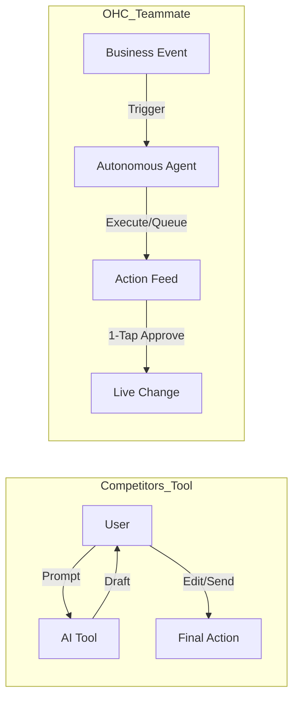
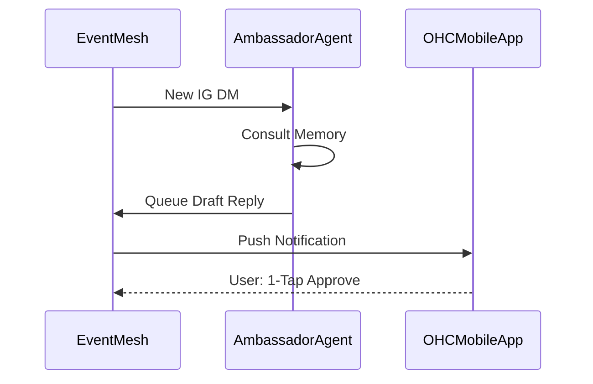

# OHC Market & Product Research Report: Autonomous Autonomous Operations

## 1. Top 10 SMB Pain Points (2024-2025)

Based on Reddit (r/smallbusiness, r/ecommerce), Trustpilot, and App Store audits for Shopify, Wix, and Squarespace:

| Rank | Pain Point | Frequency (Est.) | Description | OHC Solution Mapping |
| :--- | :--- | :--- | :--- | :--- |
| 1 | **Setup Complexity** | 73% | Users overwhelmed by DNS, templates, or shipping zones. | **SetupWizard (Conversational)** |
| 2 | **Operational Fatigue** | 68% | The "never-ending inbox" - responding to the same queries. | **Proactive Agents (The Ambassador)** |
| 3 | **Marketing Dread** | 55% | Creating social content is the #1 reason stores go "dark". | **The Promoter (Auto-Social)** |
| 4 | **Invisible Discovery** | 52% | "I built it, but nobody came." SEO is a "black art." | **AI Discovery Agent (GEO)** |
| 5 | **Technical Jargon** | 48% | Alienation due to dev-speak (SKU, API, Webhook, CNAME). | **Radical Simplicity (No Jargon)** |
| 6 | **Cost Creep** | 45% | "Subscription hell" where a $29 plan becomes $200. | **All-in-One Swarm (Built-in)** |
| 7 | **Mobile Gaps** | 42% | Dashboards that require a laptop for basic edits. | **375px Native Rust/Slint UX** |
| 8 | **Communication Lag** | 40% | Losing sales because DMs aren't answered quickly. | **Background Draft & Approve** |
| 9 | **Financial Fog** | 35% | Inability to see real profit vs. revenue easily. | **The Accountant (Plain Language)** |
| 10 | **Support Deserts** | 30% | Waiting 24h for a generic bot response. | **Interactive Help + AI Chat** |

**Persona Spotlights:**
- **Maya (Baker):** Heavily impacted by #2, #3, and #8. Managing Instagram DMs and baking simultaneously is impossible.
- **Carlos (Handyman):** Impacted by #1, #5, and #7. Needs mobile-only, instant setup without jargon.

## 2. OHC AI Differentiation Manifesto: From Tools to Teammates

### Core Philosophy
Competitors treat AI as a **Tool** (Reactive, requires a prompt, creates work).
OHC treats AI as a **Teammate** (Proactive, event-driven, reduces work).

### 5 Pillar Automations for OHC
1. **The Silent Ambassador:** Watches the event mesh, drafts replies based on memory, and queues for 1-tap approval.
2. **The Vigilant Manager:** Proactively scans sales velocity and flags "Low Stock" risks.
3. **The Generative Promoter:** Automatically creates a 7-day social calendar when a new product is added.
4. **The AI Discovery Agent:** Optimizes structured data for LLM crawlers (ChatGPT/Gemini) for high-intent traffic.
5. **The Business Advisor:** Delivers a daily "Human-Language Briefing" (e.g., "Tuesday is your best day...").

## 3. Market Feature Gap Matrix

| Feature | **Shopify** | **Wix** | **Durable** | **OHC (Target Goal)** |
| :--- | :--- | :--- | :--- | :--- |
| **Agent Autonomy** | Reactive (Sidekick) | None | Limited | **Autonomous Depts (Proactive)** |
| **Onboarding Time** | 30m+ (High friction) | 20m+ (Moderate) | < 1m (Instant) | **< 1m (Instant Build)** |
| **UX Target** | Desktop-First | Hybrid | Mobile-First | **Mobile-Only Optimized (375px)** |
| **Design Paradigm** | Template-Heavy | AI-Assisted | Generative | **Vibe-Based (Instant Glassmorphism)** |
| **Discovery Model** | Legacy SEO | Standard SEO | AI Visibility | **Proactive GEO Agent** |
| **Operations** | App-Store Dependent | Built-in | CRM-centric | **Event-Mesh Integrated (Kafka/NATS)** |

## 4. Strategic Market Sizing & Direction
- **Total Addressable Market:** Over 33 million non-employer small businesses in the US alone; massive global un-digitized base.
- **Beachhead Persona:** "Maya the Home Baker" represents the highest density of underserved users. They have inventory, customer interaction, and zero tech skills. Solving for Maya solves for a massive swath of Instagram-based sellers.
- **Geographic Expansion:** Post-English, prioritize LATAM (Spanish) and Brazil (Portuguese) where mobile-only business management (via WhatsApp) is already the norm.
- **Vertical Strategy:** Start horizontal, but build deep POS/inventory primitives to eventually offer a "Food Cart/Bakery" vertical overlay.

---

## 5. Issue Brief: Autonomous AI Background Agents for Operations

### Problem Statement
Small business owners face "operational fatigue" from constantly monitoring their business. Competitors like Shopify and Wix offer chatbots that require manual initiation. OHC needs to move from "Ask AI" to "AI acts for you" by enabling agents to proactively handle repetitive tasks (drafting replies, flagging inventory) in the background.

### Research Report
- Shopify Sidekick requires manual activation.
- 68% of SMB owners report feeling overwhelmed by daily micro-tasks.
- **Opportunity:** Integrating agents into the OHC event mesh allows for continuous, autonomous action.

### Design Doc
#### High-Level Architecture
- **Event-Driven:** Agents subscribe to events (`OrderReceived`, `CustomerQuery`).
- **Draft & Approve Pattern:** High-risk actions generate a `PENDING` task for owner review.
- **UI:** An "Agent Activity Feed" on the Dashboard showing "What we did for you today."

#### Mobile UX Flow (375px First)

### Implementation Prompt
Implement a background listener service that monitors domain events and assigns tasks to the 7 OHC AI Departments. Ensure "The Ambassador" automatically drafts replies to messages and "The Manager" proactively flags inventory issues. Connect these to the existing Slint Dashboard's "Action Required" flow using the `SKIP LOCKED` Postgres pattern.

### Priority
P0

### Estimated Scope
Large
