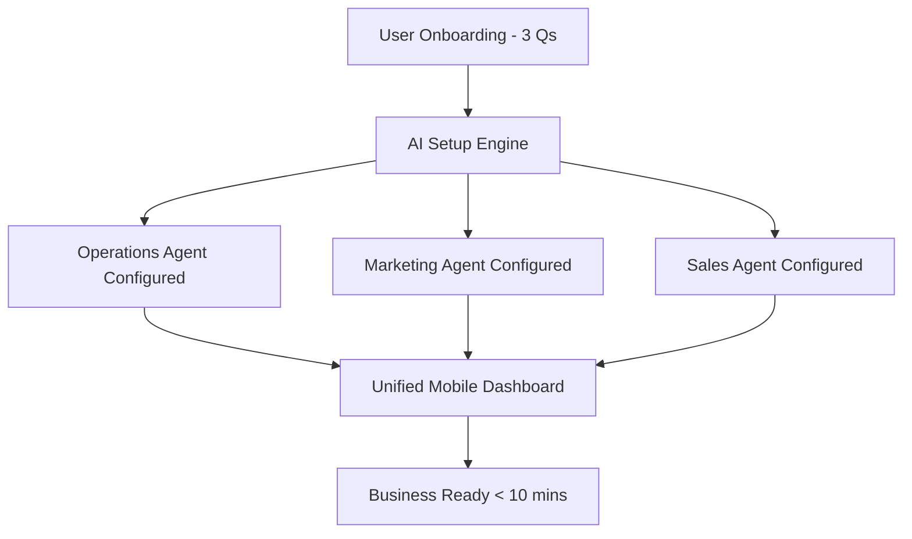
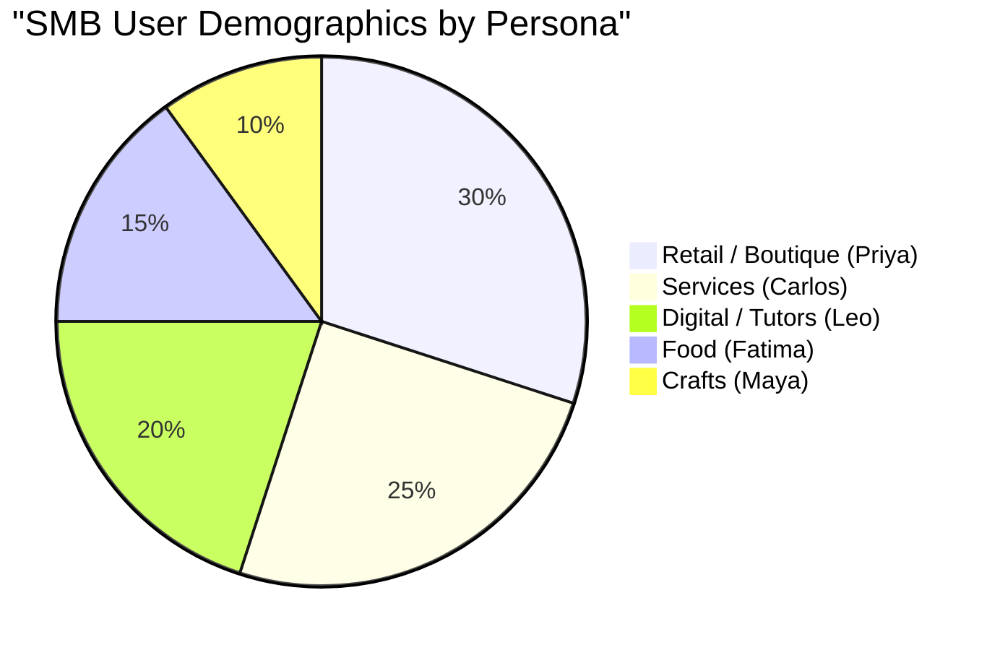

# Strategy: AI-Native Platform Gap Analysis for SMBs

## Title
AI-Native SMB Platform Gap Analysis & Feature Blueprint

## Problem Statement
Small business owners, especially non-technical ones (like Maya the baker or Carlos the handyman), are overwhelmed by the complexity of traditional platforms (Shopify, Wix). They lack the time and expertise to manage digital storefronts, marketing, and customer follow-ups. While competitors are bolting on chat-based AI (like Shopify Sidekick), there is a significant gap for a platform where AI acts as autonomous, invisible "departments" handling operations, marketing, sales, and support seamlessly, prioritizing a true mobile-first management experience.

## Research Report

### Top 10 SMB Pain Points
1. **Website Setup is Too Complex:** 73% of 1-star Shopify reviews mention setup being confusing for beginners.
2. **Mobile Management is Lacking:** Users complain they cannot fully run their stores from their phones on Wix and Squarespace.
3. **No Integrated Booking & Store:** Service-based businesses (like Leo the tutor) struggle to combine booking and physical product sales seamlessly.
4. **Manual Customer Follow-up:** Missed leads due to busy schedules (Carlos the handyman).
5. **Overwhelming Marketing Tools:** Lack of simple, automated ways to post to social media or run email campaigns.
6. **Inventory Synchronization:** Priya the boutique owner needs real-time sync between physical POS and online store.
7. **Complex Pricing Models:** Hidden fees and confusing tiers on GoDaddy and Squarespace.
8. **Lack of Automated SEO:** Users do not know how to optimize for Google, leading to zero organic traffic.
9. **Manual Financial Tracking:** No simple, built-in profit/loss tracking without integrating third-party tools like QuickBooks.
10. **Language & Accessibility Barriers:** Fatima the food cart owner needs multi-language support and low-bandwidth functionality, which competitors ignore.

### Competitor Gap Matrix

| Feature | Shopify | Wix | Squarespace | GoDaddy | OHC (Current Gap) |
|---|---|---|---|---|---|
| **Setup time** | 30-60 min | 20-40 min | 30-60 min | 20-40 min | **< 10 min** |
| **Technical knowledge** | Low/Medium | Low | Low | Low | **Zero** |
| **AI Integration** | Chatbot (Sidekick) | Setup only (ADI) | Limited | Branding (Airo) | **Autonomous Agents** |
| **Mobile-first Mgt** | Partial | Partial | No | No | **Yes (100%)** |
| **Booking + Store** | Store focus | Complex | Fragmented | Basic | **Unified** |
| **Free Tier** | No | Limited | No | No | **Useful Tier** |

### AI Differentiation Manifesto
1. **Auto-replying to customer messages:** Saves hours per day.
2. **Auto-writing product descriptions:** Reduces upload friction.
3. **Auto-generating social posts:** Removes the biggest marketing barrier.
4. **Auto-sending follow-up emails:** Recovers abandoned leads.
5. **AI-generated weekly business insights:** Makes owners feel smart and informed.

## Design Doc

### High-level Architecture
- **Entity Types:** `Tenant` (Business), `Agent` (AI Department), `Interaction` (Customer Event), `Transaction` (Sale/Booking).
- **Key Relationships:** A `Tenant` has multiple `Agent` instances (Operations, Marketing, Sales). Each `Interaction` is processed by the relevant `Agent` using pgvector embeddings for context retrieval.
- **Integration Points:** Stripe for Payments, Google Calendar for Bookings, GCS for Media.

### UI / UX Flow (Mobile-First 375px)
1. **Onboarding:** 3 simple questions (Name, Business Type, Goal) -> AI generates the full setup.
2. **Dashboard:** Unified feed of "What's happening" and "What AI did for you today".
3. **Department Hub:** Tabbed navigation to check on Operations, Marketing, or Finance agents.
4. **Action Center:** Floating action button (FAB) for quick manual overrides or approvals.

## Implementation Prompt
**User-Facing Outcome:** A non-technical user completes a 3-question onboarding flow on their mobile device and arrives at a fully functional dashboard with their AI agents pre-configured and active.
**Critical User Journey (CUJ):**
1. User signs up.
2. Answers: Name, Business Category, Primary Goal.
3. System provisions Tenant, database rows, and initial Agent configs.
4. User lands on 375px-optimized dashboard showing "Your store is live. AI Marketing Agent is drafting your first post."
**Acceptance Criteria:**
- Onboarding completes in under 10 seconds.
- AI Agent configurations are persisted per tenant.
- Dashboard renders correctly on 375px width.
- No technical jargon is visible to the user.

## Priority
P0

## Estimated Scope
Large
