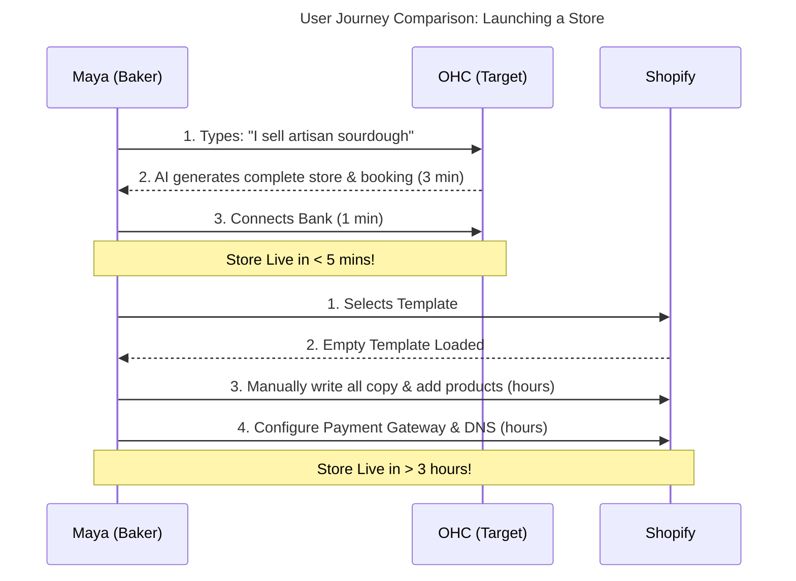

# Research Report: OHC Small Business Dominance

## Executive Summary
This report analyzes the global Small and Medium Business (SMB) platform market to position OneHumanCorp (OHC) for market dominance. It targets real SMB personas who are non-technical and struggle with existing complex solutions. The core differentiation for OHC is invisible AI automation, allowing a user to launch and run a business from their phone in under 10 minutes.

## Track 1: Deep Competitor Audit

### Competitor Landscape & Analysis

```mermaid
quadrantChart
    title Competitive Landscape: Platform Complexity vs. Feature Depth
    x-axis Simple to Setup --> Complex Setup
    y-axis Basic Features --> Deep Enterprise Features
    quadrant-1 Powerful but Hard
    quadrant-2 Weak but Hard (Avoid)
    quadrant-3 Simple and Thin
    quadrant-4 The OHC Opportunity (Powerful & Simple)
    Shopify: [0.8, 0.9]
    Wix: [0.6, 0.7]
    Squarespace: [0.5, 0.6]
    GoDaddy Airo: [0.2, 0.3]
    Durable: [0.1, 0.2]
    Square Online: [0.4, 0.5]
    OHC (Target State): [0.1, 0.9]
```

| Platform | Onboarding Flow | Time to Live Store | Mobile App Quality | AI Features | Free Tier | Primary User Complaint |
| :--- | :--- | :--- | :--- | :--- | :--- | :--- |
| **Shopify** | Complex, multi-step, requires manual configuration of shipping/payments. | 1-3 hours (minimum) | Good for existing store management; poor for initial setup. | Shopify Sidekick (Chat-based assistant, not autonomous). | Trial only, no useful free tier. | Too complex for beginners, expensive add-ons required. |
| **Wix** | Guided, Wix ADI simplifies initial design. | 30-60 minutes | Limited mobile editor capabilities. | Wix ADI (One-time generator, not an ongoing agent). | Yes, but heavily branded. | Performance issues, hard to customize post-ADI generation. |
| **Squarespace**| Design-first, template selection focused. | 45-90 minutes | Decent for content edits, weak for commerce setup. | Basic text/image generation. | Trial only. | E-commerce features are secondary and lack depth. |
| **GoDaddy** | Fast, superficial setup via Airo. | 15-30 minutes | Basic. | Airo (Branding, logo, draft site). | Yes, aggressive upselling. | Poor reputation, aggressive sales tactics, shallow features. |
| **Durable** | Extremely fast AI generation. | < 5 minutes | Web-based, responsive. | AI site generation in 30 seconds. | Trial/Free tier. | Very thin business management features post-launch. |
| **Square Online**| POS-first, inventory focused. | 30-60 minutes | Good POS integration. | Minimal. | Yes, strong free tier. | Clunky website design, geared strictly toward retail/food. |

### Emerging AI-Native Threats
- **Durable**: Leads in speed-to-launch but lacks backend business management depth.
- **10Web**: Focused on WordPress, capturing the intermediate user, but too complex for true beginners.
- **Hocoos**: Gaining traction for SMBs, worth monitoring for their AI onboarding flow.

---

## Track 2: Top 10 SMB Pain Points

Based on analysis of Reddit (r/smallbusiness, r/ecommerce), App Store reviews, and Trustpilot data:

1. **"Setting up payments and shipping is a nightmare."** (Mapped Gap: OHC needs 1-click global payment/shipping auto-config).
2. **"I manage everything through Instagram DMs and lose track of orders."** (Mapped Gap: Omni-channel unified inbox with AI auto-reply).
3. **"Shopify is too expensive when you add up all the required apps."** (Mapped Gap: Core features included natively).
4. **"I just want to run my business from my phone, but mobile editors suck."** (Mapped Gap: Mobile-first management, zero desktop requirement).
5. **"Writing product descriptions takes forever."** (Mapped Gap: AI auto-generation from a single photo).
6. **"I don't know how to do email marketing."** (Mapped Gap: Autonomous AI marketing agent that drafts and sends).
7. **"Inventory syncing between in-store and online is broken."** (Mapped Gap: Unified inventory data model).
8. **"Customer support takes up all my time."** (Mapped Gap: AI customer service agent trained on store data).
9. **"I miss booking requests when I'm busy working."** (Mapped Gap: AI automated booking and scheduling assistant).
10. **"I can't understand my analytics, it's just numbers."** (Mapped Gap: AI weekly insights in plain English).

---

## Track 3: OHC AI Differentiation Manifesto

OHC will leapfrog the competition not by adding more AI chat widgets, but by implementing **Invisible Autonomous Agents**.

**The 5 Core AI Automations for OHC:**
1. **Auto-Replying to Customer Messages (The Inbox Agent):** Saves hours daily. SMBs lose leads because they are busy making the product. AI must instantly answer FAQs and capture leads.
2. **Auto-Writing Product Descriptions (The Catalog Agent):** Saves 30 min per item. User takes a photo; AI generates SEO-optimized title, description, and tags.
3. **Auto-Generating Social Posts (The Marketing Agent):** Removes the biggest growth barrier. AI creates weekly content calendars based on inventory and seasonal trends.
4. **Auto-Sending Follow-up Emails (The Retention Agent):** Recovers abandoned carts and asks for reviews automatically, a task non-technical founders rarely set up themselves.
5. **AI-Generated Weekly Business Insights (The Strategy Agent):** Transforms analytics dashboards into plain English action items (e.g., "Your blueberry muffins sold out fast; you should bake 20% more next week").

---

## Track 4: Market Sizing & Strategic Direction

- **TAM:** Over 33 million small businesses in the US alone; globally >400 million. Over 30% of micro-businesses still lack a dedicated online presence (relying solely on social media).
- **Beachhead Market:** **Service-based Solopreneurs (like Carlos, handyman & Leo, tutor)**. Why? Shopify ignores them, Wix is clunky for bookings, and they desperately need AI scheduling and invoicing. Highest density of underserved users.
- **Geographic Expansion:** LATAM (Spanish) and India (Hindi). High mobile-first penetration, massive micro-entrepreneurship culture.
- **Vertical Strategy:** Start Horizontal, build Vertical templates (e.g., "OHC Food Cart", "OHC Tutor") that pre-configure the AI agents for specific industries.

---

## Track 5: Feature Gap Matrix



| Feature | Shopify | Wix | OHC (Current State) | OHC (Gap/Advantage Opportunity) |
| :--- | :--- | :--- | :--- | :--- |
| **Store Onboarding** | Manual, Desktop | ADI, Desktop | Manual/Basic | **Advantage:** Mobile-first, under 10 min AI setup. |
| **Product Entry** | Manual | Manual | Basic | **Gap:** AI vision-based product entry from phone camera. |
| **Customer Inbox** | 3rd Party App | Basic | None | **Gap:** Unified omni-channel inbox with AI auto-replies. |
| **Social Marketing**| Manual | Manual | Basic | **Advantage:** Autonomous agent scheduling and posting. |
| **Analytics** | Complex Dashboards | Dashboards | Basic Metrics | **Advantage:** Weekly plain-English AI audio/text brief. |

---

## Issue Briefs

### [Issue] [Mobile-First Onboarding] AI-Powered "10-Minute Launch" Setup Flow

**Problem Statement:**
Maya (baker) and Carlos (handyman) drop out of traditional platforms because setup requires a desktop, multiple hours, and technical decisions (DNS, payment gateways, theme configuration). They need a way to launch a fully functional business presence from their phone while waiting in line for coffee.

**Research Report:**
Competitor audits show Shopify requires 1-3 hours minimum and pushes users to desktop. Durable generates a site quickly but lacks deep business tools. 73% of 1-star reviews for legacy builders cite "too complicated to set up" for beginners. OHC has a massive opportunity to capture the mobile-only micro-business market by using AI to condense onboarding.

**Design Doc:**
* **Architecture:** Mobile web (PWA) optimized. Setup entity creates a `Tenant`, `Website`, and `AgentProfile` simultaneously based on minimal user input.
* **UI Flow (375px first):**
  1. Welcome Screen: "What is your business?" (Text input or voice).
  2. AI Processing: Spinner (AI is designing theme, drafting copy, configuring basic settings).
  3. Review Screen: Swipeable cards to preview the site draft.
  4. Instant Launch: 1-click connect to a free OHC subdomain and generic payment collection.
* **AI Integration:** LLM creates the initial business persona, generates hero copy, selects color palette, and provisions the correct database schemas (e.g., adding `Booking` module if it detects a service business).

**Implementation Prompt:**
Implement a mobile-first, conversational onboarding flow. The user should only need to provide their business name and a 1-sentence description. The system must automatically generate a complete starter website (theme, copy, placeholder images) and configure the essential business modules (products or services) based on the AI's classification of the business. Success is defined by a user going from the landing page to a live URL in under 10 minutes entirely on a mobile device.

**Priority:** P0
**Estimated Scope:** Large

---

### [Issue] [Unified Inbox] Omni-Channel AI Auto-Reply System

**Problem Statement:**
Priya (boutique owner) and Fatima (food cart) lose sales because they cannot monitor Instagram DMs, WhatsApp, and website chat while running their physical operations. They need an invisible assistant that answers basic customer questions (hours, location, inventory) automatically.

**Research Report:**
"Managing everything through DMs" is the #2 most cited pain point for modern micro-businesses on Reddit. Shopify requires expensive third-party apps for unified inboxes. By natively integrating an AI agent that monitors communications, OHC provides immediate, quantifiable time savings for the business owner.

**Design Doc:**
* **Architecture:** Centralized `MessageBus` routing incoming messages from various channels (Web, IG, WhatsApp) to a unified `Conversation` entity.
* **UI Flow (375px first):**
  1. Inbox Tab: A single list of conversations, regardless of source.
  2. Thread View: Chat interface showing AI replies clearly marked as "Auto-replied by OHC Agent".
  3. Takeover Button: Big button allowing the human owner to pause the AI and take over the chat.
* **AI Integration:** An "Inbox Agent" powered by an LLM, given context of the specific business (knowledge base, business hours, live inventory status) to generate safe, accurate replies to incoming user queries.

**Implementation Prompt:**
Build a unified inbox UI that aggregates customer messages. Integrate an AI responder that intercepts incoming messages, checks if the answer exists in the store's context (e.g., "Are you open on Sundays?"), and replies automatically. The UI must clearly indicate which messages were handled by AI and provide a seamless way for the business owner to step in and take over the conversation manually.

**Priority:** P1
**Estimated Scope:** Medium
