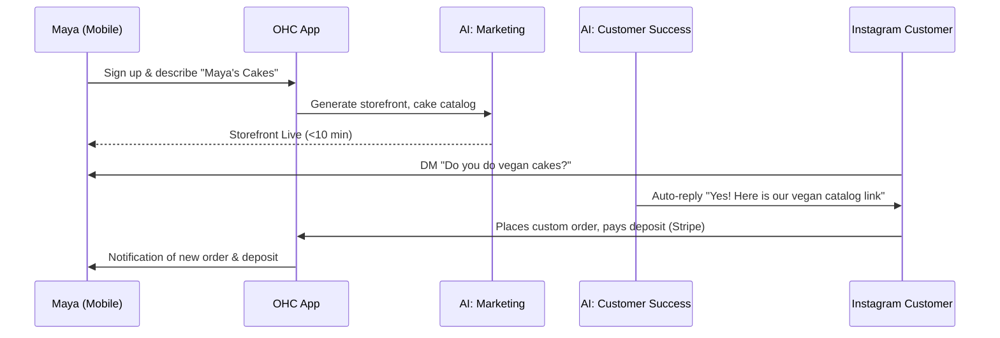
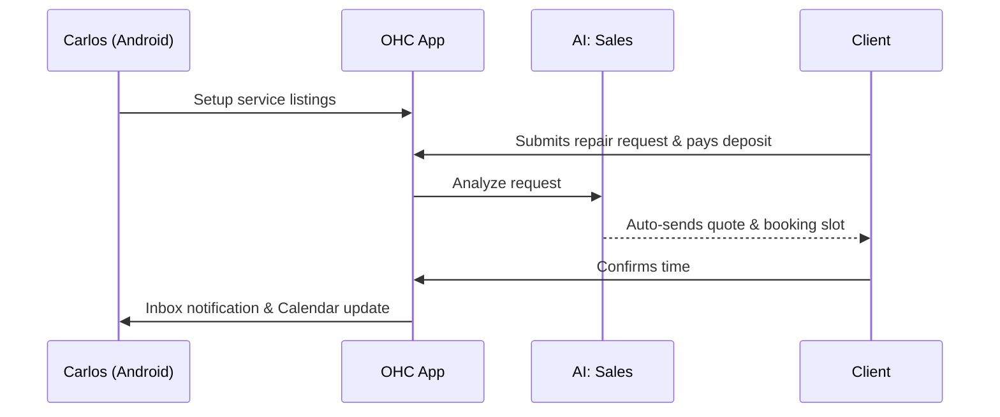
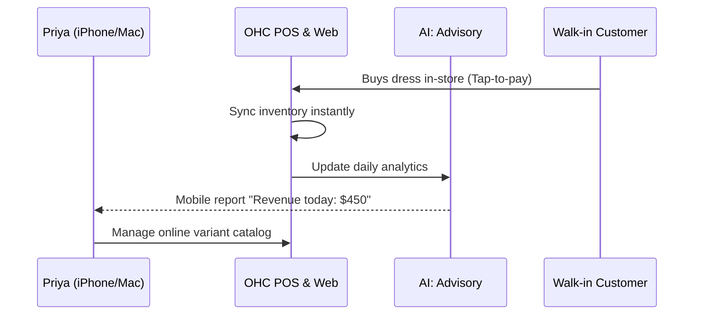
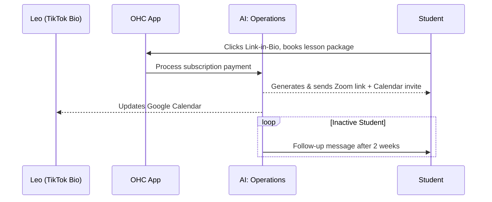
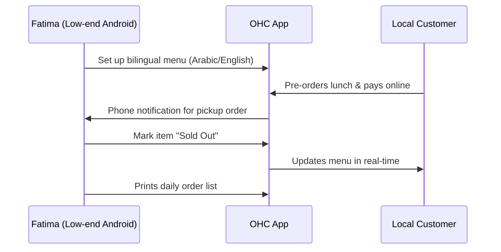

```yaml
issue_id: TBD
```

# [architecture] Business Journey Architecture

## Title
Business Journey Architecture: End-to-End User Journeys

## Problem Statement
The gap, pain point, or opportunity — framed from a non-technical small business owner's perspective.
Small business owners (bakers, handymen, boutique owners, tutors, food cart operators) are not technical and often struggle with setting up an online presence. Existing tools like Shopify or Wix take too long (30-60 min) or require technical knowledge. They need a system where they can go from idea to live business in under 10 minutes, fully managed from their mobile device, with AI invisibly taking care of all complex tasks.

## Research Report
### Findings & Market Position
OneHumanCorp aims to differentiate by targeting non-technical users and relying heavily on built-in AI agents that operate as different business departments (Operations, Marketing, Sales, Customer Success, Finance, Legal, Advisory) to handle all complex tasks.

### Competitive Analysis

| Feature | OHC | Shopify | Wix | Squarespace | GoDaddy |
|---|---|---|---|---|---|
| Setup time | **< 10 min** | 30-60 min | 20-40 min | 30-60 min | 20-40 min |
| Technical knowledge needed | **Zero** | Low | Low | Low | Low |
| AI agents (invisible) | **Yes, built-in** | Sidekick (chat only) | Wix AI | Limited | Airo (limited) |
| Mobile-first management | **Yes** | Partial | Partial | No | No |
| Booking + Store + Portfolio | **All-in-one** | Store only | All (complex) | Portfolio + store | Basic |
| Free tier | **Yes (useful)** | No | Yes (limited) | No | No |
| Target user | **Non-technical** | SMB/Tech-savvy | Semi-technical | Creative professional | Basic user |

### Persona Pain Points Summary
- **Maya (Home Baker, 28)**: Overwhelmed by complexity, needs mobile-only deposit payments and automated DMs for common questions like "do you do vegan cakes?".
- **Carlos (Handyman, 42)**: No website, needs service listings and booking deposit system, customer inbox, and automated quoting on his Android.
- **Priya (Boutique Owner, 35)**: Wants physical+online inventory sync, tap-to-pay POS, and daily mobile analytics.
- **Leo (Music Tutor, 22)**: Needs booking, calendar sync, Zoom links, subscription pricing, and portfolio link-in-bio.
- **Fatima (Food Cart, 50)**: Needs photo menu, pre-orders, sold-out toggles, bilingual support (Arabic+English), and printable lists on a low-end Android.

## Design Doc

### Architecture Diagram (Premium Mermaid.js)

#### 1. Maya (The Home Baker) Journey


#### 2. Carlos (The Handyman) Journey


#### 3. Priya (Boutique Owner) Journey


#### 4. Leo (Music Tutor) Journey


#### 5. Fatima (Food Cart Operator) Journey


### UI Wireframes & Mobile UX Flow
- **Onboarding Flow (375px baseline)**:
  - Step 1: "What do you do?" (Text input or speech-to-text)
  - Step 2: "What is your business name?"
  - Step 3: AI generates the site and catalog (Progress bar with micro-animations).
  - Step 4: "Your business is live! Connect your bank to get paid."
- **Dashboard Home**:
  - Glassmorphism header (`backdrop-filter: blur(20px) saturate(200%)`).
  - Top: "Revenue Today" and "Pending Orders" with Outfit typography.
  - Middle: AI Advisory snippet ("Fatima, you have 5 pickups in the next hour").
  - Bottom: Quick action FAB (Add product, New booking).
- **Mobile-First Constraints**:
  - All touch targets are at least 44x44px.
  - Bottom navigation for thumb reachability.
  - Native numeric keypad for price inputs.
  - Optimistic UI updates to handle slow data connections (e.g., Fatima's food cart).

### AI Agent Integration Points
- **System Prompt & Context**: Loaded from pgvector based on the `tenant_id`.
- **Department Routing**: Customer inputs route to different agents (e.g., questions to Customer Success, quotes to Sales).
- **Execution**: Redis distributed locks prevent race conditions, background jobs run via PostgreSQL `SKIP LOCKED`.


### Business Lifecycle Stages (Cross-Persona)

- **Acquisition**: Users typically discover OHC via Instagram ads targeting small business owners, organic search for "easy online booking", or friend referrals. The primary CTA is "Launch your business in 10 minutes".
- **Onboarding**: A 4-step wizard collecting just the business name, type, and bank connection, while AI builds the rest of the storefront in the background.
- **Activation**: Success is defined as the first product/service added, and the first payment received (e.g., a deposit). This should happen within Week 1.
- **Retention**: Daily retention drivers include push notifications for new orders, daily AI Advisory activity summaries (e.g., "Revenue today: $450"), and weekly comprehensive reports.
- **Revenue**: Users upgrade from Free to Starter when they reach the 10-product limit or want a custom domain. The upgrade CTA is presented contextually within the dashboard when limits are approached.
- **Referral**: A built-in viral loop allows business owners to share a "Powered by OHC" link on their storefront, offering a discount on Pro tiers for successful referrals.

### Friction Points (Abandonment Risks)

- **Payment Gateway Setup**: Connecting a bank (Stripe) is intimidating. *Solution*: Defer this step until the user receives their first order to reduce upfront friction.
- **Content Generation**: Writing descriptions is hard for non-writers. *Solution*: AI generates the initial catalog and site copy based on a single sentence prompt.
- **Domain Configuration**: DNS settings confuse non-technical users. *Solution*: OHC automatically provisions an `ohc.page` subdomain immediately, and handles custom domain mapping via a one-click integration behind the scenes.

## Implementation Prompt
Implement the end-to-end data model, API endpoints, and Flutter mobile views to support the initial 10-minute onboarding journey, the multi-tenant AI department architecture, and the core dashboard tailored for non-technical users. Focus on the mobile-first UX with Glassmorphism design system tokens. Ensure every UI component supports the 375px baseline. Create full E2E test coverage asserting the end-to-end flow from sign-up to viewing the generated dashboard. Acceptance criteria include a 100% test pass rate, functional 44x44px touch targets, offline-capable optimistic UI, and the ability to provision a storefront automatically via an AI Operations task simulation.

## Priority
P0

## Estimated Scope
Large
