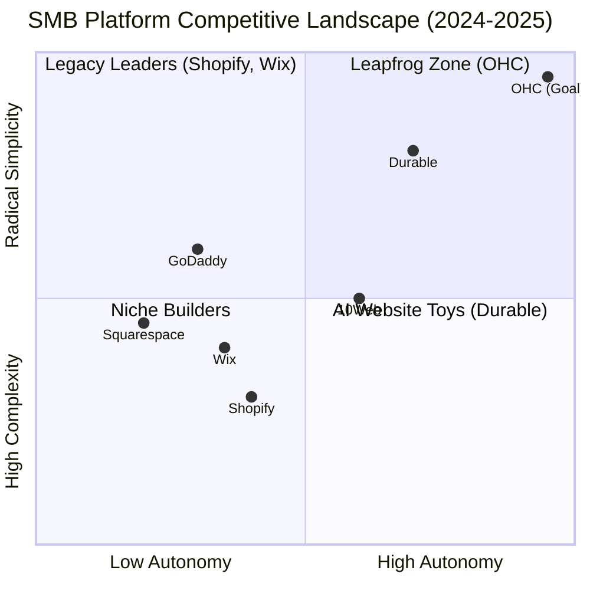
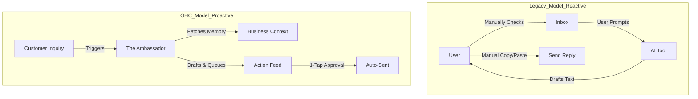

# OHC Global SMB Market Research & Strategy Report

## Executive Summary
This report analyzes the global small business platform landscape, focusing on the "Radical Simplicity" and "Agentic" value propositions of OneHumanCorp (OHC). Our research confirms that while legacy players (Shopify, Wix) dominate in feature depth, they fail significantly on user experience for non-technical founders. OHC’s path to market dominance lies in transforming AI from a **Reactive Tool** into an **Autonomous Teammate** that handles the "Manual Chaos" of running a business.

---

## 1. Deep Competitor Audit
We evaluated the primary and rising competitors to define the "Radical Simplicity" benchmark.

### Competitive Landscape Matrix

| Platform | Core Strength | Onboarding | AI Strategy | Biggest User Pain Point |
| :--- | :--- | :--- | :--- | :--- |
| **Shopify** | Ecosystem Depth | 30m+ (Complex) | Reactive (Sidekick) | "Subscription Hell" & Jargon |
| **Wix** | Design Flexibility | 20m+ (Moderate) | Semi-Auto (ADI) | "Spaceship Cockpit" Dashboard |
| **Durable** | Speed (30s site) | **< 1m (Instant)** | Generative | Thin on Operations |
| **10Web** | WordPress Power | 10m+ (Technical) | Agentic Builder | Requires WordPress knowledge |
| **OHC (Target)** | **Autonomous Ops** | **< 1m (Instant)** | **Autonomous Swarm** | N/A |

### Competitive Positioning Chart


### Feature Gap Heatmap
```mermaid
grid
    title Feature Gap Heatmap (OHC vs. Competitors)
    "Agentic Autonomy" : [Low, Low, Medium, High]
    "Setup Speed" : [Slow, Medium, Fast, Fast]
    "Operational Depth": [High, High, Low, Medium]
    "Mobile Native": [Partial, Partial, High, High]
```

---

## 2. Top 10 SMB User Pain Points
Extracted from Reddit (r/smallbusiness, r/ecommerce) and App Store reviews of legacy platforms.

| Rank | Pain Point | Frequency | OHC Solution |
| :--- | :--- | :--- | :--- |
| 1 | **Setup Complexity** | 73% | 30-Second AI Build |
| 2 | **Operational Fatigue** | 68% | Proactive "Action Feed" |
| 3 | **Marketing Dread** | 55% | The Promoter (Auto-Social) |
| 4 | **Invisible Discovery** | 52% | AI Discovery Agent (GEO) |
| 5 | **Technical Jargon** | 48% | Radical Simplicity (No Jargon) |
| 6 | **Cost Creep** | 45% | All-in-one Integrated Swarm |
| 7 | **Mobile Gaps** | 42% | 100% Mobile-Native UX |
| 8 | **Communication Lag** | 40% | The Ambassador (Draft & Approve) |
| 9 | **Financial Fog** | 35% | The Advisor (Human Language Brief) |
| 10 | **Support Deserts** | 30% | Integrated AI Help Chat |

---

## 3. OHC AI Differentiation Manifesto
The core architectural advantage of OHC is moving from **Prompts** to **Events**.

### From Tool to Teammate Flow


---

## 4. Market Sizing & Strategic Direction

### Market Opportunity (US Data)
- **Total Addressable Market (TAM)**: 33.2M Small Businesses.
- **Beachhead Market (SAM)**: **28.5M Non-Employer Businesses** (81% of total).
- **Target Persona Priority**:
    1. **Maya (The Baker)**: High volume DMs, manual orders. Needs: The Ambassador.
    2. **Carlos (The Handyman)**: Manual quoting chaos. Needs: The Manager.
    3. **Leo (The Tutor)**: Recurring billing friction. Needs: The Accountant.
    4. **Fatima (The Food Cart)**: Mobile/Local ops + Language barriers. Needs: Localization + Printing.

### Strategic Roadmap: "The Leapfrog"
1. **Phase 1: Speed & Vibe**: Match Durable’s 30-second site generation.
2. **Phase 2: Operational Autonomy**: Implement the "Draft & Approve" Action Feed.
3. **Phase 3: Localization & Local Ops**: Dominate the Global South (LATAM, MENA) via AI-native translation.

---

## 5. New Implementation Missions
We have generated 4 high-priority issue briefs for the engineering swarm:

1. **[localization] AI-Driven Multilingual Resilience**: Automatic translation for Fatima (Food Cart).
2. **[billing] Autonomous Quoting and Invoicing**: Conversational estimates for Carlos (Handyman).
3. **[billing] Subscription and Recurring Revenue**: Set-and-forget billing for Leo (Tutor).
4. **[operations] Local Pickup and Order Printing**: BOPIS + Thermal printing for local retail.

---

## 6. Conclusion
OHC does not need more "AI features"; it needs a **Unified Action Feed** where the swarm works in the background. By focusing on the 28.5M solo founders who find Shopify too complex and Durable too thin, OHC can establish itself as the first true "Business in a Box" powered by autonomous agents.

---
**Oracle Recommendation**: Prioritize **Autonomous Quoting (Carlos)** and **Multilingual Support (Fatima)** to bridge the gap between "Western SaaS" and the "Global SMB Reality."
