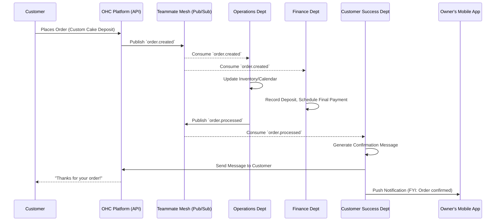
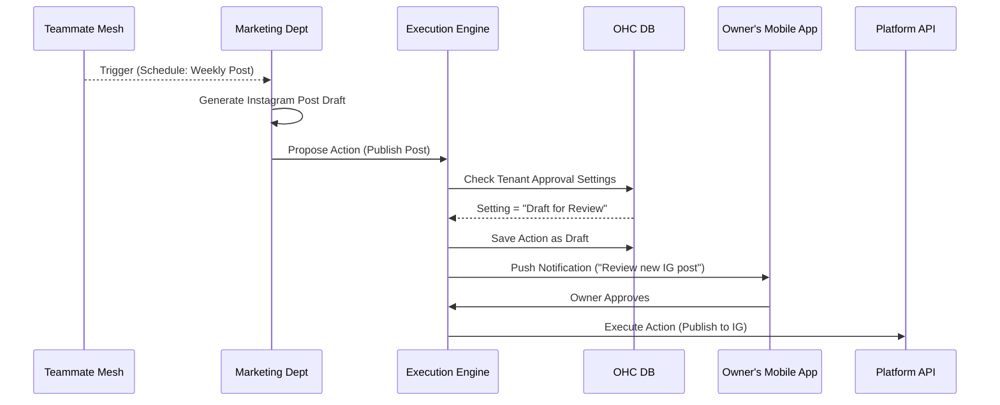

# [Architecture] AI Agent Department Architecture for Autonomous Business Operations

## Problem Statement

Small business owners—whether bakers, handymen, boutique owners, or food cart operators—often lack the time, technical expertise, and financial resources to manage the multifaceted complexities of running a business. They are overwhelmed by the cognitive load of handling operations, marketing, sales, customer service, finance, and compliance simultaneously. While platforms like Shopify and Wix offer powerful tools, they still require the business owner to actively use and manage those tools. Competitor AI solutions (like Shopify Sidekick or Wix AI) primarily act as reactive chatbots or content generators.

The gap is the need for a truly **autonomous**, invisible back-office. Small business owners need AI to function not just as a tool, but as *virtual employees* organized into familiar, functional departments that actively run the business in the background. They need an "Operations Manager," a "Promoter," an "Accountant," and an "Advisor" that coordinate with each other and execute tasks proactively.

## Research Report

### Competitive Analysis
*   **Shopify Magic & Sidekick**: Shopify integrates AI across its platform (Shopify Magic) for tasks like image generation (background removal, scene generation) and text generation (product descriptions, email campaigns). Their AI assistant, Sidekick, is a reactive, chat-based commerce assistant that can answer questions, analyze data, and execute some basic platform tasks. However, it requires the user to initiate the interaction and ask the right questions. It does not operate autonomously as a separate "department."
*   **Wix AI**: Wix offers strong AI website generation and some content creation tools. Similar to Shopify, it is heavily focused on the initial setup and content generation rather than ongoing, autonomous business operations.
*   **Squarespace AI**: Primarily focused on writing copy and assisting with design. It lacks the deep operational integration needed to run a business.

### Key Findings & Opportunities
1.  **Reactive vs. Proactive**: Current market solutions are mostly reactive. The user must prompt the AI. OHC has the opportunity to build a *proactive* system where agents monitor events (e.g., an order being placed, low inventory, an abandoned cart) and take action automatically.
2.  **Functional Organization**: Presenting AI as a single monolithic "assistant" can be overwhelming or underutilized. Organizing agents into familiar business "Departments" (Operations, Marketing, Sales, etc.) makes the AI's capabilities instantly understandable to non-technical users.
3.  **Coordination**: The true power of the AI Departments lies in their ability to coordinate. For example, when Operations processes a custom order, it should automatically notify Finance to expect a deposit, and Customer Success to send a confirmation email.
4.  **Trust and Approval**: Non-technical users need to trust the AI. A robust approval mechanism is required—allowing users to set certain actions to "auto-execute" (e.g., sending standard order confirmations) while keeping others as "draft for review" (e.g., publishing a new marketing campaign or issuing a large refund).

## Design Doc

### 1. High-Level Architecture Overview

The AI Department Architecture is built on an event-driven, proactive model. It consists of seven distinct departments, each responsible for specific business functions.

*   **Trigger Mechanisms**:
    *   **Event-Driven**: Triggered by platform events (e.g., `order.created`, `inventory.low`, `message.received`) published to the Teammate Mesh (Redis Pub/Sub).
    *   **Schedule-Driven**: Triggered by cron-like schedules (e.g., weekly health reports, daily social media posts).
    *   **On-Demand**: Triggered manually by the business owner via the app.
*   **Coordination (Teammate Mesh)**: Departments communicate via the Teammate Mesh. For instance, the Operations agent can publish an `order.fulfilled` event, which the Customer Success agent listens to in order to send a follow-up email.
*   **Memory & Context**: Each agent utilizes a shared context and department-specific memory, stored via pgvector embeddings. This allows the Customer Success agent to know about a previous refund processed by the Operations agent.

*   **Budgeting & Throttling**: To manage AI infrastructure costs, each tenant is allocated a monthly budget of "AI Actions" based on their SaaS tier (e.g., Free = 100/mo, Starter = 1,000/mo). The Execution Engine decrements this balance upon action completion. Rate limiting is enforced per-tenant at the Event Dispatcher level using Redis to prevent runaway loops (e.g., maximum 5 actions per minute).
*   **Action Execution & Approval**: Actions proposed by agents are routed through an Execution Engine. Based on user-defined configurations, actions are either executed immediately or saved as drafts awaiting the business owner's approval via a mobile push notification.

### 2. Department Definitions

1.  **Operations ("The Manager")**: Handles `order.*`, `inventory.*`, `booking.*` events.
2.  **Marketing & Advertising ("The Promoter")**: Handles schedule-driven promotional content, SEO updates, and website design generation.
3.  **Sales & Acquisition ("The Salesperson")**: Handles `lead.*` events, quote generation, and follow-ups.
4.  **Customer Success ("The Ambassador")**: Handles `message.*` events, order updates, and review requests.
5.  **Finance & Payments ("The Accountant")**: Handles `payment.*`, `subscription.*` events, and financial reporting.
6.  **Legal & Compliance ("The Protector")**: Handles contract generation and compliance tracking.
7.  **Business Advisory ("The Advisor")**: Handles schedule-driven health reports and anomaly detection (e.g., analyzing sales trends).

### 3. Architecture Diagrams

#### Event-Driven Coordination Flow (Mermaid)

#### Approval Workflow (Mermaid)

### 4. Mobile UX Flow (375px)

*   **The AI Inbox (Home Screen)**: A unified feed where the business owner sees activities from all departments.
    *   *Card 1 (Operations)*: "✅ Processed 3 new orders while you were asleep."
    *   *Card 2 (Marketing - Requires Action)*: "📝 Drafted a new Instagram post for the weekend sale. [Review & Publish]"
    *   *Card 3 (Advisor)*: "📊 Weekly Report: Vegan cakes are trending up 20%."
*   **Department Settings**: A simple toggle interface for each department.
    *   "Customer Success: Auto-reply to FAQs" [Toggle On/Off]
    *   "Marketing: Auto-post to Social Media" [Toggle On/Off] (If off, defaults to 'Draft for Review')
*   **Approval Interaction**: Tapping a "Review" card opens a bottom sheet. The owner can see the generated content (e.g., an email draft), edit it directly using the native keyboard, or hit "Approve" to send.

## Implementation Prompt

**To the Implementer Agent:**

Your objective is to implement the foundational framework for the **AI Agent Department Architecture**.

**Focus Area:**
Implement the core Event Dispatcher and Execution Engine that enables the 7 AI Departments to operate reactively based on platform events and schedule triggers.

**Critical User Journey (CUJ) to Support:**
1.  A system event (e.g., `order.created`) is published.
2.  The Event Dispatcher routes this event to the relevant AI Department(s) (e.g., Operations and Finance).
3.  The AI Department processes the event and proposes an action (e.g., "Send Confirmation Email").
4.  The Execution Engine evaluates the tenant's configuration. If set to "auto", it executes the action. If set to "review", it creates a draft and triggers a notification.

**Acceptance Criteria:**
*   Define the interfaces/base classes for an "AI Department" and an "Action".
*   Implement a robust Event Dispatcher that listens to the Teammate Mesh and routes events to registered departments.
*   Implement the Execution Engine that handles the "Auto-Execute" vs. "Draft for Review" logic based on tenant settings.
*   Ensure the implementation supports the distributed lock pattern (`ohc:lock:{tenant_id}:{resource_type}:{resource_id}`) to prevent race conditions if multiple agents attempt to modify the same resource simultaneously.
*   Add comprehensive E2E tests verifying that an event correctly triggers an agent, respects the approval configuration, and results in the expected system state. Mock the actual LLM calls.

## Metadata

*   **Priority**: P0 (Critical Infrastructure)
*   **Estimated Scope**: Large

