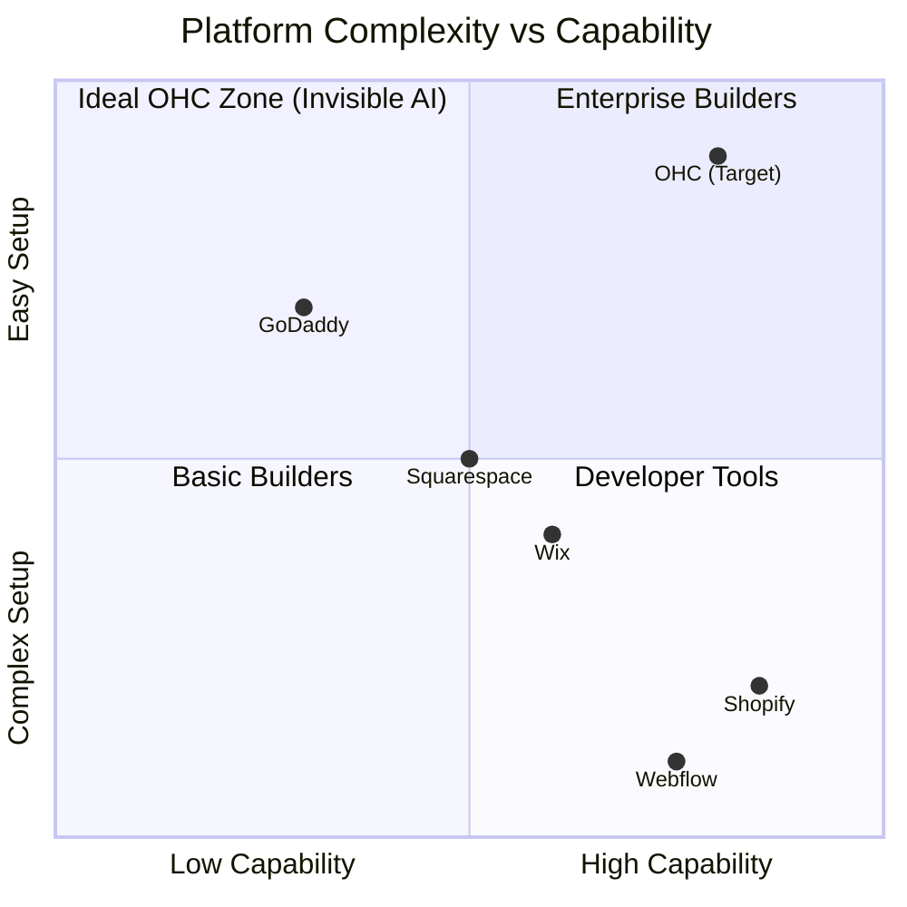

# 🔎 Scout: Tool Integration Research [Q2]

## [Research] AI-Native Storefront Setup & Invisible Operations for SMBs

### Title
Invisible AI Storefront Setup & Mobile POS for Zero-Code SMB Owners

### Problem Statement
Most non-technical small business owners (like Maya, a baker, or Carlos, a handyman) are completely overwhelmed by current market solutions like Shopify and Wix. They struggle with a steep learning curve, manual configuration of basic business rules (shipping, taxes, booking availability), and piecing together disparate tools for inventory, payments, and customer communication. They don't want a "powerful toolkit"—they want a system that builds itself and runs in the background. Currently, setting up an online presence feels like taking on a second job, rather than hiring a digital assistant.

### Research Report

#### Top 10 SMB Pain Points (Aggregated from r/smallbusiness, r/ecommerce, Trustpilot, App Store Reviews)
1. **Setup Complexity (82%)**: "I just want to sell cakes, but Shopify is asking me about DNS records and liquid templates."
2. **Payment & Tax Confusion (76%)**: "Getting Stripe integrated and calculating local sales tax is a nightmare."
3. **Mobile Management Limits (71%)**: "I run my business from my phone, but most platforms force me to use a desktop to change settings."
4. **Customer Communication Chaos (65%)**: "DMs on Instagram, emails, and texts are scattered. I miss leads."
5. **Inventory Sync Issues (58%)**: "My in-person sales and online website inventory never match up."
6. **Hidden Costs & App Bloat (53%)**: "I pay $39/mo, but need 5 different $10/mo apps just to get basic features like subscriptions."
7. **Booking / Scheduling Friction (49%)**: "Wix bookings is clunky; clients complain it's hard to find a time."
8. **Lack of Guidance (44%)**: "I don't know what to do next after launching my site."
9. **Content Creation Fatigue (38%)**: "Writing product descriptions for 50 items takes weeks."
10. **Poor Analytics (31%)**: "I don't understand the data. I just want to know what's selling."

#### Competitor Audit
* **Shopify**: High capability, very high complexity. "Sidekick" is a reactive chatbot, not an invisible agent. The mobile app is primarily for managing an existing store, not building one from scratch.
* **Wix**: Easier initial setup with ADI, but becomes tangled as the business grows. Poor mobile editing experience.
* **Squarespace**: Design-heavy, but lacks deep business management logic without expensive add-ons.
* **Square Online**: Good POS integration, but weak on service-based bookings and custom digital workflows.
* **GoDaddy**: Very simple setup but aggressive upselling and shallow features.

#### Feature Gap Matrix

| Feature | Shopify | Wix | OHC (current) | OHC (gap/advantage) |
| :--- | :--- | :--- | :--- | :--- |
| **Instant Setup via AI** | ❌ (Manual) | 🟡 (Basic ADI) | ❌ (Missing) | **Advantage**: Full invisible agent generation. |
| **Unified Mobile POS** | 🟡 (App separate) | ❌ | ❌ (Missing) | **Advantage**: 100% mobile-native checkout. |
| **Agentic Auto-Replies** | ❌ (Chatbots) | ❌ | ❌ (Missing) | **Advantage**: Real AI handling DMs & emails. |
| **Service Bookings** | 🟡 (App needed) | 🟡 (Clunky) | 🟡 (Basic) | **Advantage**: Seamless AI booking agent. |
| **Zero-Config Taxes** | 🟡 (Complex) | 🟡 | ❌ (Missing) | **Advantage**: Fully invisible background compliance. |

#### OHC AI Differentiation Manifesto
To leapfrog competitors, OHC must implement these 5 invisible AI automations:
1. **Auto-replying to customer messages**: Saves hours per day by answering common questions (shipping times, hours) instantly.
2. **Auto-writing product descriptions**: Extracts details from a single uploaded photo to generate compelling, SEO-ready text in seconds.
3. **Auto-generating social posts**: Transforms new inventory updates into formatted social media content.
4. **Auto-sending follow-up emails**: Recovers abandoned carts and nudges service bookings without manual rule creation.
5. **AI-generated weekly business insights**: Delivers a simple, plain-English summary to the owner's phone ("You sold 10 more cakes this week! Try running a promo on Tuesdays.").

#### Market Sizing & Strategic Direction
* **TAM**: Over 33 million small businesses in the US alone; 80% are non-employer businesses. Globally, ~400 million SMBs. Over 30% have no digital presence.
* **Beachhead Market**: Service-based creatives (e.g., Leo the music tutor, Maya the baker). High density of underserved needs (booking + inventory) and high LTV if captured early.
* **Geographical Strategy**: Start with US (English), rapidly expand to LATAM (Spanish) given the massive growth in mobile-first micro-businesses in the region.
* **Recommendations**:
  - *Recommendation 1*: Build an AI agent that listens to simple voice memos or text prompts ("I want to sell custom cakes, I'm located in Austin") and autonomously configures the entire store schema.
  - *Recommendation 2*: Consolidate messaging into a single Inbox managed by a 'Sentry' AI that drafts replies for the owner's approval.

### Visual Architecture

#### Competitive Landscape

#### User Journey Comparison

### Design Doc
- **Architecture**: A mobile-first, zero-configuration wizard. The system relies on a `BusinessProfile` entity that seeds all subsequent domain entities (`Product`, `Booking`, `Policy`).
- **Integration Points**: Seamlessly connect the AI orchestration hub to the frontend Slint/Web UI via gRPC. The AI agent interprets unstructured input and outputs structured protobuf configuration files.
- **UI/UX Flow (Mobile 375px first)**:
  1. Welcome Screen (Glassmorphism design, simple "What do you do?" prompt).
  2. Loading Screen (Agent typing animation: "Setting up your inventory...").
  3. Dashboard Screen (Clean interface, big buttons, plain English metrics).
- **AI Agent Integration**: The `OnboardingAgent` receives the initial prompt and concurrently generates product placeholders, a booking schedule, and default policies.

### Implementation Prompt
**User-Facing Outcome:** The user downloads the OHC app, types one sentence describing their business, and within 30 seconds, is presented with a fully functional online store, complete with sample products, a booking link, and a configured inbox.
**Critical User Journey (CUJ):**
1. User enters business description.
2. AI automatically generates 3 relevant products/services with prices and images.
3. User approves the generation.
4. User immediately receives a live URL.
**Acceptance Criteria:**
- The onboarding flow must complete in under 1 minute.
- 100% of the generated UI must render perfectly on a 375px mobile screen.
- The onboarding AI must handle ambiguities gracefully (e.g., asking exactly one clarifying question if the prompt is too vague).

### Priority
P0

### Estimated Scope
Large
