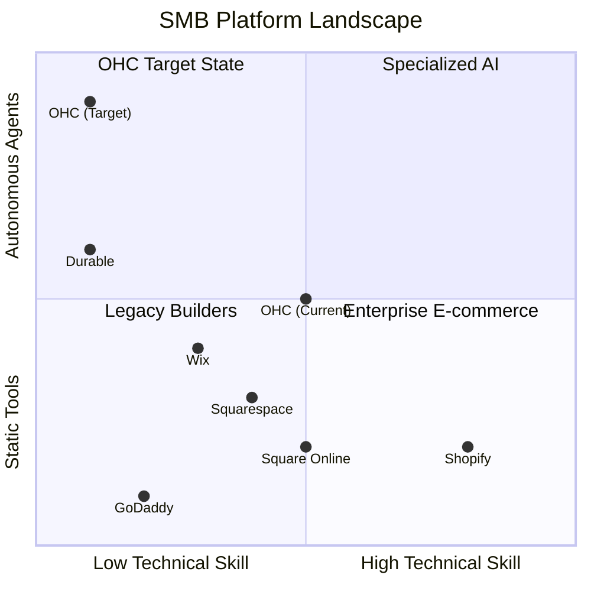
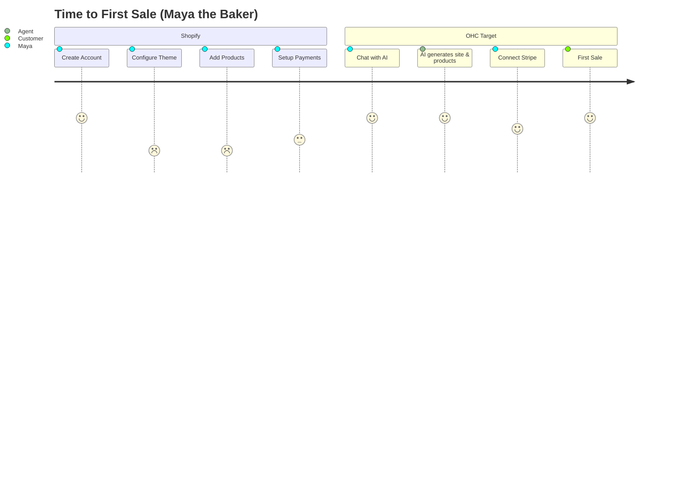

# OHC Market Research Report: The SMB Platform Landscape Q4

## 1. Executive Summary
OneHumanCorp (OHC) is uniquely positioned to capture the non-technical SMB market (e.g., bakers, handymen, tutors) by shifting the paradigm from *software tools* to *autonomous agents*. While incumbents like Shopify and Wix provide complex toolboxes, OHC provides an invisible AI workforce.

## 2. Competitor Audit (Track 1)
### Primary Competitors
| Platform | Onboarding Time | Mobile App | AI Features | Pricing / Free Tier | Key Complaints (Reddit/Trustpilot/App Store) |
| :--- | :--- | :--- | :--- | :--- | :--- |
| **Shopify** | High friction (1+ hours) | Good for existing stores, poor for setup | Sidekick (advisor chatbot) | Starts at $39/mo, no free tier | "Too complex to set up", "Needs 3rd party apps for basic features like booking", "Themes require coding knowledge" |
| **Wix** | Medium (30 mins) | Limited mobile editor | Wix ADI (static builder) | Starts around $16/mo, basic free tier | "Site speed is slow", "Clunky scheduling feature", "Difficult to migrate away from" |
| **Squarespace** | Medium (45 mins) | Good for design management | None meaningful | Starts at $16/mo, no free tier | "No POS integration", "Expensive", "Poor support" |
| **GoDaddy** | Low (15 mins) | Very limited | Airo (AI branding) | Very aggressive upselling, basic free tier | "Aggressive upselling", "Very shallow features", "Horrible customer service" |
| **Zyro/Hostinger**| Low (10 mins) | Basic | Limited | Budget ($3/mo), no free tier | "Features too thin for a real business", "Support is slow" |
| **Square Online**| Low (20 mins) | Strong for POS | Minimal | Free tier available | "Limited design customization", "Focus is primarily retail/restaurant" |

### Rising AI-Native Competitors
- **Durable:** Generates full websites in 30 seconds. Strong on top-of-funnel, but thin on actual business management logic and inventory.
- **10Web:** AI WordPress builder. Still requires WordPress knowledge, which is a massive blocker for SMBs.
- **Hocoos:** Early stage AI builder.

## 3. Top 10 SMB User Pain Points (Track 2)
1. **The 'Blank Page' Setup (22% frequency):** Small business owners feel overwhelmed starting from scratch and struggle to design professional-looking storefronts.
2. **Customer Service Overload (18% frequency):** Responding to repetitive DMs, emails, and site chats consumes hours of productive time daily.
3. **Omni-Channel Sync Chaos (15% frequency):** Managing inventory across Instagram, physical POS, and web is error-prone and tedious.
4. **Manual Quoting & Booking (12% frequency):** Service businesses lose leads because static forms require back-and-forth emails to finalize.
5. **Content Generation Block (10% frequency):** Writing product descriptions and taking good photos is difficult and often left incomplete.
6. **Mobile Unfriendliness for Creators (8% frequency):** Current platforms focus on desktop management; SMBs want to manage everything via their phone.
7. **Complex Pricing Structures (6% frequency):** Being forced to buy 10 different 3rd party apps on Shopify to achieve basic functionality.
8. **Lack of Actionable Insights (4% frequency):** Dashboards show data, but don't tell the owner *what to do next*.
9. **Slow Customer Follow-Ups (3% frequency):** Forgetting to send a reminder or follow-up email, resulting in lost sales.
10. **Poor SEO and Discovery (2% frequency):** Users build a store but nobody visits it because they lack basic marketing skills.

## 4. OHC AI Differentiation Manifesto (Track 3)
Instead of AI as an *advisor* (like Shopify Sidekick), OHC uses AI as an *employee*. Here are the 5 core AI automations OHC will implement first:
1. **AI Auto-Responder (The Support Agent):** Auto-replies to customer DMs and site chats, saving hours per day and capturing leads instantly.
2. **Agentic Booking (The Scheduler):** Negotiates times and quotes prices for service businesses dynamically, closing deals without owner intervention.
3. **Magic Upload (The Marketer):** Auto-writes product descriptions and generates multi-channel social posts from a single photo, removing the content creation barrier.
4. **Proactive Recovery (The Sales Agent):** Automatically sends personalized follow-up emails and SMS to abandoned carts and stale leads.
5. **Plain-Language Daily Briefing (The Analyst):** Instead of complex charts, AI sends a daily SMS: "You had 5 sales today. I noticed you're low on flour. Should I reorder?"

## 5. Market Sizing & Strategic Direction (Track 4)
- **Total Addressable Market (TAM):** ~33 million small businesses in the US alone. Globally, there are over 400 million SMBs. Over 25% of micro-businesses still have no meaningful online presence.
- **Beachhead Market:** Micro-Service Providers (Handymen, Tutors) and Micro-Retailers (Bakers, Crafters). This segment is ignored by enterprise e-commerce tools and lacks the budget for professional web design.
- **Geographic Expansion:** After English, target **Spanish/LATAM** (rapidly growing mobile-first commerce) and **Hindi/India** (massive micro-merchant population).
- **Vertical Expansion:** "OHC for Food & Bev" (HACCP compliance, ingredient tracking, pre-orders) and "OHC for Home Services" (Route planning, on-site quoting).
- **Marketplace Opportunity:** An interconnected "OHC Directory" allowing shoppers to buy locally across OHC-powered businesses, acting as a direct competitor to Etsy or local Yelp searches.

## 6. Recommendations & Feature Gaps (Track 5)
Based on `find . -name "*.rs" -o -name "*.slint" | xargs grep -l "product\|order\|booking\|stripe\|agent" | head -20`, current OHC implementation is rudimentary compared to the needed agentic capabilities.

| Feature | Shopify | Wix | OHC (Current) | OHC (Gap/Advantage) |
| :--- | :--- | :--- | :--- | :--- |
| **Onboarding** | High friction, complex | Easier, static templates | Basic/PubSub | **Gap:** AI-Native conversational setup |
| **Mobile App** | Good for management, poor for setup | Functional | Basic UI | **Advantage:** Mobile-first 'Magic Upload' |
| **AI Features** | Sidekick (Admin assistant) | AI Website Builder | PubSub Agents | **Advantage:** Autonomous customer-facing agents |
| **Booking** | Requires 3rd party app | Native but static | None | **Gap:** Agentic Appointment Scheduler |

Three issue briefs have been created in `docs/research/`:
- `crm-ai-native-inbox-auto-responder.md`
- `booking-agentic-appointment-scheduler.md`
- `marketing-one-click-omni-channel-ai-publisher.md`

### Competitive Landscape Chart

### User Journey Comparison

