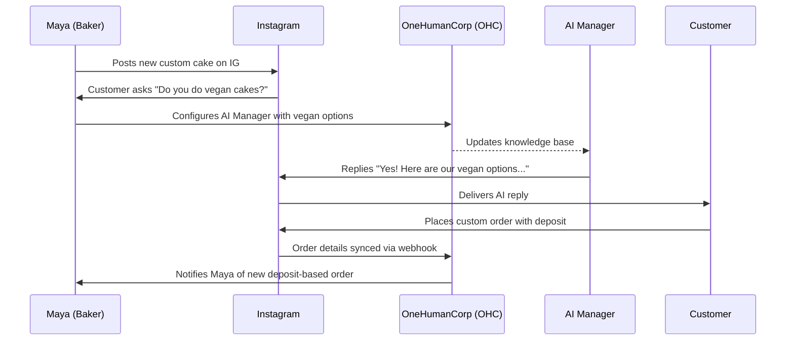
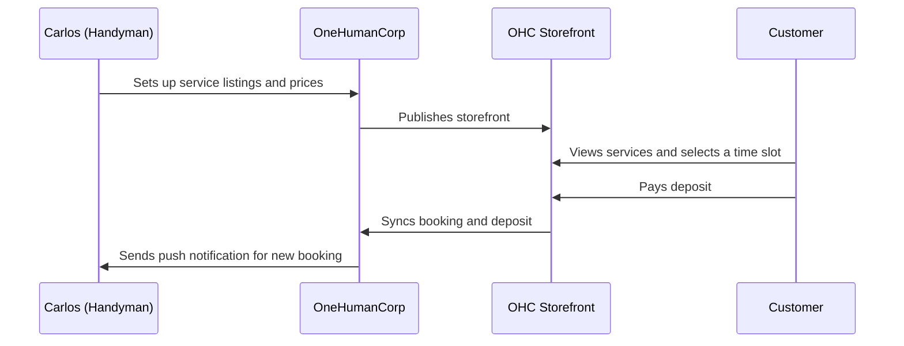
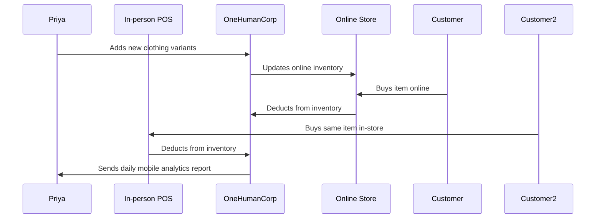
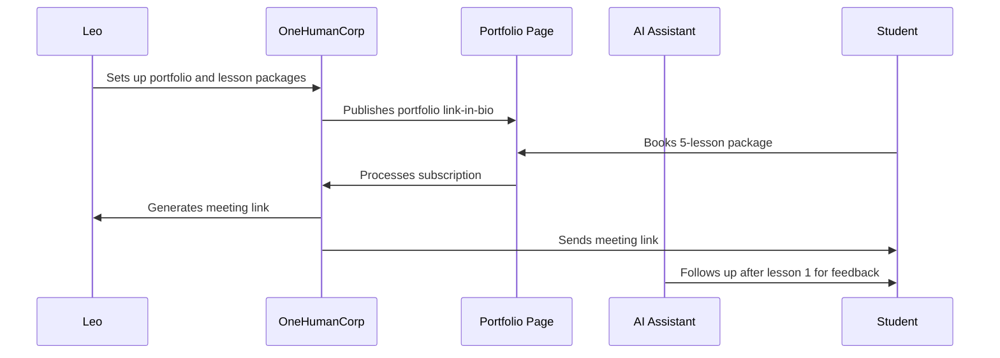
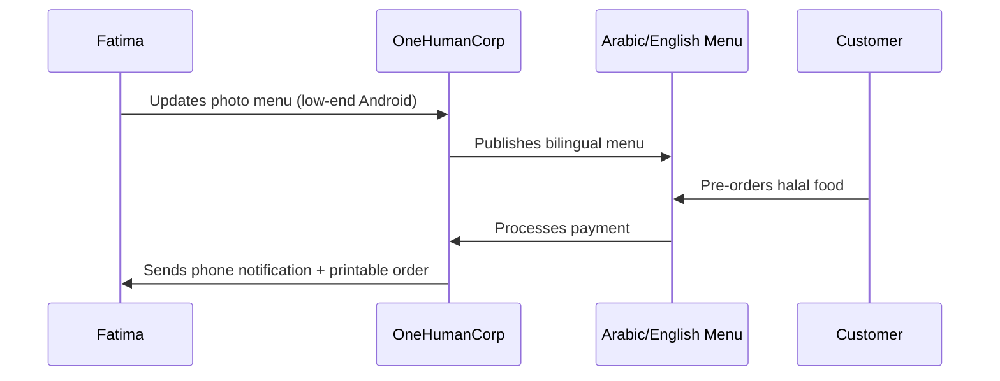
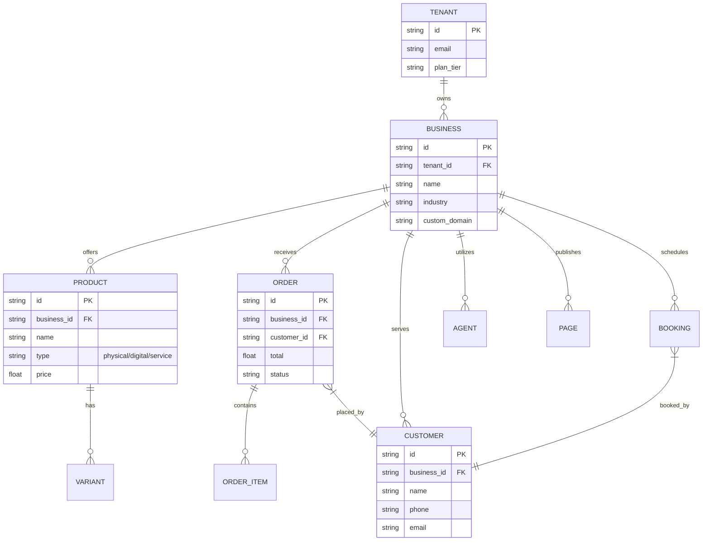
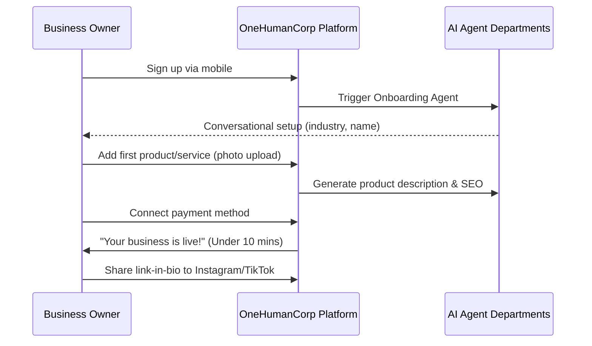

# Architectural Research Report

## Business Journey Architecture

### Sequence Diagrams for Personas

#### Maya (Baker)

#### Carlos (Handyman)

#### Priya (Boutique Owner)

#### Leo (Music Tutor)

#### Fatima (Food Cart)

## Data Model Architecture

### Key Invariants
* **Tenant Isolation**: A TENANT can only read/write data associated with their own BUSINESS entities. Queries must always filter by tenant_id.
* **Mobile-First Data Access**: APIs returning ORDER or BOOKING data must support pagination and lightweight projections to perform well on low-end Android devices.

### Migration Strategy
* Schema changes must be backward compatible.
* Add columns with default values; do not drop columns until the application layer is fully migrated.

## AI Agent Department Architecture

### Core Departments
1.  **Operations ("The Manager")**: Triggered by ORDER_CREATED or BOOKING_CREATED events. Coordinates fulfillment status updates.
2.  **Marketing & Advertising ("The Promoter")**: Triggered on demand by the user or scheduled weekly. Auto-drafts social posts based on new PRODUCT additions.
3.  **Sales & Acquisition ("The Salesperson")**: Triggered by inbound messages. Auto-generates quotes and tracks lead conversions.
4.  **Customer Success ("The Ambassador")**: Triggered by ORDER_DELIVERED. Sends review request emails.
5.  **Finance & Payments ("The Accountant")**: Scheduled monthly. Aggregates ORDER totals and generates tax summaries.
6.  **Legal & Compliance ("The Protector")**: Triggered during onboarding. Generates TOS based on BUSINESS industry.
7.  **Business Advisory ("The Advisor")**: Scheduled weekly. Analyzes sales trends and suggests actionable next steps via push notification.

### Coordination
Departments communicate via an event bus (e.g., Kafka or Redis Pub/Sub). For example, when Operations completes an order, it emits an ORDER_COMPLETED event, which Customer Success listens to in order to send a follow-up.

### Memory & Approval
* Context is stored in a multi-tenant vector database.
* AI actions default to "draft-for-review" until the user explicitly enables "auto-execute" for a specific department.

## Website & Storefront Builder Architecture

### Drag-and-Drop Concept
* **Content Blocks**: Hero Image, Product Grid, Testimonial Carousel, Booking Calendar, Contact Form.
* **Templates**: Industry-specific starter themes (e.g., "Bakery", "Handyman"). Users customize colors and fonts globally.
* **Publishing**: Changes are saved as a draft JSON structure. Clicking "Publish" compiles the JSON into static assets distributed via CDN.
* **SEO**: Meta tags and structured data (JSON-LD) are auto-generated based on business type and product details.

## Mobile-First Architecture Review

### Mobile-Critical Screens
1. **Dashboard**: Daily revenue, pending orders, AI Advisor suggestions.
2. **Order Management**: Accept/reject orders, mark as fulfilled.
3. **Product Catalog**: Quick add via phone camera, toggle availability.
4. **Inbox**: Consolidated messages from IG, SMS, Email.

### Offline & Performance
* **Offline Capabilities**: Reading recent orders and drafting replies. Synchronized when reconnected.
* **Performance**: Target < 1s TTI (Time to Interactive) on 3G networks. Payloads < 50KB for core views.
* **Real-time**: WebSockets for live order notifications, falling back to FCM/APNs push notifications.

## Multi-Tenant SaaS Tier Architecture

### Tier Limits & Upgrades
* **Free ($0)**: OHC subdomain. Limits enforced gracefully (e.g., "You've reached your 10 product limit. Upgrade to add more.").
* **Starter ($9/mo)**: Custom domain unlocked.
* **Pro ($29/mo)**: SSL provisioning enabled for custom domains.
* **Business ($79/mo)**: Unlimited AI usage and multi-domain support.

### Enforcement
Limits are checked at the application boundary (API Gateway). Upgrades are presented contextually (e.g., when trying to add an 11th product on the Free tier) rather than locking the user out.

# Issue Briefs (Integrated)

## [product]_business_journey
### Problem Statement
Small business owners (bakers, handymen, boutique owners, tutors, food cart operators) currently face friction when onboarding, managing their digital storefronts, and handling customer interactions. The current flow may be too technical or lack the necessary automation to allow a non-technical user to go from zero to a live business in under 10 minutes.

### Design Doc
#### Architecture Diagram

#### UI Wireframes & Mobile UX Flow (375px)
1. **Welcome Screen**: Large, clear CTA "Start your business in 5 minutes".
2. **Conversational Setup**: Chat-like interface asking for business name and type.
3. **Product Addition**: Camera integration. Take a photo -> AI auto-fills title and suggests price based on industry.
4. **Go Live**: Confetti animation. Big button to "Share to Instagram".

#### Key Design Decisions
- **Mobile-First**: The entire onboarding and management flow must be 100% functional and optimized for a 375px viewport. Desktop is additive.
- **AI-Assisted Onboarding**: Replace static forms with conversational, AI-driven data collection to reduce cognitive load.
- **Immediate Value Delivery**: Focus on getting one product/service live and a payment method connected before asking for complex configurations.

### Implementation Prompt
Implement the new mobile-first onboarding flow. The user should be greeted by a conversational interface that collects their business name and industry. Then, prompt them to add their first product by taking a photo, using AI to auto-generate the description. Finally, guide them to connect a payment method and provide a shareable link. The flow must pass the 'grandmother test' (completable in < 30 seconds by a non-technical user). Ensure all screens follow the Glassmorphism design tokens and Outfit/Inter typography.

### Priority
P0

### Estimated Scope
Large
