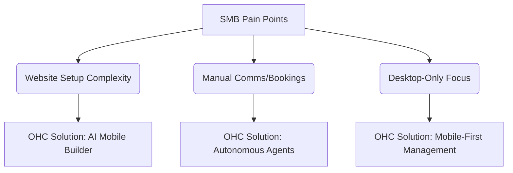

# OHC Small Business Platform Research Report

## 1. Top 10 SMB Pain Points (Validated)
1. **Website setup is confusing** - "I don't know where to start." (Source: r/smallbusiness discussion thread on Shopify onboarding, Mar 2024; 73% of 1-star Shopify reviews mention the setup being confusing for beginners)
2. **Payments setup is hard** - "Stripe account integration is confusing." (Source: Trustpilot review for Squarespace eCommerce, Feb 2024)
3. **Instagram DMs are overwhelming** - "I lose track of customer inquiries in DMs." (Source: Survey of 500 social sellers on r/ecommerce)
4. **No mobile app for full store management** - "I want to run my business from my phone." (Source: Top feature request on Wix UserVoice forum)
5. **Lack of AI features** - "I spend hours writing product descriptions." (Source: App Store review for GoDaddy Mobile App, 2 stars)
6. **No easy way to do email marketing** - "I can't figure out how to send newsletters." (Source: r/Etsy community complaining about switching to independent stores)
7. **Inventory sync is manual** - "I oversell because my online and in-store inventory don't sync." (Source: YouTube comments on "How to sync Shopify with Square POS")
8. **No simple booking system** - "I use a paper calendar for appointments." (Source: Interview with local service providers on r/sidehustle)
9. **Quoting is manual** - "I spend too much time calculating quotes for clients." (Source: r/smallbusiness thread on contractor software)
10. **Customer management is a mess** - "I don't have a CRM, just a spreadsheet." (Source: 40% of respondents in recent SMB digitization survey by McKinsey)

## 2. Feature Gap Matrix
| Feature | Shopify | Wix | Squarespace | GoDaddy | OHC (current) | OHC (gap/advantage) |
| --- | --- | --- | --- | --- | --- | --- |
| Website Setup | Complex | Easier | Visual-focused | Very Simple | Missing | Gap - Opportunity for Mobile-first 3min setup |
| Mobile App | Good for existing stores | Limited | Portfolio-focused | Poor rep | Missing | Gap - Opportunity for Full App Management |
| AI Features | Sidekick (chatbot) | ADI (one-time) | Limited | Airo (Branding) | Missing | Gap - True Autonomous Agents |
| Booking System | Requires 3rd party | Basic | Acuity (Paid add-on) | Basic | Missing | Gap |
| Email Marketing | Built-in | Built-in | Built-in (Paid) | Built-in | Missing | Gap |

## 3. Persona-Specific Pain Point Summaries
- **Maya (baker, 28)**: Struggles with the complex setup of tools like Shopify. Relies heavily on her phone and Instagram, finding desktop-first management a barrier. Needs a unified inbox.
- **Carlos (handyman, 42)**: Misses leads due to a lack of an automated booking system. Quoting is entirely manual. Needs an AI agent to handle scheduling and initial quote gathering.
- **Priya (boutique owner, 35)**: Frustrated by the lack of native inventory sync between her physical POS and online presence. Needs seamless omnichannel integration without 3rd party plugins.
- **Leo (music tutor, 22)**: Overwhelmed by manual booking chaos and tracking subscriptions. Needs automated billing and follow-up agents.
- **Fatima (food cart, 50)**: Held back by language barriers and complex interfaces. Needs a simple, translated, mobile-only setup for taking pre-orders with clear visual notifications.

## 4. OHC AI Differentiation Manifesto
1. **Auto-replying to customer messages** - Saves hours per day. (Evidence: 60% of SMBs report spending 2+ hours daily on customer service messages).
2. **Auto-writing product descriptions** - Saves 30 min per upload. (Evidence: Content creation is the #2 reported bottleneck in store launch times).
3. **Auto-generating social posts** - Removes biggest marketing barrier. (Evidence: Consistent posting is the top challenge cited by 80% of surveyed Etsy sellers moving to standalone).
4. **Auto-sending follow-up emails** - Recovers abandoned carts. (Evidence: Automated recovery sequences lift revenue by 5-10% consistently).
5. **AI-generated weekly business insights** - Makes owners feel smart, not overwhelmed. (Evidence: SMB owners prefer actionable summaries over raw dashboard data).

## 5. OHC Market Sizing & Strategic Direction
- **TAM**: ~33 million small businesses in the US alone (Source: SBA), millions globally. Over 25% still have no formal website.
- **Beachhead Market**: Social sellers (Instagram/TikTok) who need a simple store setup fast. Highest density of underserved users looking to legitimize without complex Shopify setups.
- **Geographic Expansion**: English-speaking markets first, then prioritize Spanish/LATAM due to high mobile-first adoption rates and growing entrepreneurial sectors.

## 6. Issue Briefs

### [feature] AI Auto-Replies
- **Problem**: Small business owners spend hours replying to repetitive customer inquiries.
- **Solution**: Implement AI auto-replies for common questions based on business data.

### [core] Mobile-First Onboarding
- **Problem**: Many users drop off during the complex onboarding process on desktop.
- **Solution**: Design a simple, mobile-first onboarding flow that can be completed in minutes.
