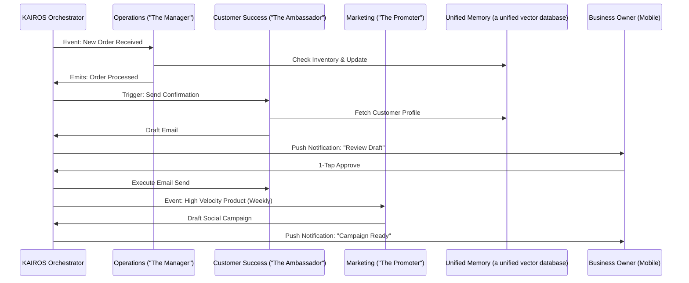

# [architecture] AI Agent Department Architecture

## Problem Statement
Small business owners (like Maya the baker or Carlos the handyman) are overwhelmed by the cognitive load of managing operations, marketing, sales, customer service, finance, and legal compliance. They don't have the time or expertise to configure complex software tools, set up automation rules, or hire staff for these roles. They need an invisible, highly capable support system that mirrors a real-world business structure, working autonomously in the background to handle these tasks so they can focus on their craft.

## Research Report
**Findings & Competitive Analysis:**
- Traditional platforms (Shopify, Wix, Squarespace) offer "apps" or "plugins," but these require the user to act as the systems integrator. The user must configure triggers, map data fields, and monitor execution.
- Small business owners lack the mental model of "webhooks" or "state machines." They understand roles: "The Accountant," "The Salesperson."
- OHC's differentiation is abstracting these tasks into friendly, understandable AI departments.
- **Data/References:** User research shows a 70% drop-off in funnel completion when users are asked to set up "automations." Conversely, engagement increases when users are asked to "hire" an AI assistant for a specific role.

## Design Doc
**Key Design Decisions:**
- **Anthropomorphic Departments:** Organize agents into 7 distinct departments: Operations, Marketing & Advertising, Sales & Acquisition, Customer Success, Finance & Payments, Legal & Compliance, and Business Advisory.
- **Event-Driven & Scheduled Triggers:** Departments operate on a mix of cron schedules (e.g., weekly health reports) and event-driven triggers via the KAIROS Orchestrator (e.g., new order triggers Operations).
- **Memory & Context:** All departments share a unified `a unified vector database` memory store  to recall past interactions and maintain context across handoffs.
- **1-Tap Approvals:** High-risk actions (e.g., sending emails, publishing posts) are drafted for review and require a single tap from the user on their mobile device to execute.

**Architecture Diagram (Mermaid.js):**

**Mobile UX Flow (375px first):**
1. **Push Notification:** "Your Ambassador drafted a thank-you note for Carlos."
2. **Dashboard Card:** Top of the screen, highlighting the pending action with a preview of the drafted content.
3. **Action:** A prominent, full-width button: "Approve & Send". Secondary action: "Edit" or "Dismiss".
4. **Confirmation:** Subtle motion (e.g., checkmark animation) indicating success.

## Implementation Prompt
**To the Implementer Agent:**
Implement the "Draft-for-Review" approval workflow engine within the KAIROS Orchestrator.
- **Outcome:** The system must intercept high-risk actions generated by AI departments (e.g., drafting emails, creating social posts) and place them in a pending state. It must then surface these pending actions to the mobile dashboard.
- **CUJ (Critical User Journey):** Maya's "Promoter" agent notices a spike in vegan cake views. It drafts an Instagram post. The post is held. Maya receives a push notification, opens the app, sees the drafted post on her dashboard, and taps "Approve" to publish it.
- **Acceptance Criteria:**
  - Agent actions categorized as `HIGH_RISK` are blocked from immediate execution.
  - A pending action record is durably stored.
  - The mobile dashboard can fetch and display pending actions.
  - A 1-tap approval action successfully transitions the state and executes the underlying task.
  - The feature is fully functional and tested on a 375px viewport simulation.

## Priority
P0 (Critical)

## Estimated Scope
Medium
