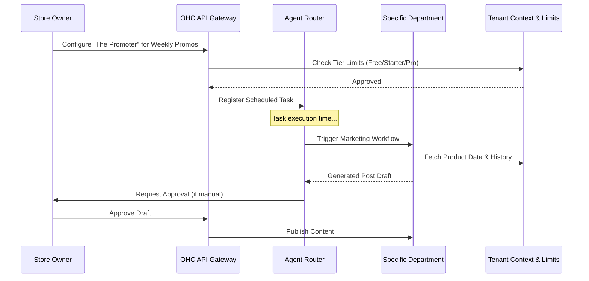

# OHC Platform Architecture Review
## AI Agent Department Architecture

### Problem Statement
OneHumanCorp's AI agents need a scalable, reliable architecture that business owners can intuitively understand. They shouldn't have to configure generic "agents", but rather interact with "departments" that mirror real business structures (e.g., Marketing, Sales, Operations).

### Research Report
Currently, AI integration is often scattered and technical. By grouping capabilities into "departments", non-technical users can reason about AI actions intuitively. E.g., instead of setting up a "webhook triggered NLP parser", they assign a task to "The Manager" in Operations. The system needs to support multiple tiers, throttle usage based on subscriptions, and provide clear audit trails for all actions.

### Design Doc

**Key Departments:**
1. **Operations ("The Manager"):** Order fulfillment, inventory alerts, simple booking adjustments.
2. **Customer Success ("The Ambassador"):** Answering FAQs, checking order status, handling basic returns.
3. **Marketing ("The Promoter"):** Generating social copy, SEO descriptions, and promotional emails.
4. **Sales ("The Salesperson"):** Drafting quotes, following up on leads.

**Architecture (Mermaid.js):**

**Mobile UX Flow (375px):**
- **Home Screen:** "Your Team" section showing active departments.
- **Department Detail:** e.g., "The Manager" -> Activity log, pending approvals, simple toggle switches for capabilities.
- **Approval Flow:** Push notification -> "The Promoter drafted a new Instagram post" -> Swipe right to approve, swipe left to edit.

**Key Decisions:**
- **Human-in-the-Loop:** Actions can be set to "Auto-Execute" or "Draft-for-Review" based on user preference and risk level.
- **Context Isolation:** Every department execution must be strictly scoped to the tenant ID.
- **Usage Budgets:** Free tier receives 100 actions/mo, throttled smoothly with soft warnings before hard limits.

### Implementation Prompt
Implement the underlying routing structure for the "AI Departments" feature. The solution should route generic tasks to the correct department (Operations, Marketing, etc.) while enforcing tenant isolation and checking monthly action limits based on the subscription tier. Create the necessary internal service interfaces without prescribing specific DB schema or external API choices. Acceptance criteria: A task can be dispatched, routed to a mocked department, checked against limits, and return a result or "draft" status.

### Priority
P1 (High)

### Estimated Scope
Medium
