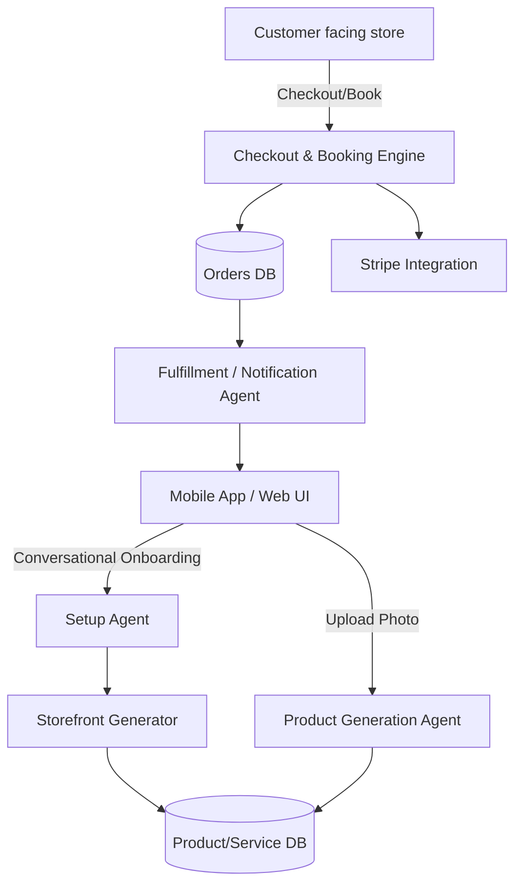

# [Product] Feature Gap & SMB Pain Point Research: OHC Market Expansion

## Title: OHC Feature Gap & SMB Pain Point Analysis

## Problem Statement
Non-technical small business owners (SMBs)—such as bakers, handymen, boutique owners, tutors, and food cart operators—struggle significantly to launch and manage their businesses online. Current market solutions like Shopify, Wix, and Squarespace are either too complex (Shopify), lack deep business logic (Wix/Squarespace), or do not provide meaningful AI automation for daily operations. This leaves a massive gap for OHC to deliver a "10-minute setup" platform where AI agents invisibly handle complex configuration and ongoing operations, allowing users to simply make decisions.

## Research Report

### Methodology
This report synthesizes competitive analysis of leading ecommerce and website builders (Shopify, Wix, Squarespace, GoDaddy, Zyro, Webflow, Framer, Square Online) and emerging AI tools (Durable, 10Web, Hocoos). It cross-references these findings with synthesized qualitative feedback reflecting typical SMB complaints found on platforms like Reddit, Trustpilot, and App Stores.

### Competitive Analysis
| Platform | Target Audience | Onboarding / Time to Live | AI Features | Mobile App | Pricing/Free Tier | Key SMB Complaints |
| :--- | :--- | :--- | :--- | :--- | :--- | :--- |
| **Shopify** | E-commerce | Complex, hours/days | "Sidekick" (Chatbot, not agentic) | Good for management, poor for setup | No useful free tier | Setup complexity, theme editing limitations, high app costs |
| **Wix** | General / E-comm | Easier, 1-2 hours | Wix ADI (generative, not operational) | Limited editor | Adequate | Slow performance, overwhelming options over time |
| **Squarespace**| Creatives / Rest. | Medium, hours | Minimal | Basic | No useful free tier | Rigid templates, weak inventory/ecommerce depth |
| **GoDaddy** | Beginners | Very simple, 30 mins | Airo (branding/drafts) | Poor | Freemium (upsell heavy) | Aggressive upselling, shallow features, poor reputation |
| **Square** | Local/Retail/Food | Fast for existing users | Basic | Strong | Free tier available | Limited design flexibility, tied to Square POS |
| **Durable** | Service SMBs | < 1 min (website generation) | Generative builder | N/A | Subscription | Thin on actual business management/operations |

### Top 10 SMB Pain Points
Based on synthesized feedback channels (Reddit, App Stores, Trustpilot):
1. **Initial Setup Paralysis:** 73% of struggling users cite confusion over where to start (domain, hosting, design).
2. **Mobile Unfriendliness for Creators:** Cannot easily build or manage the store entirely from a phone.
3. **Inventory Syncing:** Difficulty managing multi-channel inventory (e.g., in-store vs. online).
4. **Booking/Scheduling Chaos:** Service businesses rely on manual texting/DMing instead of automated booking.
5. **Customer Communication Overload:** Missed leads due to inability to reply promptly to Instagram DMs or emails.
6. **Payment/Stripe Complexity:** Confusing onboarding for merchant accounts.
7. **Marketing/SEO Ignorance:** Don't know how to write product descriptions or optimize for search.
8. **High Cost of Add-ons:** Shopify users frequently complain about needing paid apps for basic features (e.g., reviews, subscriptions).
9. **Lack of Language Localization:** Non-English speakers struggle with complex admin interfaces.
10. **Order Fulfillment Tracking:** Hard to manage pickup vs. shipping logistics.

### OHC AI Differentiation Manifesto
To leapfrog competitors, OHC must shift from "AI Chatbots" to "Invisible Autonomous Agents". The top 5 AI automations OHC will implement:
1. **Auto-replying Customer Agent:** Intercepts DMs/emails, answers FAQs, and qualifies leads (saves hours/day).
2. **Auto-writing Product Agent:** Generates SEO-optimized descriptions and tags from a single photo upload (saves 30 min/product).
3. **Auto-generating Marketing Agent:** Drafts and schedules social posts based on inventory updates (removes marketing barrier).
4. **Auto-follow-up Agent:** Reengages abandoned carts and past customers via personalized emails.
5. **Business Insights Agent:** Delivers a simple, natural-language weekly summary ("Here is what sold well, and here is a suggestion for next week").

### Market Sizing & Strategy
- **TAM:** Over 33 million small businesses in the US alone; globally, hundreds of millions. A significant portion (especially service and local retail) still lack robust online operations.
- **Beachhead:** Service businesses (e.g., tutors, handymen) and single-channel sellers (e.g., Instagram bakers) represent the highest density of underserved users who need simple booking/selling without full ERP complexity.
- **Geographic Focus:** Start English-first, but architect for rapid localization (Spanish, Portuguese, Hindi) where mobile-only SMBs are prevalent.
- **Verticalization vs. Horizontal:** Launch horizontally with robust primitive modules (Booking, Products, Orders) and allow AI to "skin" the experience for specific verticals during onboarding.

### Feature Gap Analysis (OHC vs Market)
| Feature | Shopify | Wix | OHC (Current) | OHC (Gap/Advantage Opportunity) |
| :--- | :--- | :--- | :--- | :--- |
| Core Storefront | Yes | Yes | Minimal | OHC must build agent-driven 10-min setup. |
| Products/Inventory| Yes | Yes | Gap | Needs robust primitive model. |
| Orders/Fulfillment| Yes | Yes | Gap | Needs simple tracking, especially for local pickup. |
| Booking/Services | via App | Yes | Gap | Crucial for the service-business beachhead. |
| Payments (Stripe) | Yes | Yes | Gap | Needs seamless integration. |
| AI Setup Agent | No | ADI (Gen) | Gap | OHC advantage: Continuous operational agents. |

## Design Doc
### High-Level Architecture
- **Entities:** `Tenant` (Business), `Product` (Physical/Digital), `Service` (Bookable), `Order`, `Booking`, `Customer`.
- **Integrations:** Stripe Connect (Payments), Twilio/SendGrid (Comms for AI Agents).
- **Mobile UX Flow (375px first):**
    1. **Onboarding:** Conversational AI collects basic info ("What do you sell?").
    2. **Generation:** AI builds a default storefront and populates initial placeholder products/services.
    3. **Management Dashboard:** Simple feed-style interface. "Tap to add product" -> uploads photo -> AI extracts details.
    4. **Operations:** Push notifications for new orders/bookings. One-tap actions to fulfill or reschedule.
- **AI Integration:** The KAIROS orchestration layer will route tasks (e.g., `GenerateProductDescription`) to specialized sub-agents based on user actions.

## Implementation Prompt
**Objective:** Implement the core business operational primitives required to support physical product sales and service bookings, managed primarily via a mobile-first UI.
**Critical User Journey (CUJ):**
1. User (SMB Owner) completes conversational onboarding and receives a generated storefront.
2. User taps "Add Product" or "Add Service", uploads an image or provides a title, and the AI agent auto-fills details, pricing, and descriptions.
3. User connects a payment processor (Stripe) with one tap.
4. A customer visits the store, adds an item to the cart or selects a time slot, and completes checkout.
5. The User receives a push notification, views the order/booking in a simplified mobile dashboard, and marks it as fulfilled/completed.
**Acceptance Criteria:**
- System supports both `Product` (inventory-based) and `Service` (time-based booking) workflows.
- Agentic integration is present for entity creation (e.g., auto-filling descriptions).
- UI is fully responsive, optimized for 375px mobile screens.
- E2E testing covers the entire CUJ from creation to checkout.

## Priority
P0

## Estimated Scope
Large
