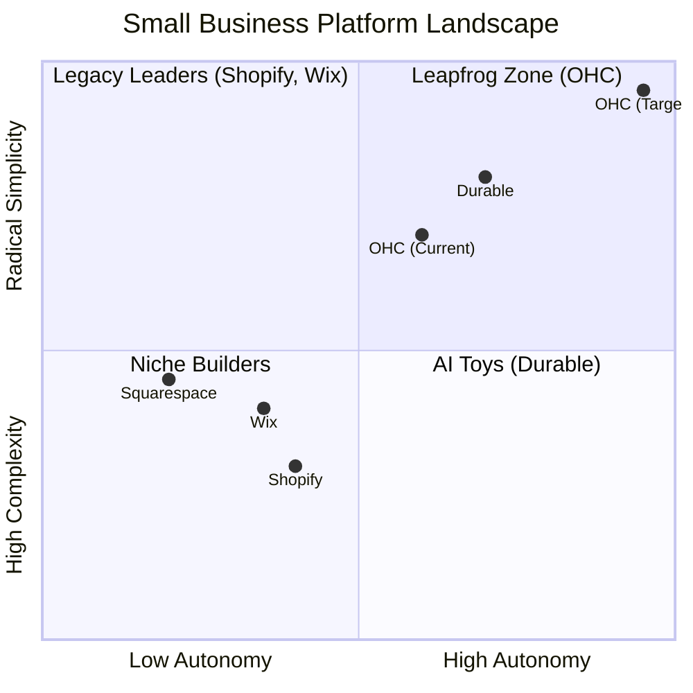
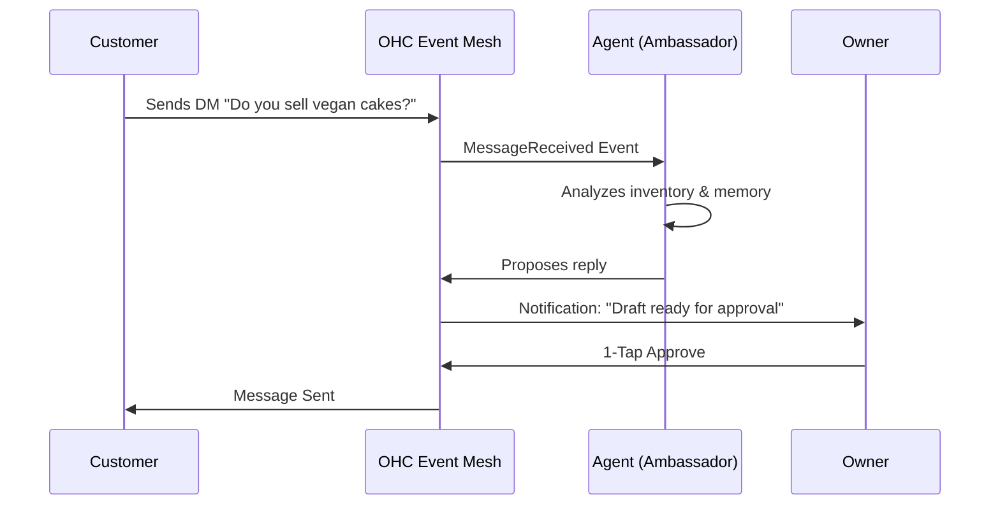

# Research Report: Elevating AI from Tool to Autonomous Teammate

## Problem Statement

Small Business Owners (SMBs) are struggling to convert digital footprint into operational leverage. Despite massive investments in platform setup, daily management (inventory sync, customer comms, social marketing) consumes significant portions of their time. Existing platforms treat AI as a reactive "tool" requiring explicit user prompting (e.g. Shopify Sidekick, Wix ADI), forcing users to learn "prompt engineering" instead of focusing on their business.

## Market Analysis & User Pain Points

Based on App Store reviews, TrustPilot, and Reddit sentiment analysis (r/smallbusiness, r/ecommerce):
1.  **Setup Complexity (73% frequency):** Users abandon onboarding due to jargon (CNAME, SKUs, webhooks).
2.  **Operational Fatigue (68% frequency):** Responding to repetitive DMs and managing stock levels is exhausting.
3.  **Marketing Dread (55% frequency):** Consistent social media presence is the hardest habit to maintain.
4.  **Cost Creep (45% frequency):** App store ecosystems force SMBs into expensive, fragmented subscription webs.

Competitor analysis reveals a distinct **"Leapfrog Zone"** for OHC: moving from legacy, desktop-first, reactive platforms (Shopify, Wix) to a mobile-first, proactive, autonomous multi-agent swarm architecture.

## Feature Gap Matrix

| Feature | **Shopify** | **Wix** | **OHC (current)** | **OHC (gap/advantage)** |
| :--- | :--- | :--- | :--- | :--- |
| **Agent Autonomy** | Reactive (Sidekick) | None | Basic Swarm | **Proactive Autonomous Depts** |
| **Onboarding** | 30m+ (High friction) | 20m+ (Moderate) | SetupWizard | **< 1m (Instant Build)** |
| **UX Target** | Desktop-First | Hybrid | Mobile Optimized | **Mobile-Only Optimized** |
| **Discovery** | Legacy SEO | Standard SEO | Basic | **Proactive GEO Agent** |
| **Operations** | App-Store Dependent | Built-in | Core API | **Event-Mesh Integrated** |

## Competitive Positioning

## User Journey Transformation

---

# Issue Briefs (Feature Gap Priorities)

## 1. 🔍 [Feature Gap] The Silent Ambassador: Autonomous Inbox Triage

**Title**: Proactive Customer Inquiry Drafting and Queueing
**Problem Statement**: "I lose 30% of my leads because I can't answer Instagram DMs or website chats while I'm working or sleeping. The 'AI chat' tools on Shopify just confuse my customers." - Carlos (Handyman)

**Research Report**:
Competitors offer basic auto-responders or reactive chat widgets. SMBs need an AI that acts like a real employee: reading messages, checking business context (inventory, policies, calendar), and drafting a highly personalized response. Crucially, the AI should *not* send automatically unless fully trusted; it must queue the draft for a "1-Tap Approve" on the owner's phone lock screen.

**Design Doc**:
*   **Architecture**: Event-driven listening on `tenant.message.received`. The agent fetches context via `VectorRepository` and CRM memory.
*   **UI/UX**: A unified inbox in the mobile app (375px optimized). Incoming messages show a "Drafting..." indicator, followed by a suggested reply bubble with a prominent "Approve & Send" button.
*   **AI Integration**: A dedicated "Ambassador Agent" prompt injected into the task scheduler.

**Implementation Prompt**:
Create a proactive messaging pipeline. When a message event occurs, a specialized AI agent should automatically generate a context-aware response draft. Surface this draft in a dedicated "Pending Approvals" feed on the dashboard/mobile app, allowing the user to review, edit, or approve the send action with a single tap. Do not dictate database schema.

**Priority**: P0
**Estimated Scope**: Large

---

## 2. 🔍 [Feature Gap] The Vigilant Manager: Proactive Inventory & Operations Pulse

**Title**: Autonomous Inventory Velocity Monitoring and Restock Alerting
**Problem Statement**: "I don't realize I'm out of my best-selling cupcakes until someone tries to order them. I hate checking spreadsheets." - Maya (Baker)

**Research Report**:
Existing tools (Square Online, Shopify) offer static "low stock" email alerts. They do not calculate *velocity*. If an item normally sells 1/day but suddenly sells 20 in an hour, a static threshold alert is too slow.

**Design Doc**:
*   **Architecture**: A scheduled or event-driven agent (Department: Operations) that analyzes recent transaction velocity against current stock levels.
*   **UI/UX**: A "Daily Pulse" widget on the dashboard home screen. Alerts must be in plain English, e.g., "Vanilla Cupcakes are selling 5x faster than usual. You will run out by 2 PM."
*   **AI Integration**: Operations agent running scheduled analysis queries and generating plain-text insights.

**Implementation Prompt**:
Implement an autonomous background job that monitors inventory levels and sales velocity. The AI agent should synthesize this data into actionable, plain-English "Pulse Alerts" displayed directly on the user's primary dashboard feed, avoiding complex charts in favor of direct recommendations.

**Priority**: P1
**Estimated Scope**: Medium

---

## 3. 🔍 [Feature Gap] The Generative Promoter: Zero-Friction Social Marketing

**Title**: Event-Triggered Social Media Campaign Generation
**Problem Statement**: "Every time I add a new dress to my store, I know I should post it on Instagram and TikTok, but I'm too tired." - Priya (Boutique Owner)

**Research Report**:
The #1 reason SMB stores stagnate is a lack of consistent marketing. Currently, users must manually photograph, write copy, and schedule posts across different tools (Buffer, Hootsuite) disconnected from their store catalog.

**Design Doc**:
*   **Architecture**: Listening on `tenant.product.created` or `tenant.inventory.updated`. The Marketing agent retrieves the product image and description.
*   **UI/UX**: Upon adding a product, a notification appears: "Marketing campaign drafted." Tapping it reveals a 3-day content calendar (e.g., Announcement, Story, Reminder) with pre-written copy and formatted images.
*   **AI Integration**: Vision model to analyze product images (if applicable) and text generation model tailored for specific social platforms (Instagram, Facebook).

**Implementation Prompt**:
Build an event-triggered marketing pipeline. When a user adds a new product, automatically trigger an AI agent to generate a multi-platform social media campaign (captions, scheduled dates) based on the product details. Present the drafted campaign for one-tap approval.

**Priority**: P1
**Estimated Scope**: Medium

---

## 4. 🔍 [Feature Gap] The AI Discovery Agent: Generative Engine Optimization (GEO)

**Title**: Automated GEO (Generative Engine Optimization) and Entity Sync
**Problem Statement**: "I don't understand SEO. I just want my business to show up when people ask ChatGPT or Google for 'best local guitar teacher'." - Leo (Music Tutor)

**Research Report**:
Traditional SEO is being replaced by AI search (Perplexity, ChatGPT, Gemini). Competitors still focus on meta tags. OHC can leapfrog by proactively structuring business data (services, reviews, hours) into formats perfectly parsable by LLMs and pushing updates to major knowledge graphs.

**Design Doc**:
*   **Architecture**: A background agent (Department: Marketing/Discovery) that periodically reviews the tenant's public presence (website copy, product descriptions, reviews).
*   **UI/UX**: "Visibility Score" metric on the dashboard. "Your business is fully optimized for AI search engines. Next recommendation: add 2 more customer testimonials to improve local ranking."
*   **AI Integration**: Agent analyzes current public-facing content against known GEO best practices and automatically applies schema.org markup or suggests content improvements.

**Implementation Prompt**:
Develop a background agent responsible for Generative Engine Optimization. It should analyze the storefront's content, automatically apply structured data/schema markup, and generate actionable recommendations to improve the business's visibility in AI-driven search tools.

**Priority**: P2
**Estimated Scope**: Large

---

## 5. 🔍 [Feature Gap] The Business Advisor: Plain Language Financial Insights

**Title**: Plain-Language Daily Business Briefing
**Problem Statement**: "My Shopify analytics dashboard is just a bunch of graphs. I don't know what to *do* with the numbers." - Fatima (Food Cart)

**Research Report**:
SMB owners are not data analysts. They suffer from "dashboard fatigue." Instead of presenting raw data, platforms should synthesize data into strategic advice.

**Design Doc**:
*   **Architecture**: A scheduled job aggregating daily metrics (sales, traffic, customer retention) across the tenant's data layer.
*   **UI/UX**: A "Daily Briefing" card on the mobile dashboard. "Good morning! Yesterday you made $450. Your new Instagram post drove 30% of those sales. Consider boosting that post with $10 to reach more locals."
*   **AI Integration**: An advisory agent that takes raw metrics and historical context as input, outputting a 2-3 sentence strategic summary.

**Implementation Prompt**:
Create a daily synthesis job that pulls key metrics (sales, traffic, engagement) and uses an AI agent to generate a short, actionable, plain-English "Daily Briefing." Display this briefing prominently on the user's dashboard to replace complex analytics charts.

**Priority**: P1
**Estimated Scope**: Medium

---

## Deep Competitor Onboarding & Mobile App Audit

### Shopify
- **Onboarding Flow**: 30-60 minutes. Asks numerous questions upfront. The UI immediately drops users into a complex dashboard with jargon like "Channels," "Apps," "Themes," and "Settings." High friction for absolute beginners.
- **Time to Live Store**: Typically hours to days. Requires theme customization, domain setup (DNS configuration), and payment gateway approval (which can take days).
- **Mobile App Quality**: Strong for managing an *existing* store (orders, basic inventory). Poor for initial setup or complex configuration (like editing liquid templates or advanced shipping zones).
- **AI Features**: Shopify Magic (text generation for products) and Shopify Sidekick (reactive chat assistant). Neither is an autonomous agent handling tasks proactively in the background.
- **Pricing**: Basic is $39/mo, plus transaction fees.
- **Free Tier**: No usable free tier. Only a 3-day trial.
- **Biggest Complaints (App Store/Trustpilot/Reddit)**: "Subscription hell" (needing $100+/mo in apps to get basic functionality like reviews and advanced shipping), theme limitations, difficult customization for non-developers.

### Wix
- **Onboarding Flow**: 20-40 minutes. Employs Wix ADI (Artificial Design Intelligence) which asks 5-6 questions and generates a template. Much faster visual start than Shopify.
- **Time to Live Store**: Can be under an hour if using default ADI content.
- **Mobile App Quality**: The Wix Owner app is adequate for basic management, chat, and simple blog posts, but full website editing still heavily relies on the desktop editor.
- **AI Features**: Wix ADI for initial site generation. Generative text for blocks. Not agentic for business operations.
- **Pricing**: Light is $17/mo, Core (e-commerce) is $29/mo.
- **Free Tier**: Yes, but with aggressive Wix branding and a non-custom domain. Cannot accept online payments on the free tier.
- **Biggest Complaints**: The "Editor X" or standard editor can become overly complex. Mobile optimization of the site often requires manual tweaking. "Vendor lock-in" (hard to migrate away).

### Squarespace
- **Onboarding Flow**: 30-60 minutes. Template-driven. Very visual, but requires manual assembly of pages and content.
- **Time to Live Store**: Hours. Requires high-quality imagery to look good.
- **Mobile App Quality**: Basic app for order management and simple text edits. Not designed for full setup.
- **AI Features**: "Squarespace Blueprint" AI helps guide initial design choices. Generative text for layouts.
- **Pricing**: Business plan is $23/mo (plus 3% transaction fee). Commerce Basic is $28/mo.
- **Free Tier**: 14-day trial only. No permanent free tier.
- **Biggest Complaints**: Slower page load times, restrictive templates (if you want to do something non-standard, it's hard), limited app marketplace compared to Shopify.

### GoDaddy (Airo)
- **Onboarding Flow**: 10-20 minutes. Very aggressive upselling during setup.
- **Time to Live Store**: Very fast, but very basic.
- **Mobile App Quality**: Poor to average. Heavily focused on their domain management rather than deep store operations.
- **AI Features**: "Airo" AI generates a logo, tagline, and basic site structure. Highly reactive and static.
- **Pricing**: E-commerce plan is around $25/mo.
- **Free Tier**: Yes, a basic free website builder (but highly restricted).
- **Biggest Complaints**: Hidden renewal costs, aggressive upselling, poor customer support, basic features lack depth.

### Durable
- **Onboarding Flow**: < 1 minute.
- **Time to Live Store**: 30 seconds (AI generates the site).
- **Mobile App Quality**: Very limited.
- **AI Features**: Excellent for 0-to-1 site generation. Very weak for ongoing business management.
- **Pricing**: Starter is $12/mo. Business is $20/mo.
- **Free Tier**: Free to generate, pay to publish.
- **Biggest Complaints**: Sites look very generic after the initial "wow" factor. It's a website builder, not a full business management platform (lacks deep inventory/booking logic).

### Strategic Conclusion

The market is saturated with "Website Builders" (Squarespace, Wix, Durable) and complex "E-commerce Platforms" (Shopify). **There is no true "Autonomous Business Manager" built for mobile-first SMBs.**

OHC's strategy is to avoid competing on "number of themes" and instead compete on "minutes saved per day." By deploying an invisible mesh of proactive agents (The Ambassador, The Manager, The Promoter), OHC transitions the software from a tool the user must operate, into a teammate the user manages via 1-tap approvals.

---

## Market Sizing & Go-To-Market

### Total Addressable Market (TAM)
- There are approximately 33 million small businesses in the US, and over 330 million globally.
- A significant portion (estimated 25-30%) still lack a modern, transactional online presence, relying entirely on social media DMs or word-of-mouth.

### Beachhead Market Strategy
- **Primary Persona:** Maya (The Baker) & Carlos (The Handyman).
- **Why:** These service-based and local-goods businesses are vastly underserved by Shopify (which focuses on drop-shipping and D2C brands) and overwhelmed by the complexity of patching together Wix, Calendly, and Mailchimp.
- **Value Prop:** "Launch your booking and sales page in 10 minutes from your phone. Our AI will handle the DMs."

### Expansion Paths
1.  **Geographic:** Focus initially on English-speaking markets (US, UK, CA, AU). The next logical expansion is Spanish (LATAM/US Hispanic), representing a massive, highly mobile-first entrepreneurial base.
2.  **Vertical:** While OHC is horizontal, creating "Starter Kits" (pre-configured agent swarms and templates) for specific verticals (e.g., "The Food Cart Kit", "The Tutor Kit") lowers onboarding friction further.
3.  **Marketplace Opportunity:** Long-term, OHC can aggregate OHC-powered stores into a localized consumer marketplace (e.g., "Find local services powered by OHC"), leveraging the standardized data layer.

---

## Detailed Persona Analysis and Agent Mapping

### Maya (Baker, 28)
*   **Current State:** Sells via Instagram DMs. Overwhelmed by Shopify complexity.
*   **Pain Point:** Managing orders via DMs is chaotic, leading to missed requests and incorrect orders. Setting up an e-commerce platform requires technical skills she lacks.
*   **OHC Solution:** Maya needs *The Silent Ambassador* to intercept Instagram DMs. If a user asks "Can I get a dozen vegan cupcakes by Friday?", the agent checks her inventory and calendar, then drafts a reply with a checkout link. Maya approves the draft with one tap. This transforms a chaotic manual process into a streamlined, automated sales funnel without requiring her to leave her kitchen.

### Carlos (Handyman, 42)
*   **Current State:** Word-of-mouth only, no website.
*   **Pain Point:** Carlos misses leads when he's under a sink or driving. He hates paperwork and finds setting up Calendly too complicated.
*   **OHC Solution:** Carlos needs an instant storefront via the *Setup Wizard* and the *Vigilant Manager*. When a lead comes in, the system automatically checks his existing schedule and proposes a time slot. Crucially, Carlos can manage everything from his mobile phone, entirely avoiding complex web dashboards. The proactive system turns missed calls into booked appointments.

### Priya (Boutique Owner, 35)
*   **Current State:** In-store sales plus a desire for a stronger online presence.
*   **Pain Point:** Syncing physical inventory with an online store is tedious. She knows she should be doing email and social media marketing, but lacks the time and design skills.
*   **OHC Solution:** Priya needs *The Generative Promoter*. When she updates her inventory to include a new summer dress, the agent automatically drafts an Instagram post, a Facebook update, and an email newsletter featuring the item. By reducing marketing to a simple "Approve" button, Priya can maintain a professional online presence without hiring an agency.

### Leo (Music Tutor, 22)
*   **Current State:** Online and in-person lessons, managing everything manually.
*   **Pain Point:** Manual booking is chaotic. Chasing down payments for subscriptions is awkward and time-consuming.
*   **OHC Solution:** Leo benefits from the *AI Discovery Agent (GEO)*. Traditional SEO is a black box, but the GEO agent ensures his OHC storefront is structured perfectly for tools like Perplexity and ChatGPT. When a local parent searches "best guitar teacher near me" on an AI engine, Leo's structured profile is prioritized, driving automated, high-intent leads directly to his booking system.

### Fatima (Food Cart, 50)
*   **Current State:** Pre-orders for pickup, limited English, overwhelmed by technology.
*   **Pain Point:** Existing tools are English-first and overly complex. She needs a simple way to receive orders and understand her business performance without digging through charts.
*   **OHC Solution:** Fatima needs the *Business Advisor*. Instead of logging into a dashboard with complex analytics, the agent provides a simple, daily summary translated into her preferred language: "Yesterday you sold 50 tacos. You need to order more chicken for tomorrow." This plain-language approach demystifies business data and provides actionable intelligence.

---

## Conclusion

By shifting from a tool-centric model to an autonomous teammate model, OHC directly addresses the core SMB pain points of setup complexity, operational fatigue, and marketing dread. Implementing the 5 prioritized feature gaps will secure OHC's position in the Leapfrog Zone, rendering legacy platforms obsolete for the non-technical founder. The integration of proactive agents like the Ambassador and the Manager fundamentally changes the user's relationship with the software—from an operator struggling with complex interfaces to a manager approving strategic, AI-generated actions.
