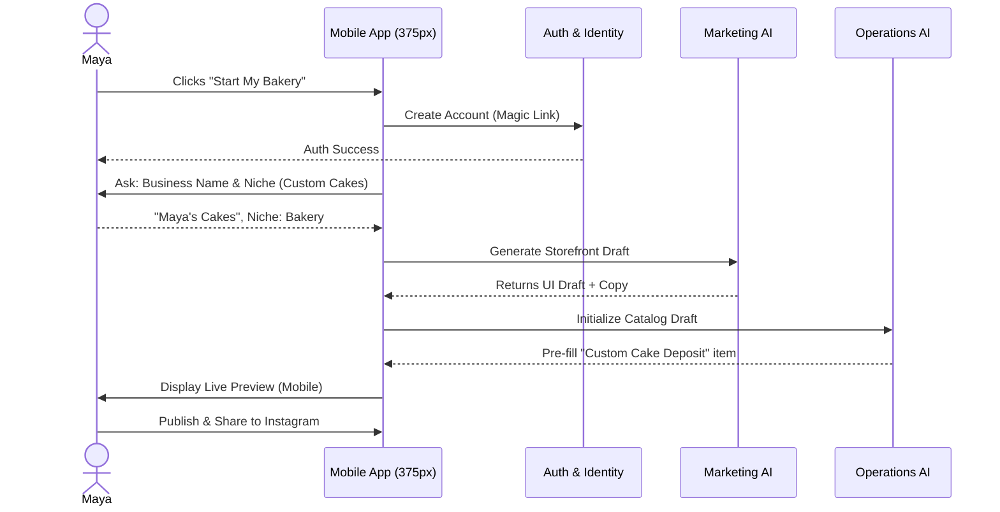
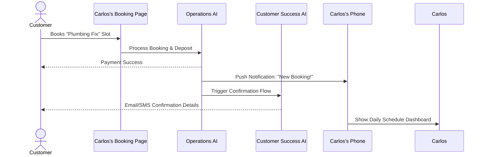

# [Architecture] Business Journey Definition & Lifecycle Mappings

## Title
End-to-End Business Journey Architecture: Defining the Lifecycle for SMB Personas

## Problem Statement
The current platform lacks a cohesive architectural definition of the end-to-end user lifecycle (Acquisition, Onboarding, Activation, Retention, Revenue, Referral). Non-technical small business owners (SMBs) like Maya (baker), Carlos (handyman), Priya (boutique owner), Leo (music tutor), and Fatima (food cart operator) experience fragmented flows when attempting to transition from sign-up to daily active operations. Without a unified business journey architecture, different product features feel disconnected, leading to user drop-off during onboarding and lower activation rates. We need a standardized journey architecture that dictates how AI agents integrate invisibly at each lifecycle stage to drive success.

## Research Report
**Findings & Persona Analysis:**
1. **Acquisition:** Users discover OHC via organic search, social media ads (e.g., Instagram), or word-of-mouth. The landing page CTA must instantly promise a "Live Business in 10 Minutes" without jargon.
2. **Onboarding:** Non-technical users abandon complex setups. For Maya, Carlos, and Fatima, the core requirement is capturing just the business name, core offering, and contact info, allowing the "Operations" and "Marketing" AI departments to auto-generate the storefront.
3. **Activation:** Success (activation) means different things per persona:
   - *Maya/Priya/Fatima:* First product/item published and first order received.
   - *Carlos/Leo:* First service listed and first booking confirmed.
4. **Retention:** Daily active usage is driven by actionable insights. Users need push notifications for new orders/bookings and a weekly "Business Advisory" report summarizing health.
5. **Revenue:** Users transition from Free to Starter/Pro when hitting logical friction points (e.g., custom domain requirement, advanced AI action limits, or SSL provisioning).
6. **Referral:** Organic growth is driven by the viral loop of shared storefronts, booking links, and link-in-bio pages (e.g., Leo's TikTok link-in-bio).

**Competitive Analysis:**
- *Shopify/Wix:* High setup complexity (30-60 mins). Demands technical configuration before launch.
- *OHC:* Radically simple (< 10 mins). Focuses on mobile-first setup with AI handling configuration (pricing, design, copy).

## Design Doc

### Key Design Decisions and Why
1. **Progressive Disclosure:** Collect only essential data (Name, Niche) upfront. Defer complex setups (Stripe, Tax) until the user has successfully listed their first product/service. This maximizes activation rates.
2. **Mobile-First (375px) Bias:** The entire onboarding wizard and daily management dashboard must work flawlessly on a 375px screen. Desktop is purely additive.
3. **AI-Driven Defaults:** Instead of presenting users with blank templates, AI (Marketing & Operations) pre-fills the site, catalog, and policies based on the initial niche selection.
4. **Actionable Retention:** Retention relies on proactive "Business Advisory" AI nudges (e.g., "Tuesday was your busiest day, want to run a promo?") rather than passive dashboards.

### AI Agent Integration Points
- **Onboarding:** *Marketing & Advertising* auto-generates the storefront and initial copy. *Legal & Compliance* drafts default ToS/Privacy policies.
- **Activation:** *Operations* manages the first booking/order flow. *Finance & Payments* tracks the initial deposit.
- **Retention:** *Customer Success* drafts review requests post-order. *Business Advisory* delivers weekly push notification health reports.
- **Revenue/Referral:** *Sales & Acquisition* tracks referrals and suggests upsell tier prompts when user approaches limit.

### Sequence Diagrams (Mermaid.js)

#### 1. Maya (Baker) - Onboarding & Activation Journey

#### 2. Carlos (Handyman) - Retention & Booking Journey

### UI Wireframes & Mobile UX Flow (375px first)
1. **Acquisition Screen:** Hero text "Your Business, Live in 10 Mins". Single input field: "What do you sell/do?". Large primary CTA button.
2. **Onboarding Screen (Wizard):**
   - Step 1: "Name your business"
   - Step 2: "Pick a vibe" (Visual selection of 3 AI-generated styles)
   - Step 3: "Add your first item" (Uses native mobile keyboard/camera)
3. **Dashboard (Retention/Daily Operations):**
   - Top: "Today's Pulse" (Orders/Revenue summary, Glassmorphism card).
   - Middle: Actionable AI Nudges ("Business Advisory: 3 customers haven't reviewed their orders. Request reviews?").
   - Bottom: Core navigation (Home, Inbox, Catalog, Settings). Touch targets 44x44px.

## Implementation Prompt
**Context:** We are implementing the end-to-end business journey architecture for the OHC platform, focusing on a radically simple, mobile-first experience.
**Task:** Implement the unified onboarding flow and AI department hooks.
**Requirements:**
1. Build the mobile-first (375px) onboarding wizard using Riverpod/Zustand for state management. Ensure progressive disclosure (ask for Name/Niche only).
2. Wire up the AI integration points to trigger *Marketing & Advertising* for storefront generation and *Operations* for catalog seeding upon completing the wizard.
3. Implement the daily management dashboard that prioritizes actionable "Business Advisory" push notifications over raw data charts.
4. Add comprehensive E2E tests validating the journey from sign-up to "first item published" for both a product-based (Maya) and service-based (Carlos) flow. Start the test from the UI login and navigate through every step. Do not mock network requests in the E2E flow.

## Priority
P0

## Estimated Scope
Large
