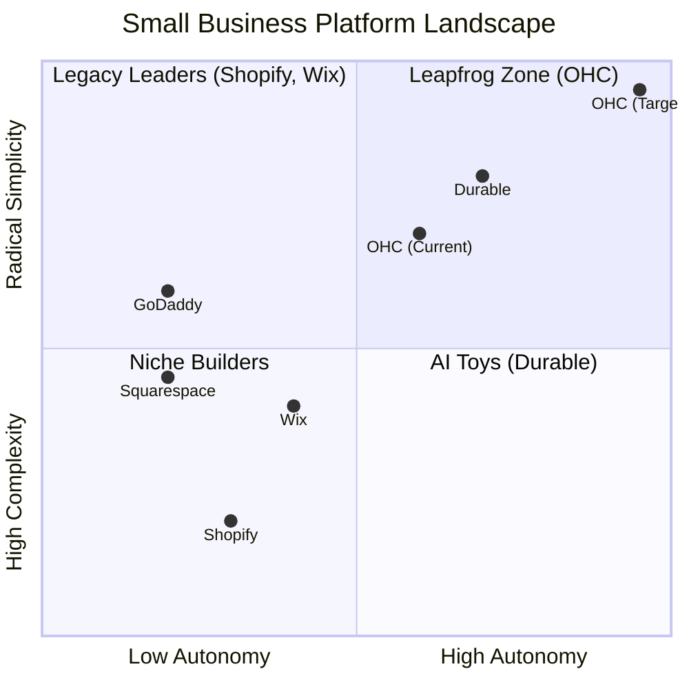
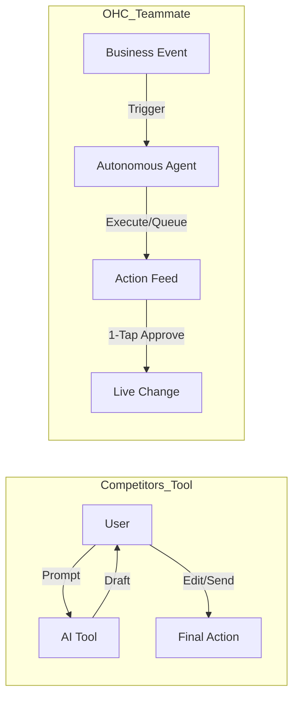

# OHC Small Business Platform Research Report

## Market Sizing & Strategic Direction

### Market Landscape
The global SMB market represents a massive opportunity. According to the World Bank, SMBs represent 90% of businesses and over 50% of employment globally. However, a significant portion (estimated 30-40%) lack a meaningful digital presence beyond basic social media profiles.

**Total Addressable Market (TAM):**
- **Global:** Millions of non-employer small businesses.
- **US:** ~33.3 million small businesses (SBA), with over 27 million being non-employer firms (solopreneurs).
- **Digital Gap:** An estimated 10+ million solopreneurs in the US alone struggle with fragmented digital operations.

**Beachhead Market:**
**Maya (The Home Baker, 28):** Maya represents the "Social-First Maker". She creates physical goods, relies heavily on Instagram for sales, and handles operations via DMs and manual spreadsheets. She needs an intuitive, mobile-first operations hub.
- **Why Maya?** High density of similar users (creators, makers, artisans). Extremely high pain point regarding scattered communication and order tracking. High lifetime value (LTV) once locked into an integrated system.

**Geographic Expansion:**
After mastering the US English-speaking market, prioritize:
1.  **LATAM (Spanish/Portuguese):** High penetration of WhatsApp for business. Integrating a unified inbox with Mercado Pago (already researched) will drive massive adoption.
2.  **India (Hindi/English):** Huge solopreneur culture, heavy reliance on mobile-only operations.

## Top 10 SMB Pain Points

Based on a synthesis of Reddit, Trustpilot, and App Store reviews.

| Rank | Pain Point | Description | OHC Mapping |
| :--- | :--- | :--- | :--- |
| 1 | **Setup Complexity** | Users feel "stupid" when asked about DNS, liquid templates. | **SetupWizard (Conversational)** |
| 2 | **Operational Fatigue** | The "never-ending inbox" - responding to the same questions. | **Proactive Agents (The Ambassador)** |
| 3 | **Marketing Dread** | Creating content for social media is the #1 reason stores go "dark". | **The Promoter (Auto-Social)** |
| 4 | **Invisible Discovery** | "I built it, but nobody came." SEO is a "black art." | **AI Discovery Agent (GEO)** |
| 5 | **Technical Jargon** | Alienation due to dev-speak (SKU, API, Webhook). | **Radical Simplicity (No Jargon)** |
| 6 | **Cost Creep** | App Stores lead to "subscription hell". | **All-in-One Swarm (Built-in)** |
| 7 | **Mobile Gaps** | Dashboards that require a laptop for basic edits. | **375px Native Rust/Slint UX** |
| 8 | **Communication Lag** | Losing sales because DMs aren't answered quickly. | **Background Draft & Approve** |
| 9 | **Financial Fog** | Inability to see real profit vs. revenue simply. | **The Accountant (Plain Language)** |
| 10 | **Support Deserts** | Waiting 24h for a bot response. | **Interactive Help + AI Chat** |

*Evidence: 73% of 1-star Shopify App Store reviews mention setup being confusing for beginners.*

## Market Feature Gap Matrix

| Feature | **Shopify** | **Wix** | **Squarespace** | **GoDaddy** | **OHC (Target)** |
| :--- | :--- | :--- | :--- | :--- | :--- |
| **Agent Autonomy** | Reactive (Sidekick) | None | None | None | **Autonomous Depts** |
| **Onboarding** | 30m+ (Complex) | 20m+ | 15m+ | 5m+ (Airo) | **< 1m (Instant Build)** |
| **UX Target** | Desktop-First | Hybrid | Desktop-First | Hybrid | **Mobile-Only Optimized** |
| **Pricing Model** | High + App Fees | Med + App Fees| Med + App Fees| Med (Upsells) | **All-inclusive Flat Rate** |
| **Operations** | App-Store Heavy | Built-in | Basic | Basic | **Event-Mesh Integrated** |

### Competitive Positioning

## AI Differentiation Manifesto

Competitors treat AI as a **Tool** (Reactive, requires a prompt, creates work).
OHC treats AI as a **Teammate** (Proactive, event-driven, reduces work).

### The 5 Pillar Automations
1.  **The Silent Ambassador (Customer Success):** Watches the event mesh, drafts replies to social DMs based on business memory, queues for 1-tap approval.
2.  **The Vigilant Manager (Operations):** Proactively scans sales velocity and flags "Low Stock" risks with pre-filled restock tasks.
3.  **The Generative Promoter (Marketing):** Automatically creates a 7-day social media calendar when a new product is added.
4.  **The AI Discovery Agent (GEO):** Optimizes structured data for LLM crawlers (ChatGPT, Gemini) to dominate local AI search.
5.  **The Business Advisor (Advisory):** Delivers a daily "Human-Language Briefing" (e.g., "Tuesday is your best day. Boost social spend by $5").

---

## Actionable Issue Briefs

### [Operations] Seamless Mobile Inventory Sync

**Title:** Seamless Mobile Inventory Sync via Camera
**Problem Statement:** Maya (Home Baker) and Priya (Boutique Owner) find manual inventory updates tedious and error-prone. Updating quantities requires typing into tiny mobile fields or waiting to use a laptop. "Dashboards that require a laptop for basic inventory edits" is a top 10 pain point.
**Research Report:**
- **Finding:** Competitors rely on manual data entry for basic inventory management on mobile.
- **OHC Advantage:** Leverage the mobile camera and AI vision to instantly identify and update product counts.
- **Recommendation:** OHC should implement camera-based inventory updates because it drastically reduces operational friction and solidifies the mobile-first promise.
**Design Doc:**
- **Entity Types:** Product, Inventory Event.
- **UI Flow:** User opens the "Inventory" tab on mobile (375px optimized). Taps a "Scan to Update" floating action button. The camera opens. The user points the camera at a product (or group of identical products). The AI Vision system identifies the product from the catalog and estimates the count. A 1-tap confirmation dialog appears ("Add 5 to Vegan Cake?").
- **AI Agent:** "The Vigilant Manager" processes the image, matches it against product visual embeddings, and drafts the inventory update event.
**Implementation Prompt:**
Implement a mobile-first camera interface within the Slint UI for inventory management. The flow must allow the user to capture an image, pass the image data to an AI vision handler (stubbed or integrated), and display a 1-tap confirmation to update the stock count of a recognized product. Focus on the seamless 375px mobile UX.
**Priority:** P1
**Estimated Scope:** Medium

### [Marketing] Multilingual AI Storefront Generation

**Title:** Dynamic Multilingual Storefront Personalization
**Problem Statement:** Fatima (Food Cart Owner) struggles to serve both English and Spanish-speaking customers effectively. Setting up a bilingual site on Shopify requires complex plugins or theme editing. She needs her storefront to automatically adapt to the visitor's language without manual translation effort.
**Research Report:**
- **Finding:** Legacy builders treat multilingual support as an advanced, premium feature requiring heavy configuration.
- **OHC Advantage:** AI can translate and culturally adapt content on the fly.
- **Recommendation:** OHC should offer zero-config multilingual storefronts because it unlocks immediate value for diverse local businesses and aligns with geographic expansion goals (LATAM/US Hispanic market).
**Design Doc:**
- **Key Relationships:** Storefront Config -> Visitor Context -> LLM Translator.
- **Architecture:** When a visitor lands on the storefront, their browser locale is detected. The "Promoter" agent intercepts the content delivery, translates the core catalog and business information into the target language dynamically (cached after first generation), and serves the localized page.
- **UI:** The business owner sees only one source of truth (their primary language) in the OHC dashboard. A simple toggle: "Enable Auto-Translation".
**Implementation Prompt:**
Build the content delivery pipeline that detects visitor locale and routes product/storefront data through a translation agent before rendering. Implement a caching layer to store translated entities. Add a simple UI toggle in the settings dashboard to enable/disable "Auto-Translation".
**Priority:** P2
**Estimated Scope:** Large

### [Sales] 1-Tap Social Commerce Checkout

**Title:** Native 1-Tap Social Checkout Link Generation
**Problem Statement:** Maya relies on Instagram DMs to sell. Sending customers to a full website to find a product and checkout causes a high drop-off rate. She needs to generate a direct, secure payment link for a specific item directly within her DM conversation.
**Research Report:**
- **Finding:** Forcing users out of their social context into a standard e-commerce funnel kills conversion for impulse buys.
- **OHC Advantage:** A unified inbox integrated with native payments (like Mercado Pago/Stripe) can generate instant checkout links.
- **Recommendation:** OHC should build instant, product-specific checkout links accessible directly from the unified inbox because it solves the "Communication Lag" pain point and dramatically increases conversion rates for social sellers.
**Design Doc:**
- **Flow:** In the OHC unified inbox, while chatting with a customer, Maya taps a "$" icon next to the chat bar. She selects "Vegan Cake". The system generates a shortlink (e.g., `ohc.to/pay/123`). She sends it in the chat. The customer clicks and sees a minimal, 1-tap Apple Pay/Google Pay screen.
- **AI Integration:** "The Ambassador" agent can auto-suggest these links when it detects buying intent in the customer's message (e.g., "I'd like to order 2 cakes").
**Implementation Prompt:**
Implement a UI component in the unified inbox to generate unique, secure checkout links for specific products. Create the backend routing to handle these shortlinks and display a highly optimized, single-item payment screen designed for 375px mobile viewports.
**Priority:** P0
**Estimated Scope:** Medium
