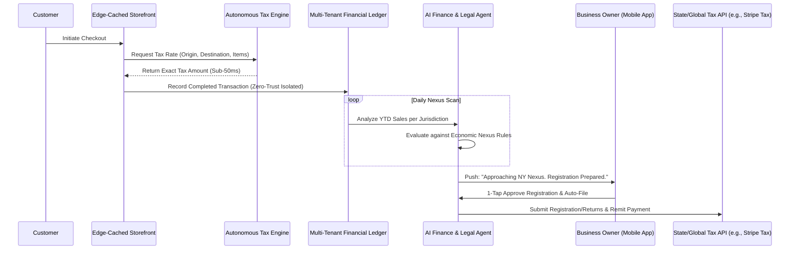

# Issue Brief: Autonomous Global Tax & Compliance Engine

## Title
[Architecture] Autonomous Global Tax & Compliance Engine

## Problem Statement
Small business owners—whether they are e-commerce merchants like Maya shipping custom cakes across state lines or service providers like Priya selling boutique items internationally—face massive administrative burden and legal risk navigating local, state, and global tax laws. Tracking economic nexus thresholds, calculating the correct sales tax or VAT at the point of checkout, and manually filing returns across multiple jurisdictions drains their time and exposes them to severe financial penalties. They need an invisible, zero-config engine that accurately calculates tax dynamically at checkout, monitors business growth against compliance thresholds globally, and auto-files returns without requiring them to act as a compliance officer.

## Research Report
- **Competitor Systems Audit**:
  - **Shopify / Stripe Tax (TaxJar) / Avalara**: These platforms provide robust API-driven tax calculation and auto-filing. However, they often require merchants to navigate complex configuration dashboards, map their specific products to intricate tax codes manually, and continuously monitor their status.
  - **Wix / Squarespace**: Offer basic integrations but still push the burden of compliance monitoring onto the business owner.
- **OHC's Opportunity**: We must transition from "Tax Calculation Tools" to a fully "Autonomous Compliance Engine." By natively integrating an automated tax ledger, OHC can use AI (specifically the AI Finance & Legal Departments) to invisibly map product catalogs to their respective tax codes. As the Universal Capacity and Inventory Ledger records transactions, the engine can autonomously project threshold limits (e.g., "You are at 90% of the California economic nexus threshold") and auto-generate compliance registrations before penalties are incurred. The business owner's only interaction is a simple 1-tap approval to auto-file.

## Design Doc

### Business Journey Mapping & AI Department Coordination
- **Revenue & Retention Phase**: During checkout, the engine calculates the precise tax in sub-50ms using edge-cached rules. Post-checkout, the transaction is synced to a globally compliant ledger.
- **AI Coordination**:
  - **Finance & Legal Department**: Scans the unified ledger and monitors cross-jurisdiction sales volumes against real-time nexus thresholds.
  - **Operations Department**: Automatically maps new inventory (e.g., a digital course vs. a physical cake) to the correct global tax category without merchant input.
- **Owner Journey**: The business owner sees a clean "Compliance Health" card on their mobile dashboard. If they cross a threshold, the system pushes a notification: "You are nearing the tax threshold in New York. I've prepared your registration. Tap to file."

### Architecture Diagram

### Mobile UX Flow (375px First)
1. **Push Notification**: "Action needed: You're approaching the California tax threshold. Tap to review."
2. **Dashboard Card (The "Grandmother Test")**: A translucent glass card on the main dashboard showing a simple progress bar: "Compliance Health: 1 Action Required."
3. **Review Screen**: Swiping the card opens a unified view showing the specific state (e.g., California), current sales ($95k / $100k threshold), and an AI-drafted summary explaining what this means in plain language.
4. **Action**: A prominent, single button: "Approve & Auto-File." No complex forms.
5. **Confirmation State**: Haptic feedback followed by a smooth success animation confirming the business is fully compliant.

### Key Design Decisions
- **Edge-Caching for Checkout Performance**: To ensure zero friction during the purchase flow, common tax rates for the merchant's high-volume shipping zones are cached at the edge, maintaining strict sub-50ms latency targets.
- **Invisible Product Mapping**: The burden of categorizing products (e.g., differentiating between a taxable physical good and a non-taxable service) is handled by the AI Operations Agent parsing the product description during creation, not by the merchant selecting from a 10,000-item dropdown.
- **Multi-Tenant Isolation & Zero Trust**: Strict SPIFFE/SPIRE identity checks ensure that one tenant's financial ledger and sales velocity data can never be accessed or inferred by another tenant during the AI batch analysis.

## Implementation Prompt
**Objective**: Build the Autonomous Global Tax & Compliance Engine. This system must intercept checkout requests to provide real-time, accurate tax calculations based on origin, destination, and product type. It must continuously analyze transaction ledgers to monitor economic nexus thresholds per tenant and trigger the AI Finance Department to generate 1-tap auto-file prompts for the business owner via the mobile UI.
**Acceptance Criteria**:
1. Implement an edge-compatible tax calculation endpoint that parses order details and returns jurisdiction-specific tax rates within 50ms.
2. Develop a background worker that securely queries the multi-tenant financial ledger daily to evaluate sales volume against state/country nexus thresholds.
3. Integrate the AI Finance Agent to auto-categorize catalog items into proper tax codes upon creation.
4. Create a mobile-first UI endpoint that surfaces plain-language compliance alerts and accepts a 1-tap approval to trigger downstream tax registration/filing APIs.
5. Ensure all data access is strictly bounded by the tenant's Zero-Trust identity.

## Priority
P0

## Estimated Scope
Large
