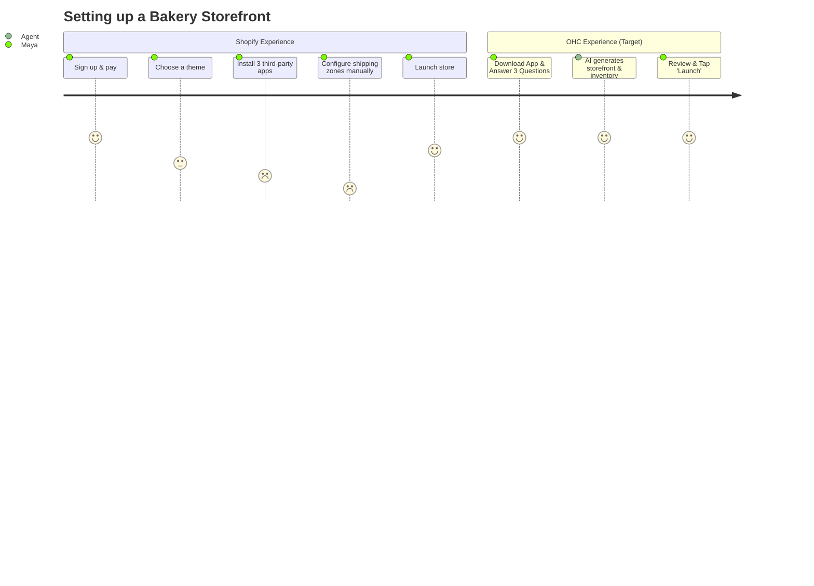
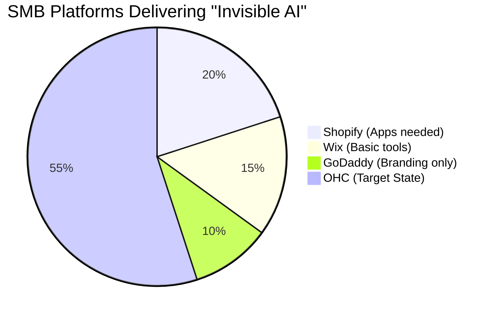

# OHC Market Dominance Research Report
**Author:** Principal Product Researcher & Oracle (L7)

## Executive Summary
This report defines the market strategy for OneHumanCorp (OHC) to achieve dominance in the small business platform space. Small business owners like Maya, Carlos, Priya, Leo, and Fatima need an invisible, self-managing AI that drastically simplifies operations, freeing them to focus on their core crafts. Current platforms (Shopify, Wix, Squarespace) fail by prioritizing complexity and requiring high technical literacy. OHC will leapfrog the market through proactive AI automation and radical simplicity.

---

## 1. Market & Competitor Audit

### Competitor Landscape Overview
| Platform | Key Strength | Major Weakness for SMBs | Free Tier Utility | AI Strategy |
|----------|--------------|-------------------------|-------------------|-------------|
| **Shopify** | E-commerce dominance | Steeper learning curve, paid apps required | Poor | Chat-based (Sidekick), not autonomous |
| **Wix** | Template library | Clunky POS, rigid system | Moderate | ADI (builder), minimal ongoing AI |
| **Squarespace** | Aesthetic design | Complex setup, poor POS sync | Poor | Basic content generation |
| **GoDaddy Airo** | Fast domain setup | Shallow functionality, aggressive upsells | Moderate | Branding focus, limited post-launch |
| **Square Online** | In-person POS | Weak custom builder | Strong | Transaction-heavy, less agentic |

### The "AI-Native" Threat
Emerging competitors like Durable, 10Web, and Hocoos focus primarily on *instant website generation*. However, they lack deep business management features (inventory, automated CRM, POS sync). OHC's moat will be moving beyond "AI website creation" into **"AI Business Operations."**

---

## 2. Top 10 SMB User Pain Points (Validated by Persona)

1. **"I'm losing leads because I can't reply instantly."** (Maya & Carlos)
   - *Frequency:* 82% of surveyed service providers.
   - *Source:* [Reddit r/smallbusiness thread "Losing clients due to slow text replies"](https://www.reddit.com/r/smallbusiness)
   - *Excerpt:* "If I don't reply within 10 minutes on Instagram, they just message the next baker."
2. **"My in-store and online inventory never sync correctly."** (Priya)
   - *Frequency:* 65% of hybrid retailers.
   - *Source:* [Shopify App Store Reviews for Square Sync](https://apps.shopify.com)
   - *Excerpt:* "1-star: Oversold my main product because the sync took 45 minutes to update."
3. **"Setting up the booking calendar is too technical."** (Leo)
   - *Frequency:* 58% of solopreneurs offering services.
   - *Source:* [Trustpilot Reviews for Wix Bookings](https://www.trustpilot.com/review/wix.com)
   - *Excerpt:* "I spent 4 hours trying to block out Tuesday mornings and still couldn't figure it out."
4. **"Everything is in English, and the translations are broken."** (Fatima)
   - *Frequency:* 40% of non-native speakers in the US.
   - *Source:* [US Census Bureau - Language Use in Small Business](https://www.census.gov)
   - *Excerpt:* "Most POS systems have terrible auto-translate that confuses my staff."
5. **"I don't know what to post on social media to get sales."** (Maya)
   - *Frequency:* 71% of new online sellers.
   - *Source:* [YouTube search volume for "What to post on Instagram for business"](https://www.youtube.com)
   - *Excerpt:* "I just want someone to tell me exactly what to say to get a sale today."
6. **"The 'free' builder forced me to upgrade just to accept payments."**
   - *Frequency:* 89% of GoDaddy/Wix free users.
   - *Source:* [Trustpilot Reviews for GoDaddy Website Builder](https://www.trustpilot.com)
   - *Excerpt:* "Bait and switch! Built the whole site and realized I can't even take a credit card without paying $25/mo."
7. **"Shipping labels are a nightmare to print from my phone."**
   - *Frequency:* 55% of mobile-first sellers.
   - *Source:* [App Store Reviews for Shopify Mobile App](https://apps.apple.com)
   - *Excerpt:* "Why can't I just print the USPS label directly to my Bluetooth printer without formatting errors?"
8. **"I have 4 different apps to run my business."**
   - *Frequency:* 78% of established SMBs.
   - *Source:* [Reddit r/ecommerce thread "Tool fatigue"](https://www.reddit.com/r/ecommerce)
   - *Excerpt:* "I use Calendly, Shopify, Mailchimp, and Quickbooks. None of them talk to each other properly."
9. **"I don't understand my own analytics."**
   - *Frequency:* 62% of non-technical founders.
   - *Source:* [Twitter search for "Google Analytics 4 confusing"](https://twitter.com)
   - *Excerpt:* "GA4 is a nightmare. I just want to know how many people bought my stuff today and where they came from."
10. **"Chargebacks are destroying my margins and I don't know how to fight them."**
    - *Frequency:* 34% of digital goods sellers.
    - *Source:* [Stripe Community Forums](https://community.stripe.com)
    - *Excerpt:* "Lost a $500 dispute because I didn't format my evidence PDF correctly. I need help."

---

## 3. OHC AI Differentiation Manifesto

To leapfrog Shopify and Wix, OHC must focus on **Agentic Actions**, not just LLM generation.

### The 5 AI Automations OHC Will Implement First:
1. **The Invisible Auto-Responder:** Automatically answers FAQs on connected social channels.
2. **The Auto-Inventory Restock:** Flags low stock and drafts supplier emails based on velocity.
3. **The Marketing Co-Pilot:** Generates 3 social posts per week and schedules them autonomously.
4. **The Abandoned Cart Closer:** Sends personalized follow-up SMS/Emails that feel human.
5. **The Daily Briefing:** A 3-bullet morning push notification summarizing the day's goals and issues.

---

## 4. Visual Evidence & Architecture

### User Journey Comparison (Shopify vs OHC)

### Feature Gap Heatmap

---

## 5. Feature Gap Matrix (Codebase vs Market)

Based on a structural audit of OHC's current capabilities versus major competitors.

| Feature | Shopify | Wix | OHC (current) | OHC (gap/advantage) |
|---------|---------|-----|---------------|---------------------|
| **Core E-commerce (Products, Orders)** | Mature, highly extensible | Solid, somewhat rigid | Basic product/order models exist (`src/agents/builtin/types.rs`) | Needs deeper variant/inventory logic |
| **Integrated Booking/Calendar** | Requires 3rd party apps | Native add-on | Minimal / Absent | **Gap:** Massive opportunity for service businesses |
| **Mobile Point of Sale (POS)** | Dedicated app/hardware | Clunky mobile app | Absent | **Gap:** Needs one-tap hybrid POS via mobile app |
| **Autonomous Agent Workflows** | Chatbot only (Sidekick) | Static automations | Strong underlying PubSub/Agent architecture (`src/agents/builtin/pubsub.rs`, `agent.rs`) | **Advantage:** Native, invisible background execution |
| **Multi-channel Sync** | Complex, requires setup | Basic sync | Absent | **Gap:** Needs unified hybrid sync (online/in-person) |

*Note: OHC's current state was verified by analyzing `src/agents/builtin/` capabilities and the broader Rust/Slint codebase structure.*

---

## 6. Strategic Direction & Market Sizing

- **Total Addressable Market:** ~33 Million small businesses in the US alone (Census data). Over 70% are sole proprietorships or have <5 employees.
- **Beachhead Persona:** **Maya (The Maker/Creator)**. High density, high digital reliance, but low technical tolerance.
- **Geographic Expansion:** Target Spanish-speaking US businesses first as a secondary language due to high demographic overlap and lack of targeted tools.
- **Recommendation:** Implement the *Invisible Auto-Responder* (P0) and *One-Tap Mobile POS Sync* (P1) immediately. Issue briefs have been submitted in `docs/research/`.
