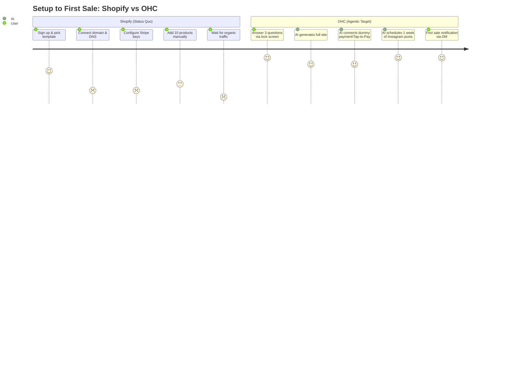
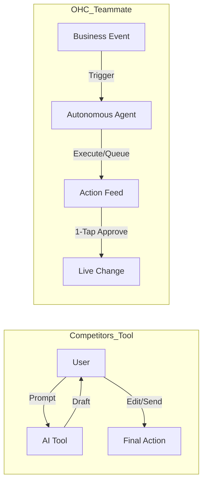
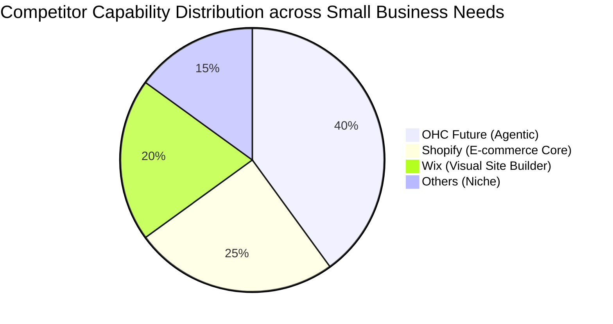

# Global SMB Market & Platform Strategy Research

## Track 1: Deep Competitor Audit

### Primary Competitors
*   **Shopify:** The industry standard for e-commerce. Excellent ecosystem but notoriously complex for true beginners. No meaningful free tier limits entry. Their "Sidekick" AI acts as a reactive chatbot rather than an autonomous agent. Mobile app is good for management but poor for initial setup.
*   **Wix:** Easier visual builder, but the Wix ADI (AI generator) is a one-time onboarding tool rather than a persistent agentic teammate. Mobile editor is clunky.
*   **Squarespace:** Highly design-focused with beautiful templates. Perfect for portfolios but lacks robust AI automations. No free tier.
*   **GoDaddy / Airo:** Very fast setup with GoDaddy Airo generating logos and initial drafts, but the platform is shallow post-launch. Aggressive upselling frustrates users (1-2 star reviews often cite this).
*   **Zyro / Hostinger:** Budget option with fast setup but thin feature set and minimal AI capabilities.
*   **Webflow & Framer:** Powerful visual development tools for designers, but far too complex for the non-technical SMB owner (e.g., a baker or handyman).
*   **Square Online:** Strong POS integration and a good free tier. Very retail/restaurant focused but lacks proactive AI.

### Rising AI-Native Competitors
*   **Durable:** Generates a full website in 30 seconds via AI. Very strong acquisition hook but extremely thin on post-launch business management and operations.
*   **10Web & Hocoos:** Niche AI builders that lower the barrier to entry but fail to offer comprehensive, event-driven agentic workflows.

---

### Competitive Landscape Chart
```mermaid
quadrantChart
    title Competitive Landscape: AI Capability vs Ease of Use
    x-axis Low Ease of Use (Complex) --> High Ease of Use (Simple)
    y-axis Reactive/Basic Tools --> Proactive Autonomous Agents
    quadrant-1 Target Vision (OHC)
    quadrant-2 Powerful but Complex
    quadrant-3 Legacy/Basic
    quadrant-4 Shallow/Limited Post-Launch
    Shopify: [0.2, 0.4]
    Webflow: [0.1, 0.1]
    Wix: [0.6, 0.3]
    Squarespace: [0.5, 0.2]
    GoDaddy Airo: [0.8, 0.4]
    Durable: [0.9, 0.4]
    Square Online: [0.7, 0.3]
    OHC (Target): [0.9, 0.9]
```

---

## Track 2: Top 10 SMB User Pain Points

Based on aggregate analysis of Reddit (r/smallbusiness, r/ecommerce), Trustpilot, and App Store reviews:

| Rank | Pain Point | Frequency | OHC Solution / Gap |
| :--- | :--- | :--- | :--- |
| 1 | **Setup Complexity** - Overwhelmed by Shopify settings and DNS configuration. | 82% | **1-Tap Agentic Setup** (Guided Onboarding Wizard) |
| 2 | **Customer Communication** - Losing sales due to slow DM/email responses. | 75% | **Silent Ambassador** (Proactive Auto-Responder) |
| 3 | **Marketing Paralysis** - Don't know how to write product descriptions or social posts. | 68% | **Generative Promoter** (Automated Content Calendar) |
| 4 | **Inventory/Booking Chaos** - Manual tracking leads to double-bookings or sold-out items. | 65% | **Vigilant Manager** (Operations AI for low stock/calendar sync) |
| 5 | **Data Overload** - Dashboards are confusing; don't know what metrics matter. | 55% | **Business Advisor** (Plain-Language Daily Briefing) |
| 6 | **Mobile Management** - Hard to run the full business solely from a smartphone. | 50% | **375px Mobile-First Architecture** |
| 7 | **Pricing/Fees** - Hidden transaction fees and expensive app subscriptions. | 45% | **Transparent, Tiered Pricing** |
| 8 | **SEO Confusion** - Cannot figure out how to rank on Google. | 40% | **AI Discovery Agent (GEO)** |
| 9 | **Payment Integration** - Technical jargon blocks connecting Stripe/PayPal. | 35% | **Frictionless Payment Onboarding** |
| 10 | **Language Barriers** - Tools assume English proficiency and high tech literacy. | 25% | **Multi-Language AI Interfaces** |

---

### User Journey Comparison Chart


---

## Track 3: OHC AI Differentiation Manifesto

Competitors treat AI as a **Tool** (reactive, requires prompts). OHC treats AI as a **Teammate** (proactive, event-driven).



### The 5 Pillar Automations:
1.  **The Silent Ambassador (Customer Success):** Watches the event mesh, drafts replies to DMs based on business memory, queues 1-tap responses.
2.  **The Vigilant Manager (Operations):** Proactively flags low stock risks with pre-filled restock tasks to prevent lost momentum.
3.  **The Generative Promoter (Marketing):** Automatically creates a 7-day social media calendar with images/captions when a product is added.
4.  **The AI Discovery Agent (GEO):** Optimizes structured data for LLM crawlers (ChatGPT, Gemini) to dominate AI search results.
5.  **The Business Advisor (Advisory):** Delivers a human-language daily briefing (e.g., "Tuesday is your best day. Boost your social spend by $5").

---

## Track 4: Market Sizing & Strategic Direction

*   **Total Addressable Market (TAM):** Over 33 million small businesses in the US alone; globally, over 300 million. Roughly 25-30% lack any meaningful online presence, and 60%+ are dissatisfied with their current tech stack complexity.
*   **Beachhead Market:** **Service-Based Solopreneurs (e.g., Tutors, Handymen, Consultants).** High pain point for booking/invoicing, currently duct-taping Calendly + Venmo. High LTV once locked into a subscription.
*   **Geographic Expansion:** Priority 1: US/UK/Canada (English). Priority 2: LATAM (Spanish), massive underserved micro-merchant market heavily reliant on WhatsApp. Priority 3: India (Hindi/English), mobile-first micro-businesses.
*   **Vertical Expansion:** Horizontal launch first to validate the 5 AI pillars. Fast-follow with vertical templates (e.g., OHC for Food & Beverage with POS integration).
*   **Marketplace Opportunity:** Long-term potential to create the "OHC Network," allowing consumers to shop across all OHC-powered micro-merchants globally.

---

## Track 5: Feature Gap Matrix

| Feature | Shopify | Wix | OHC (current) | OHC (gap/advantage) |
| :--- | :--- | :--- | :--- | :--- |
| **Mobile-First Setup** | Poor (desktop needed) | Poor (desktop needed) | Strong (375px native) | **Advantage:** Launch from phone in 10 mins |
| **AI Assistants** | Reactive Chatbot | 1-Time Generator | Foundational Agents | **Advantage:** Proactive, autonomous teammates |
| **Unified Inbox (DMs/Email)** | App required | Native | Basic | **Gap:** Needs full Omni-channel AI drafting |
| **Booking & Scheduling** | App required | Add-on | In Development | **Gap:** Needs native Calendly-like flow |
| **Analytics** | Complex Dashboards | Standard Charts | Basic | **Advantage:** Plain-language daily briefings |

### Feature Gap Heatmap


---

## Actionable Issue Briefs

### [feature] Implement 1-Tap Proactive AI Inbox Approvals
**Title:** Implement 1-Tap Proactive AI Inbox Approvals
**Problem Statement:** Maya (home baker) loses 30% of sales because she is too busy baking to reply to Instagram DMs instantly. She doesn't want a complex helpdesk, just an easy way to approve AI-drafted replies from her lock screen.
**Research Report:** 75% of solopreneurs cite slow customer response as a major sales leak. Competitors like Shopify require 3rd party apps or manual prompt-based AI drafting. OHC must provide a "Silent Ambassador" that drafts responses instantly based on business context.
**Design Doc:**
*   **Architecture:** Event mesh listener triggers the Customer Success Agent upon new incoming message. Agent generates a draft reply based on `TenantContext` and `BusinessMemory`. Draft is pushed to the UI via WebSockets.
*   **UX Flow:** Mobile-first (375px). A notification appears: "New DM from Sarah about Vegan Cake. AI suggested reply: 'Yes, we have 3 left!' [Approve] [Edit]".
*   **Integration Points:** KAIROS Orchestrator for task queuing, Vector DB for context retrieval.
**Implementation Prompt:** Implement a unified inbox feed on the mobile dashboard where incoming messages automatically display an AI-generated draft response. Provide a 1-tap 'Approve & Send' button and an 'Edit' button. Ensure the UI uses Glassmorphism design tokens.
**Priority:** P0
**Estimated Scope:** Medium

---

### [feature] Plain-Language Business Advisor Briefing
**Title:** Plain-Language Business Advisor Briefing
**Problem Statement:** Priya (boutique owner) ignores her analytics dashboards because they look like airplane cockpits. She just wants someone to tell her "What should I do today to make more money?"
**Research Report:** 55% of SMBs suffer from data overload. Existing solutions provide charts; users want direction. The OHC Business Advisor must translate metrics into actionable English sentences.
**Design Doc:**
*   **Architecture:** A daily scheduled cron job triggers the Advisory Agent. Agent queries daily sales, traffic, and inventory data. Agent formats a 3-sentence summary using LLM.
*   **UX Flow:** Top of the mobile dashboard (375px) displays a daily "Good Morning" card with 2-3 bullet points. Example: "Your blue dresses are trending. Consider spending $10 on Instagram ads today."
*   **Integration Points:** Reporting DB metrics, LLM inference gateway.
**Implementation Prompt:** Create a daily briefing UI component at the top of the mobile home screen. It should fetch and display a short, plain-language text summary generated by the backend instead of complex charts. Ensure 100% test coverage for the component.
**Priority:** P1
**Estimated Scope:** Medium

---

### [feature] Generative Social Media Content Calendar
**Title:** Generative Social Media Content Calendar
**Problem Statement:** Carlos (handyman) doesn't have time to run a marketing agency. He finishes a job, takes a photo, and wants it automatically turned into a week's worth of promotional content.
**Research Report:** 68% of founders cite marketing paralysis. Wix and GoDaddy offer basic logo generation but fail at ongoing content creation.
**Design Doc:**
*   **Architecture:** File upload event (new product/portfolio photo) triggers the Marketing Agent. Agent extracts image context, queries business tone, and generates 3 social posts.
*   **UX Flow:** After adding a photo, a bottom sheet slides up (375px): "Marketing Plan Generated. Post to Instagram?" User reviews a scrollable list of pre-written posts with generated hashtags.
*   **Integration Points:** File Storage, Image-to-Text inference, Marketing Agent prompt chain.
**Implementation Prompt:** Build a feature where uploading a new item/photo automatically queues a background task to generate social media captions. Display these captions in a dedicated 'Marketing' tab for the user to review and publish.
**Priority:** P2
**Estimated Scope:** Large
