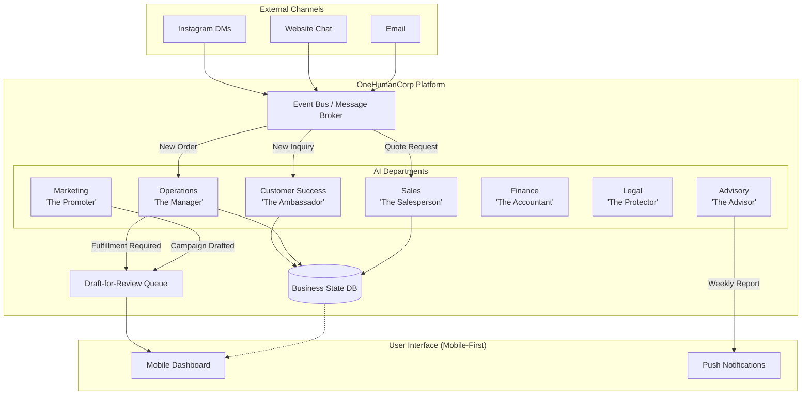
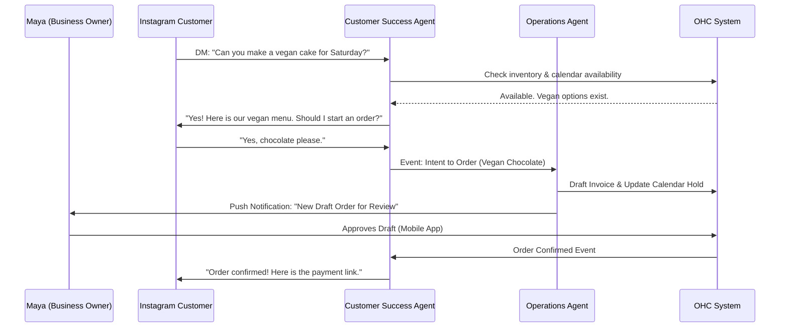

# 🔎 Scout: Tool Integration Research [Q3]

## Problem Statement

Small business owners—like Maya the baker and Carlos the handyman—do not want to manage "AI Agents," "Prompt Engineering," or "Orchestration Queues." They just want help running their business.

Currently, raw AI tools are confusing, intimidating, and disconnected from the day-to-day operations of a small business. When Maya opens her OneHumanCorp app, she shouldn't see a raw chat interface to a general-purpose LLM. She should see a familiar business structure: a "Department" that handles a specific function (like Customer Success or Marketing).

The gap is that existing platforms (like Shopify or Wix) either offer no integrated AI, or offer bolt-on chatbots that don't proactively run the business. We need to bridge this gap by abstracting complex AI orchestration into familiar, accessible "AI Departments" that run invisibly in the background, mirroring how a real business operates.

## Research Report

Our market analysis reveals that the primary friction point for AI adoption among non-technical SMBs is the "blank canvas" problem. Users don't know what to ask, how to ask it, or how to connect the AI's output to their actual business systems (inventory, CRM, billing).

**Competitive Landscape:**
- **Shopify/Wix/Squarespace:** Offer AI tools primarily for content generation (e.g., product descriptions, website copy). These are passive, single-turn tools. They do not proactively handle customer inquiries or manage operations.
- **GoDaddy:** Offers basic AI website building, but lacks ongoing operational support.
- **OneHumanCorp (Our Vision):** AI is active, proactive, and deeply integrated. It doesn't just write a product description; it answers Instagram DMs, updates inventory when a custom order is placed, and suggests seasonal marketing campaigns.

**The Solution: The Department Model**
By organizing AI agents into familiar "Departments", we achieve:
1.  **Instant Comprehension:** "Operations" handling orders makes intuitive sense.
2.  **Clear Boundaries:** Users know exactly what each department is authorized to do.
3.  **Proactive Assistance:** Departments can act autonomously based on events (e.g., a new order triggers the Customer Success department to send a confirmation).

**The 7 AI Departments:**
1.  **Operations ("The Manager"):** Order and booking processing, inventory tracking, fulfillment, refunds.
2.  **Marketing & Advertising ("The Promoter"):** Website design, SEO, social media posts, promotional content.
3.  **Sales & Acquisition ("The Salesperson"):** Quote generation, lead follow-up, referral tracking.
4.  **Customer Success ("The Ambassador"):** Message replies, order updates, review requests.
5.  **Finance & Payments ("The Accountant"):** Payment processing, financial reports, subscription billing.
6.  **Legal & Compliance ("The Protector"):** Terms/policies, contracts, GDPR compliance.
7.  **Business Advisory ("The Advisor"):** Weekly health reports, next-action suggestions, seasonal trends.

## Design Doc

### Architecture Diagram

### Flow Diagram: Maya's Custom Cake Order

### Key Design Decisions
1.  **Event-Driven Triggers:** Departments are triggered by system events (e.g., `OrderPlaced`, `MessageReceived`), not manual prompts.
2.  **Draft-for-Review Workflow:** High-stakes actions (refunds, sending quotes) require explicit human approval via the mobile app. The AI drafts the action, the human swipes to approve.
3.  **Inter-Department Coordination:** Departments communicate via the Event Bus. When 'Operations' finishes an order, 'Customer Success' automatically sends the follow-up.
4.  **Token Budgeting & Throttling:** Each department operates within a tenant-specific budget to control costs and prevent runaway loops.

## Implementation Prompt

**Objective:** Implement the "AI Department" orchestration framework to allow agents to act autonomously on business events, subject to human review for critical actions.

**Critical User Journey (CUJ):**
1. A new message arrives via an external channel (e.g., a simulated Instagram DM).
2. The `Customer Success` department automatically intercepts the message, queries the business state (e.g., product catalog), and drafts a reply.
3. If the reply involves a commitment (e.g., sending an invoice or booking a slot), the action is routed to the `Draft-for-Review Queue`.
4. The business owner receives a push notification, opens the OHC mobile app, reviews the drafted action, and swipes to approve.
5. The approved action is executed, and the `Operations` department is notified to update the internal state.

**Acceptance Criteria:**
- The framework must support defining at least 3 distinct "Departments" (e.g., CS, Ops, Sales) with specific system permissions.
- Departments must be triggerable via asynchronous events (pub/sub or message queue).
- A robust "Draft-for-Review" mechanism must be implemented, capturing the intent, proposed state change, and requiring an explicit approval flag before execution.
- Implement token usage tracking per department per tenant.
- The system must elegantly handle failures (e.g., if the LLM is unavailable, the system queues the event or alerts the owner).

*Note to Implementer:* Do not use this prompt to generate database schema directly. Design the appropriate entity relationships and API endpoints needed to support this asynchronous, event-driven workflow.

## Priority & Scope
- **Priority:** P0
- **Estimated Scope:** Large