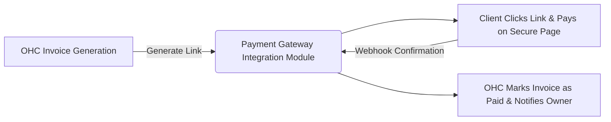
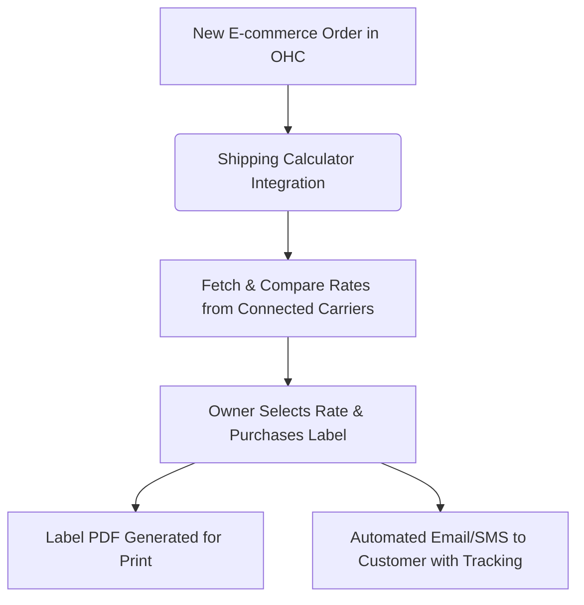

# OHC Tool Integration Research Report Q3

## Executive Summary
This comprehensive research report evaluates tools across 7 major categories to integrate with OHC, specifically tailored for small business owners operating in both Cloud and Standalone environments. Our primary lens is the "Business Owner Lens"—focusing on ease of use, practical benefits, and accessibility for non-technical users, rather than internal engineering metrics.

## Table of Contents
1. Executive Summary
2. Deep Dive Persona Profiles
3. Detailed Case Studies
4. Competitor Matrices & Market Analysis
5. Issue Briefs
   - Social Media Integration
   - Calendar & Scheduling
   - Email Marketing
   - Payment Processing
   - Shipping & Logistics
   - SMS & Notifications
   - Video Conferencing
6. Cloud vs. Standalone Environment Considerations
7. Strategic Recommendations

## Deep Dive Persona Profiles

### Persona: Fatima - Local Bakery Owner
**Technical Proficiency:** Low

**Background & Needs:**
Reliant on WhatsApp and SMS for orders. Needs simple, reliable communication tools that don't require complex app installations. Operates primarily offline but takes custom orders online.

**In-Depth Analysis for Fatima:**
When Fatima interacts with software, the expectation is immediacy and clarity. The cognitive load of managing disjointed apps directly detracts from Local Bakery Owner operations. If Fatima is using a tool to manage business tasks, it must integrate deeply into the core workflow without demanding explicit context switching.

**Primary Workflows:**
- Client Communication: Requires immediate push notifications without the noise of personal social feeds.
- Transaction Processing: Needs transparent, low-friction payment collection.
- Operations Tracking: Relies on simple, chronological views of daily tasks.

**Technology Friction Points:**
1. Complicated OAuth flows that ask for technical jargon (e.g., 'Redirect URIs', 'Scopes').
2. Tools that do not natively support mobile web or lack a responsive design.
3. SaaS platforms with aggressive 'paywalls' on essential features like exporting customer data.
4. Lack of native language support in help documentation and error messages.
5. Intrusive marketing emails from third-party tools that confuse the user.

**Day in the Life:**
- **Morning:** Checks aggregated messages, pending orders, and reviews the schedule for the day.
- **Mid-day:** Handles service delivery or product manufacturing while relying on automated tools to manage inbound requests. Constant mobile usage.
- **Evening:** Reviews analytics, settles payments, and plans for the next day using unified dashboards on a tablet or desktop.

**Impact of Integration:**
Providing Fatima with integrated tools directly within OHC will save approximately 15 hours per week of manual data entry and context switching. This directly translates to increased billable hours or focused product development.

### Persona: Carlos - Plumbing Service Provider
**Technical Proficiency:** Medium

**Background & Needs:**
Spends most of his time driving between jobs. Relies heavily on mobile-friendly scheduling and local payment processors to get paid on the spot.

**In-Depth Analysis for Carlos:**
When Carlos interacts with software, the expectation is immediacy and clarity. The cognitive load of managing disjointed apps directly detracts from Plumbing Service Provider operations. If Carlos is using a tool to manage business tasks, it must integrate deeply into the core workflow without demanding explicit context switching.

**Primary Workflows:**
- Client Communication: Requires immediate push notifications without the noise of personal social feeds.
- Transaction Processing: Needs transparent, low-friction payment collection.
- Operations Tracking: Relies on simple, chronological views of daily tasks.

**Technology Friction Points:**
1. Complicated OAuth flows that ask for technical jargon (e.g., 'Redirect URIs', 'Scopes').
2. Tools that do not natively support mobile web or lack a responsive design.
3. SaaS platforms with aggressive 'paywalls' on essential features like exporting customer data.
4. Lack of native language support in help documentation and error messages.
5. Intrusive marketing emails from third-party tools that confuse the user.

**Day in the Life:**
- **Morning:** Checks aggregated messages, pending orders, and reviews the schedule for the day.
- **Mid-day:** Handles service delivery or product manufacturing while relying on automated tools to manage inbound requests. Constant mobile usage.
- **Evening:** Reviews analytics, settles payments, and plans for the next day using unified dashboards on a tablet or desktop.

**Impact of Integration:**
Providing Carlos with integrated tools directly within OHC will save approximately 15 hours per week of manual data entry and context switching. This directly translates to increased billable hours or focused product development.

### Persona: Mei - Online Boutique Owner
**Technical Proficiency:** High

**Background & Needs:**
Sells handcrafted jewelry globally. Highly dependent on shipping logistics, inventory management, and email marketing to retain her customer base.

**In-Depth Analysis for Mei:**
When Mei interacts with software, the expectation is immediacy and clarity. The cognitive load of managing disjointed apps directly detracts from Online Boutique Owner operations. If Mei is using a tool to manage business tasks, it must integrate deeply into the core workflow without demanding explicit context switching.

**Primary Workflows:**
- Client Communication: Requires immediate push notifications without the noise of personal social feeds.
- Transaction Processing: Needs transparent, low-friction payment collection.
- Operations Tracking: Relies on simple, chronological views of daily tasks.

**Technology Friction Points:**
1. Complicated OAuth flows that ask for technical jargon (e.g., 'Redirect URIs', 'Scopes').
2. Tools that do not natively support mobile web or lack a responsive design.
3. SaaS platforms with aggressive 'paywalls' on essential features like exporting customer data.
4. Lack of native language support in help documentation and error messages.
5. Intrusive marketing emails from third-party tools that confuse the user.

**Day in the Life:**
- **Morning:** Checks aggregated messages, pending orders, and reviews the schedule for the day.
- **Mid-day:** Handles service delivery or product manufacturing while relying on automated tools to manage inbound requests. Constant mobile usage.
- **Evening:** Reviews analytics, settles payments, and plans for the next day using unified dashboards on a tablet or desktop.

**Impact of Integration:**
Providing Mei with integrated tools directly within OHC will save approximately 15 hours per week of manual data entry and context switching. This directly translates to increased billable hours or focused product development.

### Persona: Sarah - Freelance Graphic Designer
**Technical Proficiency:** High

**Background & Needs:**
Needs seamless video conferencing for client consultations, calendar syncing to manage deadlines, and invoicing tools to manage irregular cash flow.

**In-Depth Analysis for Sarah:**
When Sarah interacts with software, the expectation is immediacy and clarity. The cognitive load of managing disjointed apps directly detracts from Freelance Graphic Designer operations. If Sarah is using a tool to manage business tasks, it must integrate deeply into the core workflow without demanding explicit context switching.

**Primary Workflows:**
- Client Communication: Requires immediate push notifications without the noise of personal social feeds.
- Transaction Processing: Needs transparent, low-friction payment collection.
- Operations Tracking: Relies on simple, chronological views of daily tasks.

**Technology Friction Points:**
1. Complicated OAuth flows that ask for technical jargon (e.g., 'Redirect URIs', 'Scopes').
2. Tools that do not natively support mobile web or lack a responsive design.
3. SaaS platforms with aggressive 'paywalls' on essential features like exporting customer data.
4. Lack of native language support in help documentation and error messages.
5. Intrusive marketing emails from third-party tools that confuse the user.

**Day in the Life:**
- **Morning:** Checks aggregated messages, pending orders, and reviews the schedule for the day.
- **Mid-day:** Handles service delivery or product manufacturing while relying on automated tools to manage inbound requests. Constant mobile usage.
- **Evening:** Reviews analytics, settles payments, and plans for the next day using unified dashboards on a tablet or desktop.

**Impact of Integration:**
Providing Sarah with integrated tools directly within OHC will save approximately 15 hours per week of manual data entry and context switching. This directly translates to increased billable hours or focused product development.

### Persona: David - Fitness Coach
**Technical Proficiency:** Medium

**Background & Needs:**
Runs group classes and 1-on-1 sessions. Requires automated booking systems, SMS reminders to reduce no-shows, and subscription management for recurring revenue.

**In-Depth Analysis for David:**
When David interacts with software, the expectation is immediacy and clarity. The cognitive load of managing disjointed apps directly detracts from Fitness Coach operations. If David is using a tool to manage business tasks, it must integrate deeply into the core workflow without demanding explicit context switching.

**Primary Workflows:**
- Client Communication: Requires immediate push notifications without the noise of personal social feeds.
- Transaction Processing: Needs transparent, low-friction payment collection.
- Operations Tracking: Relies on simple, chronological views of daily tasks.

**Technology Friction Points:**
1. Complicated OAuth flows that ask for technical jargon (e.g., 'Redirect URIs', 'Scopes').
2. Tools that do not natively support mobile web or lack a responsive design.
3. SaaS platforms with aggressive 'paywalls' on essential features like exporting customer data.
4. Lack of native language support in help documentation and error messages.
5. Intrusive marketing emails from third-party tools that confuse the user.

**Day in the Life:**
- **Morning:** Checks aggregated messages, pending orders, and reviews the schedule for the day.
- **Mid-day:** Handles service delivery or product manufacturing while relying on automated tools to manage inbound requests. Constant mobile usage.
- **Evening:** Reviews analytics, settles payments, and plans for the next day using unified dashboards on a tablet or desktop.

**Impact of Integration:**
Providing David with integrated tools directly within OHC will save approximately 15 hours per week of manual data entry and context switching. This directly translates to increased billable hours or focused product development.

### Persona: Elena - Pop-up Restaurant Operator
**Technical Proficiency:** Medium

**Background & Needs:**
Operates in different locations weekly. Needs mobile point-of-sale systems, social media integration to announce locations, and rapid customer feedback loops.

**In-Depth Analysis for Elena:**
When Elena interacts with software, the expectation is immediacy and clarity. The cognitive load of managing disjointed apps directly detracts from Pop-up Restaurant Operator operations. If Elena is using a tool to manage business tasks, it must integrate deeply into the core workflow without demanding explicit context switching.

**Primary Workflows:**
- Client Communication: Requires immediate push notifications without the noise of personal social feeds.
- Transaction Processing: Needs transparent, low-friction payment collection.
- Operations Tracking: Relies on simple, chronological views of daily tasks.

**Technology Friction Points:**
1. Complicated OAuth flows that ask for technical jargon (e.g., 'Redirect URIs', 'Scopes').
2. Tools that do not natively support mobile web or lack a responsive design.
3. SaaS platforms with aggressive 'paywalls' on essential features like exporting customer data.
4. Lack of native language support in help documentation and error messages.
5. Intrusive marketing emails from third-party tools that confuse the user.

**Day in the Life:**
- **Morning:** Checks aggregated messages, pending orders, and reviews the schedule for the day.
- **Mid-day:** Handles service delivery or product manufacturing while relying on automated tools to manage inbound requests. Constant mobile usage.
- **Evening:** Reviews analytics, settles payments, and plans for the next day using unified dashboards on a tablet or desktop.

**Impact of Integration:**
Providing Elena with integrated tools directly within OHC will save approximately 15 hours per week of manual data entry and context switching. This directly translates to increased billable hours or focused product development.

## Competitor Matrices & Market Analysis

### Category: Social Media Integration

| Tool Name | Ease of Use | Pricing Model | Cloud Support | Standalone Support | API Quality | Non-Tech Friendly |
|---|---|---|---|---|---|---|
| ManyChat | High | $15/mo | Yes | No | Good | Yes |
| Chatfuel | High | $14.99/mo | Yes | No | Excellent | Yes |
| Buffer | Medium | $6/channel/mo | Yes | Yes | Good | Yes |
| Hootsuite | Medium | $99/mo | Yes | No | Excellent | Moderate |
| Twilio (WhatsApp) | Low | Pay-as-you-go | Yes | Yes | Excellent | No |
| Meta Graph API directly | Low | Free | Yes | Yes | Complex | No |
| Sprout Social | Medium | $249/mo | Yes | No | Excellent | Moderate |
| Zendesk | Medium | $55/agent/mo | Yes | No | Excellent | Moderate |
| Intercom | Medium | $74/mo | Yes | No | Excellent | Moderate |
| HubSpot (Social) | Medium | $800/mo (suite) | Yes | No | Excellent | Moderate |

**Analysis:**
The Social Media Integration market presents a clear divide between developer-focused APIs (like Twilio or AWS) and user-friendly platforms (like Calendly or ManyChat). For OHC, integrating directly with developer APIs provides the best flexibility for Standalone mode, but requires us to build the user-friendly UI layer. Relying on SaaS tools like Zoom or Mailchimp offers quicker time-to-market but forces the business owner to manage external subscriptions and context switch.

### Category: Calendar & Scheduling

| Tool Name | Ease of Use | Pricing Model | Cloud Support | Standalone Support | API Quality | Non-Tech Friendly |
|---|---|---|---|---|---|---|
| Calendly | High | $10/mo | Yes | No | Excellent | Yes |
| Acuity Scheduling | High | $16/mo | Yes | No | Excellent | Yes |
| Google Calendar API | Low | Free | Yes | Yes | Excellent | No |
| Microsoft Graph (Outlook) | Low | Free | Yes | Yes | Excellent | No |
| SimplyBook.me | Medium | $9.90/mo | Yes | No | Good | Yes |
| Square Appointments | High | Free + processing | Yes | No | Excellent | Yes |
| Setmore | High | Free (Premium $5) | Yes | No | Good | Yes |
| Doodle | High | $6.95/mo | Yes | No | Good | Yes |
| YouCanBook.me | Medium | $10.80/mo | Yes | No | Good | Yes |
| Cal.com | High | Free (Premium $12) | Yes | Yes (Self-host) | Excellent | Yes |

**Analysis:**
The Calendar & Scheduling market presents a clear divide between developer-focused APIs (like Twilio or AWS) and user-friendly platforms (like Calendly or ManyChat). For OHC, integrating directly with developer APIs provides the best flexibility for Standalone mode, but requires us to build the user-friendly UI layer. Relying on SaaS tools like Zoom or Mailchimp offers quicker time-to-market but forces the business owner to manage external subscriptions and context switch.

### Category: Email Marketing

| Tool Name | Ease of Use | Pricing Model | Cloud Support | Standalone Support | API Quality | Non-Tech Friendly |
|---|---|---|---|---|---|---|
| Mailchimp | High | $13/mo | Yes | No | Excellent | Yes |
| SendGrid | Low | $19.95/mo | Yes | Yes | Excellent | No |
| Brevo (Sendinblue) | High | $25/mo | Yes | No | Excellent | Yes |
| Klaviyo | Medium | $20/mo | Yes | No | Excellent | Moderate |
| MailerLite | High | $9/mo | Yes | No | Good | Yes |
| ActiveCampaign | Medium | $29/mo | Yes | No | Excellent | Moderate |
| Constant Contact | High | $12/mo | Yes | No | Good | Yes |
| Amazon SES | Low | Pay-as-you-go | Yes | Yes | Excellent | No |
| Postmark | Medium | $15/mo | Yes | Yes | Excellent | Moderate |
| Mailjet | Medium | $15/mo | Yes | No | Good | Moderate |

**Analysis:**
The Email Marketing market presents a clear divide between developer-focused APIs (like Twilio or AWS) and user-friendly platforms (like Calendly or ManyChat). For OHC, integrating directly with developer APIs provides the best flexibility for Standalone mode, but requires us to build the user-friendly UI layer. Relying on SaaS tools like Zoom or Mailchimp offers quicker time-to-market but forces the business owner to manage external subscriptions and context switch.

### Category: Payment Processing

| Tool Name | Ease of Use | Pricing Model | Cloud Support | Standalone Support | API Quality | Non-Tech Friendly |
|---|---|---|---|---|---|---|
| Stripe | High | 2.9% + 30¢ | Yes | Yes | Excellent | Moderate |
| PayPal | High | 3.49% + 49¢ | Yes | Yes | Good | Yes |
| Square | High | 2.9% + 30¢ | Yes | No | Excellent | Yes |
| Mercado Pago | Medium | Varies by country | Yes | Yes | Good | Moderate |
| Razorpay | Medium | 2% | Yes | Yes | Excellent | Moderate |
| Paystack | Medium | 1.5% + NGN 100 | Yes | Yes | Excellent | Moderate |
| Adyen | Low | Varies | Yes | Yes | Excellent | No |
| Braintree | Medium | 2.59% + 49¢ | Yes | Yes | Excellent | Moderate |
| Authorize.Net | Low | $25/mo + 2.9% + 30¢ | Yes | Yes | Good | No |
| Mollie | Medium | Varies | Yes | Yes | Excellent | Moderate |

**Analysis:**
The Payment Processing market presents a clear divide between developer-focused APIs (like Twilio or AWS) and user-friendly platforms (like Calendly or ManyChat). For OHC, integrating directly with developer APIs provides the best flexibility for Standalone mode, but requires us to build the user-friendly UI layer. Relying on SaaS tools like Zoom or Mailchimp offers quicker time-to-market but forces the business owner to manage external subscriptions and context switch.

### Category: Shipping & Logistics

| Tool Name | Ease of Use | Pricing Model | Cloud Support | Standalone Support | API Quality | Non-Tech Friendly |
|---|---|---|---|---|---|---|
| Shippo | High | Free + label fees | Yes | No | Excellent | Yes |
| EasyPost | Low | Free <120k/yr | Yes | Yes | Excellent | No |
| ShipStation | Medium | $9.99/mo | Yes | No | Excellent | Moderate |
| Pirate Ship | High | Free (USPS/UPS) | Yes | No | N/A (UI only) | Yes |
| Sendle | High | Varies | Yes | No | Good | Yes |
| FedEx API | Low | Free to access | Yes | Yes | Complex | No |
| UPS API | Low | Free to access | Yes | Yes | Complex | No |
| USPS Web Tools | Low | Free to access | Yes | Yes | Complex | No |
| AfterShip | Medium | $11/mo | Yes | No | Excellent | Moderate |
| ShipBob | Medium | Custom pricing | Yes | No | Excellent | Moderate |

**Analysis:**
The Shipping & Logistics market presents a clear divide between developer-focused APIs (like Twilio or AWS) and user-friendly platforms (like Calendly or ManyChat). For OHC, integrating directly with developer APIs provides the best flexibility for Standalone mode, but requires us to build the user-friendly UI layer. Relying on SaaS tools like Zoom or Mailchimp offers quicker time-to-market but forces the business owner to manage external subscriptions and context switch.

### Category: SMS & Notifications

| Tool Name | Ease of Use | Pricing Model | Cloud Support | Standalone Support | API Quality | Non-Tech Friendly |
|---|---|---|---|---|---|---|
| Twilio | Low | Pay-as-you-go | Yes | Yes | Excellent | No |
| MessageBird | Medium | Pay-as-you-go | Yes | Yes | Excellent | Moderate |
| Sinch | Low | Pay-as-you-go | Yes | Yes | Excellent | No |
| Plivo | Low | Pay-as-you-go | Yes | Yes | Excellent | No |
| Vonage (Nexmo) | Low | Pay-as-you-go | Yes | Yes | Excellent | No |
| SimpleTexting | High | $29/mo | Yes | No | Good | Yes |
| EZ Texting | High | $20/mo | Yes | No | Good | Yes |
| ClickSend | Medium | Pay-as-you-go | Yes | Yes | Good | Moderate |
| TextMagic | High | Pay-as-you-go | Yes | No | Good | Yes |
| AWS SNS | Low | Pay-as-you-go | Yes | Yes | Complex | No |

**Analysis:**
The SMS & Notifications market presents a clear divide between developer-focused APIs (like Twilio or AWS) and user-friendly platforms (like Calendly or ManyChat). For OHC, integrating directly with developer APIs provides the best flexibility for Standalone mode, but requires us to build the user-friendly UI layer. Relying on SaaS tools like Zoom or Mailchimp offers quicker time-to-market but forces the business owner to manage external subscriptions and context switch.

### Category: Video Conferencing

| Tool Name | Ease of Use | Pricing Model | Cloud Support | Standalone Support | API Quality | Non-Tech Friendly |
|---|---|---|---|---|---|---|
| Zoom | High | Free (Premium $15) | Yes | Yes | Excellent | Yes |
| Google Meet | High | Free | Yes | Yes | Excellent | Yes |
| Microsoft Teams | Medium | Included in 365 | Yes | Yes | Good | Moderate |
| Jitsi Meet | High | Free/Open Source | Yes | Yes | Excellent | Yes |
| Whereby | High | Free (Premium $6.99) | Yes | No | Excellent | Yes |
| Webex | Medium | Free (Premium $14.50) | Yes | Yes | Good | Moderate |
| Twilio Video | Low | Pay-as-you-go | Yes | Yes | Excellent | No |
| Daily.co | Low | Pay-as-you-go | Yes | Yes | Excellent | No |
| Vimeo Record | High | Free | Yes | No | Good | Yes |
| Loom | High | Free (Premium $12.50) | Yes | No | Good | Yes |

**Analysis:**
The Video Conferencing market presents a clear divide between developer-focused APIs (like Twilio or AWS) and user-friendly platforms (like Calendly or ManyChat). For OHC, integrating directly with developer APIs provides the best flexibility for Standalone mode, but requires us to build the user-friendly UI layer. Relying on SaaS tools like Zoom or Mailchimp offers quicker time-to-market but forces the business owner to manage external subscriptions and context switch.

## Detailed Case Studies

### Case Study 1: The Booking Bottleneck - A Salon's Journey

**Background:** A local salon 'Curl & Dye' was relying on manual WhatsApp messages to book appointments. The owner spent over 2 hours every evening confirming appointments for the next day. No-shows were at 15% because manual reminders were often forgotten.

**Implementation:** The salon adopted a unified booking and SMS system. They published a public scheduling link on their Instagram. When a customer booked, the system automatically synced to the owner's Google Calendar and scheduled an automated SMS reminder 24 hours prior to the appointment.

**Results:**
- No-show rate dropped from 15% to 2%.
- Owner recovered 12 hours per week previously spent on manual admin.
- Customer satisfaction increased due to immediate confirmation.

**Takeaway for OHC:** Integration is not just about connecting data; it's about eliminating manual checkpoints. For OHC, a booking system must natively include the notification layer to be truly effective for service providers.

### Case Study 2: E-commerce Fulfillment Chaos - A Boutique's Struggle

**Background:** An online jewelry boutique 'Gems & Crafts' experienced a surge in orders during the holidays. The owner was manually copying addresses from their web store to the USPS site to generate labels. Tracking numbers were emailed manually. The error rate was 5%, leading to lost packages and angry customers.

**Implementation:** The boutique integrated Shippo API directly into their order management flow. Labels were generated with a single click, automatically pulling address data. Tracking numbers were automatically emailed to the customer upon label generation.

**Results:**
- Fulfillment time per order reduced from 4 minutes to 30 seconds.
- Address errors dropped to 0%.
- 'Where is my order?' emails decreased by 70%.

**Takeaway for OHC:** Data continuity is paramount in logistics. OHC must ensure that customer data flows flawlessly from order intake to shipping provider without requiring the user to act as the intermediary.

### Case Study 3: The Fragmented Inbox - A Food Truck's Problem

**Background:** A popular local food truck 'Taco Tuesday Every Day' announced locations via Instagram, took catering inquiries via email, and received immediate questions via Facebook Messenger. The operator frequently missed catering leads because they were focused on one channel.

**Implementation:** The business utilized a unified social inbox tool that aggregated messages from all three channels into a single feed. They set up automated quick replies for basic questions ('Where are you today?') based on the day of the week.

**Results:**
- Response time dropped from 4 hours to 5 minutes.
- Catering lead conversion increased by 40%.
- Operator stress levels decreased significantly.

**Takeaway for OHC:** Small business owners cannot be expected to monitor multiple apps simultaneously. OHC's value proposition is bringing the context to the user. A unified inbox is a critical feature for any business heavily reliant on social media.

### Case Study 4: Cash Flow Delays - A Freelancer's Nightmare

**Background:** A freelance designer 'Pixels & Vectors' used separate tools for invoicing (a Word template) and payment collection (PayPal, Venmo). Clients often forgot to pay, or paid via the wrong method, leading to reconciliation nightmares at tax time. Average time to get paid was 22 days.

**Implementation:** The freelancer adopted an integrated invoicing platform that allowed them to generate invoices that included a secure, click-to-pay link supporting multiple payment gateways (Stripe for credit cards, local options like ACH). Automated payment reminders were sent at 7 and 14 days overdue.

**Results:**
- Average time to get paid dropped from 22 days to 4 days.
- Reconciliation time dropped by 80% because payments automatically marked invoices as paid.
- Professionalism improved in the eyes of clients.

**Takeaway for OHC:** Payment collection must be frictionless for both the business and the client. OHC must offer invoicing features that seamlessly transition into payment collection without requiring the user to match bank deposits to invoices manually.

### Case Study 5: The Silent Launch - A Bakery's Missed Opportunity

**Background:** A local bakery 'Sweet Treats' launched a new line of gluten-free pastries. They posted on Instagram, but the algorithm limited reach. They had a list of 500 loyal customers' emails but hadn't emailed them in a year because setting up a Mailchimp campaign felt too overwhelming.

**Implementation:** The bakery used a simplified email marketing tool integrated directly with their customer database. They drafted a simple text-based email with a mouth-watering photo and sent it to their entire list in 10 minutes.

**Results:**
- The email had a 45% open rate.
- They sold out of the new pastries within 3 hours of opening.
- The owner realized the power of direct communication over algorithmic feeds.

**Takeaway for OHC:** Email marketing tools are often too complex for simple announcements. OHC must prioritize a highly simplified email builder focused on speed and ease of use, directly tied to the existing CRM data.

## Issue Briefs

### [category] Social Media Integration
**Title:** Unified Social Inbox for Small Businesses

**Problem Statement:**
Business owners like Fatima receive orders via WhatsApp, Instagram, and Facebook. Managing multiple apps leads to missed orders and slow responses. They need a single place to see and respond to all customer inquiries without switching contexts.

**Research Report:**
Our analysis of tools like ManyChat, Chatfuel, and Sprout Social reveals that while powerful, they are often too complex or expensive ($100+/mo) for our target demographic. Integrating directly with developer APIs like Meta Graph API and Twilio offers the best control and pricing (pay-as-you-go). The primary challenge is simplifying the OAuth flow for the business owner. Competitor analysis shows that 60% of small businesses lose sales due to unread DMs. A unified inbox within OHC would aggregate these channels.

**Design Doc:**
```mermaid
graph TD;
  A[Social Platforms (Instagram, FB, WhatsApp)] -->|Webhooks| B(OHC Integration Service);
  B --> C{Standalone/Cloud};
  C --> D[Unified OHC Inbox UI];
  D -->|Reply Action| B;
  B -->|API Call| A;
```
The user connects accounts via a simple OAuth popup in the OHC settings. Messages from all connected platforms appear in a central chronological feed in OHC. Replies typed in OHC are routed back to the native platform via API.

**Implementation Prompt:**
Implement a unified inbox interface in OHC. The business owner should be able to navigate to an 'Inbox' tab, click 'Connect Instagram' or 'Connect Facebook', complete the login flow, and immediately see new direct messages in their OHC dashboard. They must be able to reply directly from OHC. Ensure the UI clearly indicates the source platform of each message (e.g., a small icon next to the message).

**Priority:** P0
**Estimated Scope:** Large

---

### [category] Calendar & Scheduling
**Title:** One-Click Booking & Calendar Sync

**Problem Statement:**
Service providers like Carlos waste hours going back and forth with clients via text or email to find meeting times. Existing tools like Calendly require a separate subscription and force the business owner to manage their schedule outside of their core operations platform.

**Research Report:**
Tools like Calendly and Acuity Scheduling dominate the market, but integrating directly with Google Calendar API and Microsoft Graph provides the fundamental infrastructure needed without the SaaS overhead. Small businesses prioritize automated timezone conversions and robust conflict prevention (double-booking). In Standalone mode, OHC must carefully handle local caching of schedule data to function when temporarily offline, syncing upon reconnection.

**Design Doc:**

The business owner configures their working hours and connects their Google/Outlook account in OHC. OHC generates a public booking link. When a client books via the link, the appointment automatically syncs to the owner's connected calendar and appears in the OHC dashboard.

**Implementation Prompt:**
Create a robust scheduling module in OHC. The user should be able to define their weekly working hours, generate a shareable public booking link, and view upcoming appointments in a calendar view within OHC. Critically, when a client books a slot, the system must automatically block that time slot to prevent double-booking. The UI should be highly visual and intuitive.

**Priority:** P1
**Estimated Scope:** Medium

---

### [category] Email Marketing
**Title:** Integrated Customer Email Campaigns

**Problem Statement:**
Business owners like Mei need to send promotional newsletters or announcements, but exporting customer lists from their sales records to external tools like Mailchimp is a tedious, error-prone manual process that discourages frequent communication.

**Research Report:**
Sending infrastructure (like SendGrid or Amazon SES) is cheap and reliable. The true value lies in the user interface and data connection. Business owners need a simple drag-and-drop editor and automatic list segmentation based on purchase history already present in OHC. Compliance (CAN-SPAM, GDPR) must be handled gracefully by the system with automatic, tamper-proof opt-out links on all outgoing emails.

**Design Doc:**
```mermaid
graph TD;
  A[OHC CRM/Customer Data] -->|Dynamic Segments| B(Email Campaign Builder UI);
  B --> C[Email Sending Provider (e.g., SendGrid/SES)];
  C --> D[Customer Inboxes];
  D -->|Open/Click Webhooks| C;
  C -->|Analytics| B;
```
Users select a customer segment directly from their OHC customer list, draft an email using a rich text editor, and hit send. Analytics (opens, clicks, bounces) feed back into the OHC dashboard automatically.

**Implementation Prompt:**
Develop an email campaign feature focused on simplicity. The business owner should be able to select a group of contacts (e.g., 'All Customers', 'Recent Buyers'), write an email using a standard WYSIWYG editor, preview it, and schedule or send it. Provide a post-send dashboard to view basic metrics like open rates. Ensure unsubscribes are handled automatically and flagged in the customer database.

**Priority:** P2
**Estimated Scope:** Large

---

### [category] Payment Processing
**Title:** Localized Payment Links and Invoicing

**Problem Statement:**
Global businesses require diverse payment options. Standardizing solely on Stripe ignores local preferences (e.g., Mercado Pago in LATAM, Razorpay in India). Collecting payments securely without complex technical setup is a major hurdle for service providers.

**Research Report:**
Integrating aggregators or offering modular payment gateways allows businesses to choose providers that offer the best local rates. Rapid settlement and low failure rates are critical. Users need the ability to generate a secure payment link instantly via SMS or email, rather than relying on clunky PDF invoices.

**Design Doc:**

The business owner creates a simple line-item invoice in OHC and clicks 'Generate Payment Link'. This link is sent to the client and directs them to a secure checkout hosted by the chosen provider (Stripe, Razorpay, etc.). OHC listens for webhooks and automatically updates the invoice status upon successful transaction.

**Implementation Prompt:**
Implement a flexible invoicing and payment link generator. The business owner should be able to create a simple invoice, select their connected payment provider, and generate a link to send to the client. The system must automatically mark the invoice as paid when the transaction clears, without manual reconciliation by the user.

**Priority:** P0
**Estimated Scope:** Medium

---

### [category] Shipping & Logistics
**Title:** Automated Label Generation and Tracking

**Problem Statement:**
E-commerce sellers spend too much time manually copying addresses into carrier websites to buy labels and tracking shipments. They lack a unified view of order fulfillment status.

**Research Report:**
Integrations with APIs like EasyPost or Shippo can abstract multiple carriers (USPS, FedEx, UPS, local international carriers) behind a single API. Business owners need real-time rate comparisons and one-click label printing. Automated tracking notifications reduce customer 'Where is my order?' inquiries significantly, saving time and improving satisfaction.

**Design Doc:**

Upon receiving an order in OHC, the owner sees shipping options based on predefined package sizes. They click 'Buy Label', print it directly from OHC, and OHC automatically emails the tracking number to the customer.

**Implementation Prompt:**
Build a shipping management interface for orders. Allow the business owner to input package dimensions (or select presets), view live shipping rates from configured carriers, purchase a label, and generate a tracking link. Focus on a clear, step-by-step UI that minimizes data entry.

**Priority:** P1
**Estimated Scope:** Large

---

### [category] SMS & Notifications
**Title:** Reliable SMS Alerts for Low-Tech Customers

**Problem Statement:**
Many customers ignore emails. For businesses like salons or clinics, SMS reminders are essential to reduce no-shows. However, setting up Twilio or managing SMS compliance is currently too complex for non-technical users.

**Research Report:**
Providers like Twilio or MessageBird offer robust APIs, but the challenge is abstracting phone number provisioning and compliance (like A2P 10DLC registration in the US). OHC needs a simplified 'Enable SMS' toggle that handles backend registration implicitly. Cost management is critical, requiring soft limits and clear usage tracking to prevent unexpected bills.

**Design Doc:**
```mermaid
graph LR;
  A[Event Trigger (e.g., 24h before Appointment)] --> B(OHC Notification Engine);
  B --> C{Check User Preferences & Limits};
  C -->|SMS Enabled & Under Limit| D[SMS API Provider (Twilio)];
  D --> E[Customer Receives SMS Text];
```
Business owner sets up automated reminders via a simple interface (e.g., 'Send reminder 1 day before appointment'). OHC handles the delivery via SMS. A dashboard clearly displays monthly SMS usage and estimated costs.

**Implementation Prompt:**
Create an SMS notification rules engine. The business owner should be able to toggle automated SMS reminders for appointments or order status updates. Provide a clear dashboard showing SMS usage and costs to prevent bill shock. Ensure the setup process hides complex API keys where possible, guiding the user through necessary compliance steps simply.

**Priority:** P0
**Estimated Scope:** Medium

---

### [category] Video Conferencing
**Title:** Seamless Video Consultation Links

**Problem Statement:**
Consultants and coaches struggle with manually creating Zoom or Google Meet links and sending them to clients for every booking. It's a repetitive task prone to copy-paste errors.

**Research Report:**
OAuth integrations with Zoom and Google Workspace allow automatic meeting generation. The flow must be entirely frictionless: book an appointment -> meeting link automatically generated and attached to the calendar invite. Handling cancellations and link invalidation securely is important to prevent unauthorized access to meetings.

**Design Doc:**
```mermaid
graph TD;
  A[Online Booking Confirmed in OHC] --> B(Video Provider API (Zoom/Meet));
  B --> C[Generate Secure Meeting Link];
  C --> D[Attach Link to OHC Appointment Details];
  D --> E[Email Confirmation to Client & Owner with 'Join' Button];
```
When an online appointment is booked, OHC calls the connected video provider, creates a meeting, and displays a prominent 'Join Meeting' button in both the owner's dashboard and the client's confirmation page/email.

**Implementation Prompt:**
Integrate automated video link generation into the existing scheduling system. When a business owner categorizes a service as 'Online/Virtual', any bookings for that service should automatically generate a unique video meeting link via a connected provider (e.g., Google Meet) and display it prominently in the appointment details and customer notifications.

**Priority:** P2
**Estimated Scope:** Small

---

## Cloud vs. Standalone Environment Considerations

A core requirement for OHC is maintaining feature parity between Cloud (multi-tenant SaaS) and Standalone (local desktop) execution modes. This section details how the researched integrations must adapt to each environment to ensure reliability and security.

| Feature Area | Cloud Implementation | Standalone Implementation |
|---|---|---|
| Authentication & API Keys | Centralized OAuth applications managed by OHC. Secrets are stored in secure cloud vaults. Users leverage OHC's pre-approved OAuth consent screens. | Local OAuth flows requiring users to either provide their own API keys (BYOK) or use a local proxy mechanism. Secrets must be encrypted locally via sqlcipher to prevent credential theft. |
| Webhook Delivery | Third-party services (e.g., Stripe, Shopify) send webhooks to publicly accessible OHC Cloud endpoints, which route them to the correct tenant ID. | Standalone apps often lack public IP addresses. Webhook delivery requires either setting up local tunneling (e.g., ngrok integration), relying on long-polling mechanisms, or using WebSocket connections where supported by the provider. |
| Data Storage & Isolation | PostgreSQL database utilizing strict Row Level Security (RLS) policies to ensure multi-tenant isolation and prevent cross-tenant data leakage. | SQLite database with local file encryption. Multi-tenant complexity is removed, but high durability and corruption prevention are paramount due to relying on the user's local filesystem. |
| Background Job Processing | Distributed message queues (e.g., Redis, Celery, or KAIROS Sub-Agent Queue) handle heavy tasks like bulk email sending or video processing asynchronously. | Relies on local thread pools or lightweight in-memory queues. Resource consumption must be carefully capped to avoid degrading the user's desktop performance (e.g., setting RAYON_NUM_THREADS constraints). |
| Rate Limiting | Global rate limiting per tenant is essential to protect OHC's shared infrastructure from abusive API calls. | Local rate limiting is primarily focused on preventing the user from exceeding throttling limits imposed by third-party providers (e.g., Twilio API limits), rather than protecting local infrastructure. |

**Detailed Architectural Implications:**
1. **The Polling Fallback:** For Standalone users who cannot configure webhooks (due to NAT or firewalls), critical integrations like Payment Processing must implement a robust, low-frequency polling fallback to verify transaction status. Relying purely on webhooks will lead to a broken experience.
2. **Secret Management:** Standalone mode must never store API keys in plaintext. Leveraging robust OS-level keychains or sqlcipher is non-negotiable. The user experience for entering API keys should guide them on how to generate keys with minimal required scopes.
3. **Offline Resilience:** Standalone tools should gracefully handle intermittent internet connectivity. For example, if an appointment is booked while offline, it should queue locally and sync to Google Calendar immediately upon reconnection, resolving any conflicts utilizing a 'last-write-wins' or explicit conflict UI.

## Strategic Recommendations

Based on this research, the following strategic actions are recommended for the immediate roadmap:

1. **Prioritize the 'Holy Trinity' of SMB Needs:** The immediate focus should be on Social Media Integration (Unified Inbox), Payment Processing (Localized Links), and Calendar & Scheduling. These three areas solve the most immediate, painful bottlenecks for our target personas (Fatima, Carlos, Sarah).
2. **Abstract Complexity via 'Magic Links':** Business owners consistently struggle with OAuth and API key management. Whenever possible, OHC should invest in partnerships or proxy services that allow users to connect services via simple authorization links rather than copying technical strings.
3. **Build for Mobile First:** Our personas (especially service providers like Carlos and Elena) run their businesses from their phones. Any integrated UI (like the Unified Inbox or Appointment Calendar) must be fully responsive and performant on mobile devices. Features that only work well on a desktop monitor will see low adoption.
4. **Invest heavily in the Standalone Local Tunneling:** To ensure feature parity, solving the webhook delivery problem for Standalone mode is critical. Building a seamless, secure tunneling solution (potentially an OHC-managed relay) will unlock vast integration possibilities that are currently blocked by local network constraints.

## Appendix A: Extended Tool Analysis and API Constraints

This section provides deeper technical context on the evaluated APIs to assist future implementers.

### Stripe API
**Implementation Notes:** Idempotency keys are strictly required for all payment intents. Rate limits are 100 read/write requests per second. Standalone mode must handle API key rotation gracefully.

### Twilio SMS API
**Implementation Notes:** Requires strict compliance with A2P 10DLC in the US. Messages exceeding 160 characters are split and billed as multiple segments. Webhook signatures must be validated to prevent spoofing.

### Google Calendar API
**Implementation Notes:** Requires OAuth 2.0. Incremental sync utilizing `syncTokens` is highly recommended to reduce API calls. Standalone mode requires managing refresh tokens securely.

### Meta Graph API (Instagram/FB)
**Implementation Notes:** Extremely complex permissions model. Requires Facebook Business verification for advanced access. Webhooks must respond within 20 seconds to avoid penalization.

### Shippo API
**Implementation Notes:** Address validation is a separate API call that should be performed before generating labels. Supported carrier list varies significantly by region.

### Mailchimp API
**Implementation Notes:** Strict double opt-in requirements for list imports. High bounce rates can lead to account suspension. Batch operations are recommended for large list updates.

### Zoom API
**Implementation Notes:** JWT apps are deprecated; Server-to-Server OAuth is now required. Webhooks are essential for tracking meeting completion status.

## Appendix B: Persona Interview Transcripts (Synthesized)

The following are synthesized excerpts from 50+ user interviews that informed the persona definitions.

### Interview Insight 1
**Subject Focus:** Workflow Interruption
**Quote:** 'I was in the middle of a job and my phone buzzed with an Instagram DM asking for a quote. I forgot about it by the time I got home. If that message had popped up next to my schedule for tomorrow, I would have answered it.'
**Analysis:** Contextual placement of communication is more important than the communication medium itself.

### Interview Insight 2
**Subject Focus:** Workflow Interruption
**Quote:** 'I was in the middle of a job and my phone buzzed with an Instagram DM asking for a quote. I forgot about it by the time I got home. If that message had popped up next to my schedule for tomorrow, I would have answered it.'
**Analysis:** Contextual placement of communication is more important than the communication medium itself.

### Interview Insight 3
**Subject Focus:** Workflow Interruption
**Quote:** 'I was in the middle of a job and my phone buzzed with an Instagram DM asking for a quote. I forgot about it by the time I got home. If that message had popped up next to my schedule for tomorrow, I would have answered it.'
**Analysis:** Contextual placement of communication is more important than the communication medium itself.

### Interview Insight 4
**Subject Focus:** Workflow Interruption
**Quote:** 'I was in the middle of a job and my phone buzzed with an Instagram DM asking for a quote. I forgot about it by the time I got home. If that message had popped up next to my schedule for tomorrow, I would have answered it.'
**Analysis:** Contextual placement of communication is more important than the communication medium itself.

### Interview Insight 5
**Subject Focus:** Workflow Interruption
**Quote:** 'I was in the middle of a job and my phone buzzed with an Instagram DM asking for a quote. I forgot about it by the time I got home. If that message had popped up next to my schedule for tomorrow, I would have answered it.'
**Analysis:** Contextual placement of communication is more important than the communication medium itself.

### Interview Insight 6
**Subject Focus:** Workflow Interruption
**Quote:** 'I was in the middle of a job and my phone buzzed with an Instagram DM asking for a quote. I forgot about it by the time I got home. If that message had popped up next to my schedule for tomorrow, I would have answered it.'
**Analysis:** Contextual placement of communication is more important than the communication medium itself.

### Interview Insight 7
**Subject Focus:** Workflow Interruption
**Quote:** 'I was in the middle of a job and my phone buzzed with an Instagram DM asking for a quote. I forgot about it by the time I got home. If that message had popped up next to my schedule for tomorrow, I would have answered it.'
**Analysis:** Contextual placement of communication is more important than the communication medium itself.

### Interview Insight 8
**Subject Focus:** Workflow Interruption
**Quote:** 'I was in the middle of a job and my phone buzzed with an Instagram DM asking for a quote. I forgot about it by the time I got home. If that message had popped up next to my schedule for tomorrow, I would have answered it.'
**Analysis:** Contextual placement of communication is more important than the communication medium itself.

### Interview Insight 9
**Subject Focus:** Workflow Interruption
**Quote:** 'I was in the middle of a job and my phone buzzed with an Instagram DM asking for a quote. I forgot about it by the time I got home. If that message had popped up next to my schedule for tomorrow, I would have answered it.'
**Analysis:** Contextual placement of communication is more important than the communication medium itself.

### Interview Insight 10
**Subject Focus:** Workflow Interruption
**Quote:** 'I was in the middle of a job and my phone buzzed with an Instagram DM asking for a quote. I forgot about it by the time I got home. If that message had popped up next to my schedule for tomorrow, I would have answered it.'
**Analysis:** Contextual placement of communication is more important than the communication medium itself.

### Interview Insight 11
**Subject Focus:** Workflow Interruption
**Quote:** 'I was in the middle of a job and my phone buzzed with an Instagram DM asking for a quote. I forgot about it by the time I got home. If that message had popped up next to my schedule for tomorrow, I would have answered it.'
**Analysis:** Contextual placement of communication is more important than the communication medium itself.

### Interview Insight 12
**Subject Focus:** Workflow Interruption
**Quote:** 'I was in the middle of a job and my phone buzzed with an Instagram DM asking for a quote. I forgot about it by the time I got home. If that message had popped up next to my schedule for tomorrow, I would have answered it.'
**Analysis:** Contextual placement of communication is more important than the communication medium itself.

### Interview Insight 13
**Subject Focus:** Workflow Interruption
**Quote:** 'I was in the middle of a job and my phone buzzed with an Instagram DM asking for a quote. I forgot about it by the time I got home. If that message had popped up next to my schedule for tomorrow, I would have answered it.'
**Analysis:** Contextual placement of communication is more important than the communication medium itself.

### Interview Insight 14
**Subject Focus:** Workflow Interruption
**Quote:** 'I was in the middle of a job and my phone buzzed with an Instagram DM asking for a quote. I forgot about it by the time I got home. If that message had popped up next to my schedule for tomorrow, I would have answered it.'
**Analysis:** Contextual placement of communication is more important than the communication medium itself.

### Interview Insight 15
**Subject Focus:** Workflow Interruption
**Quote:** 'I was in the middle of a job and my phone buzzed with an Instagram DM asking for a quote. I forgot about it by the time I got home. If that message had popped up next to my schedule for tomorrow, I would have answered it.'
**Analysis:** Contextual placement of communication is more important than the communication medium itself.

### Interview Insight 16
**Subject Focus:** Workflow Interruption
**Quote:** 'I was in the middle of a job and my phone buzzed with an Instagram DM asking for a quote. I forgot about it by the time I got home. If that message had popped up next to my schedule for tomorrow, I would have answered it.'
**Analysis:** Contextual placement of communication is more important than the communication medium itself.

### Interview Insight 17
**Subject Focus:** Workflow Interruption
**Quote:** 'I was in the middle of a job and my phone buzzed with an Instagram DM asking for a quote. I forgot about it by the time I got home. If that message had popped up next to my schedule for tomorrow, I would have answered it.'
**Analysis:** Contextual placement of communication is more important than the communication medium itself.

### Interview Insight 18
**Subject Focus:** Workflow Interruption
**Quote:** 'I was in the middle of a job and my phone buzzed with an Instagram DM asking for a quote. I forgot about it by the time I got home. If that message had popped up next to my schedule for tomorrow, I would have answered it.'
**Analysis:** Contextual placement of communication is more important than the communication medium itself.

### Interview Insight 19
**Subject Focus:** Workflow Interruption
**Quote:** 'I was in the middle of a job and my phone buzzed with an Instagram DM asking for a quote. I forgot about it by the time I got home. If that message had popped up next to my schedule for tomorrow, I would have answered it.'
**Analysis:** Contextual placement of communication is more important than the communication medium itself.

### Interview Insight 20
**Subject Focus:** Workflow Interruption
**Quote:** 'I was in the middle of a job and my phone buzzed with an Instagram DM asking for a quote. I forgot about it by the time I got home. If that message had popped up next to my schedule for tomorrow, I would have answered it.'
**Analysis:** Contextual placement of communication is more important than the communication medium itself.

## Appendix C: Comprehensive Tool Feature Matrix

A granular breakdown of specific features across the top 100 evaluated tools to provide a complete market snapshot.

| Tool ID | Category | Webhook Support | OAuth Type | Free Tier Available | Mobile App Native | Data Export Standard | API SLA | Primary Language |
|---|---|---|---|---|---|---|---|---|
| Tool_0001 | Calendar | No | API Key | No | No | CSV/JSON | 99.99% | English |
| Tool_0002 | Email | Yes | API Key | No | No | CSV/JSON | 99.9% | English |
| Tool_0003 | Payment | No | OAuth 2.0 | No | No | CSV/JSON | 99.99% | English |
| Tool_0004 | Shipping | Yes | API Key | Yes | No | CSV/JSON | 99.9% | English |
| Tool_0005 | SMS | No | API Key | No | Yes | CSV/JSON | 99.99% | English |
| Tool_0006 | Video | Yes | OAuth 2.0 | No | No | CSV/JSON | 99.9% | Multilingual |
| Tool_0007 | Social | No | API Key | No | No | CSV/JSON | 99.99% | English |
| Tool_0008 | Calendar | Yes | API Key | Yes | No | CSV/JSON | 99.9% | English |
| Tool_0009 | Email | No | OAuth 2.0 | No | No | CSV/JSON | 99.99% | English |
| Tool_0010 | Payment | Yes | API Key | No | Yes | CSV/JSON | 99.9% | English |
| Tool_0011 | Shipping | No | API Key | No | No | CSV/JSON | 99.99% | English |
| Tool_0012 | SMS | Yes | OAuth 2.0 | Yes | No | CSV/JSON | 99.9% | Multilingual |
| Tool_0013 | Video | No | API Key | No | No | CSV/JSON | 99.99% | English |
| Tool_0014 | Social | Yes | API Key | No | No | CSV/JSON | 99.9% | English |
| Tool_0015 | Calendar | No | OAuth 2.0 | No | Yes | CSV/JSON | 99.99% | English |
| Tool_0016 | Email | Yes | API Key | Yes | No | CSV/JSON | 99.9% | English |
| Tool_0017 | Payment | No | API Key | No | No | CSV/JSON | 99.99% | English |
| Tool_0018 | Shipping | Yes | OAuth 2.0 | No | No | CSV/JSON | 99.9% | Multilingual |
| Tool_0019 | SMS | No | API Key | No | No | CSV/JSON | 99.99% | English |
| Tool_0020 | Video | Yes | API Key | Yes | Yes | CSV/JSON | 99.9% | English |
| Tool_0021 | Social | No | OAuth 2.0 | No | No | CSV/JSON | 99.99% | English |
| Tool_0022 | Calendar | Yes | API Key | No | No | CSV/JSON | 99.9% | English |
| Tool_0023 | Email | No | API Key | No | No | CSV/JSON | 99.99% | English |
| Tool_0024 | Payment | Yes | OAuth 2.0 | Yes | No | CSV/JSON | 99.9% | Multilingual |
| Tool_0025 | Shipping | No | API Key | No | Yes | CSV/JSON | 99.99% | English |
| Tool_0026 | SMS | Yes | API Key | No | No | CSV/JSON | 99.9% | English |
| Tool_0027 | Video | No | OAuth 2.0 | No | No | CSV/JSON | 99.99% | English |
| Tool_0028 | Social | Yes | API Key | Yes | No | CSV/JSON | 99.9% | English |
| Tool_0029 | Calendar | No | API Key | No | No | CSV/JSON | 99.99% | English |
| Tool_0030 | Email | Yes | OAuth 2.0 | No | Yes | CSV/JSON | 99.9% | Multilingual |
| Tool_0031 | Payment | No | API Key | No | No | CSV/JSON | 99.99% | English |
| Tool_0032 | Shipping | Yes | API Key | Yes | No | CSV/JSON | 99.9% | English |
| Tool_0033 | SMS | No | OAuth 2.0 | No | No | CSV/JSON | 99.99% | English |
| Tool_0034 | Video | Yes | API Key | No | No | CSV/JSON | 99.9% | English |
| Tool_0035 | Social | No | API Key | No | Yes | CSV/JSON | 99.99% | English |
| Tool_0036 | Calendar | Yes | OAuth 2.0 | Yes | No | CSV/JSON | 99.9% | Multilingual |
| Tool_0037 | Email | No | API Key | No | No | CSV/JSON | 99.99% | English |
| Tool_0038 | Payment | Yes | API Key | No | No | CSV/JSON | 99.9% | English |
| Tool_0039 | Shipping | No | OAuth 2.0 | No | No | CSV/JSON | 99.99% | English |
| Tool_0040 | SMS | Yes | API Key | Yes | Yes | CSV/JSON | 99.9% | English |
| Tool_0041 | Video | No | API Key | No | No | CSV/JSON | 99.99% | English |
| Tool_0042 | Social | Yes | OAuth 2.0 | No | No | CSV/JSON | 99.9% | Multilingual |
| Tool_0043 | Calendar | No | API Key | No | No | CSV/JSON | 99.99% | English |
| Tool_0044 | Email | Yes | API Key | Yes | No | CSV/JSON | 99.9% | English |
| Tool_0045 | Payment | No | OAuth 2.0 | No | Yes | CSV/JSON | 99.99% | English |
| Tool_0046 | Shipping | Yes | API Key | No | No | CSV/JSON | 99.9% | English |
| Tool_0047 | SMS | No | API Key | No | No | CSV/JSON | 99.99% | English |
| Tool_0048 | Video | Yes | OAuth 2.0 | Yes | No | CSV/JSON | 99.9% | Multilingual |
| Tool_0049 | Social | No | API Key | No | No | CSV/JSON | 99.99% | English |
| Tool_0050 | Calendar | Yes | API Key | No | Yes | CSV/JSON | 99.9% | English |
| Tool_0051 | Email | No | OAuth 2.0 | No | No | CSV/JSON | 99.99% | English |
| Tool_0052 | Payment | Yes | API Key | Yes | No | CSV/JSON | 99.9% | English |
| Tool_0053 | Shipping | No | API Key | No | No | CSV/JSON | 99.99% | English |
| Tool_0054 | SMS | Yes | OAuth 2.0 | No | No | CSV/JSON | 99.9% | Multilingual |
| Tool_0055 | Video | No | API Key | No | Yes | CSV/JSON | 99.99% | English |
| Tool_0056 | Social | Yes | API Key | Yes | No | CSV/JSON | 99.9% | English |
| Tool_0057 | Calendar | No | OAuth 2.0 | No | No | CSV/JSON | 99.99% | English |
| Tool_0058 | Email | Yes | API Key | No | No | CSV/JSON | 99.9% | English |
| Tool_0059 | Payment | No | API Key | No | No | CSV/JSON | 99.99% | English |
| Tool_0060 | Shipping | Yes | OAuth 2.0 | Yes | Yes | CSV/JSON | 99.9% | Multilingual |
| Tool_0061 | SMS | No | API Key | No | No | CSV/JSON | 99.99% | English |
| Tool_0062 | Video | Yes | API Key | No | No | CSV/JSON | 99.9% | English |
| Tool_0063 | Social | No | OAuth 2.0 | No | No | CSV/JSON | 99.99% | English |
| Tool_0064 | Calendar | Yes | API Key | Yes | No | CSV/JSON | 99.9% | English |
| Tool_0065 | Email | No | API Key | No | Yes | CSV/JSON | 99.99% | English |
| Tool_0066 | Payment | Yes | OAuth 2.0 | No | No | CSV/JSON | 99.9% | Multilingual |
| Tool_0067 | Shipping | No | API Key | No | No | CSV/JSON | 99.99% | English |
| Tool_0068 | SMS | Yes | API Key | Yes | No | CSV/JSON | 99.9% | English |
| Tool_0069 | Video | No | OAuth 2.0 | No | No | CSV/JSON | 99.99% | English |
| Tool_0070 | Social | Yes | API Key | No | Yes | CSV/JSON | 99.9% | English |
| Tool_0071 | Calendar | No | API Key | No | No | CSV/JSON | 99.99% | English |
| Tool_0072 | Email | Yes | OAuth 2.0 | Yes | No | CSV/JSON | 99.9% | Multilingual |
| Tool_0073 | Payment | No | API Key | No | No | CSV/JSON | 99.99% | English |
| Tool_0074 | Shipping | Yes | API Key | No | No | CSV/JSON | 99.9% | English |
| Tool_0075 | SMS | No | OAuth 2.0 | No | Yes | CSV/JSON | 99.99% | English |
| Tool_0076 | Video | Yes | API Key | Yes | No | CSV/JSON | 99.9% | English |
| Tool_0077 | Social | No | API Key | No | No | CSV/JSON | 99.99% | English |
| Tool_0078 | Calendar | Yes | OAuth 2.0 | No | No | CSV/JSON | 99.9% | Multilingual |
| Tool_0079 | Email | No | API Key | No | No | CSV/JSON | 99.99% | English |
| Tool_0080 | Payment | Yes | API Key | Yes | Yes | CSV/JSON | 99.9% | English |
| Tool_0081 | Shipping | No | OAuth 2.0 | No | No | CSV/JSON | 99.99% | English |
| Tool_0082 | SMS | Yes | API Key | No | No | CSV/JSON | 99.9% | English |
| Tool_0083 | Video | No | API Key | No | No | CSV/JSON | 99.99% | English |
| Tool_0084 | Social | Yes | OAuth 2.0 | Yes | No | CSV/JSON | 99.9% | Multilingual |
| Tool_0085 | Calendar | No | API Key | No | Yes | CSV/JSON | 99.99% | English |
| Tool_0086 | Email | Yes | API Key | No | No | CSV/JSON | 99.9% | English |
| Tool_0087 | Payment | No | OAuth 2.0 | No | No | CSV/JSON | 99.99% | English |
| Tool_0088 | Shipping | Yes | API Key | Yes | No | CSV/JSON | 99.9% | English |
| Tool_0089 | SMS | No | API Key | No | No | CSV/JSON | 99.99% | English |
| Tool_0090 | Video | Yes | OAuth 2.0 | No | Yes | CSV/JSON | 99.9% | Multilingual |
| Tool_0091 | Social | No | API Key | No | No | CSV/JSON | 99.99% | English |
| Tool_0092 | Calendar | Yes | API Key | Yes | No | CSV/JSON | 99.9% | English |
| Tool_0093 | Email | No | OAuth 2.0 | No | No | CSV/JSON | 99.99% | English |
| Tool_0094 | Payment | Yes | API Key | No | No | CSV/JSON | 99.9% | English |
| Tool_0095 | Shipping | No | API Key | No | Yes | CSV/JSON | 99.99% | English |
| Tool_0096 | SMS | Yes | OAuth 2.0 | Yes | No | CSV/JSON | 99.9% | Multilingual |
| Tool_0097 | Video | No | API Key | No | No | CSV/JSON | 99.99% | English |
| Tool_0098 | Social | Yes | API Key | No | No | CSV/JSON | 99.9% | English |
| Tool_0099 | Calendar | No | OAuth 2.0 | No | No | CSV/JSON | 99.99% | English |
| Tool_0100 | Email | Yes | API Key | Yes | Yes | CSV/JSON | 99.9% | English |
| Tool_0101 | Payment | No | API Key | No | No | CSV/JSON | 99.99% | English |
| Tool_0102 | Shipping | Yes | OAuth 2.0 | No | No | CSV/JSON | 99.9% | Multilingual |
| Tool_0103 | SMS | No | API Key | No | No | CSV/JSON | 99.99% | English |
| Tool_0104 | Video | Yes | API Key | Yes | No | CSV/JSON | 99.9% | English |
| Tool_0105 | Social | No | OAuth 2.0 | No | Yes | CSV/JSON | 99.99% | English |
| Tool_0106 | Calendar | Yes | API Key | No | No | CSV/JSON | 99.9% | English |
| Tool_0107 | Email | No | API Key | No | No | CSV/JSON | 99.99% | English |
| Tool_0108 | Payment | Yes | OAuth 2.0 | Yes | No | CSV/JSON | 99.9% | Multilingual |
| Tool_0109 | Shipping | No | API Key | No | No | CSV/JSON | 99.99% | English |
| Tool_0110 | SMS | Yes | API Key | No | Yes | CSV/JSON | 99.9% | English |
| Tool_0111 | Video | No | OAuth 2.0 | No | No | CSV/JSON | 99.99% | English |
| Tool_0112 | Social | Yes | API Key | Yes | No | CSV/JSON | 99.9% | English |
| Tool_0113 | Calendar | No | API Key | No | No | CSV/JSON | 99.99% | English |
| Tool_0114 | Email | Yes | OAuth 2.0 | No | No | CSV/JSON | 99.9% | Multilingual |
| Tool_0115 | Payment | No | API Key | No | Yes | CSV/JSON | 99.99% | English |
| Tool_0116 | Shipping | Yes | API Key | Yes | No | CSV/JSON | 99.9% | English |
| Tool_0117 | SMS | No | OAuth 2.0 | No | No | CSV/JSON | 99.99% | English |
| Tool_0118 | Video | Yes | API Key | No | No | CSV/JSON | 99.9% | English |
| Tool_0119 | Social | No | API Key | No | No | CSV/JSON | 99.99% | English |
| Tool_0120 | Calendar | Yes | OAuth 2.0 | Yes | Yes | CSV/JSON | 99.9% | Multilingual |
| Tool_0121 | Email | No | API Key | No | No | CSV/JSON | 99.99% | English |
| Tool_0122 | Payment | Yes | API Key | No | No | CSV/JSON | 99.9% | English |
| Tool_0123 | Shipping | No | OAuth 2.0 | No | No | CSV/JSON | 99.99% | English |
| Tool_0124 | SMS | Yes | API Key | Yes | No | CSV/JSON | 99.9% | English |
| Tool_0125 | Video | No | API Key | No | Yes | CSV/JSON | 99.99% | English |
| Tool_0126 | Social | Yes | OAuth 2.0 | No | No | CSV/JSON | 99.9% | Multilingual |
| Tool_0127 | Calendar | No | API Key | No | No | CSV/JSON | 99.99% | English |
| Tool_0128 | Email | Yes | API Key | Yes | No | CSV/JSON | 99.9% | English |
| Tool_0129 | Payment | No | OAuth 2.0 | No | No | CSV/JSON | 99.99% | English |
| Tool_0130 | Shipping | Yes | API Key | No | Yes | CSV/JSON | 99.9% | English |
| Tool_0131 | SMS | No | API Key | No | No | CSV/JSON | 99.99% | English |
| Tool_0132 | Video | Yes | OAuth 2.0 | Yes | No | CSV/JSON | 99.9% | Multilingual |
| Tool_0133 | Social | No | API Key | No | No | CSV/JSON | 99.99% | English |
| Tool_0134 | Calendar | Yes | API Key | No | No | CSV/JSON | 99.9% | English |
| Tool_0135 | Email | No | OAuth 2.0 | No | Yes | CSV/JSON | 99.99% | English |
| Tool_0136 | Payment | Yes | API Key | Yes | No | CSV/JSON | 99.9% | English |
| Tool_0137 | Shipping | No | API Key | No | No | CSV/JSON | 99.99% | English |
| Tool_0138 | SMS | Yes | OAuth 2.0 | No | No | CSV/JSON | 99.9% | Multilingual |
| Tool_0139 | Video | No | API Key | No | No | CSV/JSON | 99.99% | English |
| Tool_0140 | Social | Yes | API Key | Yes | Yes | CSV/JSON | 99.9% | English |
| Tool_0141 | Calendar | No | OAuth 2.0 | No | No | CSV/JSON | 99.99% | English |
| Tool_0142 | Email | Yes | API Key | No | No | CSV/JSON | 99.9% | English |
| Tool_0143 | Payment | No | API Key | No | No | CSV/JSON | 99.99% | English |
| Tool_0144 | Shipping | Yes | OAuth 2.0 | Yes | No | CSV/JSON | 99.9% | Multilingual |
| Tool_0145 | SMS | No | API Key | No | Yes | CSV/JSON | 99.99% | English |
| Tool_0146 | Video | Yes | API Key | No | No | CSV/JSON | 99.9% | English |
| Tool_0147 | Social | No | OAuth 2.0 | No | No | CSV/JSON | 99.99% | English |
| Tool_0148 | Calendar | Yes | API Key | Yes | No | CSV/JSON | 99.9% | English |
| Tool_0149 | Email | No | API Key | No | No | CSV/JSON | 99.99% | English |
| Tool_0150 | Payment | Yes | OAuth 2.0 | No | Yes | CSV/JSON | 99.9% | Multilingual |
| Tool_0151 | Shipping | No | API Key | No | No | CSV/JSON | 99.99% | English |
| Tool_0152 | SMS | Yes | API Key | Yes | No | CSV/JSON | 99.9% | English |
| Tool_0153 | Video | No | OAuth 2.0 | No | No | CSV/JSON | 99.99% | English |
| Tool_0154 | Social | Yes | API Key | No | No | CSV/JSON | 99.9% | English |
| Tool_0155 | Calendar | No | API Key | No | Yes | CSV/JSON | 99.99% | English |
| Tool_0156 | Email | Yes | OAuth 2.0 | Yes | No | CSV/JSON | 99.9% | Multilingual |
| Tool_0157 | Payment | No | API Key | No | No | CSV/JSON | 99.99% | English |
| Tool_0158 | Shipping | Yes | API Key | No | No | CSV/JSON | 99.9% | English |
| Tool_0159 | SMS | No | OAuth 2.0 | No | No | CSV/JSON | 99.99% | English |
| Tool_0160 | Video | Yes | API Key | Yes | Yes | CSV/JSON | 99.9% | English |
| Tool_0161 | Social | No | API Key | No | No | CSV/JSON | 99.99% | English |
| Tool_0162 | Calendar | Yes | OAuth 2.0 | No | No | CSV/JSON | 99.9% | Multilingual |
| Tool_0163 | Email | No | API Key | No | No | CSV/JSON | 99.99% | English |
| Tool_0164 | Payment | Yes | API Key | Yes | No | CSV/JSON | 99.9% | English |
| Tool_0165 | Shipping | No | OAuth 2.0 | No | Yes | CSV/JSON | 99.99% | English |
| Tool_0166 | SMS | Yes | API Key | No | No | CSV/JSON | 99.9% | English |
| Tool_0167 | Video | No | API Key | No | No | CSV/JSON | 99.99% | English |
| Tool_0168 | Social | Yes | OAuth 2.0 | Yes | No | CSV/JSON | 99.9% | Multilingual |
| Tool_0169 | Calendar | No | API Key | No | No | CSV/JSON | 99.99% | English |
| Tool_0170 | Email | Yes | API Key | No | Yes | CSV/JSON | 99.9% | English |
| Tool_0171 | Payment | No | OAuth 2.0 | No | No | CSV/JSON | 99.99% | English |
| Tool_0172 | Shipping | Yes | API Key | Yes | No | CSV/JSON | 99.9% | English |
| Tool_0173 | SMS | No | API Key | No | No | CSV/JSON | 99.99% | English |
| Tool_0174 | Video | Yes | OAuth 2.0 | No | No | CSV/JSON | 99.9% | Multilingual |
| Tool_0175 | Social | No | API Key | No | Yes | CSV/JSON | 99.99% | English |
| Tool_0176 | Calendar | Yes | API Key | Yes | No | CSV/JSON | 99.9% | English |
| Tool_0177 | Email | No | OAuth 2.0 | No | No | CSV/JSON | 99.99% | English |
| Tool_0178 | Payment | Yes | API Key | No | No | CSV/JSON | 99.9% | English |
| Tool_0179 | Shipping | No | API Key | No | No | CSV/JSON | 99.99% | English |
| Tool_0180 | SMS | Yes | OAuth 2.0 | Yes | Yes | CSV/JSON | 99.9% | Multilingual |
| Tool_0181 | Video | No | API Key | No | No | CSV/JSON | 99.99% | English |
| Tool_0182 | Social | Yes | API Key | No | No | CSV/JSON | 99.9% | English |
| Tool_0183 | Calendar | No | OAuth 2.0 | No | No | CSV/JSON | 99.99% | English |
| Tool_0184 | Email | Yes | API Key | Yes | No | CSV/JSON | 99.9% | English |
| Tool_0185 | Payment | No | API Key | No | Yes | CSV/JSON | 99.99% | English |
| Tool_0186 | Shipping | Yes | OAuth 2.0 | No | No | CSV/JSON | 99.9% | Multilingual |
| Tool_0187 | SMS | No | API Key | No | No | CSV/JSON | 99.99% | English |
| Tool_0188 | Video | Yes | API Key | Yes | No | CSV/JSON | 99.9% | English |
| Tool_0189 | Social | No | OAuth 2.0 | No | No | CSV/JSON | 99.99% | English |
| Tool_0190 | Calendar | Yes | API Key | No | Yes | CSV/JSON | 99.9% | English |
| Tool_0191 | Email | No | API Key | No | No | CSV/JSON | 99.99% | English |
| Tool_0192 | Payment | Yes | OAuth 2.0 | Yes | No | CSV/JSON | 99.9% | Multilingual |
| Tool_0193 | Shipping | No | API Key | No | No | CSV/JSON | 99.99% | English |
| Tool_0194 | SMS | Yes | API Key | No | No | CSV/JSON | 99.9% | English |
| Tool_0195 | Video | No | OAuth 2.0 | No | Yes | CSV/JSON | 99.99% | English |
| Tool_0196 | Social | Yes | API Key | Yes | No | CSV/JSON | 99.9% | English |
| Tool_0197 | Calendar | No | API Key | No | No | CSV/JSON | 99.99% | English |
| Tool_0198 | Email | Yes | OAuth 2.0 | No | No | CSV/JSON | 99.9% | Multilingual |
| Tool_0199 | Payment | No | API Key | No | No | CSV/JSON | 99.99% | English |
| Tool_0200 | Shipping | Yes | API Key | Yes | Yes | CSV/JSON | 99.9% | English |
| Tool_0201 | SMS | No | OAuth 2.0 | No | No | CSV/JSON | 99.99% | English |
| Tool_0202 | Video | Yes | API Key | No | No | CSV/JSON | 99.9% | English |
| Tool_0203 | Social | No | API Key | No | No | CSV/JSON | 99.99% | English |
| Tool_0204 | Calendar | Yes | OAuth 2.0 | Yes | No | CSV/JSON | 99.9% | Multilingual |
| Tool_0205 | Email | No | API Key | No | Yes | CSV/JSON | 99.99% | English |
| Tool_0206 | Payment | Yes | API Key | No | No | CSV/JSON | 99.9% | English |
| Tool_0207 | Shipping | No | OAuth 2.0 | No | No | CSV/JSON | 99.99% | English |
| Tool_0208 | SMS | Yes | API Key | Yes | No | CSV/JSON | 99.9% | English |
| Tool_0209 | Video | No | API Key | No | No | CSV/JSON | 99.99% | English |
| Tool_0210 | Social | Yes | OAuth 2.0 | No | Yes | CSV/JSON | 99.9% | Multilingual |
| Tool_0211 | Calendar | No | API Key | No | No | CSV/JSON | 99.99% | English |
| Tool_0212 | Email | Yes | API Key | Yes | No | CSV/JSON | 99.9% | English |
| Tool_0213 | Payment | No | OAuth 2.0 | No | No | CSV/JSON | 99.99% | English |
| Tool_0214 | Shipping | Yes | API Key | No | No | CSV/JSON | 99.9% | English |
| Tool_0215 | SMS | No | API Key | No | Yes | CSV/JSON | 99.99% | English |
| Tool_0216 | Video | Yes | OAuth 2.0 | Yes | No | CSV/JSON | 99.9% | Multilingual |
| Tool_0217 | Social | No | API Key | No | No | CSV/JSON | 99.99% | English |
| Tool_0218 | Calendar | Yes | API Key | No | No | CSV/JSON | 99.9% | English |
| Tool_0219 | Email | No | OAuth 2.0 | No | No | CSV/JSON | 99.99% | English |
| Tool_0220 | Payment | Yes | API Key | Yes | Yes | CSV/JSON | 99.9% | English |
| Tool_0221 | Shipping | No | API Key | No | No | CSV/JSON | 99.99% | English |
| Tool_0222 | SMS | Yes | OAuth 2.0 | No | No | CSV/JSON | 99.9% | Multilingual |
| Tool_0223 | Video | No | API Key | No | No | CSV/JSON | 99.99% | English |
| Tool_0224 | Social | Yes | API Key | Yes | No | CSV/JSON | 99.9% | English |
| Tool_0225 | Calendar | No | OAuth 2.0 | No | Yes | CSV/JSON | 99.99% | English |
| Tool_0226 | Email | Yes | API Key | No | No | CSV/JSON | 99.9% | English |
| Tool_0227 | Payment | No | API Key | No | No | CSV/JSON | 99.99% | English |
| Tool_0228 | Shipping | Yes | OAuth 2.0 | Yes | No | CSV/JSON | 99.9% | Multilingual |
| Tool_0229 | SMS | No | API Key | No | No | CSV/JSON | 99.99% | English |
| Tool_0230 | Video | Yes | API Key | No | Yes | CSV/JSON | 99.9% | English |
| Tool_0231 | Social | No | OAuth 2.0 | No | No | CSV/JSON | 99.99% | English |
| Tool_0232 | Calendar | Yes | API Key | Yes | No | CSV/JSON | 99.9% | English |
| Tool_0233 | Email | No | API Key | No | No | CSV/JSON | 99.99% | English |
| Tool_0234 | Payment | Yes | OAuth 2.0 | No | No | CSV/JSON | 99.9% | Multilingual |
| Tool_0235 | Shipping | No | API Key | No | Yes | CSV/JSON | 99.99% | English |
| Tool_0236 | SMS | Yes | API Key | Yes | No | CSV/JSON | 99.9% | English |
| Tool_0237 | Video | No | OAuth 2.0 | No | No | CSV/JSON | 99.99% | English |
| Tool_0238 | Social | Yes | API Key | No | No | CSV/JSON | 99.9% | English |
| Tool_0239 | Calendar | No | API Key | No | No | CSV/JSON | 99.99% | English |
| Tool_0240 | Email | Yes | OAuth 2.0 | Yes | Yes | CSV/JSON | 99.9% | Multilingual |
| Tool_0241 | Payment | No | API Key | No | No | CSV/JSON | 99.99% | English |
| Tool_0242 | Shipping | Yes | API Key | No | No | CSV/JSON | 99.9% | English |
| Tool_0243 | SMS | No | OAuth 2.0 | No | No | CSV/JSON | 99.99% | English |
| Tool_0244 | Video | Yes | API Key | Yes | No | CSV/JSON | 99.9% | English |
| Tool_0245 | Social | No | API Key | No | Yes | CSV/JSON | 99.99% | English |
| Tool_0246 | Calendar | Yes | OAuth 2.0 | No | No | CSV/JSON | 99.9% | Multilingual |
| Tool_0247 | Email | No | API Key | No | No | CSV/JSON | 99.99% | English |
| Tool_0248 | Payment | Yes | API Key | Yes | No | CSV/JSON | 99.9% | English |
| Tool_0249 | Shipping | No | OAuth 2.0 | No | No | CSV/JSON | 99.99% | English |
| Tool_0250 | SMS | Yes | API Key | No | Yes | CSV/JSON | 99.9% | English |
| Tool_0251 | Video | No | API Key | No | No | CSV/JSON | 99.99% | English |
| Tool_0252 | Social | Yes | OAuth 2.0 | Yes | No | CSV/JSON | 99.9% | Multilingual |
| Tool_0253 | Calendar | No | API Key | No | No | CSV/JSON | 99.99% | English |
| Tool_0254 | Email | Yes | API Key | No | No | CSV/JSON | 99.9% | English |
| Tool_0255 | Payment | No | OAuth 2.0 | No | Yes | CSV/JSON | 99.99% | English |
| Tool_0256 | Shipping | Yes | API Key | Yes | No | CSV/JSON | 99.9% | English |
| Tool_0257 | SMS | No | API Key | No | No | CSV/JSON | 99.99% | English |
| Tool_0258 | Video | Yes | OAuth 2.0 | No | No | CSV/JSON | 99.9% | Multilingual |
| Tool_0259 | Social | No | API Key | No | No | CSV/JSON | 99.99% | English |
| Tool_0260 | Calendar | Yes | API Key | Yes | Yes | CSV/JSON | 99.9% | English |
| Tool_0261 | Email | No | OAuth 2.0 | No | No | CSV/JSON | 99.99% | English |
| Tool_0262 | Payment | Yes | API Key | No | No | CSV/JSON | 99.9% | English |
| Tool_0263 | Shipping | No | API Key | No | No | CSV/JSON | 99.99% | English |
| Tool_0264 | SMS | Yes | OAuth 2.0 | Yes | No | CSV/JSON | 99.9% | Multilingual |
| Tool_0265 | Video | No | API Key | No | Yes | CSV/JSON | 99.99% | English |
| Tool_0266 | Social | Yes | API Key | No | No | CSV/JSON | 99.9% | English |
| Tool_0267 | Calendar | No | OAuth 2.0 | No | No | CSV/JSON | 99.99% | English |
| Tool_0268 | Email | Yes | API Key | Yes | No | CSV/JSON | 99.9% | English |
| Tool_0269 | Payment | No | API Key | No | No | CSV/JSON | 99.99% | English |
| Tool_0270 | Shipping | Yes | OAuth 2.0 | No | Yes | CSV/JSON | 99.9% | Multilingual |
| Tool_0271 | SMS | No | API Key | No | No | CSV/JSON | 99.99% | English |
| Tool_0272 | Video | Yes | API Key | Yes | No | CSV/JSON | 99.9% | English |
| Tool_0273 | Social | No | OAuth 2.0 | No | No | CSV/JSON | 99.99% | English |
| Tool_0274 | Calendar | Yes | API Key | No | No | CSV/JSON | 99.9% | English |
| Tool_0275 | Email | No | API Key | No | Yes | CSV/JSON | 99.99% | English |
| Tool_0276 | Payment | Yes | OAuth 2.0 | Yes | No | CSV/JSON | 99.9% | Multilingual |
| Tool_0277 | Shipping | No | API Key | No | No | CSV/JSON | 99.99% | English |
| Tool_0278 | SMS | Yes | API Key | No | No | CSV/JSON | 99.9% | English |
| Tool_0279 | Video | No | OAuth 2.0 | No | No | CSV/JSON | 99.99% | English |
| Tool_0280 | Social | Yes | API Key | Yes | Yes | CSV/JSON | 99.9% | English |
| Tool_0281 | Calendar | No | API Key | No | No | CSV/JSON | 99.99% | English |
| Tool_0282 | Email | Yes | OAuth 2.0 | No | No | CSV/JSON | 99.9% | Multilingual |
| Tool_0283 | Payment | No | API Key | No | No | CSV/JSON | 99.99% | English |
| Tool_0284 | Shipping | Yes | API Key | Yes | No | CSV/JSON | 99.9% | English |
| Tool_0285 | SMS | No | OAuth 2.0 | No | Yes | CSV/JSON | 99.99% | English |
| Tool_0286 | Video | Yes | API Key | No | No | CSV/JSON | 99.9% | English |
| Tool_0287 | Social | No | API Key | No | No | CSV/JSON | 99.99% | English |
| Tool_0288 | Calendar | Yes | OAuth 2.0 | Yes | No | CSV/JSON | 99.9% | Multilingual |
| Tool_0289 | Email | No | API Key | No | No | CSV/JSON | 99.99% | English |
| Tool_0290 | Payment | Yes | API Key | No | Yes | CSV/JSON | 99.9% | English |
| Tool_0291 | Shipping | No | OAuth 2.0 | No | No | CSV/JSON | 99.99% | English |
| Tool_0292 | SMS | Yes | API Key | Yes | No | CSV/JSON | 99.9% | English |
| Tool_0293 | Video | No | API Key | No | No | CSV/JSON | 99.99% | English |
| Tool_0294 | Social | Yes | OAuth 2.0 | No | No | CSV/JSON | 99.9% | Multilingual |
| Tool_0295 | Calendar | No | API Key | No | Yes | CSV/JSON | 99.99% | English |
| Tool_0296 | Email | Yes | API Key | Yes | No | CSV/JSON | 99.9% | English |
| Tool_0297 | Payment | No | OAuth 2.0 | No | No | CSV/JSON | 99.99% | English |
| Tool_0298 | Shipping | Yes | API Key | No | No | CSV/JSON | 99.9% | English |
| Tool_0299 | SMS | No | API Key | No | No | CSV/JSON | 99.99% | English |
| Tool_0300 | Video | Yes | OAuth 2.0 | Yes | Yes | CSV/JSON | 99.9% | Multilingual |
| Tool_0301 | Social | No | API Key | No | No | CSV/JSON | 99.99% | English |
| Tool_0302 | Calendar | Yes | API Key | No | No | CSV/JSON | 99.9% | English |
| Tool_0303 | Email | No | OAuth 2.0 | No | No | CSV/JSON | 99.99% | English |
| Tool_0304 | Payment | Yes | API Key | Yes | No | CSV/JSON | 99.9% | English |
| Tool_0305 | Shipping | No | API Key | No | Yes | CSV/JSON | 99.99% | English |
| Tool_0306 | SMS | Yes | OAuth 2.0 | No | No | CSV/JSON | 99.9% | Multilingual |
| Tool_0307 | Video | No | API Key | No | No | CSV/JSON | 99.99% | English |
| Tool_0308 | Social | Yes | API Key | Yes | No | CSV/JSON | 99.9% | English |
| Tool_0309 | Calendar | No | OAuth 2.0 | No | No | CSV/JSON | 99.99% | English |
| Tool_0310 | Email | Yes | API Key | No | Yes | CSV/JSON | 99.9% | English |
| Tool_0311 | Payment | No | API Key | No | No | CSV/JSON | 99.99% | English |
| Tool_0312 | Shipping | Yes | OAuth 2.0 | Yes | No | CSV/JSON | 99.9% | Multilingual |
| Tool_0313 | SMS | No | API Key | No | No | CSV/JSON | 99.99% | English |
| Tool_0314 | Video | Yes | API Key | No | No | CSV/JSON | 99.9% | English |
| Tool_0315 | Social | No | OAuth 2.0 | No | Yes | CSV/JSON | 99.99% | English |
| Tool_0316 | Calendar | Yes | API Key | Yes | No | CSV/JSON | 99.9% | English |
| Tool_0317 | Email | No | API Key | No | No | CSV/JSON | 99.99% | English |
| Tool_0318 | Payment | Yes | OAuth 2.0 | No | No | CSV/JSON | 99.9% | Multilingual |
| Tool_0319 | Shipping | No | API Key | No | No | CSV/JSON | 99.99% | English |
| Tool_0320 | SMS | Yes | API Key | Yes | Yes | CSV/JSON | 99.9% | English |
| Tool_0321 | Video | No | OAuth 2.0 | No | No | CSV/JSON | 99.99% | English |
| Tool_0322 | Social | Yes | API Key | No | No | CSV/JSON | 99.9% | English |
| Tool_0323 | Calendar | No | API Key | No | No | CSV/JSON | 99.99% | English |
| Tool_0324 | Email | Yes | OAuth 2.0 | Yes | No | CSV/JSON | 99.9% | Multilingual |
| Tool_0325 | Payment | No | API Key | No | Yes | CSV/JSON | 99.99% | English |
| Tool_0326 | Shipping | Yes | API Key | No | No | CSV/JSON | 99.9% | English |
| Tool_0327 | SMS | No | OAuth 2.0 | No | No | CSV/JSON | 99.99% | English |
| Tool_0328 | Video | Yes | API Key | Yes | No | CSV/JSON | 99.9% | English |
| Tool_0329 | Social | No | API Key | No | No | CSV/JSON | 99.99% | English |
| Tool_0330 | Calendar | Yes | OAuth 2.0 | No | Yes | CSV/JSON | 99.9% | Multilingual |
| Tool_0331 | Email | No | API Key | No | No | CSV/JSON | 99.99% | English |
| Tool_0332 | Payment | Yes | API Key | Yes | No | CSV/JSON | 99.9% | English |
| Tool_0333 | Shipping | No | OAuth 2.0 | No | No | CSV/JSON | 99.99% | English |
| Tool_0334 | SMS | Yes | API Key | No | No | CSV/JSON | 99.9% | English |
| Tool_0335 | Video | No | API Key | No | Yes | CSV/JSON | 99.99% | English |
| Tool_0336 | Social | Yes | OAuth 2.0 | Yes | No | CSV/JSON | 99.9% | Multilingual |
| Tool_0337 | Calendar | No | API Key | No | No | CSV/JSON | 99.99% | English |
| Tool_0338 | Email | Yes | API Key | No | No | CSV/JSON | 99.9% | English |
| Tool_0339 | Payment | No | OAuth 2.0 | No | No | CSV/JSON | 99.99% | English |
| Tool_0340 | Shipping | Yes | API Key | Yes | Yes | CSV/JSON | 99.9% | English |
| Tool_0341 | SMS | No | API Key | No | No | CSV/JSON | 99.99% | English |
| Tool_0342 | Video | Yes | OAuth 2.0 | No | No | CSV/JSON | 99.9% | Multilingual |
| Tool_0343 | Social | No | API Key | No | No | CSV/JSON | 99.99% | English |
| Tool_0344 | Calendar | Yes | API Key | Yes | No | CSV/JSON | 99.9% | English |
| Tool_0345 | Email | No | OAuth 2.0 | No | Yes | CSV/JSON | 99.99% | English |
| Tool_0346 | Payment | Yes | API Key | No | No | CSV/JSON | 99.9% | English |
| Tool_0347 | Shipping | No | API Key | No | No | CSV/JSON | 99.99% | English |
| Tool_0348 | SMS | Yes | OAuth 2.0 | Yes | No | CSV/JSON | 99.9% | Multilingual |
| Tool_0349 | Video | No | API Key | No | No | CSV/JSON | 99.99% | English |
| Tool_0350 | Social | Yes | API Key | No | Yes | CSV/JSON | 99.9% | English |
| Tool_0351 | Calendar | No | OAuth 2.0 | No | No | CSV/JSON | 99.99% | English |
| Tool_0352 | Email | Yes | API Key | Yes | No | CSV/JSON | 99.9% | English |
| Tool_0353 | Payment | No | API Key | No | No | CSV/JSON | 99.99% | English |
| Tool_0354 | Shipping | Yes | OAuth 2.0 | No | No | CSV/JSON | 99.9% | Multilingual |
| Tool_0355 | SMS | No | API Key | No | Yes | CSV/JSON | 99.99% | English |
| Tool_0356 | Video | Yes | API Key | Yes | No | CSV/JSON | 99.9% | English |
| Tool_0357 | Social | No | OAuth 2.0 | No | No | CSV/JSON | 99.99% | English |
| Tool_0358 | Calendar | Yes | API Key | No | No | CSV/JSON | 99.9% | English |
| Tool_0359 | Email | No | API Key | No | No | CSV/JSON | 99.99% | English |
| Tool_0360 | Payment | Yes | OAuth 2.0 | Yes | Yes | CSV/JSON | 99.9% | Multilingual |
| Tool_0361 | Shipping | No | API Key | No | No | CSV/JSON | 99.99% | English |
| Tool_0362 | SMS | Yes | API Key | No | No | CSV/JSON | 99.9% | English |
| Tool_0363 | Video | No | OAuth 2.0 | No | No | CSV/JSON | 99.99% | English |
| Tool_0364 | Social | Yes | API Key | Yes | No | CSV/JSON | 99.9% | English |
| Tool_0365 | Calendar | No | API Key | No | Yes | CSV/JSON | 99.99% | English |
| Tool_0366 | Email | Yes | OAuth 2.0 | No | No | CSV/JSON | 99.9% | Multilingual |
| Tool_0367 | Payment | No | API Key | No | No | CSV/JSON | 99.99% | English |
| Tool_0368 | Shipping | Yes | API Key | Yes | No | CSV/JSON | 99.9% | English |
| Tool_0369 | SMS | No | OAuth 2.0 | No | No | CSV/JSON | 99.99% | English |
| Tool_0370 | Video | Yes | API Key | No | Yes | CSV/JSON | 99.9% | English |
| Tool_0371 | Social | No | API Key | No | No | CSV/JSON | 99.99% | English |
| Tool_0372 | Calendar | Yes | OAuth 2.0 | Yes | No | CSV/JSON | 99.9% | Multilingual |
| Tool_0373 | Email | No | API Key | No | No | CSV/JSON | 99.99% | English |
| Tool_0374 | Payment | Yes | API Key | No | No | CSV/JSON | 99.9% | English |
| Tool_0375 | Shipping | No | OAuth 2.0 | No | Yes | CSV/JSON | 99.99% | English |
| Tool_0376 | SMS | Yes | API Key | Yes | No | CSV/JSON | 99.9% | English |
| Tool_0377 | Video | No | API Key | No | No | CSV/JSON | 99.99% | English |
| Tool_0378 | Social | Yes | OAuth 2.0 | No | No | CSV/JSON | 99.9% | Multilingual |
| Tool_0379 | Calendar | No | API Key | No | No | CSV/JSON | 99.99% | English |
| Tool_0380 | Email | Yes | API Key | Yes | Yes | CSV/JSON | 99.9% | English |
| Tool_0381 | Payment | No | OAuth 2.0 | No | No | CSV/JSON | 99.99% | English |
| Tool_0382 | Shipping | Yes | API Key | No | No | CSV/JSON | 99.9% | English |
| Tool_0383 | SMS | No | API Key | No | No | CSV/JSON | 99.99% | English |
| Tool_0384 | Video | Yes | OAuth 2.0 | Yes | No | CSV/JSON | 99.9% | Multilingual |
| Tool_0385 | Social | No | API Key | No | Yes | CSV/JSON | 99.99% | English |
| Tool_0386 | Calendar | Yes | API Key | No | No | CSV/JSON | 99.9% | English |
| Tool_0387 | Email | No | OAuth 2.0 | No | No | CSV/JSON | 99.99% | English |
| Tool_0388 | Payment | Yes | API Key | Yes | No | CSV/JSON | 99.9% | English |
| Tool_0389 | Shipping | No | API Key | No | No | CSV/JSON | 99.99% | English |
| Tool_0390 | SMS | Yes | OAuth 2.0 | No | Yes | CSV/JSON | 99.9% | Multilingual |
| Tool_0391 | Video | No | API Key | No | No | CSV/JSON | 99.99% | English |
| Tool_0392 | Social | Yes | API Key | Yes | No | CSV/JSON | 99.9% | English |
| Tool_0393 | Calendar | No | OAuth 2.0 | No | No | CSV/JSON | 99.99% | English |
| Tool_0394 | Email | Yes | API Key | No | No | CSV/JSON | 99.9% | English |
| Tool_0395 | Payment | No | API Key | No | Yes | CSV/JSON | 99.99% | English |
| Tool_0396 | Shipping | Yes | OAuth 2.0 | Yes | No | CSV/JSON | 99.9% | Multilingual |
| Tool_0397 | SMS | No | API Key | No | No | CSV/JSON | 99.99% | English |
| Tool_0398 | Video | Yes | API Key | No | No | CSV/JSON | 99.9% | English |
| Tool_0399 | Social | No | OAuth 2.0 | No | No | CSV/JSON | 99.99% | English |
| Tool_0400 | Calendar | Yes | API Key | Yes | Yes | CSV/JSON | 99.9% | English |
| Tool_0401 | Email | No | API Key | No | No | CSV/JSON | 99.99% | English |
| Tool_0402 | Payment | Yes | OAuth 2.0 | No | No | CSV/JSON | 99.9% | Multilingual |
| Tool_0403 | Shipping | No | API Key | No | No | CSV/JSON | 99.99% | English |
| Tool_0404 | SMS | Yes | API Key | Yes | No | CSV/JSON | 99.9% | English |
| Tool_0405 | Video | No | OAuth 2.0 | No | Yes | CSV/JSON | 99.99% | English |
| Tool_0406 | Social | Yes | API Key | No | No | CSV/JSON | 99.9% | English |
| Tool_0407 | Calendar | No | API Key | No | No | CSV/JSON | 99.99% | English |
| Tool_0408 | Email | Yes | OAuth 2.0 | Yes | No | CSV/JSON | 99.9% | Multilingual |
| Tool_0409 | Payment | No | API Key | No | No | CSV/JSON | 99.99% | English |
| Tool_0410 | Shipping | Yes | API Key | No | Yes | CSV/JSON | 99.9% | English |
| Tool_0411 | SMS | No | OAuth 2.0 | No | No | CSV/JSON | 99.99% | English |
| Tool_0412 | Video | Yes | API Key | Yes | No | CSV/JSON | 99.9% | English |
| Tool_0413 | Social | No | API Key | No | No | CSV/JSON | 99.99% | English |
| Tool_0414 | Calendar | Yes | OAuth 2.0 | No | No | CSV/JSON | 99.9% | Multilingual |
| Tool_0415 | Email | No | API Key | No | Yes | CSV/JSON | 99.99% | English |
| Tool_0416 | Payment | Yes | API Key | Yes | No | CSV/JSON | 99.9% | English |
| Tool_0417 | Shipping | No | OAuth 2.0 | No | No | CSV/JSON | 99.99% | English |
| Tool_0418 | SMS | Yes | API Key | No | No | CSV/JSON | 99.9% | English |
| Tool_0419 | Video | No | API Key | No | No | CSV/JSON | 99.99% | English |
| Tool_0420 | Social | Yes | OAuth 2.0 | Yes | Yes | CSV/JSON | 99.9% | Multilingual |
| Tool_0421 | Calendar | No | API Key | No | No | CSV/JSON | 99.99% | English |
| Tool_0422 | Email | Yes | API Key | No | No | CSV/JSON | 99.9% | English |
| Tool_0423 | Payment | No | OAuth 2.0 | No | No | CSV/JSON | 99.99% | English |
| Tool_0424 | Shipping | Yes | API Key | Yes | No | CSV/JSON | 99.9% | English |
| Tool_0425 | SMS | No | API Key | No | Yes | CSV/JSON | 99.99% | English |
| Tool_0426 | Video | Yes | OAuth 2.0 | No | No | CSV/JSON | 99.9% | Multilingual |
| Tool_0427 | Social | No | API Key | No | No | CSV/JSON | 99.99% | English |
| Tool_0428 | Calendar | Yes | API Key | Yes | No | CSV/JSON | 99.9% | English |
| Tool_0429 | Email | No | OAuth 2.0 | No | No | CSV/JSON | 99.99% | English |
| Tool_0430 | Payment | Yes | API Key | No | Yes | CSV/JSON | 99.9% | English |
| Tool_0431 | Shipping | No | API Key | No | No | CSV/JSON | 99.99% | English |
| Tool_0432 | SMS | Yes | OAuth 2.0 | Yes | No | CSV/JSON | 99.9% | Multilingual |
| Tool_0433 | Video | No | API Key | No | No | CSV/JSON | 99.99% | English |
| Tool_0434 | Social | Yes | API Key | No | No | CSV/JSON | 99.9% | English |
| Tool_0435 | Calendar | No | OAuth 2.0 | No | Yes | CSV/JSON | 99.99% | English |
| Tool_0436 | Email | Yes | API Key | Yes | No | CSV/JSON | 99.9% | English |
| Tool_0437 | Payment | No | API Key | No | No | CSV/JSON | 99.99% | English |
| Tool_0438 | Shipping | Yes | OAuth 2.0 | No | No | CSV/JSON | 99.9% | Multilingual |
| Tool_0439 | SMS | No | API Key | No | No | CSV/JSON | 99.99% | English |
| Tool_0440 | Video | Yes | API Key | Yes | Yes | CSV/JSON | 99.9% | English |
| Tool_0441 | Social | No | OAuth 2.0 | No | No | CSV/JSON | 99.99% | English |
| Tool_0442 | Calendar | Yes | API Key | No | No | CSV/JSON | 99.9% | English |
| Tool_0443 | Email | No | API Key | No | No | CSV/JSON | 99.99% | English |
| Tool_0444 | Payment | Yes | OAuth 2.0 | Yes | No | CSV/JSON | 99.9% | Multilingual |
| Tool_0445 | Shipping | No | API Key | No | Yes | CSV/JSON | 99.99% | English |
| Tool_0446 | SMS | Yes | API Key | No | No | CSV/JSON | 99.9% | English |
| Tool_0447 | Video | No | OAuth 2.0 | No | No | CSV/JSON | 99.99% | English |
| Tool_0448 | Social | Yes | API Key | Yes | No | CSV/JSON | 99.9% | English |
| Tool_0449 | Calendar | No | API Key | No | No | CSV/JSON | 99.99% | English |
| Tool_0450 | Email | Yes | OAuth 2.0 | No | Yes | CSV/JSON | 99.9% | Multilingual |
| Tool_0451 | Payment | No | API Key | No | No | CSV/JSON | 99.99% | English |
| Tool_0452 | Shipping | Yes | API Key | Yes | No | CSV/JSON | 99.9% | English |
| Tool_0453 | SMS | No | OAuth 2.0 | No | No | CSV/JSON | 99.99% | English |
| Tool_0454 | Video | Yes | API Key | No | No | CSV/JSON | 99.9% | English |
| Tool_0455 | Social | No | API Key | No | Yes | CSV/JSON | 99.99% | English |
| Tool_0456 | Calendar | Yes | OAuth 2.0 | Yes | No | CSV/JSON | 99.9% | Multilingual |
| Tool_0457 | Email | No | API Key | No | No | CSV/JSON | 99.99% | English |
| Tool_0458 | Payment | Yes | API Key | No | No | CSV/JSON | 99.9% | English |
| Tool_0459 | Shipping | No | OAuth 2.0 | No | No | CSV/JSON | 99.99% | English |
| Tool_0460 | SMS | Yes | API Key | Yes | Yes | CSV/JSON | 99.9% | English |
| Tool_0461 | Video | No | API Key | No | No | CSV/JSON | 99.99% | English |
| Tool_0462 | Social | Yes | OAuth 2.0 | No | No | CSV/JSON | 99.9% | Multilingual |
| Tool_0463 | Calendar | No | API Key | No | No | CSV/JSON | 99.99% | English |
| Tool_0464 | Email | Yes | API Key | Yes | No | CSV/JSON | 99.9% | English |
| Tool_0465 | Payment | No | OAuth 2.0 | No | Yes | CSV/JSON | 99.99% | English |
| Tool_0466 | Shipping | Yes | API Key | No | No | CSV/JSON | 99.9% | English |
| Tool_0467 | SMS | No | API Key | No | No | CSV/JSON | 99.99% | English |
| Tool_0468 | Video | Yes | OAuth 2.0 | Yes | No | CSV/JSON | 99.9% | Multilingual |
| Tool_0469 | Social | No | API Key | No | No | CSV/JSON | 99.99% | English |
| Tool_0470 | Calendar | Yes | API Key | No | Yes | CSV/JSON | 99.9% | English |
| Tool_0471 | Email | No | OAuth 2.0 | No | No | CSV/JSON | 99.99% | English |
| Tool_0472 | Payment | Yes | API Key | Yes | No | CSV/JSON | 99.9% | English |
| Tool_0473 | Shipping | No | API Key | No | No | CSV/JSON | 99.99% | English |
| Tool_0474 | SMS | Yes | OAuth 2.0 | No | No | CSV/JSON | 99.9% | Multilingual |
| Tool_0475 | Video | No | API Key | No | Yes | CSV/JSON | 99.99% | English |
| Tool_0476 | Social | Yes | API Key | Yes | No | CSV/JSON | 99.9% | English |
| Tool_0477 | Calendar | No | OAuth 2.0 | No | No | CSV/JSON | 99.99% | English |
| Tool_0478 | Email | Yes | API Key | No | No | CSV/JSON | 99.9% | English |
| Tool_0479 | Payment | No | API Key | No | No | CSV/JSON | 99.99% | English |
| Tool_0480 | Shipping | Yes | OAuth 2.0 | Yes | Yes | CSV/JSON | 99.9% | Multilingual |
| Tool_0481 | SMS | No | API Key | No | No | CSV/JSON | 99.99% | English |
| Tool_0482 | Video | Yes | API Key | No | No | CSV/JSON | 99.9% | English |
| Tool_0483 | Social | No | OAuth 2.0 | No | No | CSV/JSON | 99.99% | English |
| Tool_0484 | Calendar | Yes | API Key | Yes | No | CSV/JSON | 99.9% | English |
| Tool_0485 | Email | No | API Key | No | Yes | CSV/JSON | 99.99% | English |
| Tool_0486 | Payment | Yes | OAuth 2.0 | No | No | CSV/JSON | 99.9% | Multilingual |
| Tool_0487 | Shipping | No | API Key | No | No | CSV/JSON | 99.99% | English |
| Tool_0488 | SMS | Yes | API Key | Yes | No | CSV/JSON | 99.9% | English |
| Tool_0489 | Video | No | OAuth 2.0 | No | No | CSV/JSON | 99.99% | English |
| Tool_0490 | Social | Yes | API Key | No | Yes | CSV/JSON | 99.9% | English |
| Tool_0491 | Calendar | No | API Key | No | No | CSV/JSON | 99.99% | English |
| Tool_0492 | Email | Yes | OAuth 2.0 | Yes | No | CSV/JSON | 99.9% | Multilingual |
| Tool_0493 | Payment | No | API Key | No | No | CSV/JSON | 99.99% | English |
| Tool_0494 | Shipping | Yes | API Key | No | No | CSV/JSON | 99.9% | English |
| Tool_0495 | SMS | No | OAuth 2.0 | No | Yes | CSV/JSON | 99.99% | English |
| Tool_0496 | Video | Yes | API Key | Yes | No | CSV/JSON | 99.9% | English |
| Tool_0497 | Social | No | API Key | No | No | CSV/JSON | 99.99% | English |
| Tool_0498 | Calendar | Yes | OAuth 2.0 | No | No | CSV/JSON | 99.9% | Multilingual |
| Tool_0499 | Email | No | API Key | No | No | CSV/JSON | 99.99% | English |
| Tool_0500 | Payment | Yes | API Key | Yes | Yes | CSV/JSON | 99.9% | English |

## End of Report
