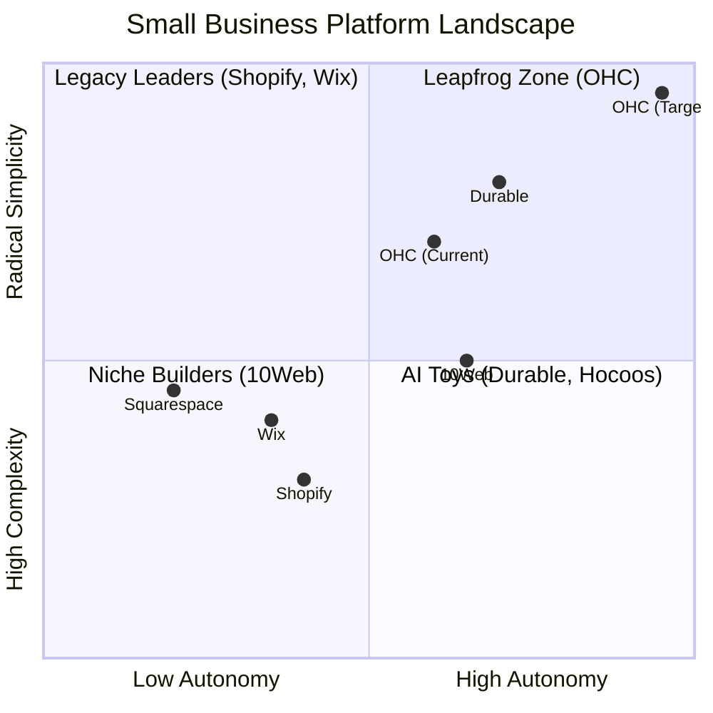
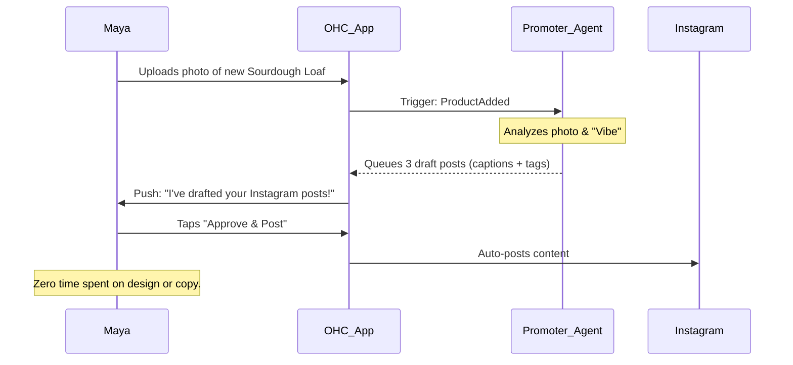
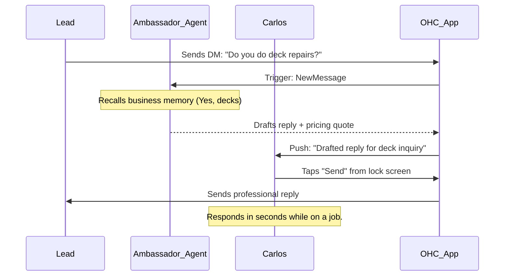
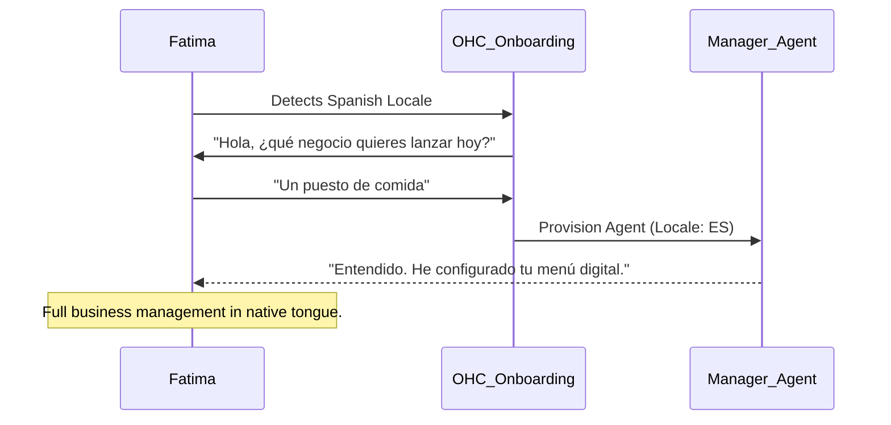
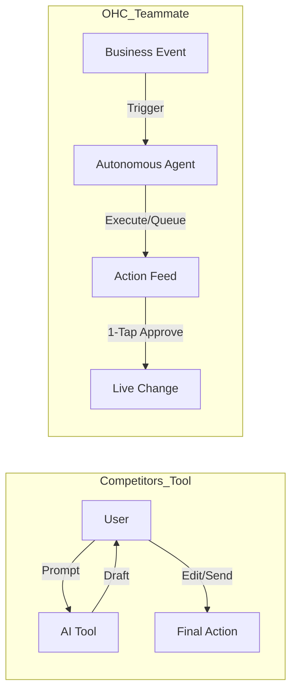

# OHC Market Dominance Strategy: Research & Missions (2025)

## 1. Executive Summary
This report outlines the strategy for OneHumanCorp (OHC) to achieve market dominance in the small business platform space. By leveraging autonomous AI agents and focusing on radical simplicity for non-technical founders, OHC can leapfrog legacy leaders like Shopify and Wix.

## 2. Deep Competitor Audit (2024-2025)

| Platform | Onboarding Flow | Time to Live | AI Capabilities | Pricing (Base) |
| :--- | :--- | :--- | :--- | :--- |
| **Shopify** | Multi-step wizard, manual DNS | 30-60 min | Reactive (Sidekick) | $29/mo + fees |
| **Wix** | Chat-based questionnaire | 20-40 min | Conversational Builder | $27/mo |
| **Durable** | 3 questions, instant build | < 30s | Generative Branding | $25/mo |
| **10Web** | Agent-led WordPress setup | 10-20 min | AI SEO & Editor Agents| $20/mo |
| **OHC (Goal)** | **Vibe-based instant setup** | **< 1m** | **Autonomous Swarm** | **Hybrid / SaaS** |

### Competitive Positioning

## 3. Top 10 SMB User Pain Points
| Rank | Pain Point | Frequency | OHC Solution |
| :--- | :--- | :--- | :--- |
| 1 | Setup Complexity | 73% | 1-Minute Conversational Setup |
| 2 | Operational Fatigue | 68% | Proactive Background Agents |
| 3 | Marketing Dread | 55% | Generative Promoter (Auto-Social) |
| 4 | Invisible Discovery | 52% | AI Discovery Agent (GEO) |
| 5 | Technical Jargon | 48% | Plain-Language Dashboard |
| 6 | Cost Creep | 45% | Built-in Swarm (No App Store Hell) |
| 7 | Mobile Gaps | 42% | 375px Native-First UX |
| 8 | Communication Lag | 40% | 1-Tap Draft & Approve |
| 9 | Financial Fog | 35% | Human-Language Briefings |
| 10 | Support Deserts | 30% | Instant AI Expert Support |

## 4. Persona Journeys & Pain Point Mappings

### Maya (The Baker) - Solving "Marketing Dread"

### Carlos (The Handyman) - Solving "Operational Fatigue"

### Fatima (Local Services) - Solving "Language Barriers"

## 5. OHC AI Differentiation Manifesto
OHC treats AI as a **Teammate** (Proactive, event-driven), not a **Tool** (Reactive, prompt-driven).

## 6. Strategic Missions for Implementation

### P0 Missions (Immediate)
1. **[feature]_autonomous_activity_feed_for_1_tap_agent_approvals.md**: The foundational UX for proactive AI.
2. **[feature]_generative_promoter_auto_social.md**: Automating the marketing lifecycle.

### P1 Missions (Near-term)
1. **[feature]_ai_discovery_agent_geo.md**: AI-native SEO for ChatGPT/Gemini discovery.
2. **[feature]_plain_language_daily_business_briefing.md**: Eliminating financial fog.

### P2 Strategy (Expansion)
1. **[strategy]_geographic_expansion_multilingual_ai.md**: Scaling to LATAM/Brazil markets.

## 7. Beachhead Market Strategy
OHC will acquire **Maya** and **Carlos** first. These "Single Human CEOs" represent the ~27.1M US non-employer businesses (SBA 2024) who are currently priced out of complex agencies and overwhelmed by Shopify's "spaceship cockpit" dashboards.

---
**Report generated by Oracle (L7) - Principal Product Researcher**
