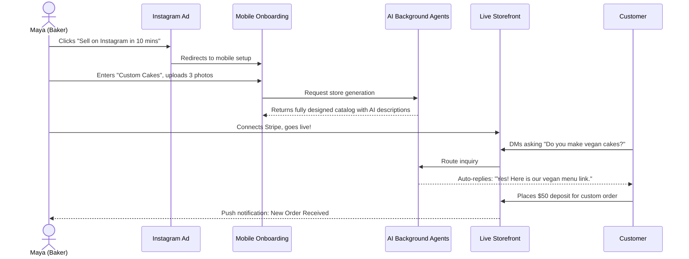
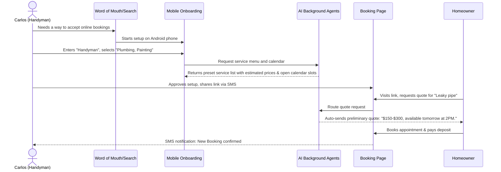
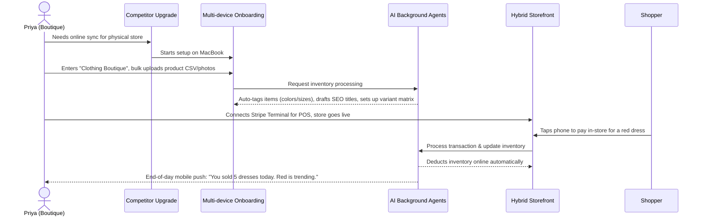
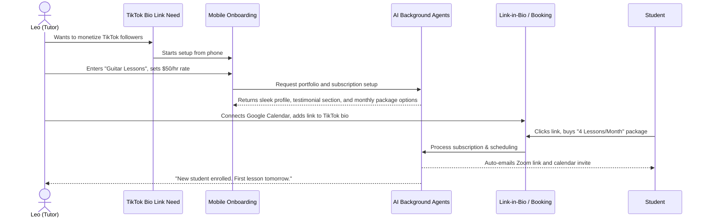
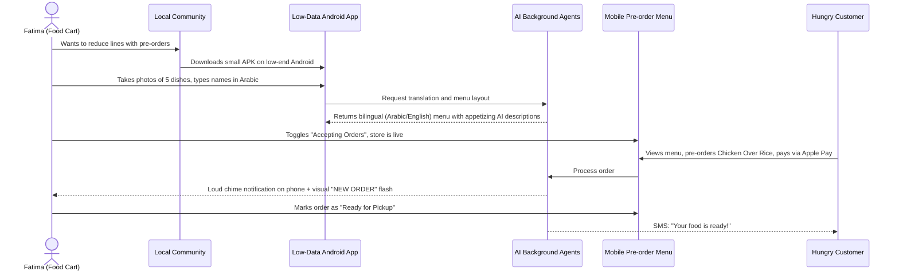

# [architecture]_business_journey_mapping.md

## Title
Business Journey Architecture: End-to-End User Journey for Real Business Personas

## Problem Statement
Small business owners—from bakers to freelance handymen—often feel completely overwhelmed when starting an online business. They don't know what steps to take first, when to set up payments, or how to handle customer inquiries. While current platforms leave users to navigate complex dashboards alone, OHC must provide a seamless, guided journey from zero to a live, money-making business in under 10 minutes. If our target user cannot intuitively flow from acquisition through onboarding to their first sale and beyond, the platform has failed. We must map the end-to-end journey for each of our five core personas to ensure all business types are supported and friction points are eliminated by AI agents.

## Research Report
Based on a review of existing tools and user behaviors:
- **Shopify & Wix**: Onboarding is long (30-60 mins), requiring users to configure shipping zones, tax rules, and complex themes before they feel "ready".
- **Squarespace**: Too focused on the portfolio aspect; adding e-commerce feels like an afterthought.
- **GoDaddy**: Basic setup is quick but lacks depth for specific business operations like booking and custom orders.
- **Opportunity for OHC**: By mapping the exact journey of our key personas (Maya, Carlos, Priya, Leo, Fatima) and identifying every friction point, OHC can leverage AI background agents to remove these hurdles automatically.

## Design Doc

### Architecture Diagrams: Persona Journeys

#### 1. Maya (The Home Baker - Physical Products/Custom Orders)
**Friction Point:** Abandonment during complex inventory setup or manual order negotiation.
**AI Intervention:** AI drafts custom cake catalog; Customer Success agent auto-replies to DM inquiries.

#### 2. Carlos (The Freelance Handyman - Services & Bookings)
**Friction Point:** Abandonment during complex booking calendar setup or pricing matrix configuration.
**AI Intervention:** AI auto-generates service packages and standard pricing; AI Salesperson drafts quotes based on user problem descriptions.

#### 3. Priya (The Boutique Owner - Inventory & In-Person)
**Friction Point:** Abandonment when trying to sync in-store POS with online inventory and managing variants (size/color).
**AI Intervention:** AI auto-categorizes imported inventory photos and suggests cross-sells; AI Accountant manages daily mobile analytics.

#### 4. Leo (The Music Tutor - Subscriptions & Portfolio)
**Friction Point:** Abandonment trying to integrate third-party tools (Zoom, Google Calendar, Subscription billing) into one page.
**AI Intervention:** Operations agent handles automatic link generation and calendar sync; AI Salesperson follows up with inactive students.

#### 5. Fatima (The Food Cart Operator - Pre-orders & Low Tech)
**Friction Point:** Abandonment due to language barriers, slow network, or complex menu builders on low-end devices.
**AI Intervention:** AI auto-translates menu items from photos; Operations agent optimizes for slow networks and provides simple printable lists.

### Common Friction Points Identified & AI Solutions
1.  **"Blank Canvas" Anxiety (All Personas)**: Users freeze when asked to design a site.
    - *Solution*: AI Promoter agent drafts the entire site structure, colors, and initial copy based merely on the business type.
2.  **Product/Service Data Entry (Maya, Priya, Carlos)**: Typing out variants, prices, and descriptions on a phone is tedious.
    - *Solution*: Users upload photos or a basic list; AI auto-generates SEO-friendly descriptions, categorizes items, and sets up variant matrices.
3.  **Payment & Logistics Setup (Priya, Leo)**: Connecting gateways and calendars usually requires technical knowledge and multiple tabs.
    - *Solution*: AI Accountant guides Stripe connection step-by-step; Operations agent auto-provisions Zoom links and handles calendar sync invisibly.
4.  **Customer Communication Burden (Maya, Carlos)**: Managing DMs and quotes distracts from the actual work.
    - *Solution*: AI Ambassador agent drafts replies to common questions; AI Salesperson generates instant quotes based on user input.

### UI Wireframes & Screen Flow (375px First)
1.  **Landing / Signup (Acquisition)**
    - *Screen 1*: Bold value proposition: "Your business live in 10 minutes." Simple input: "What do you do?" (e.g., I bake cakes).
2.  **Onboarding Wizard**
    - *Screen 2*: "Let's set up your shop, Maya." (AI auto-fills colors, fonts, and a starting catalog based on the business type).
    - *Screen 3*: "Connect your bank to get paid." (Stripe integration).
3.  **Activation Dashboard (Home)**
    - *Screen 4*: "You're live! Here's your link: ohc.com/mayascakes. Share it on Instagram."
4.  **Retention & Operations Feed**
    - *Screen 5*: Agent Activity Feed showing recent actions (e.g., "The Promoter scheduled an Instagram post").

### Mobile UX Flow
- The flow is rigorously designed for a 375px viewport with native mobile keyboard inputs.
- Progress is saved automatically. If the user drops off at the Stripe connection step, a push notification gently reminds them 2 hours later.
- Interactions utilize large touch targets (44x44px minimum) and micro-animations for feedback.

### AI Agent Integration Points
- **The Promoter (Marketing)**: Automatically spins up the initial design theme and drafts the first social media post during onboarding.
- **The Advisor (Business)**: Monitors the journey; if activation takes more than a week, it sends a personalized check-in message with tips.
- **The Accountant (Finance)**: Simplifies the Stripe onboarding and prompts the user for tax/pricing details only when relevant.

### Key Design Decisions
- **Deferred Complexity**: Users provide only the bare minimum to go live (name, business type, first product). Everything else (taxes, domains) is deferred.
- **AI-Led Onboarding**: Instead of blank templates, AI generates a filled-in draft tailored to the user's input, removing the "blank canvas" anxiety.
- **Mobile-First Everything**: Management tasks, including inventory and design tweaks, must be flawlessly executed on a 375px screen without horizontal scrolling.

## Implementation Prompt
**To the Implementer Agent:**
Build the full mobile-first end-to-end user journey for business onboarding, starting from the landing page up to the Activation dashboard.
- **User Outcome**: A non-technical user must be able to sign up, select their business type, and have an AI-generated storefront drafted and visible on a mobile device in under 10 minutes.
- **CUJs to Support**:
  1. User signup and basic info input.
  2. AI auto-generation of initial storefront state (mock the AI response).
  3. Minimal Stripe connection flow (or placeholder).
  4. Generation of a shareable store link.
- **Acceptance Criteria**:
  - The UI must be fully responsive, starting at 375px width.
  - No horizontal scrolling is permitted on mobile breakpoints.
  - The feature flow must be covered by a full-loop E2E Playwright test (starting from the home page, interacting with the UI, and asserting the final dashboard state).

## Priority
`P0` (critical)

## Estimated Scope
Large
