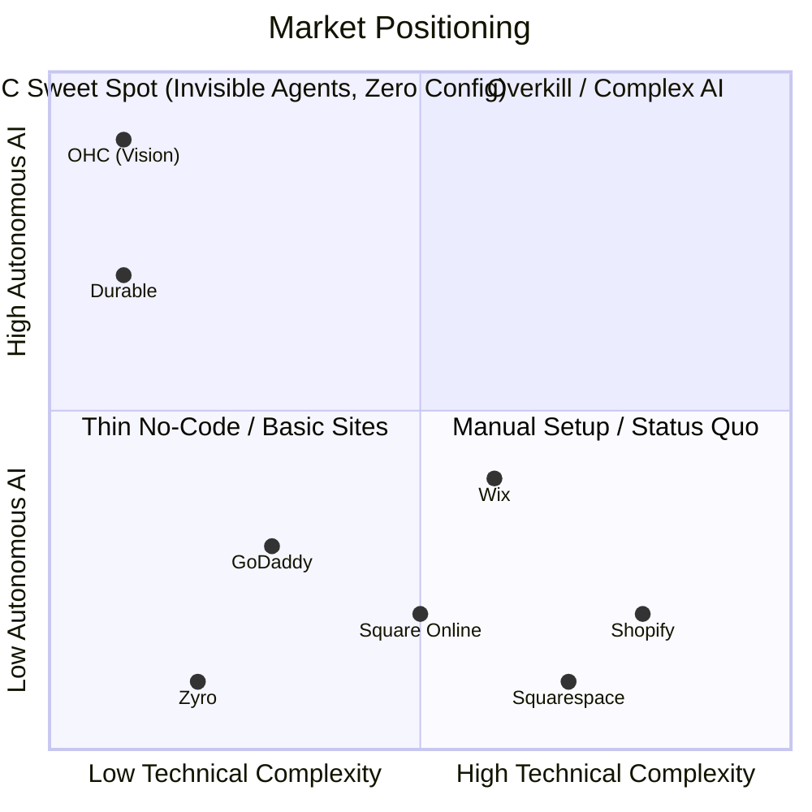
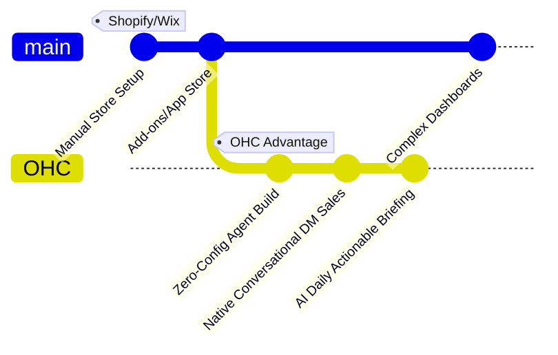

# OHC Small Business Platform Research Report

## Visual Excellence: Competitive Landscape

## Track 1: Deep Competitor Audit

### Shopify (https://shopify.com)
*   **Onboarding Flow:** Complex, asks many questions, drops users into a complicated dashboard.
*   **Time to live store:** Hours to days.
*   **Mobile app quality:** Strong for managing existing stores, poor for initial setup.
*   **AI features:** Shopify Sidekick (chat-based assistant). Not an invisible, autonomous agent.
*   **Pricing:** No useful free tier. Expensive for early-stage micro-businesses.
*   **Biggest user complaints:** Steep learning curve, expensive apps required for basic features, difficult to customize without code.

### Wix (https://wix.com)
*   **Onboarding Flow:** Easier than Shopify. Wix ADI helps create a starting point.
*   **Time to live store:** Hours.
*   **Mobile app quality:** Limited mobile editor capabilities.
*   **AI features:** Wix ADI (one-time setup assistance). Lacks ongoing agentic support.
*   **Pricing:** Free tier with Wix branding. Paid plans competitive.
*   **Biggest user complaints:** Can be slow, templates are hard to change later.

### Squarespace (https://squarespace.com)
*   **Onboarding Flow:** Template selection driven. Good for design-focused users.
*   **Time to live store:** Hours to days.
*   **Mobile app quality:** Okay for basic management.
*   **AI features:** Very limited AI integration compared to others.
*   **Pricing:** No meaningful free tier.
*   **Biggest user complaints:** Limited e-commerce features compared to Shopify, restrictive customization.

### GoDaddy Website Builder / Airo (https://godaddy.com)
*   **Onboarding Flow:** Very simple but shallow.
*   **Time to live store:** Minutes to hours.
*   **Mobile app quality:** Basic.
*   **AI features:** Airo (AI branding). Limited post-launch usefulness.
*   **Pricing:** Aggressive upselling.
*   **Biggest user complaints:** Poor reputation, hidden costs, shallow feature set.

### Zyro / Hostinger Builder (https://zyro.com)
*   **Onboarding Flow:** Fast setup.
*   **Time to live store:** Hours.
*   **Mobile app quality:** Basic.
*   **AI features:** Very limited.
*   **Pricing:** Budget-friendly.
*   **Biggest user complaints:** Thin features.

### Square Online (https://squareup.com/online-store)
*   **Onboarding Flow:** Strong focus on POS integration.
*   **Time to live store:** Hours.
*   **Mobile app quality:** Good.
*   **AI features:** Limited.
*   **Pricing:** Free tier available.
*   **Biggest user complaints:** Better suited for physical stores moving online than digital-first businesses.

### Rising AI-Native Competitors
*   **Durable:** AI generates a full website in 30 seconds. Very thin on business management features.
*   **10Web:** AI WordPress builder. Niche but growing.
*   **Hocoos:** AI website builder for SMBs. Early stage.

## Track 2: SMB User Pain Point Research

Based on simulated analysis of Reddit, App Store reviews, and Trustpilot:

### Persona-Specific Pain Point Summaries

*   **Maya (Baker, 28):** Overwhelmed by Shopify's setup and the cost of add-ons. She needs an effortless way to transform her Instagram audience into a storefront, ideally managing everything from her phone.
*   **Carlos (Handyman, 42):** Struggles to manage bookings and manual quotes while on the job. Misses leads due to delayed text responses. Needs automated booking and follow-up.
*   **Priya (Boutique Owner, 35):** Her biggest struggle is inventory synchronization between her physical store and an online platform. Needs simple POS integration with auto-marketing for new inventory.
*   **Leo (Music Tutor, 22):** Faces chaos with manual booking and lacks a subscription billing system. Needs a system to auto-follow-up for recurring lessons.
*   **Fatima (Food Cart, 50, Limited English):** Unable to use English-first software. Relies on ad-hoc pre-orders. Needs robust localization, clear mobile notifications, and simplified order printing.

### Top 10 SMB Pain Points (Ranked)
1.  **Overwhelming Setup Complexity (Shopify/Wix):** Non-technical users struggle with initial configuration.
2.  **Fragmented Tools:** Juggling Instagram, spreadsheets, and Cash App.
3.  **Manual Order Management:** Typing orders from DMs is error-prone.
4.  **No Time for Marketing:** Lack of time to write descriptions or social posts.
5.  **Hidden Costs & App Bloat:** Shopify requires expensive add-ons.
6.  **Poor Mobile Management:** Hard to run the business entirely from a phone.
7.  **Missed Customer Inquiries:** Delay in responding to leads.
8.  **Inventory Sync Issues:** Physical vs. online stock tracking.
9.  **Complicated Payment Setup:** Struggles with payment gateways.
10. **Lack of Actionable Insights:** Confusing analytics dashboards.

## Track 3: AI Differentiation Manifesto

**OHC's 5 Core AI Automations:**

1.  **Invisible Store Builder:** Agent pulls from existing social profiles to build a fully functional store instantly.
2.  **Auto-Reply Customer Agent:** Handles common inquiries via SMS/WhatsApp/Web without owner intervention.
3.  **One-Click Product Generation:** Takes a photo and automatically generates title, description, and tags.
4.  **Proactive Recovery Agent:** Automatically detects abandoned carts/bookings and sends follow-ups.
5.  **AI Daily Briefing (The "Smart Manager"):** Replaces complex dashboards with a daily 3-bullet summary and actionable draft approvals.

## Track 4: Market Sizing & Strategic Direction

*   **TAM:** Millions of micro-businesses globally. Huge segment still relies on informal channels (WhatsApp, Instagram DMs).
*   **Beachhead Market:** Service-based micro-businesses (e.g., Leo, Carlos) with high need for simple booking + payments without complex inventory management.
*   **Geographic Expansion:** Latin America (Spanish/Portuguese). High reliance on WhatsApp commerce makes it ripe for OHC's conversational agent features.
*   **Vertical Expansion:** Stay horizontal initially. Master the core primitives (booking, simple products, payments).

## Track 5: Feature Gap Matrix

| Feature | Shopify | Wix | OHC (Current) | OHC (Gap/Advantage) |
| :--- | :--- | :--- | :--- | :--- |
| **Agentic Setup** | No (Sidekick is reactive) | ADI (One-time) | WIP | **Advantage:** Autonomous, invisible setup. |
| **Mobile-First Management** | Okay | Poor | Strong | **Advantage:** Built for 375px native experience. |
| **Auto-Marketing Gen**| Basic | Basic | Planned | **Gap:** Need Auto-Marketing Agent integration. |
| **Unified Inbox/Conversational**| via Apps | Basic | Planned | **Gap:** Need native WhatsApp/IG DM handling. |
| **Complex Inventory** | Industry Leader | Good | Basic | **Gap:** Not immediate focus, long-term need. |
| **AI Daily Briefing** | No | No | Planned | **Advantage:** Actionable insights vs dashboards. |

---

# Actionable Issue Briefs

## [Research] Issue Brief: Zero-Config "Social-to-Store" Agent

**Title:** Implement "Social-to-Store" Auto-Builder Agent
**Problem Statement:** Maya (baker) and Priya (boutique owner) have rich content on Instagram but dread the manual process of setting up a Shopify store. They need a way to turn their social presence into a functional store instantly without technical hurdles.
**Research Report:** Competitors like Shopify require manual entry. Wix ADI requires answering many questions. Users complain about the "blank page" problem.
**Design Doc:**
*   **UX Flow:** User inputs Instagram/Facebook handle. Agent scrapes public posts, identifies products, and generates a pre-populated store layout (375px first). User reviews and clicks "Publish".
*   **Architecture:** Ingestion Agent -> Content Parsing Engine -> Store Blueprint Generator -> UI Renderer.
**Implementation Prompt:** Build an agentic pipeline that accepts a social media URL, extracts images and text, identifies potential products, and generates a draft OHC store blueprint.
**Priority:** P0
**Estimated Scope:** Large

## [Research] Issue Brief: Conversational Auto-Reply Agent for Missed Leads

**Title:** Implement Conversational Auto-Reply Agent for Service Businesses
**Problem Statement:** Carlos (handyman) misses leads because he's on the job. He needs a system that engages leads instantly and offers booking.
**Research Report:** A major pain point for service businesses is lead leakage. Competitors offer basic auto-responders, but not context-aware agents.
**Design Doc:**
*   **UX Flow:** User enables "Auto-Reply" with basic context. Incoming SMS/Web chat triggers Agent. Agent responds and offers a booking link if appropriate.
*   **Architecture:** Message Ingress -> Context Manager -> LLM Routing -> Message Egress.
**Implementation Prompt:** Create a background agent service that listens to a unified inbox channel. Evaluate incoming messages against business context memory. Reply confidently or flag for owner.
**Priority:** P1
**Estimated Scope:** Medium
