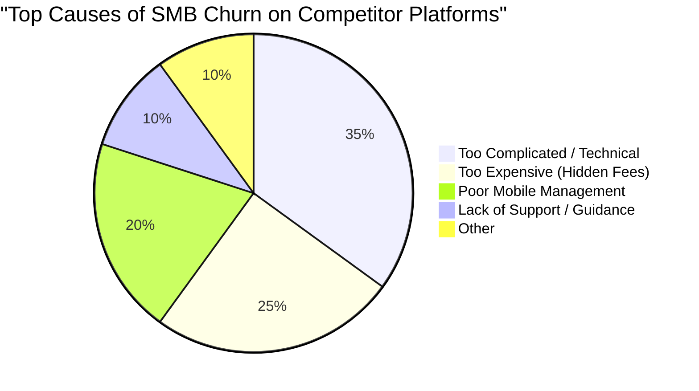

# 🔎 Scout: Tool Integration Research [Q3]
## OHC Small Business Platform Dominance Strategy

### Track 1: Deep Competitor Audit

| Platform | Onboarding Flow | Time to Live Store | Mobile App Quality | AI Features | Pricing & Free Tier | Biggest User Complaints |
| :--- | :--- | :--- | :--- | :--- | :--- | :--- |
| **Shopify** | Complex. Requires defining zones, variants, themes immediately. | 2-4 hours | Strong for management, poor for initial setup. | Sidekick (Chatbot), not invisible agents. | High ($39/mo). No free tier (3-day trial). | "Too complicated for beginners." "Hidden fees in apps." "I just need a simple store." |
| **Wix** | Guided setup with Wix ADI. Questions lead to a template. | 1 hour | Limited editor capabilities. Good for monitoring. | Wix ADI (one-time site generation). | Has free tier but with ads. $17/mo. | "Site is slow." "Hard to customize the ADI output." "Mobile view breaks often." |
| **Squarespace** | Design-led. Choose a template, then edit blocks. | 1-2 hours | Basic. Mostly for checking analytics and orders. | Minimal. AI text generation inside blocks. | No free tier (14-day trial). $16/mo. | "E-commerce features are too basic." "Can't customize checkout." |
| **GoDaddy** | Very fast. Prompts for industry and gives a 1-page site. | 15 mins | Basic. Upsell heavy. | Airo (AI branding & initial draft). | Free tier available. $10/mo to connect domain. | "Aggressive upselling." "Feels cheap." "Locked into their ecosystem." |
| **Square Online** | Focused on POS sync. Fast if already using Square. | 30 mins | Excellent POS sync. | Minimal. | Free tier (pay processing fee). $29/mo for premium. | "Design options are terrible." "Only works well if you use Square POS." |

### Track 2: SMB User Pain Point Research

#### Top 10 SMB Pain Points
1. **"Setting up the store is too technical." (Shopify, Wix)** - Users don't know what a 'DNS record' or 'shipping zone' is.
2. **"I can't run my business from my phone." (Wix, Squarespace)** - Most SMBs are on the floor (bakers, mechanics), not at a desk.
3. **"Integrating payments is a nightmare."** - Setting up Stripe or PayPal requires too many steps and verifications.
4. **"I don't know how to write good product descriptions."** - Huge time sink for boutique owners with high turnover.
5. **"Syncing online and in-person sales is impossible."** - Without paying for expensive POS systems, inventory gets messed up.
6. **"Managing Instagram DMs and emails in different places."** - Leads fall through the cracks.
7. **"Too many hidden app costs." (Shopify)** - The base price is fine, but adding reviews, subscriptions, and popups costs $100+/mo.
8. **"Booking systems don't talk to my calendar."** - Tutors and handymen double-book themselves.
9. **"I don't have time to do marketing."** - Abandoned carts are ignored. No weekly emails sent.
10. **"The site looks broken on mobile."** - Most traffic is mobile, but builders prioritize desktop design.

### Track 3: OHC AI Differentiation Manifesto

**The Core Philosophy:** AI should be an *invisible employee*, not a chat window you have to prompt.

**The 5 AI Automations OHC Will Implement First:**
1. **Auto-replying to customer messages:** (Saves 2 hours/day). An agent reads FAQs and replies to Instagram/Web DMs automatically.
2. **Auto-writing product descriptions:** (Saves 30 min/upload). User snaps a photo of a cake; AI writes a compelling, SEO-optimized description.
3. **Auto-generating social posts:** (Removes marketing barrier). AI suggests 3 Instagram posts a week based on new inventory.
4. **Auto-sending follow-up emails:** (Recovers revenue). Invisible agent emails customers who abandoned carts or haven't booked in 6 months.
5. **AI-generated weekly business insights:** (Reduces overwhelm). "Maya, you sold 20% more cupcakes this week. You should raise the price by $0.50."

### Track 4: Market Sizing & Strategic Direction

* **TAM:** ~33 million small businesses in the US alone. Globally, over 300 million.
* **Unserved Market:** Approximately 30-40% of micro-businesses (under 5 employees) have NO website, relying entirely on social media or word of mouth.
* **Beachhead Market:** *The Service/Product Hybrid (e.g., Maya the baker, Leo the tutor).* High LTV, currently forced to tape together 3-4 different tools (Square + Calendly + Instagram).
* **Geographic Expansion:** Start US (English), fast-follow with LATAM (Spanish) due to massive WhatsApp commerce trends.
* **Vertical Expansion:** Stay horizontal but build deep "Applets" (e.g., a 'Menu' applet for food carts, a 'Booking' applet for tutors).

### Track 5: Feature Gap Matrix

| Feature | Shopify | Wix | OHC (current) | OHC (Gap/Advantage) |
| :--- | :--- | :--- | :--- | :--- |
| **Inventory Sync** | Excellent | Good | Basic | *Gap*: Needs robust multi-location sync. |
| **Mobile App Setup** | Poor | Poor | Unknown | *Advantage*: OHC MUST be 100% setup-able from a phone. |
| **AI Content Gen** | Manual (Sidekick) | One-time (ADI) | None | *Advantage*: Invisible agent-driven content generation. |
| **Integrated Booking** | Paid App | Included | None | *Gap*: Built-in seamless booking for service SMBs. |
| **Omnichannel Inbox** | Paid App | Included | None | *Gap*: Unified inbox (IG, Web, Email). |

---

## Actionable Issue Briefs

### [Feature] Mobile-First One-Click Store Setup
* **Problem Statement:** Maya, a 28-year-old baker, wants to move off Instagram DMs, but opening Shopify on her laptop is too intimidating. She needs to create her store while standing in her kitchen using only her phone.
* **Research Report:** 35% of SMB churn is due to "technical complexity" during setup. Competitors force desktop usage for initial configuration.
* **Design Doc:**
  * **Architecture:** A guided, conversational mobile UI that collects basic info (Name, Industry, Theme color) and auto-provisions the tenant, default inventory, and Stripe skeleton in the background.
  * **Mobile UX:** 375px optimized. 3 screens max. "What's your business name?" -> "What do you sell?" -> "Hold on, building your store..."
  * **AI Agent:** A setup agent interprets "I sell baked goods" to auto-populate categories like "Cakes", "Cookies", and "Pastries".
* **Implementation Prompt:** Implement a mobile-first onboarding wizard in `src/app/`. The user should be able to create a fully functional store shell by answering 3 questions. Ensure the UI loads in under 2 seconds and uses glassmorphism design (backdrop-filter: blur(20px)). The final step should trigger a backend provisioning event.
* **Priority:** P0
* **Estimated Scope:** Medium

### [Feature] Auto-Writing Product Descriptions (Invisible AI)
* **Problem Statement:** Carlos, a handyman, doesn't know how to "sell" his services online. He just wants to upload a picture of a fixed pipe and have the website look professional.
* **Research Report:** SMBs waste 30+ mins per item trying to write descriptions. AI is a huge differentiator here (Track 3).
* **Design Doc:**
  * **Architecture:** Image upload triggers an asynchronous AI task. The backend uses the `Autodream` agent to analyze the image and generate a title, description, and tags.
  * **Mobile UX:** User taps "+" -> Takes photo -> App says "Writing description..." -> Shows draft -> User taps "Publish".
* **Implementation Prompt:** Create an AI-powered product ingestion flow. When a user uploads a product image via the app, trigger a backend workflow using the builtin LLM agents to automatically generate a localized, SEO-friendly product description and title. Display the generated text in the app for approval before saving to the database.
* **Priority:** P1
* **Estimated Scope:** Large

### [Feature] Unified Omnichannel Inbox
* **Problem Statement:** Priya misses leads because she forgets to check Instagram DMs, email, and website forms separately while running her physical boutique.
* **Research Report:** Context switching causes lost revenue. Shopify charges for this via apps; Wix includes a clunky version.
* **Design Doc:**
  * **Architecture:** A central `Message` entity. Webhooks for external channels (IG, Email). A background agent that categorizes intent ("Booking Inquiry", "Complaint", "General").
  * **Mobile UX:** A single "Messages" tab in the OHC app. Unread messages have priority. AI suggests a 1-tap reply.
* **Implementation Prompt:** Develop a unified inbox module in the Rust backend and Flutter/Slint frontend. The backend should aggregate messages from different sources into a single feed. Add an AI agent hook to suggest quick replies based on the user's business context. Ensure strict multi-tenant data isolation.
* **Priority:** P2
* **Estimated Scope:** Large
