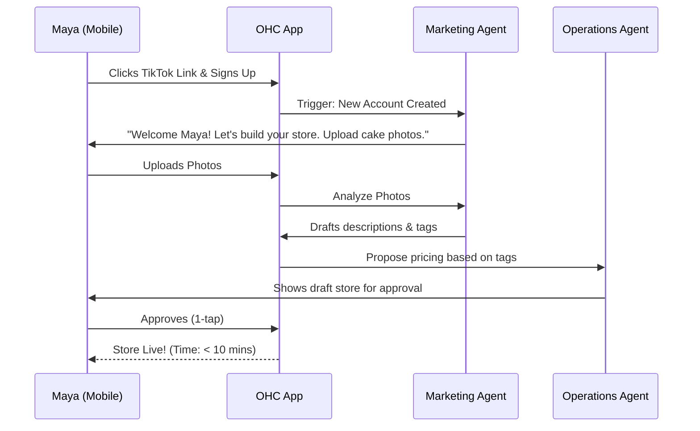
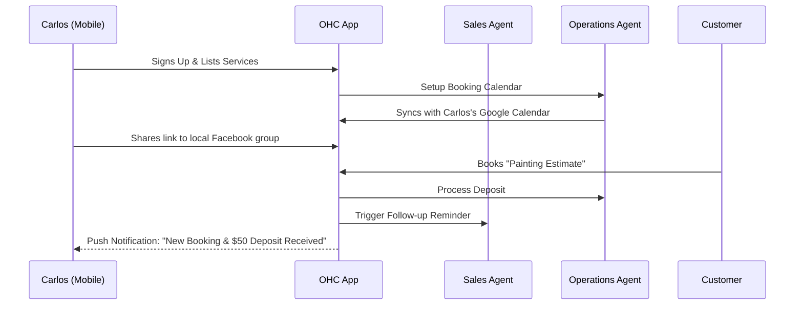
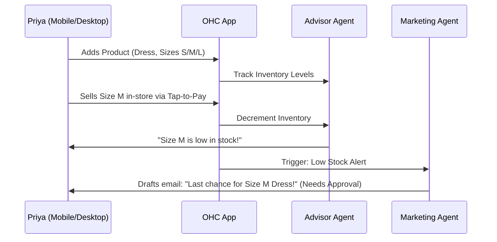
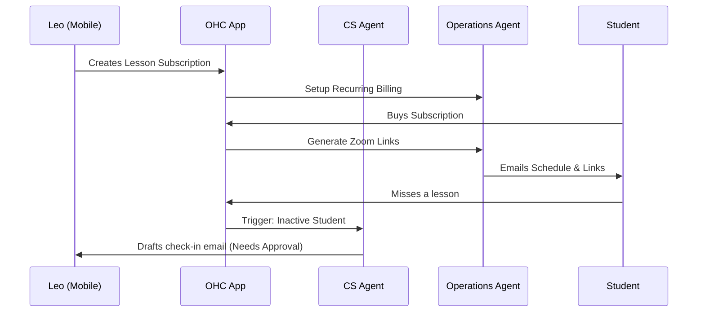
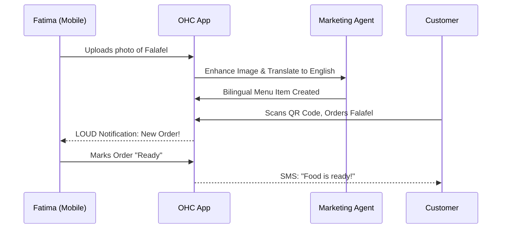

# Business Journey Architecture Design Doc

## 1. Overview
This design document maps out the complete end-to-end user journeys for key personas on the OneHumanCorp (OHC) platform. It examines how users go from initial discovery (Acquisition) to launching a live business within 10 minutes (Activation), and outlines strategies for retention and revenue growth.

## 2. Problem Statement
Many small business owners are non-technical and overwhelmed by traditional platforms like Shopify, Wix, and Squarespace. They need a system that requires zero coding and minimal configuration to launch. The goal is to architect seamless flows for a 375px mobile breakpoint, with invisible AI agents doing the heavy lifting to eliminate friction.

## 3. Personas & Core Journeys

### 3.1 Maya — The Home Baker (Physical Products / Custom Orders)
**Acquisition:** Maya discovers OHC through an organic TikTok about "running your baking business from your phone." The landing page CTA is "Launch your bakery in 5 minutes."
**Onboarding:** Maya uploads 3 photos of her cakes. OHC's Operations Agent suggests pricing, and the Marketing Agent drafts her store bio and categorizes the items. She sets up Stripe connect for pre-payment deposits.
**Activation:** Maya receives her first deposit for a custom order via Instagram DM using an OHC payment link.
**Retention:** OHC sends daily push notifications: "You have 2 cakes to bake for tomorrow."
**Revenue:** Maya upgrades to the Starter tier when she needs more than 10 products on her catalog.



### 3.2 Carlos — The Freelance Handyman (Services & Bookings)
**Acquisition:** Carlos hears about OHC from a friend. CTA: "Get a booking website that manages itself."
**Onboarding:** Carlos lists 3 services: Plumbing, Painting, General Repairs. OHC sets up a Google Calendar sync for his available times.
**Activation:** A customer books a "Painting Estimate" time slot and pays a $50 deposit.
**Retention:** The AI Salesperson sends follow-up quotes for open estimates. Carlos logs in to view his weekly calendar.
**Revenue:** Carlos upgrades to Pro when he needs unlimited bookings and a custom domain.



### 3.3 Priya — The Boutique Owner (Retail & Inventory)
**Acquisition:** Priya searches Google for "easy POS and online store." OHC SEO captures the search. CTA: "Sync your store and online sales instantly."
**Onboarding:** Priya adds a few top-selling items with size variants. She enables Stripe Terminal for in-person tap-to-pay.
**Activation:** First online sale, and inventory automatically decrements for both online and in-store.
**Retention:** The AI Business Advisor sends a weekly report on trending items. The Marketing agent drafts email campaigns for new stock.
**Revenue:** Upgrades to Business tier for unlimited inventory, multi-location support, and custom SSL domains.



### 3.4 Leo — The Music Tutor (Subscriptions)
**Acquisition:** Leo clicks an Instagram ad for "link-in-bio for musicians."
**Onboarding:** Leo sets up a monthly lesson package (subscription).
**Activation:** First student signs up for a 4-lesson-per-month package.
**Retention:** The AI Operations Agent auto-generates Zoom links. The Customer Success Agent follows up with inactive students.
**Referral:** Students share Leo's link-in-bio on TikTok.



### 3.5 Fatima — The Food Cart Operator (Pre-orders)
**Acquisition:** Fatima sees a flyer for "take orders on your phone."
**Onboarding:** Fatima takes photos of her menu items. OHC AI removes the background, enhances the colors, and builds a bilingual Arabic/English menu.
**Activation:** Customer orders a meal online while standing in line. Fatima gets a loud ping on her phone.
**Retention:** Fatima prints the daily order summary. The simple UI allows her to toggle "Sold Out" on items with one tap.



## 4. Key Friction Points & Mitigations
- **Complex Forms:** Avoid traditional forms. Use a conversational onboarding flow driven by the Operations/Marketing agents.
- **Payment Setup:** Stripe Connect can be intimidating. Defer deep verification until the first payout. Enable accepting payments immediately.
- **Blank Canvas Syndrome:** Provide fully formed, AI-generated store layouts based on just 2-3 inputs (Industry, Name, Vibe) so the user never starts from zero.

## 5. Next Steps for Implementation
1. Develop the conversational onboarding UI components (Flutter).
2. Integrate image enhancement and translation capabilities for product cataloging.
3. Establish the base KAIROS triggers for Acquisition and Onboarding events.

```yaml
issue_title: "[architecture] Implement Conversational Onboarding Flow"
issue_priority: "P0"
issue_description: "Build the mobile-first conversational onboarding flow where AI agents collect initial business context (Name, Industry, Photos) and generate the first iteration of the storefront within 3 minutes."
issue_todo_list:
  - [ ] Design Flutter chat-like UI components.
  - [ ] Integrate with Marketing Agent for initial setup.
  - [ ] Implement seamless transition from chat to live store.
issue_label: ["architecture", "onboarding", "core-feature"]
```