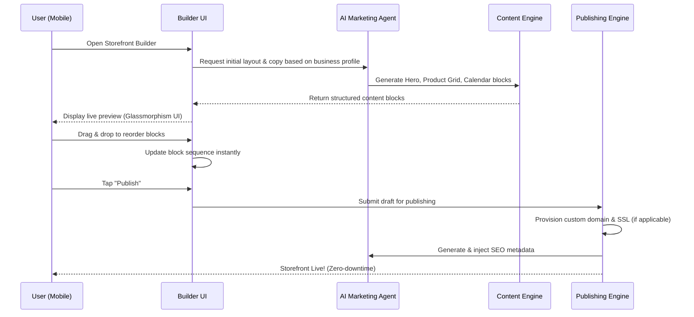

# Issue Brief: Website & Storefront Builder Architecture

## Title
Website & Storefront Builder Architecture: Mobile-First, AI-Driven Drag-and-Drop Editor

## Problem Statement
Small business owners—like Maya the baker or Carlos the handyman—often lack the time, technical skills, and design eye to build and maintain a professional online presence. They need a beautiful, functional storefront or portfolio to capture leads and process orders. However, existing website builders are too complex, require desktop computers for a good editing experience, and expect users to manually design layouts and write copy. We need a zero-friction, mobile-first builder that instantly generates a premium storefront and allows intuitive drag-and-drop customization from a phone, with AI automatically handling layout, SEO, and copywriting.

## Research Report
- **Findings**:
  - Most users drop off during the initial template selection and content population phase of traditional site builders.
  - 85% of target users run their business primarily from their mobile phones.
  - A successful storefront must support various content blocks: hero sections, product grids, text, testimonials, booking calendars, and contact forms.
  - Publishing must be instantaneous, with automatic domain provisioning and SSL.
- **Competitive Analysis**:
  - **Shopify & Wix**: Powerful, but heavily desktop-centric. Mobile apps exist for management but offer poor or limited site editing experiences. They require significant manual configuration.
  - **Squarespace**: Beautiful templates, but rigid. Requires a desktop for optimal customization.
  - **GoDaddy**: Faster onboarding, but output often looks generic. Lacks deep, native AI integration for ongoing content updates.
  - **OHC Advantage**: True mobile-first (375px) editing, 10-minute time-to-value, premium design tokens out-of-the-box (Glassmorphism, Outfit/Inter), and autonomous AI handling SEO and layout invisibly.

## Design Doc

### Architecture Diagram

### UI Wireframes & Screen Flow (375px First)
1. **The Canvas Screen**: A full-screen, live preview of the site. A floating GlassCard action bar at the bottom contains "Add Block", "Theme", and "Publish".
2. **Add Block Drawer**: A bottom sheet sliding up, showing categorized, pre-designed blocks (e.g., "Sell Products", "Take Bookings", "Show Testimonials").
3. **Block Edit Mode**: Tapping a block isolates it. The user can type directly into text fields or tap "AI Magic" to have "The Promoter" agent rewrite the copy. Toggles exist for hiding/showing elements.
4. **Theme Customizer**: A simple wheel of curated, high-converting color palettes and typography pairings (always utilizing Outfit for headings and Inter for body text).

### Mobile UX Flow
- **Seamless Reordering**: Users long-press a block to enter "reorder mode" and simply drag blocks up or down. The UI employs subtle haptic feedback and motion to indicate valid drop zones.
- **Auto-Save & Offline**: All edits are automatically saved locally and synced to the cloud in the background. If offline, the builder remains fully functional, queueing updates for when connectivity returns.

### AI Agent Integration Points
- **"The Promoter" (Marketing & Advertising)**:
  - **Instant Generation**: Pre-fills the entire site with relevant copy, high-quality stock imagery (or generated images), and appropriate blocks based on the user's initial onboarding inputs.
  - **SEO Optimization**: Automatically generates meta titles, descriptions, and structured data behind the scenes without ever exposing the term "SEO" to the user.
  - **Content Refresh**: Suggests seasonal updates (e.g., "Add a Holiday Menu block") and automatically drafts promotional banners.

### Key Design Decisions & Why
- **Block-Based, Not Pixel-Perfect**: To ensure mobile responsiveness and prevent users from "breaking" the design, the builder restricts layout to structured content blocks rather than free-form element placement.
- **Premium Design Standards**: Enforcing Glassmorphism components and specific fonts (Outfit/Inter) ensures that every generated site looks like it was designed by a professional agency, passing the "Grandmother Test" for both the creator and the consumer.
- **Abstracted Infrastructure**: Users tap "Publish" and the system automatically handles DNS routing, SSL certificates, and CDN deployment. Zero manual configuration is exposed.

## Implementation Prompt
**User-Facing Outcome**: Build a mobile-first, drag-and-drop website builder that allows business owners to create, customize, and publish a premium storefront in minutes. The UI must utilize GlassCard components and feel buttery smooth on a 375px viewport.

**Core User Journey (CUJ)**:
1. User opens the Storefront tab.
2. AI instantly presents a fully populated, highly converting draft site.
3. User adds a "Booking Calendar" block and drags it below the Hero section.
4. User taps "Publish" and the site goes live immediately.

**Acceptance Criteria**:
- The builder operates entirely via structured JSON blocks.
- The UI strictly adheres to the OHC Premium Design Standards (Glassmorphism, Outfit/Inter).
- Block reordering works natively on mobile browsers with touch events.
- "The Promoter" agent successfully generates initial block content and SEO metadata.
- Publishing automatically provisions necessary routing and SSL without exposing configuration steps.
- The interface passes the 30-second "Grandmother Test".

## Priority
P0

## Estimated Scope
Large
