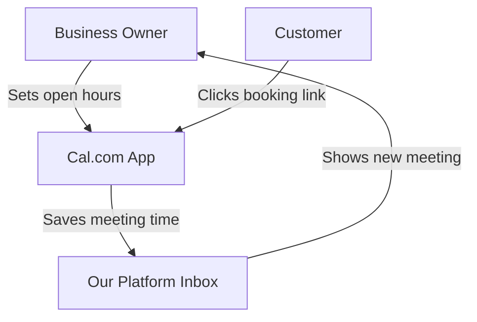
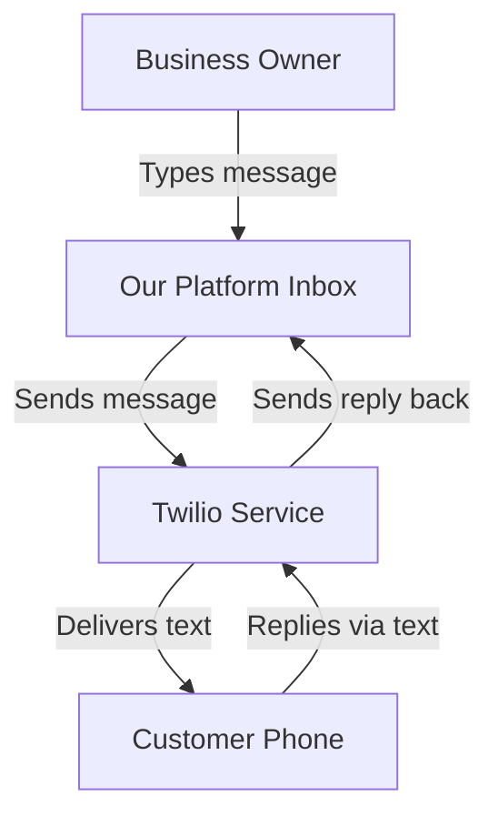
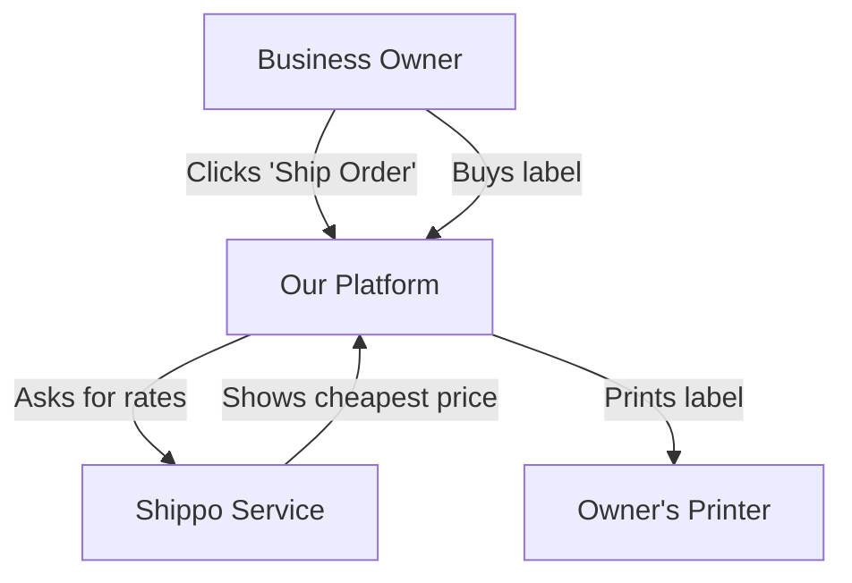

# Tool Integration Research Q4

## [Calendar & Scheduling] Add Cal.com for Easy Customer Booking

**Problem Statement:**
Small business owners waste too much time emailing back and forth to find a time to meet with customers. We need a simple way for customers to pick an open time on the calendar and book it without asking.

**Research Report:**
Cal.com is a popular tool for scheduling. It lets you set your open hours and gives you a link to share. Customers just click the link and pick a time. It works well and has a very strong reputation in the community (with lots of people talking about it online). It is very easy to use for people who do not know much about computers. The basic plan is free, and paid plans start around $12 per month. It works in both our Cloud and Standalone modes because it connects through the internet.

**Design Doc:**

**Implementation Prompt:**
Create a way for the business owner to connect their Cal.com account. Once connected, show their booking link on their public page. When a customer books a time, show the new meeting in the owner's message inbox. Make sure the setup is just one click and easy to understand.

**Priority:** P1

**Estimated Scope:** Medium

---

## [SMS & Notifications] Add Twilio to Send Text Messages to Customers

**Problem Statement:**
Sometimes emails get lost or go to spam. Business owners need a way to send quick text messages (SMS) directly to their customers' phones for things like appointment reminders or order updates.

**Research Report:**
Twilio is a very famous service that sends text messages. People trust it because it is very fast and works all over the world. It is easy to connect to other tools. For a small business owner, it is very cheap—it costs less than a penny to send one message. It works perfectly in both Cloud and Standalone modes because it sends messages over the internet.

**Design Doc:**

**Implementation Prompt:**
Build a screen where the business owner can type a text message to a customer. Use Twilio to send that message. If the customer texts back, show their reply in the owner's message inbox. The owner should not have to learn anything complicated to send a text.

**Priority:** P1

**Estimated Scope:** Medium

---

## [Shipping & Logistics] Add Shippo to Buy Shipping Labels Easily

**Problem Statement:**
When a small business owner sells a product, they have to figure out how much shipping costs and go to the post office to buy a label. We need a simple way to buy and print shipping labels right from our platform.

**Research Report:**
Shippo is a tool that lets you compare shipping prices and buy labels from places like the Post Office or UPS. It is known for having good data on how long packages take to arrive. It is free to sign up, and you just pay a few cents per label plus the cost of shipping. It is very simple to use and saves business owners a trip to the post office. It works perfectly in both our Cloud and Standalone modes.

**Design Doc:**

**Implementation Prompt:**
Add a button next to customer orders that says "Buy Shipping Label". When clicked, use Shippo to find the cheapest shipping cost and let the owner buy it. Then, give them a simple file they can print and tape to the box. The process should take less than a minute.

**Priority:** P2

**Estimated Scope:** Large
