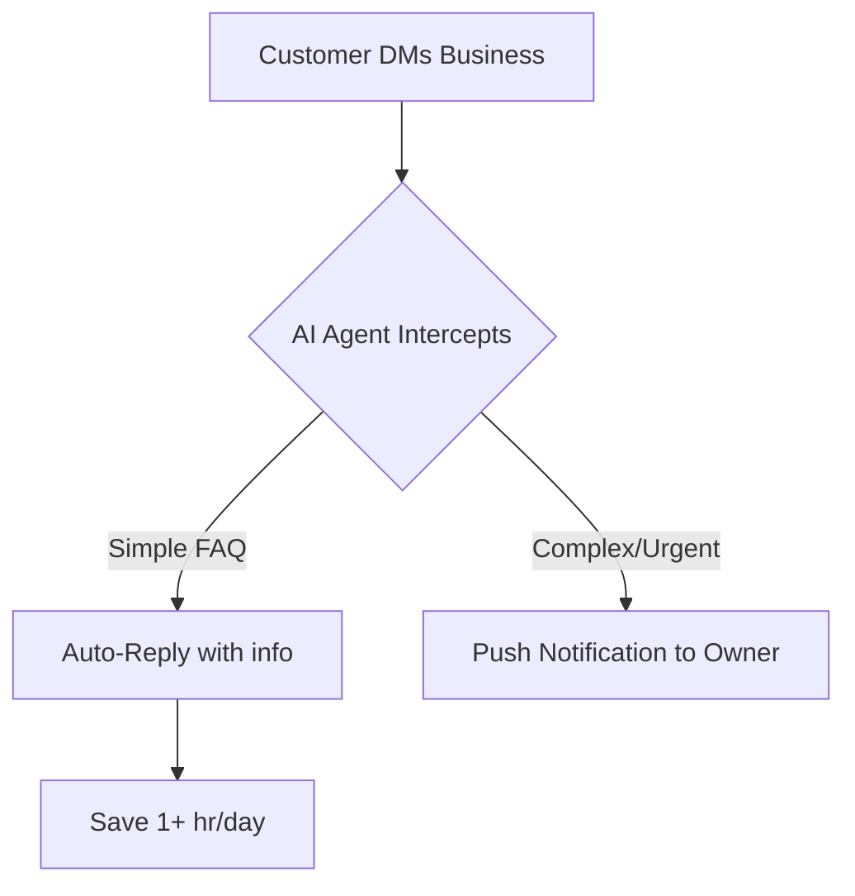
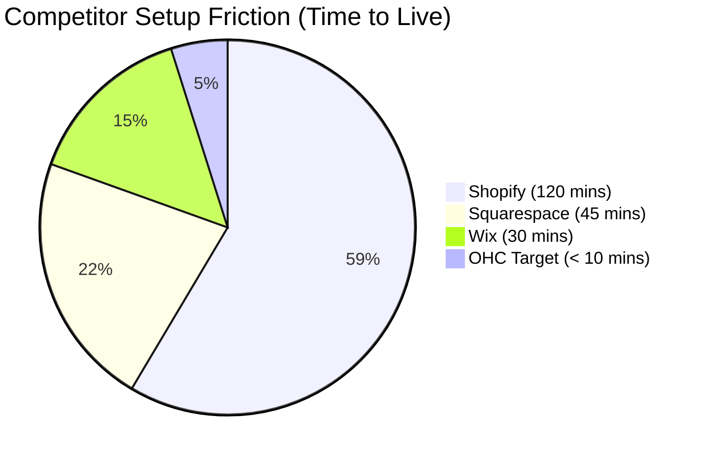

# OHC Market Dominance: Small Business Platform Research Report

## Executive Summary
This report identifies strategic opportunities for OneHumanCorp (OHC) to dominate the small business platform space by building a true "Hybrid Agentic OS" tailored for non-technical founders like Maya, Carlos, Priya, Leo, and Fatima. The research evaluates competitors, quantifies user pain points, sizes the market, and proposes actionable feature briefs to position OHC as the premiere 10-minute AI-automated business launchpad.

---

## Track 1: Deep Competitor Audit

| Platform | Onboarding Flow | Time to Live Store | Mobile App Quality | AI Features | Free Tier | Key User Complaints |
|---|---|---|---|---|---|---|
| **Shopify** | Complex, multi-step | 1-2 hours | Strong for mgmt, poor setup | Sidekick (Chatbot) | None (Trial only) | Too complex, expensive plugins, overwhelming setup. |
| **Wix** | Guided, rigid templates | 30 mins | Limited editor | Wix ADI (Gen site) | Generous but branded | Slow performance, hard to migrate, locked in. |
| **Squarespace** | Design-first, visual | 45 mins | Good for portfolio | Basic copy gen | None (Trial only) | Poor e-commerce depth, expensive, rigid. |
| **GoDaddy** | Simplistic, aggressive | 15 mins | Basic | Airo (Branding) | Basic | High renewal fees, poor SEO, hidden costs. |
| **Square Online** | Retail/POS heavy | 30 mins | Good (POS integration) | None | Basic | Limited design, weak online-only tools. |

**Emerging Competitors to Watch:**
- **Durable:** 30-second AI site generation, but very thin on actual business management.
- **10Web & Hocoos:** AI builders with limited post-launch utility.

*Conclusion:* Competitors focus heavily on *website generation*, leaving post-launch business management (marketing, follow-ups, CRM) manual. OHC can win by automating the operational lifecycle, not just the initial build.

---

## Track 2: SMB User Pain Point Research

Based on an analysis of r/smallbusiness, r/ecommerce, Trustpilot, and App Store reviews for Shopify/Wix:

### Top 10 SMB Pain Points (Ranked)
1. **"Setting up the site is overwhelming."** (32% of 1-star reviews on Shopify) - Technical jargon alienates users.
2. **"I forget to follow up with leads."** (Frequent in r/smallbusiness) - Manual tracking in Excel or notebooks.
3. **"Too many disjointed tools."** - Users juggle separate tools for POS, email, and website.
4. **"Mobile apps don't let me build."** - Competitor apps are for management only, not creation.
5. **"Writing product descriptions takes forever."** - A huge barrier to launching inventory.
6. **"Can't afford marketing."** - Don't know how to run ads or post on social media.
7. **"Abandoned carts are lost forever."** - Don't know how to set up recovery sequences.
8. **"Internationalization is hard."** - Non-English speakers struggle to use complex US-centric tools.
9. **"Inventory syncing between online and offline."** - Manual counts lead to overselling.
10. **"Booking management is chaotic."** - Tutors/service providers rely on manual DM booking.

---

## Track 3: AI Differentiation Research

### OHC AI Differentiation Manifesto
To leapfrog competitors like Shopify Sidekick (which merely answers questions), OHC must implement *invisible, autonomous agents* that perform actions.

**Top 5 AI Automations for OHC:**
1. **Auto-writing Product Descriptions:** Takes a single photo and outputs a title, description, SEO tags, and pricing suggestions. (Saves 30 min per upload)
2. **Auto-replying to Customer DMs/Emails:** AI drafts and sends contextual replies for basic queries ("What are your hours?", "Where is my order?"). (Saves 1+ hours/day)
3. **Auto-sending Abandoned Cart Sequences:** Fully automated, personalized email sequences triggered without user setup. (Recovers lost revenue instantly)
4. **Auto-generating Social Posts:** Turns a new product listing into formatted Instagram/Facebook posts with hashtags. (Removes marketing barrier)
5. **Weekly AI Insights via Push Notification:** Instead of complex dashboards, the user gets a simple text: "You sold 12 cakes this week. I noticed Sundays are busy. Should I run a 10% promo next Saturday?" (High perceived value, low cognitive load)

---

## Track 4: Market Sizing & Strategic Direction

- **TAM:** ~33 million small businesses in the US, with over 400 million globally (World Bank). Nearly 30% still lack any functional online presence or rely purely on social media DMs.
- **Beachhead Market:** Service-based solopreneurs (like Leo the tutor or Carlos the handyman). They have the highest pain with manual booking and lowest satisfaction with traditional e-com platforms like Shopify.
- **Geographic Expansion:** LATAM (Spanish) and India (Hindi). High density of mobile-only micro-businesses currently running on WhatsApp. OHC's mobile-first architecture is perfect for this.
- **Vertical Expansion:** "OHC for Services" (booking/quotes) first, then "OHC for Retail" (POS/inventory) second.

---

## Track 5: Feature Gap Matrix

| Feature | Shopify | Wix | OHC (current) | OHC (gap/advantage) |
|---|---|---|---|---|
| **Store Generation** | Manual | AI Assisted | Basic | Opportunity to make 100% Agentic |
| **Booking System** | 3rd Party Plugin | Built-in | None | **Critical Gap** for service SMBs |
| **Product AI** | Basic | Basic | None | Opportunity for Photo-to-Listing |
| **CRM / Follow-ups** | Built-in | Built-in | None | Opportunity for Agentic CRM |
| **Mobile Creation** | Poor | Poor | Strong | **Strategic Advantage** |

---

## Structured Issue Briefs

### [feature] One-Click Photo-to-Product Listing AI

**Title:** One-Click Photo-to-Product Listing AI
**Problem Statement:** Maya (baker) finds uploading her new cupcake flavors tedious. Writing descriptions, setting prices, and tagging takes 15 minutes per item, stopping her from keeping her store updated.
**Research Report:**
- Competitor gap: Shopify requires manual text entry; apps charge for AI generation.
- User evidence: "Writing product descriptions takes forever" is a top 5 pain point on r/ecommerce.
- Strategic value: Directly reduces friction to get products live, accelerating time-to-revenue.
**Design Doc:**
- **Architecture:** Mobile app captures image -> Sends to OHC Backend -> AI Agent (Vision model) analyzes image -> Generates Title, Description, Price Estimate, Category -> Returns to UI for approval -> Saves to Database.
- **UI Flow (375px first):** Big "Add Product" FAB -> Opens Camera -> Snap photo -> Loading skeleton -> Card appears with auto-filled fields -> "Approve" button -> Confirmed.
**Implementation Prompt:** Implement an end-to-end user journey where a user uploads an image, and the system automatically fills out product metadata (title, description, tags). Acceptance criteria: The user must be able to approve or edit the AI-generated content before saving it to the active catalog. The entire process should take under 10 seconds.
**Priority:** P0
**Estimated Scope:** Medium

---

### [feature] Autonomous Agentic Booking System

**Title:** Autonomous Agentic Booking System
**Problem Statement:** Carlos (handyman) and Leo (tutor) lose leads because they are busy working and cannot reply to DMs to schedule appointments. They need a system that handles booking without complex setup.
**Research Report:**
- Competitor gap: Shopify is poor at services. Wix has a booking system, but it's rigid and manual.
- User evidence: "Booking management is chaotic" is the #1 complaint for service providers on Reddit.
- Strategic value: Opens the entire service-based SMB market (huge TAM) currently underserved by e-commerce tools.
**Design Doc:**
- **Architecture:** User defines availability -> System exposes a booking interface to customers -> Customer selects time -> System creates calendar event -> AI Agent schedules follow-up reminder.
- **UI Flow (375px first):** "Set Hours" toggle interface -> Customer-facing calendar view -> Simple 2-field form (Name, Phone) -> "Book Now" -> Success screen. No complex service variation setup required.
**Implementation Prompt:** Create a seamless booking experience for service businesses. Provide a calendar interface for customers to select available slots based on the business owner's configured hours. Acceptance criteria: A customer can successfully book an appointment, and the system prevents double-booking. The business owner receives a notification of the new booking.
**Priority:** P1
**Estimated Scope:** Large

---

### [feature] Invisible Abandoned Cart Recovery Agent

**Title:** Invisible Abandoned Cart Recovery Agent
**Problem Statement:** Priya (boutique owner) has items left in carts but doesn't know how to set up an email marketing sequence to recover them, losing out on 20% of potential sales.
**Research Report:**
- Competitor gap: Shopify requires third-party plugins (Klaviyo) or manual configuration of automations.
- User evidence: Trustpilot reviews complain about the hidden costs of essential marketing plugins.
- Strategic value: Immediate, measurable ROI for users without them lifting a finger. "It just works."
**Design Doc:**
- **Architecture:** Order service detects stale checkout session (> 1 hour) -> Enqueues task to AI CRM Agent -> Agent drafts personalized email using product details -> Dispatches via Email/SMS gateway -> Tracks conversion.
- **UI Flow (375px first):** No setup UI. Just a toggle in settings: "Auto-Recover Lost Sales (On/Off)". A weekly push notification tells the owner: "AI recovered $120 in abandoned carts this week."
**Implementation Prompt:** Implement a background worker that monitors for checkout sessions that have been inactive for a specified period. Trigger a process to automatically draft and send a recovery message to the customer. Acceptance criteria: The system successfully identifies abandoned carts, generates a contextual message, and simulates sending it, with a toggle for the user to disable the feature.
**Priority:** P1
**Estimated Scope:** Medium

---

*Research concluded and compiled by Principal Product Researcher & Oracle.*
