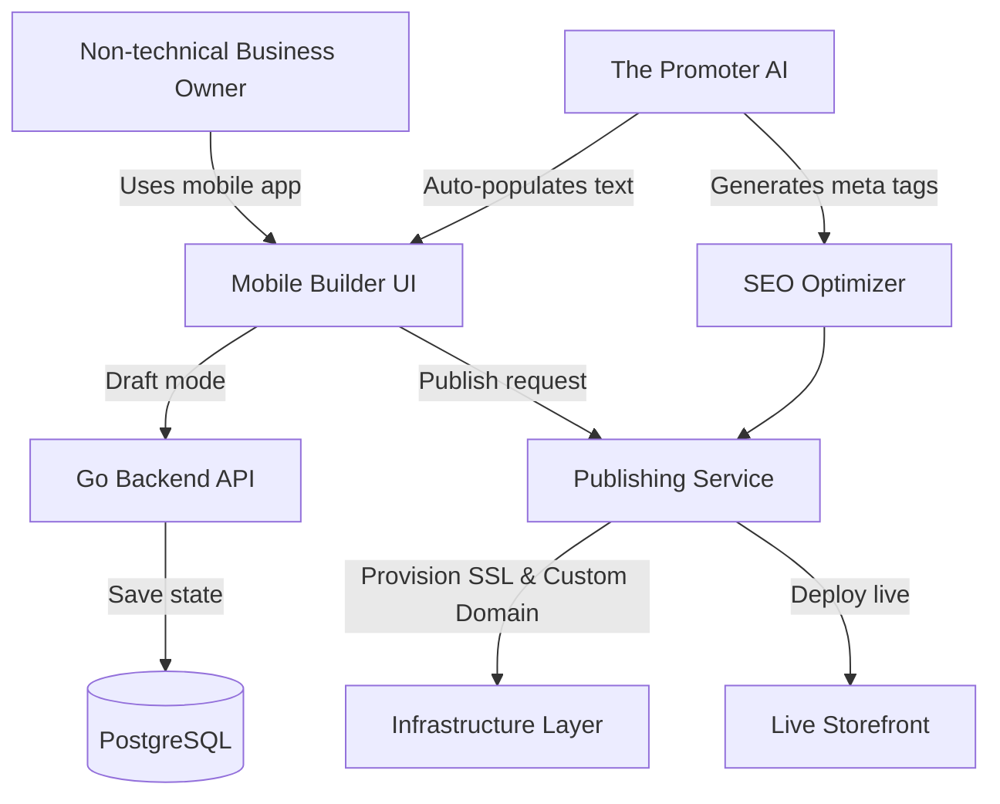

# Title
Website & Storefront Builder Architecture

# Problem Statement
Small business owners like Carlos the Handyman and Maya the Baker need a professional online presence to attract customers, accept bookings, and sell products. However, existing website builders (like Wix, Squarespace, or GoDaddy) are too complex, require manual design work, and are not mobile-friendly for the owner to manage on the go. These users need a simple, drag-and-drop website builder that works perfectly on a 375px mobile screen, allows them to customize their storefront effortlessly, and automatically handles SEO, publishing, and custom domains without exposing any technical jargon.

# Research Report
Based on an analysis of competitor platforms and the needs of non-technical small business owners:
- **Shopify & Wix**: Offer powerful website builders, but the mobile management experience is clunky and often requires a desktop for design tasks. Their AI features are usually bolt-on rather than fully integrated.
- **Squarespace & GoDaddy**: Focus on aesthetics but struggle with seamless mobile-first editing and automatic SEO optimization for the "grandmother test" user.
- **Opportunity**: OHC can differentiate by providing a "mobile-first, drag-and-drop" website builder that relies entirely on "The Promoter" (Marketing & Advertising Agent) to handle the heavy lifting. The user just selects blocks (like Hero, Product Grid, Booking Calendar), and the AI auto-populates content, ensures mobile responsiveness, and configures SEO automatically.

# Design Doc

## Architecture Diagram

## UI Wireframes & Screen Flow (375px First)
1. **Builder Dashboard**: A vertical list of available content blocks (Hero, Product Grid, Text, Testimonials, Booking Calendar, Contact Form).
2. **Block Editor**: Tapping a block opens a full-screen mobile editor. Uses native keyboards (e.g., numeric for prices). Images can be uploaded directly from the phone's camera roll.
3. **Template Selector**: A swipeable carousel of beautiful, Glassmorphism-style templates. Users can preview how the template looks with their content.
4. **Publish Screen**: A big "Publish" button. Once tapped, it transitions to a success screen with the live link and options to map a custom domain.

## Mobile UX Flow
- The user enters the builder from the app's main dashboard.
- The user drags and drops blocks to reorder them or taps to add new ones.
- "The Promoter" agent suggests content based on the business type (e.g., suggesting a "Vegan Cake" product grid for Maya).
- The user reviews the draft on their 375px screen, tapping "Publish" to go live instantly.

## AI Agent Integration Points
- **The Promoter**: Automatically generates compelling copy for text blocks, suggests layout improvements, and handles SEO (generating meta titles and descriptions).
- **The Operations Manager**: Integrates with the Product Grid and Booking Calendar blocks to ensure real-time inventory and availability are displayed accurately.

## Key Design Decisions
- **Content Blocks**: Standardized blocks (Hero, Product Grid, etc.) ensure that the UI remains cohesive and mobile-responsive across all devices.
- **Draft to Live**: A distinct separation between "Draft" and "Live" states allows users to experiment without breaking their public storefront.
- **Automated SEO**: Users never see "meta tags" or "SEO settings". "The Promoter" handles this entirely in the background.
- **Custom Domains & SSL**: Abstracted entirely. Users just type their desired domain, and the system provisions it and secures it with SSL seamlessly.

# Implementation Prompt
Implement the backend API and database schemas to support storing website drafts and published states for tenants. Create the mobile Flutter UI (starting at 375px) for the drag-and-drop builder, allowing users to add, reorder, and configure standard content blocks. Integrate "The Promoter" AI agent to auto-generate SEO metadata upon publishing. Ensure the publishing flow supports seamless transitions from draft to live, and abstract custom domain provisioning. Do not prescribe specific JSONB block structures or CDN setups; focus on delivering the intuitive mobile experience described.

# Priority
P0

# Estimated Scope
Large
