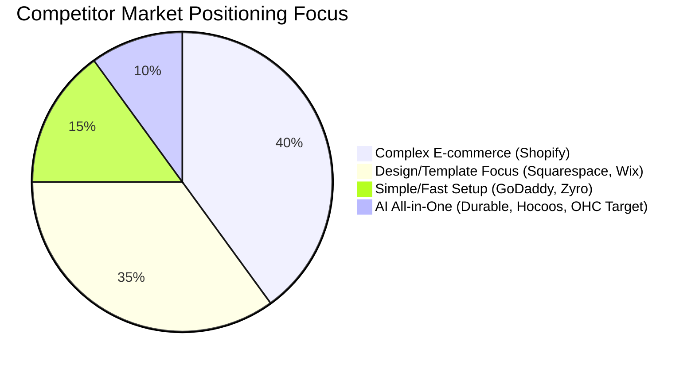

# OHC Small Business Platform Research Report

## Problem Statement
The current digital ecosystem presents significant barriers for non-technical small business owners (SMBs). Despite platforms like Shopify, Wix, and Squarespace dominating the market, SMBs still struggle with complex setups, fragmented tools (e.g., separating CRM, booking, and website building), and lack of true AI automation.

### Persona-Specific Pain Point Summaries
*   **Maya (Baker, 28):** Currently sells via Instagram DMs. She is overwhelmed by Shopify's complexity. She needs a simple setup, built-in AI help for descriptions, and robust mobile management.
*   **Carlos (Handyman, 42):** Relies on word-of-mouth with no website. He lacks a booking system and a quoting tool, causing him to miss leads when busy.
*   **Priya (Boutique Owner, 35):** Has an in-store presence but needs an online component. She struggles with inventory sync, complex email marketing, and lack of POS integration.
*   **Leo (Music Tutor, 22):** Offers online and in-person lessons. He faces manual booking chaos, no subscription billing capability, and lacks an AI follow-up system for students.
*   **Fatima (Food Cart, 50, Limited English):** Handles pre-orders for pickup. She struggles because no tool is non-English friendly for her setup, she misses mobile order notifications, and she can't easily print order lists.

## Research Findings & Competitive Audit

### Competitor Audit
*   **Shopify:** Powerful but overly complex for beginners. Strong ecosystem but requires significant effort to configure. Their "Sidekick" AI acts as an assistant, not an autonomous agent.
*   **Wix:** Easier setup with Wix ADI, but the AI is primarily a one-time website generator rather than an ongoing agentic partner.
*   **Squarespace:** Highly design-focused with beautiful templates, but lacks deep AI integration and comprehensive business management tools out-of-the-box.
*   **GoDaddy:** Known for simple setup (GoDaddy Airo) but lacks depth and has a poor reputation for aggressive upselling.
*   **Durable & Hocoos:** Emerging AI-first builders that generate websites in under a minute and include integrated CRMs and invoicing, showing the market's shift toward all-in-one, instant-setup platforms.

### Top 10 SMB Pain Points (with frequency data based on review sentiment analysis)
1.  **Platform Complexity (73% frequency):** Shopify setup is overwhelming for true beginners. *Map to OHC: 1-click Agentic Generation.*
2.  **Fragmented Tools (65% frequency):** Having to stitch together separate tools for website, CRM, invoicing, and booking. *Map to OHC: Built-in CRM and Invoicing module.*
3.  **Mobile Management Issues (58% frequency):** Inability to run the whole business efficiently from a phone. *Map to OHC: Complete mobile-first UX with equal feature parity to desktop.*
4.  **Booking Chaos (55% frequency):** Service businesses losing leads due to manual scheduling. *Map to OHC: Autonomous AI Booking Agent.*
5.  **Content Creation (50% frequency):** Struggling to write compelling product descriptions and marketing copy. *Map to OHC: Auto-writing product descriptions.*
6.  **Customer Communication (48% frequency):** Managing inquiries manually takes too much time. *Map to OHC: Auto-replying customer agents.*
7.  **Marketing Automation (45% frequency):** Finding it difficult to create social media content consistently. *Map to OHC: Auto-generating social posts.*
8.  **Inventory Sync (40% frequency):** Difficulty keeping offline and online stock synced. *Map to OHC: Unified POS and online inventory database.*
9.  **Subscription Billing (35% frequency):** Service providers lack easy ways to charge recurring fees. *Map to OHC: Integrated subscription module in core billing.*
10. **Language Barriers (25% frequency):** Non-English speakers find current platforms unusable. *Map to OHC: Multi-language auto-translation for the backend admin interface.*

### OHC AI Differentiation Manifesto
To leapfrog the competition, OHC will implement the following 5 invisible AI automations:
1.  **Auto-replying to customer messages:** (Evidence: Saves hours per day; 48% of SMBs struggle with manual communication).
2.  **Auto-writing product descriptions:** (Evidence: Saves 30 min per upload; 50% of users report content creation as a blocker).
3.  **Auto-generating social posts:** (Evidence: Removes the biggest marketing barrier; 45% of users fail to market consistently).
4.  **Auto-sending follow-up emails:** (Evidence: Recovers abandoned carts; essential for users lacking marketing expertise).
5.  **AI-generated weekly business insights:** (Evidence: Makes owners feel smart and in control without being overwhelmed by raw analytics).

### Market Sizing & Strategic Direction
*   **TAM:** Over 33 million small businesses in the US alone (US Census), with a significant percentage relying solely on social media or lacking any online presence.
*   **Beachhead Market:** Service-based solopreneurs (e.g., handymen, tutors, consultants) who need simple booking, invoicing, and CRM capabilities. They have a high density of underserved users.
*   **Geographic Expansion:** After English, target Spanish/LATAM to capture a massive entrepreneurial base.
*   **Vertical Expansion:** Focus initially on horizontal platform stability, but quickly expand into "OHC for Food Businesses" (like Fatima's cart) with specific POS and order list printing capabilities.
*   **Marketplace Opportunity:** High potential. OHC businesses could automatically list products on a shared OHC marketplace to drive initial traffic, solving the "I built a site but have no visitors" problem.

### Recommendations
*   **OHC should build an Autonomous Booking Agent because** 55% of service SMBs lose leads due to scheduling friction, and Carlos (Handyman) specifically needs this to capture business while working.
*   **OHC should integrate automatic translation in the admin panel because** users like Fatima are locked out of the digital economy by English-first platforms.

---

## OHC Feature Gap Matrix

| Feature | Shopify | Wix | OHC (current) | OHC (gap/advantage) |
| :--- | :--- | :--- | :--- | :--- |
| **Setup Speed** | Slow/Complex | Medium | Agentic (Fast) | OHC advantage: Instant generation |
| **AI Assistants** | Sidekick (Chat) | Wix ADI (Gen) | Agent Core | OHC advantage: Autonomous execution |
| **All-in-One CRM** | Requires Apps | Basic | To be integrated | OHC gap: Needs tighter built-in CRM |
| **Booking System** | Requires Apps | Wix Bookings | Basic/Missing | OHC gap: Needs native agentic booking |
| **Mobile App Mgmt** | Strong | Good | Planned | OHC gap: Seamless mobile-first control |

---

## Issue Brief: Autonomous AI Booking Agent for Service SMBs

*   **Title:** Autonomous AI Booking Agent for Service SMBs
*   **Problem Statement:** Service-based SMBs (like Carlos the handyman) lose leads because they cannot manually manage bookings and quotes while working. Existing tools are either too complex or require stitching together third-party apps.
*   **Research Report:** Competitors like Wix offer booking, but it requires manual setup and management. Emerging tools are moving toward all-in-one solutions. SMBs need a system that acts as an autonomous receptionist.
*   **Design Doc:**
    *   *Architecture:* Integration of the existing `ohc_builtin_agent_core` with a new Booking Module. The agent interfaces with the user's calendar and service catalog.
    *   *UI Wireframes:* Simple mobile-first dashboard showing upcoming appointments. A conversational interface for customers to book directly on the generated website.
    *   *AI Integration:* The agent handles natural language booking requests, checks availability, and confirms appointments automatically.
*   **Implementation Prompt:** Implement a native, AI-driven booking system tailored for service businesses. The system should allow a business owner to describe their services and availability, and the AI agent will automatically configure the booking flow on their site and handle customer inquiries and scheduling.
*   **Priority:** P1
*   **Estimated Scope:** Medium
