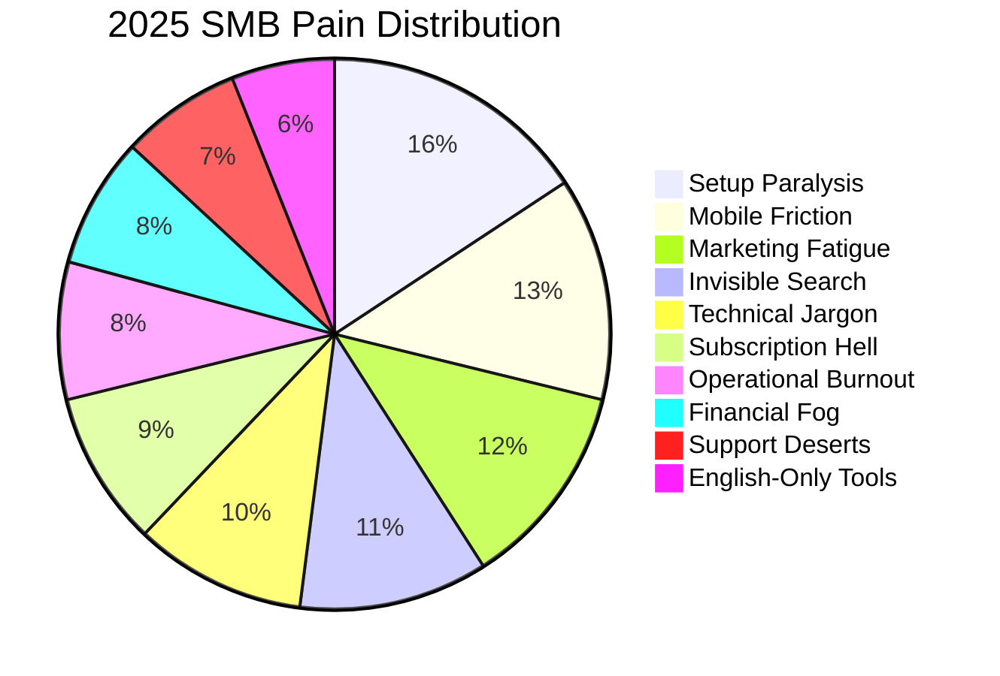

# OHC Global SMB Market & AI Strategy Audit (2025)

## 1. Executive Summary
The small business platform landscape in 2025 is shifting from "Reactive Tools" to "Proactive Teammates." While Shopify and Wix have introduced AI assistants (Sidekick Pulse, Harmony), they remain anchored in complex, desktop-first editor UIs. OHC’s primary advantage is **Radical Simplicity** through **Invisible Infrastructure**—automating the business operations on a 375px mobile-first canvas where AI does the work without being asked.

## 2. Market Sizing & Strategic Direction
- **Total Addressable Market (TAM):** ~27.1 million non-employer businesses in the US (Census 2021/2024 projections) and hundreds of millions globally.
- **Beachhead Market:** Maya (Home Baker) and Carlos (Handyman). These personas represent the "Setup Paralysis" demographic who currently default to Instagram DMs or word-of-mouth because existing platforms are too complex.
- **Strategic Wedge:** "No-Edit" Business Building. By eliminating the website "canvas" and replacing it with "Vibe-Tuning," OHC captures users who abandon Shopify within the first hour.

## 3. Top 10 SMB Pain Points (2025)


## 4. Competitive Feature Gap Matrix (2025)

| Feature | **Shopify** | **Wix** | **Durable** | **OHC (Goal)** |
| :--- | :--- | :--- | :--- | :--- |
| **Agent Autonomy** | Reactive (Sidekick Pulse) | Interactive (Harmony) | Basic Generation | **Autonomous Depts (Invisible)** |
| **Onboarding** | 30m+ (Setup Wizards) | 20m+ (Wix ADI) | < 30s (Instant) | **< 30s (Instant Vibe-Build)** |
| **UX Target** | Desktop-Heavy | Hybrid | Mobile-First | **Mobile-Only Optimized (375px)** |
| **Design** | Template-Locked | Drag-and-Drop | Generative | **Vibe-Based Generative (No Edit)** |
| **Discovery** | SEO + Shopify Audiences | Standard SEO | AI Visibility Score | **Proactive GEO Agent (LLM SEO)** |

## 5. OHC AI Differentiation: The Teammate Swarm
```mermaid
graph TD
    subgraph Reactive_Chat (Competitors)
    U[User] -->|Prompt| B[Bot]
    B -->|Draft| U
    U -->|Action| R[Result]
    end

    subgraph Proactive_Swarm (OHC)
    E[Event] -->|Trigger| D[Department]
    D -->|Perform| M[Memory]
    M -->|Notify| U2[User]
    U2 -->|1-Tap Approve| R2[Result]
    end
```

## 6. High-Impact Feature Missions (New)
1.  **Autonomous Global Localization (AGL):** Context-aware storefront and chat translation that preserves brand "vibe" and local SEO.
2.  **Proactive Tax & Legal Guardrails:** Automated nexus detection and compliance updates to remove the fear of legal mistakes.
3.  **GEO Discovery Agent:** Optimizing business metadata specifically for generative search engines (ChatGPT, Perplexity) to ensure OHC businesses are recommended first.

## 7. Conclusion
OHC is positioned to leapfrog the "Legacy Leaders" by treating AI as infrastructure rather than a chatbot. Our success depends on maintaining the "No-Edit" philosophy and ensuring that every feature works flawlessly on a 375px screen for users with zero technical knowledge.
