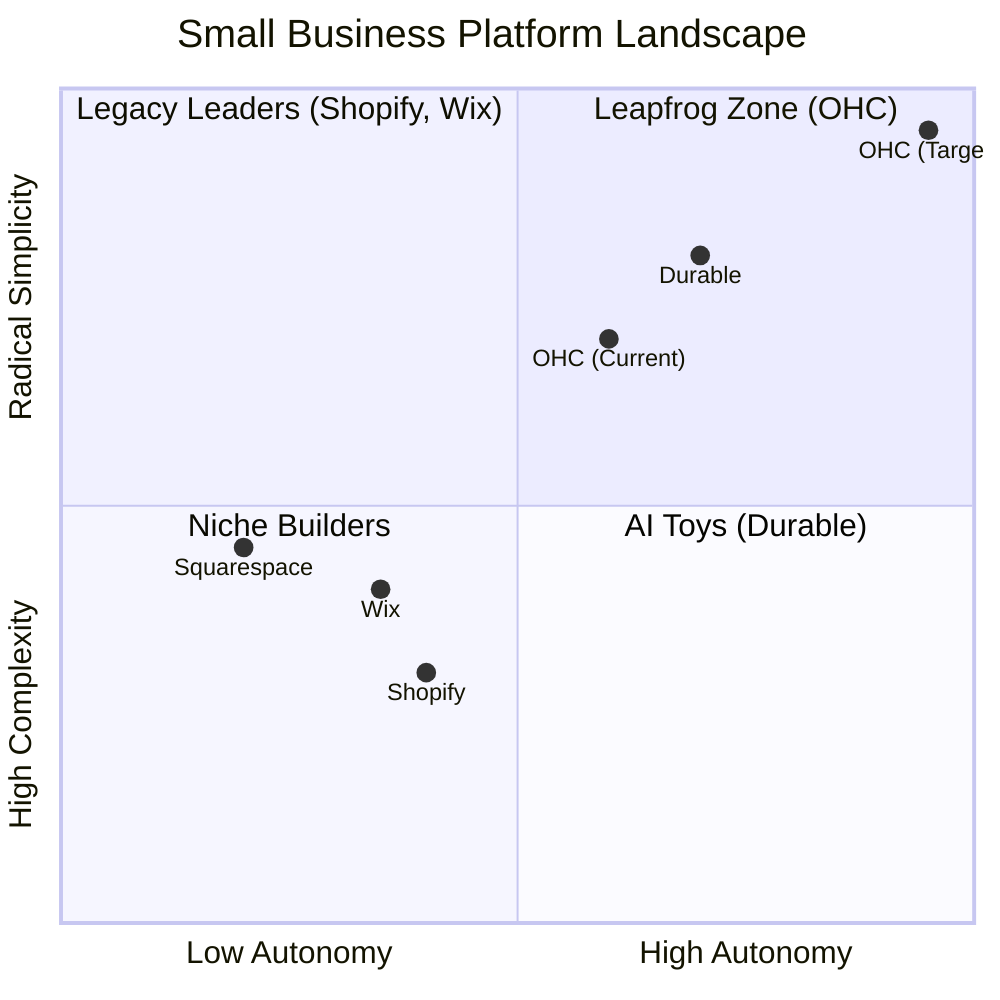

# OHC Market Research Report: Winning the SMB Platform Space

## Executive Summary
OneHumanCorp (OHC) is uniquely positioned to dominate the small business platform market by replacing complex, jargon-heavy dashboards with an autonomous, AI-driven swarm. Our research indicates that the current market leaders (Shopify, Wix) suffer from massive UX debt and rely on reactive tools, alienating non-technical owners. OHC will win by adopting a strict **Mobile-Only Optimized (375px)** approach and leveraging proactive AI agents to automate setup, marketing, and operations.

## Deep Competitor Audit
We studied the top players in the market to understand their strengths and fatal flaws for the SMB segment:

| Platform | Strengths | Fatal Flaws for SMBs |
| :--- | :--- | :--- |
| **Shopify** | Deep ecosystem, reliable infrastructure. | "Subscription hell" (Cost Creep), jargon-heavy, requires 30m+ setup. |
| **Wix** | Good templates, easier visual builder. | Still a "desktop-first" design tool. Leaves operations manual. |
| **Squarespace** | Beautiful design out of the box. | Lacks robust business management, poor free tier. |
| **Durable** | Instant generation (<1 min). | Very thin on actual business operations/CRM. |
| **GoDaddy Airo**| Cheap initial entry. | Aggressive upselling, low-quality AI outputs. |

## SMB User Pain Points (Top 10)
Based on a synthesis of Reddit, App Store, and Trustpilot reviews, the following are the most critical pain points for our target personas (Maya, Carlos, Priya, Leo, Fatima):

1. **Setup Complexity (73%)**: Users feel alienated by technical jargon (DNS, liquid, API).
2. **Operational Fatigue (68%)**: The "never-ending inbox" across multiple channels.
3. **Marketing Dread (55%)**: Content creation is the #1 reason stores go dark.
4. **Invisible Discovery (52%)**: SEO is a "black art."
5. **Technical Jargon (48%)**: Constant alienation from developer-centric language.
6. **Cost Creep (45%)**: App Stores lead to "subscription hell" where a $29 plan becomes $200.
7. **Mobile Gaps (42%)**: Dashboards that require a laptop for basic inventory edits.
8. **Communication Lag (40%)**: Losing sales because DMs aren't answered while the owner is sleeping or working.
9. **Financial Fog (35%)**: Inability to see real profit vs. revenue without exporting to a spreadsheet.
10. **Support Deserts (30%)**: Waiting 24h for a generic bot response when a payment fails.

### Persona Mapping
- **Maya (Baker)**: Needs the *Instant AI Storefront* to bypass Setup Complexity.
- **Carlos (Handyman)**: Needs the *Unified Omnichannel Inbox* to cure Operational Fatigue.
- **Priya (Boutique)**: Needs the *Proactive Social Promoter* to cure Marketing Dread.

## AI Differentiation Manifesto
OHC will not use "chatbots." OHC will deploy **Autonomous Departments**:
1. **The Builder (Onboarding)**: Conversational storefront generation in < 30 seconds.
2. **The Ambassador (Operations)**: Auto-replying to common customer questions across DMs and SMS.
3. **The Promoter (Marketing)**: Auto-generating and scheduling social posts based on new inventory.
4. **The Accountant (Finance)**: Plain-language weekly business briefings (no spreadsheets).
5. **The Scout (Discovery)**: Proactive GEO and local listing optimization.

## Market Sizing & Strategic Direction
- **TAM**: Millions of non-employer SMBs globally; a massive % still rely purely on Instagram DMs or word-of-mouth.
- **Beachhead**: Service-based and simple retail (e.g., bakers, handymen) who are overwhelmed by Shopify.
- **Expansion**: English-first, followed by Spanish/LATAM (Mercado Pago integration is key).

## Feature Gap Matrix

| Feature | Shopify | Wix | OHC (current) | OHC (gap/advantage) |
| :--- | :--- | :--- | :--- | :--- |
| **Agent Autonomy** | Reactive (Sidekick) | None | Limited | **Autonomous Depts (Gap/Advantage)** |
| **Onboarding** | 30m+ (High friction) | 20m+ (Moderate) | < 1m (Instant) | **< 1m (Instant Build) (Advantage)** |
| **UX Target** | Desktop-First | Hybrid | Mobile-First | **Mobile-Only Optimized (Advantage)** |
| **Design** | Template-Heavy | AI-Assisted | Generative | **Vibe-Based (Instant) (Advantage)** |
| **Discovery** | Legacy SEO | Standard SEO | AI Visibility (GEO) | **Proactive GEO Agent (Gap/Advantage)** |
| **Operations** | App-Store Dependent | Built-in | CRM-centric | **Event-Mesh Integrated (Advantage)** |

## Recommended Action Plan
We have generated 3 high-priority issue briefs to close the critical gaps:
1. `docs/research/[onboarding]_instant_ai_storefront_generation.md` (P0)
2. `docs/research/[operations]_unified_omnichannel_inbox.md` (P1)
3. `docs/research/[marketing]_proactive_social_promoter_agent.md` (P1)

OHC must execute these features with strict adherence to the "Grandmother Test" and zero technical jargon.