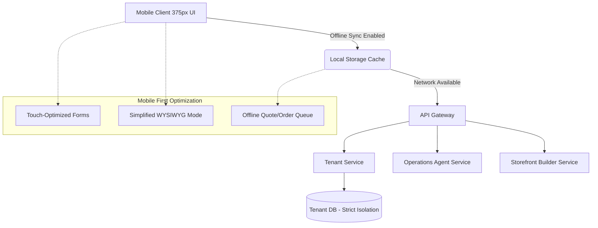

# 🔎 Scout: Tool Integration Research Q2

## Title: Mobile-First Architecture Parity Review & Implementation Plan

## Problem Statement
Small business owners, particularly our core personas like Fatima (food cart, relies on low-end Android) and Maya (baker, runs everything via iPhone), are increasingly abandoning OHC when critical operations require a desktop fallback. Currently, while our storefronts render on mobile, the administrative workflows (e.g., complex menu editing, AI agent prompt configuration, full booking calendar management) are clunky or practically unusable on a 375px viewport. When a user cannot complete their essential business tasks within 10 minutes on their phone, they churn to competitors like Shopify or Square who offer polished native mobile experiences. We must guarantee 100% mobile parity to fulfill our core promise of running a business "from their phone."

## Research Report
**Market Benchmarks:**
- **Shopify:** Offers full functional parity between desktop and native mobile app. Their POS and Admin apps allow complex inventory management, order fulfillment, and analytics entirely from the phone.
- **Square (Wix/Squarespace):** Square focuses heavily on in-person mobile functionality but its web-based dashboard is sometimes restrictive on mobile. Wix's owner app is fully featured but can be slow.
- **OHC Current State:** Our desktop experience is robust, but on a 375px viewport, tables scroll awkwardly, complex forms (like setting up product variants) lack sufficient touch targets, and the WYSIWYG editor for "The Promoter" is difficult to navigate. Offline support is nearly non-existent, meaning Carlos the handyman cannot reliably generate a draft quote while in a basement with poor reception.

**Key Findings:**
1.  **Administrative Blockers:** Creating complex products (variants, sizes, colors) is the #1 drop-off point on mobile.
2.  **Offline Gaps:** Service providers (handymen, tutors) need to create draft orders/quotes offline and sync them when connectivity is restored.
3.  **UI/UX Inconsistencies:** The WYSIWYG site builder lacks a dedicated "mobile edit mode" prioritizing vertical stacking and simplified drag-and-drop.

## Design Doc

### Audit: Screen Mobile-Criticality
- **Mobile-Critical (Must be 100% functional at 375px):**
  - Order Fulfillment & Status Toggles (Fatima's cart operations)
  - Product Creation with Variants (Maya's cake catalog)
  - Quote Generation & Messaging (Carlos's on-site bids)
  - Daily Analytics & Notifications
- **Desktop-Only (Acceptable to defer for complex tasks):**
  - Deep Data Export (CSV downloads of annual accounting)
  - Advanced Multi-Domain SSL routing
  - Bulk Inventory Upload via Spreadsheets

### Performance Targets
- **Load Time:** Core app shell and top viewport must load in < 2 seconds on 3G (critical for Fatima).
- **Payload Size:** Core JS/CSS must remain small enough to not hinder first-paint; assets heavily lazy-loaded.
- **Responsiveness:** Toggles (like "sold out") must optimistically update the UI instantly (0ms perceived latency) to ensure rapid service during busy periods.

### Push Notifications & Real-time Updates
- Order creation triggers an immediate, loud alert for food and service verticals.
- AI Agent actions (e.g., "The Ambassador" closed a sale via IG DM) send batched, summary notifications to prevent notification fatigue while still keeping the owner informed of background revenue generation.

### Architecture Diagram

### UI Wireframes & Mobile UX Flow
- **Product Creation Flow (375px):**
  - **Screen 1:** Camera intent to snap product photo.
  - **Screen 2:** Large input fields for Name & Price.
  - **Screen 3:** "Add Options" (Variants) using a bottom-sheet modal with full-width touch targets instead of inline tables.
- **Offline Quote Flow:**
  - **Screen 1:** User creates quote. App detects offline state.
  - **Screen 2:** Quote saved to local queue. UI shows "Pending Sync" icon.
  - **Screen 3:** Connection restored. Background sync pushes quote to server. "Pending" changes to "Sent".

### Key Design Decisions
1.  **Robust Offline Capability:** Implement localized offline queueing exclusively for critical flows like "Create Quote" and "Create Order" to ensure Carlos can work anywhere.
2.  **Bottom-Sheet Modals over Modals/Popups:** Replace all administrative pop-up dialogs with bottom-sheet modals for a native app feel and better thumb-reachability on mobile.
3.  **Simplified Storefront Builder:** The mobile site builder will hide advanced styling controls and default to simple block reordering (up/down arrows instead of freeform drag-and-drop).

### AI Agent Integration Points
- **The Promoter (Site Builder):** When a user struggles with the mobile site builder, the Promoter agent can proactively offer to rearrange blocks via chat interface instead of manual manipulation.
- **The Operations Agent:** Can manage the offline sync queue, intelligently resolving conflicts if an order was modified both offline and online simultaneously.

## Implementation Prompt
**Task for Implementer Agent:**
Implement the "Mobile-First Product Variant Creator" covering a complete Critical User Journey (CUJ).
The user (Maya) must be able to add a new custom cake with "Size" and "Flavor" variants entirely from a 375px viewport.
- **UI:** Redesign the product variant creation UI. Remove any horizontal scrolling tables. Use vertically stacked cards or a bottom-sheet flow for adding variant options. Ensure touch targets are at least 44x44px.
- **Design System:** Strictly adhere to OHC Premium Design Standards: use Glassmorphism effects, Outfit for headings, Inter for body text. Ensure WCAG 2.1 AA accessibility (sufficient contrast, aria-labels for the variant inputs).
- **Backend/State:** Ensure the new UI correctly binds to the existing product and variant state handling without requiring a full page refresh.

## Priority
`P1`

## Estimated Scope
Medium
