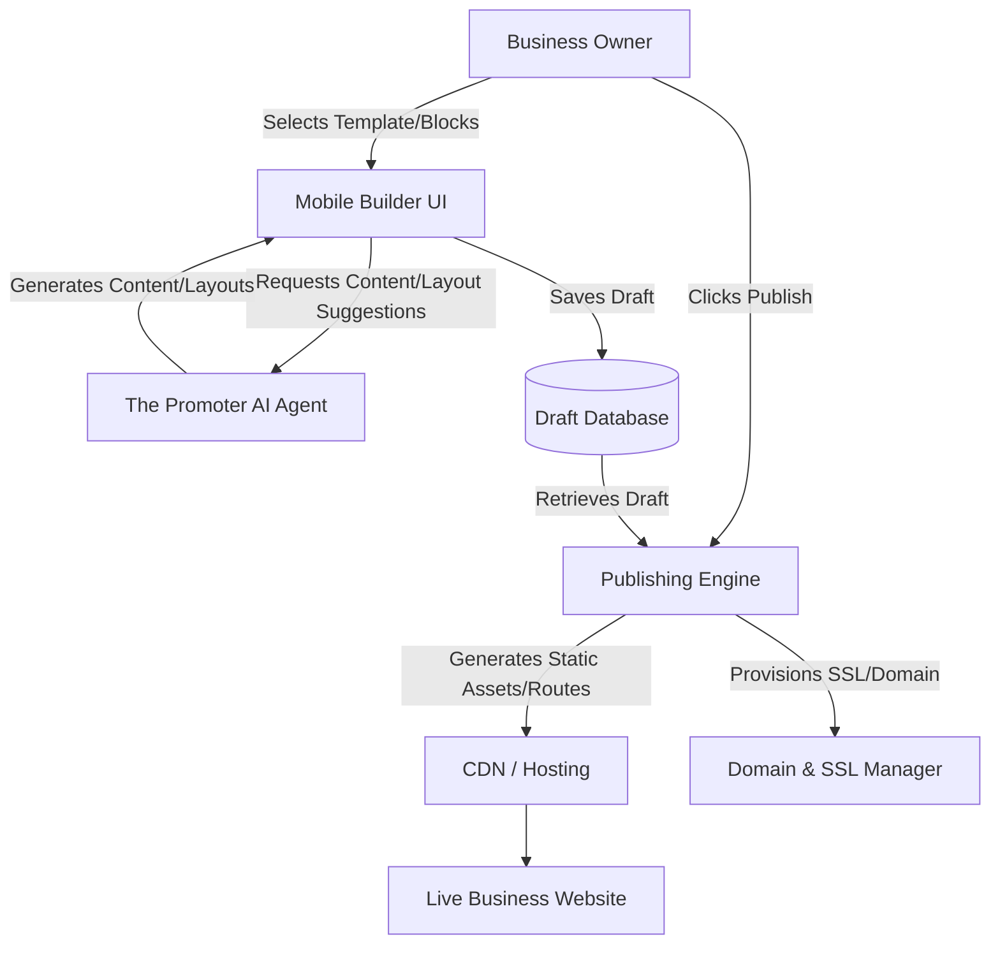

# Website & Storefront Builder Architecture

## Problem Statement
Small business owners (like Maya the Baker or Carlos the Handyman) need a simple, drag-and-drop website and storefront builder to quickly establish their online presence. Currently, setting up a website involves dealing with templates, hosting, SSL, and technical jargon, which can be overwhelming for non-technical users. The goal is to provide a seamless, intuitive builder that allows users to create professional, functional websites and storefronts from their mobile devices in under 10 minutes, with AI handling the complex tasks invisibly.

## Research Report
An analysis of competitor platforms (Shopify, Wix, Squarespace, GoDaddy) reveals:
- **Competitors** often require significant manual configuration, technical knowledge, and time to set up a website.
- **Pain Points:** Users struggle with layout adjustments, mobile responsiveness, connecting domains, and configuring SSL.
- **Opportunity:** OHC can offer a genuinely mobile-first builder that relies heavily on AI to auto-generate content, optimize layouts, and handle technical configurations (like domains and SSL) without user intervention.

## Design Doc

### High-Level Architecture
- **Content Blocks:** A library of predefined, functional blocks (e.g., Hero, Product Grid, Testimonials, Booking Calendar, Contact Form).
- **Templates:** Starting templates tailored to business types (e.g., Bakery, Handyman, Boutique) that serve as a foundation for customization.
- **AI Integration:** "The Promoter" AI agent assists in generating copy, selecting images, and optimizing layout based on the user's business profile.
- **Publishing Pipeline:** A simple "Draft -> Live" flow.
- **Automated Technicals:** OHC handles custom domain routing and SSL provisioning automatically.

### Architecture Diagram (Mermaid.js)

### Mobile UX Flow (375px First)
1. **Onboarding:** User selects their business type.
2. **Template Selection:** User chooses a starting template (AI suggests the best fit).
3. **Editor:**
   - **Main View:** A live preview of the site.
   - **Controls:** Floating action button (FAB) to "Add Block". Tapping a block opens a bottom sheet to edit content or ask AI to rewrite.
4. **Publishing:** A clear "Publish" button at the top right.
5. **Success Screen:** Displays the live URL with options to "Share on Social" or "Connect Custom Domain" (with simple, guided steps).

## Implementation Prompt
Implement the Website & Storefront Builder engine and mobile UI.
- Create the core content blocks and the drag-and-drop functionality tailored for a 375px mobile screen.
- Integrate "The Promoter" AI agent to provide real-time content generation and layout suggestions within the builder.
- Develop the backend publishing engine that takes a saved draft, generates the necessary assets, and deploys them to the CDN.
- Ensure the publishing process automatically provisions SSL certificates and handles custom domain routing transparently to the user. The entire experience must be completely free of technical jargon.

## Priority
P0

## Estimated Scope
Large
