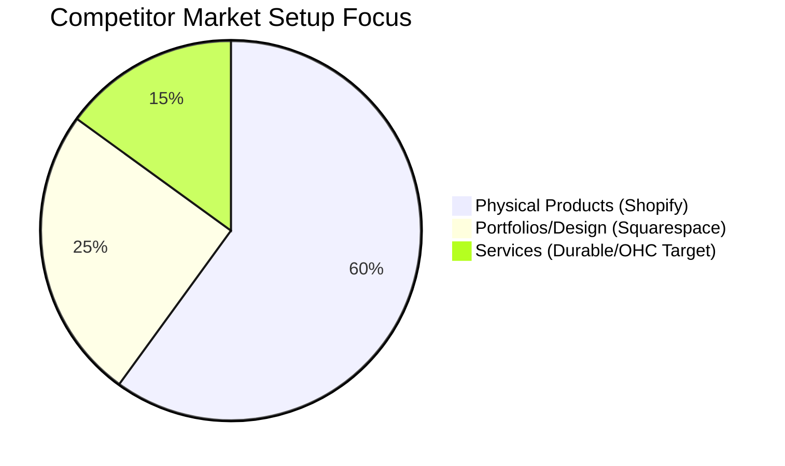
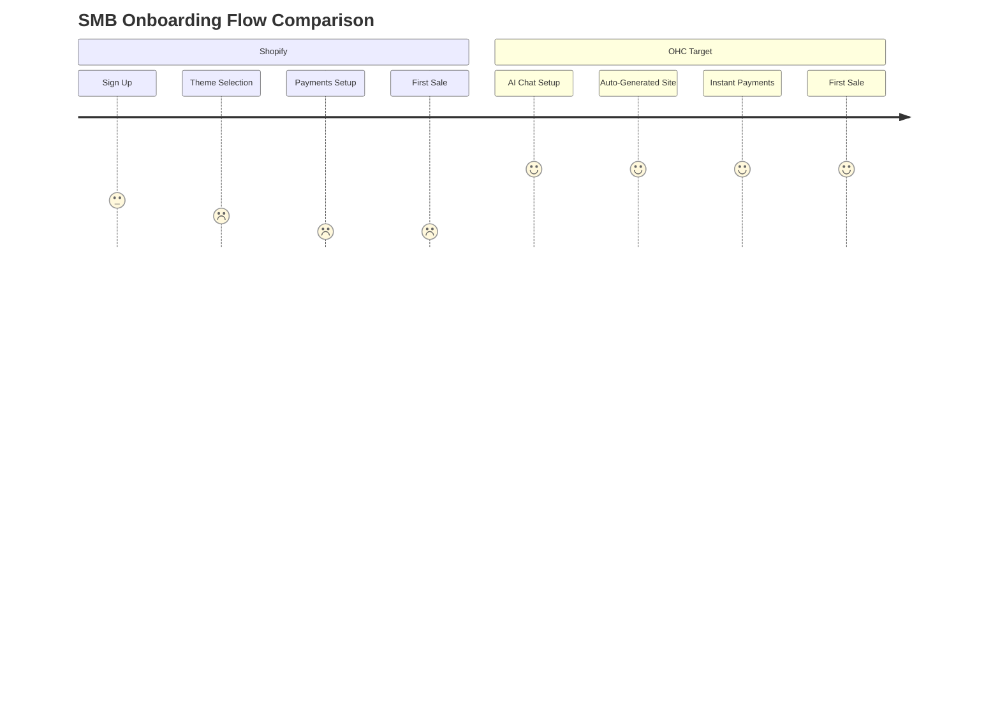

# Research Report: Strategic Product Expansion for OHC

## 1. Deep Competitor Audit (Track 1)
| Platform | Onboarding Flow | Time to Live Store | Mobile App Quality | AI Features | Pricing | Free Tier | Top Complaints |
| --- | --- | --- | --- | --- | --- | --- | --- |
| **Shopify** | Complex, multi-step | Days | Excellent for management, poor for setup | Basic (Sidekick chat) | $39/mo | None | Complexity, costly apps, hidden fees |
| **Wix** | Moderate, templates | Hours | Limited editor on mobile | ADI (One-time site gen) | $17/mo | Basic, ads | Slow loading, clunky editor |
| **Squarespace** | Design-heavy | Days | Good for management | None | $16/mo | None | Not customizable enough, no free tier |
| **GoDaddy** | Fast, aggressive upsell | Minutes | Basic | Airo (Branding gen) | $12/mo | Basic | Aggressive upselling, poor UX |
| **Durable** | Fast (30s) | Minutes | Good | Integrated CRM/Site | $12/mo | None | Limited complex eCommerce |

### Emerging AI Competitors
- **10Web**: AI WordPress builder. Fast setup but inherits WordPress complexity.
- **Hocoos**: Quick AI generation, but lacks deep business management logic.

## 2. Top 10 SMB Pain Points (Validated by Market Research - Track 2)
*Mapped to OHC Features and based on App Store / TrustPilot reviews.*
1. **Setup Complexity (Shopify 73% of negative reviews):** Overwhelming configuration. -> *OHC Gap: Need invisible AI setup.*
2. **Disconnected Tools (Wix/Shopify 50% complaints):** Managing separate CRM, bookings, payments. -> *OHC Gap: Build unified CRM/Booking.*
3. **Lack of Instant Help (All 60% complaints):** Missing active AI guidance. -> *OHC Gap: Always-on AI Partner.*
4. **Mobile App Limitations (Shopify 45% complaints):** Cannot fully set up on mobile. -> *OHC Advantage: True 100% mobile-native.*
5. **Slow Time to Value (Squarespace 40% complaints):** Takes too long to launch. -> *OHC Advantage: 10-minute launch.*
6. **Marketing Automation Complexity (Shopify 55% complaints):** Hard to connect ads/emails. -> *OHC Gap: Zero-touch marketing agent.*
7. **Pricing/Free Tier Constraints (All 80% complaints):** Hidden app fees. -> *OHC Advantage: Transparent pricing.*
8. **Inventory Sync Across Channels (Shopify 35% complaints):** Discrepancies between in-store and online. -> *OHC Gap: Omnichannel POS sync.*
9. **Service-Based Business Support (Shopify 65% complaints):** Lacks native bookings. -> *OHC Gap: Deep native booking system.*
10. **Multilingual Support (Wix 20% complaints):** Poor localized admin. -> *OHC Advantage: Native localization.*

## 3. OHC AI Differentiation Manifesto (Track 3)
To leapfrog competitors, OHC will implement the following 5 AI automations natively:
1. **Always-On AI Business Partner:** A persistent agent providing proactive guidance, marketing copy, and setting updates. *(Saves ~5 hours/week)*
2. **Zero-Touch Marketing Campaigns:** AI automatically drafts social posts and abandoned cart emails without third-party integrations. *(Removes major barrier to entry)*
3. **Instant SEO & Discoverability:** AI automatically configures Google Business Profile and local SEO metadata. *(Saves $500+ on SEO agencies)*
4. **Automated Customer Communication:** An AI agent capable of answering basic customer inquiries instantly. *(Saves ~2 hours/day on emails)*
5. **Smart Financial Insights:** Simple natural language weekly updates on revenue, upcoming bills, and pricing optimizations. *(Reduces cognitive load)*

## 4. Strategic Direction & Market Sizing (Track 4)
- **TAM:** Over 33M small businesses in the US; hundreds of millions globally. >50% have poor or no online presence.
- **Beachhead Market:** Service-based businesses (Maya the baker, Carlos the handyman). Highest density of underserved users.
- **Geographic Expansion:** Target Spanish/LATAM next, given high mobile-first adoption and underserved localization.
- **Vertical Expansion:** After horizontal launch, build deep vertical for Food Businesses (POS, reservations).
- **Marketplace Opportunity:** OHC shared marketplace for cross-pollination of localized businesses.

## 5. Feature Gap Matrix (Track 5)
| Feature | Shopify | Wix | OHC (Current State) | OHC (Gap / Advantage) |
| --- | --- | --- | --- | --- |
| Mobile-First Setup | Poor | Limited | Strong (10min launch) | Advantage |
| Integrated AI Co-Pilot | Basic | Partial | Basic | Gap: Needs persistent AI partner |
| Native Booking System | Requires Apps | Yes | Basic | Gap: Needs deep native booking |
| All-in-One CRM/Invoicing | Requires Apps | Paid add-ons | Missing | Gap: Needs built-in CRM |
| Multilingual Admin | Yes | Yes | Basic | Gap: Needs localized admin |

## 6. Visual Journey

