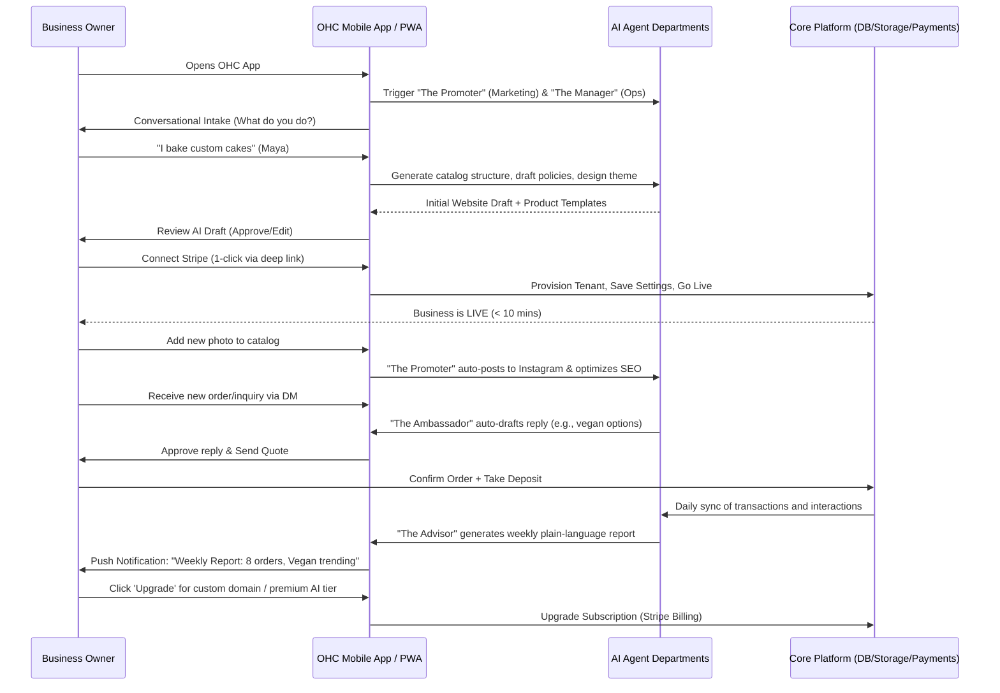
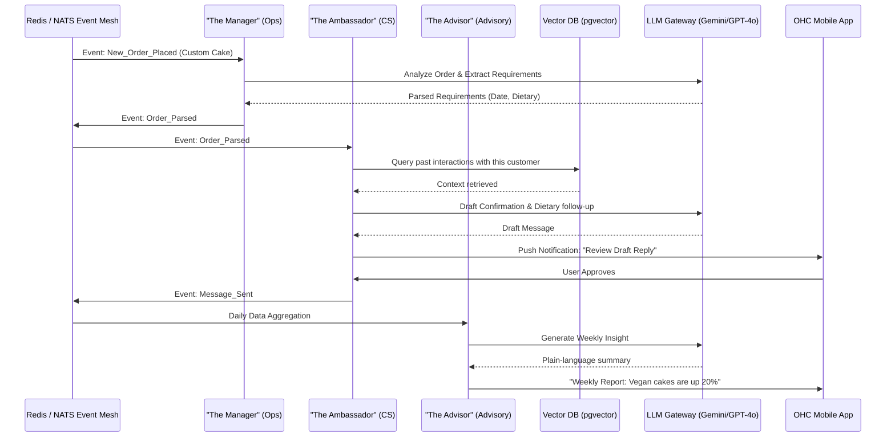
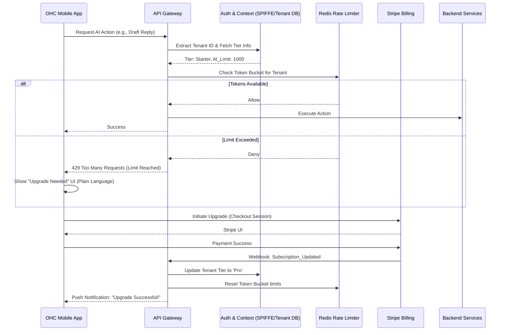
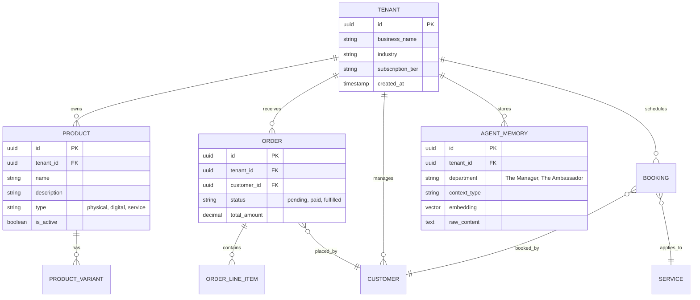

# Research Report: Business Journey Architecture

## 1. Title
Business Journey Architecture

## 2. Problem Statement
Non-technical small business owners (e.g., bakers, handymen, boutique owners, tutors, and food cart operators) often face overwhelming complexity when attempting to establish an online presence. Existing platforms present steep learning curves involving technical jargon, complex integrations, and manual configuration of services like hosting, payments, and SEO. The core opportunity for OneHumanCorp (OHC) is to eliminate this friction entirely, enabling any user to launch and run a comprehensive business stack in under 10 minutes with AI handling the technical complexity.

## 3. Research Report
### Competitive Analysis
- **Shopify/Wix/Squarespace/GoDaddy**: All target users who have some level of technical literacy. Setup times range from 20-60 minutes minimum, heavily relying on manual configuration.
- **OHC's Differentiator**: OHC uses AI as an underlying infrastructure rather than a bolted-on assistant. The AI actively handles website design, content generation, and customer support invisibly. OHC guarantees a sub-10 minute setup, 100% mobile-first parity, and zero technical jargon (passing the "grandmother test").

### Core Personas & Friction Points
1. **Maya (The Home Baker, 28)**
   - **Needs**: Visual catalog, custom orders with deposits, DM auto-replies.
   - **Friction Points**: Complex inventory systems not suited for custom cakes; manual response to frequent DM queries (e.g., "vegan options?"); setting up deposit logic.
2. **Carlos (The Freelance Handyman, 42)**
   - **Needs**: Service listings, booking calendar, quote generation.
   - **Friction Points**: Juggling scheduling across different apps; writing professional quotes manually; collecting deposits online without a website.
3. **Priya (The Boutique Owner, 35)**
   - **Needs**: In-store POS sync, product variants, automated email marketing.
   - **Friction Points**: Disconnected offline and online inventory; complex CRM setup for emails.
4. **Leo (The Music Tutor, 22)**
   - **Needs**: Subscriptions, automated meeting links, link-in-bio.
   - **Friction Points**: Tying together Google Calendar, Zoom, and Stripe manually; following up with inactive students.
5. **Fatima (The Food Cart Operator, 50)**
   - **Needs**: Multi-language, sold-out toggles, simple phone notifications.
   - **Friction Points**: High data/resource usage on low-end devices; complex POS interfaces in English only; delayed order notifications.

## 4. Design Doc

### 4.1 Architecture Diagram: End-to-End User Journey

### 4.2 Mobile UX Flow (375px First)
1. **Welcome Screen**: Clean, Glassmorphism design. Single prominent CTA: "Start My Business".
2. **Conversational Intake**: Chat-like interface asking 3-4 plain-language questions (e.g., "What's the name of your business?", "What do you sell?", "Where are you located?").
3. **AI Generation Overlay**: Subtle pulse animation while AI configures the storefront, policies, and products.
4. **Preview & Go Live**: A fully functional, mobile-optimized preview of the storefront. A prominent "Go Live" button.
5. **Dashboard**:
   - **Top**: Daily plain-language insight (e.g., "You made $150 today. 2 people asked about vegan cakes.").
   - **Middle**: Action items (e.g., "Review 1 draft reply", "1 new order to fulfill").
   - **Bottom Navigation**: Home, Orders/Bookings, AI Agents, Settings.

### 4.3 AI Agent Integration Points
- **The Promoter (Marketing)**: Hooks into the initial setup to generate the storefront UI. Monitors the catalog and auto-generates social media posts upon new item addition.
- **The Ambassador (Customer Success)**: Hooks into incoming Webhooks (e.g., Instagram DMs, WhatsApp). Uses vector DB of past chats to draft context-aware replies.
- **The Advisor (Business Advisory)**: Runs a nightly cron job analyzing the tenant's telemetry and transaction data to generate weekly health reports and next-action recommendations.
- **The Protector (Legal)**: Triggered during onboarding and when new product types are added to generate necessary compliance docs and contracts automatically.

### 4.4 Key Design Decisions
- **Conversational Onboarding**: Replaces traditional multi-step forms to pass the "grandmother test", ensuring zero technical friction.
- **AI-First Generation**: By generating the entire business stack (website, policies, catalog structure) upfront based on a simple prompt, we achieve the <10 min Go-Live promise.
- **Aggregated Action Dashboard**: Instead of navigating complex menus, users are presented with a unified "Action Items" feed curated by the AI, simplifying daily management.
- **Progressive Disclosure**: Advanced features (like variant management or custom domain DNS) are hidden behind simple, plain-language prompts and only surfaced when the AI identifies a need or the user explicitly asks.

## 5. Implementation Prompt
**For Implementer Agent:**
Implement the Conversational Onboarding Flow for the OHC mobile app.
- **CUJ**: A new, non-technical user (e.g., Maya the Baker) opens the app for the first time, answers 3 plain-language questions about her business, and within 10 minutes, is presented with a fully generated, live storefront preview.
- **Acceptance Criteria**:
  1. The UI must be fully responsive, starting at 375px width, utilizing the OHC Premium Token library (Glassmorphism, Outfit/Inter typography).
  2. Implement a chat-like intake wizard that collects basic business info.
  3. Integrate with the backend AI service to generate a mock storefront and draft policies.
  4. Display a "Go Live" success screen upon completion.
  5. Include 100% E2E test coverage starting from app launch, navigating the wizard, and verifying the success screen, using mocked AI responses.
  6. The entire flow must be completely devoid of technical jargon.

## 6. Priority
P0 (Critical)

## 7. Estimated Scope
Medium

---

## Autonomous Task Definition 2: AI Agent Department Architecture

## 1. Title
AI Agent Department Architecture

## 2. Problem Statement
Small business owners lack the time, expertise, and capital to hire specialists for marketing, customer support, finance, and legal compliance. Traditional software provides tools for these tasks but still requires the user to do the work. OHC needs a robust, scalable architecture where AI agents function as autonomous "departments" (e.g., "The Promoter", "The Manager") that invisibly execute these business operations in the background, collaborating seamlessly to run the business.

## 3. Research Report
### Competitive Analysis
- **Current Market**: Most platforms (like Shopify's Sidekick) offer AI as a reactive chatbot. The user must prompt the AI to perform a task or ask a question.
- **OHC's Differentiator**: OHC's AI agents operate proactively and autonomously. They are structured as functional departments that monitor events (new orders, incoming messages, low stock) and execute workflows automatically or prepare drafts for simple 1-click user approval.

### Department Core Functions
1. **Operations ("The Manager")**: Monitors order queues and inventory. Triggers reorder alerts or updates sold-out status.
2. **Marketing & Advertising ("The Promoter")**: Monitors catalog changes. Generates and schedules social media content. Updates SEO metadata.
3. **Sales & Acquisition ("The Salesperson")**: Monitors lead interactions. Generates quotes and follow-ups.
4. **Customer Success ("The Ambassador")**: Monitors communication channels (DMs, emails). Drafts context-aware replies using historical data.
5. **Finance & Payments ("The Accountant")**: Monitors transactions. Generates financial summaries and tracks pending deposits.
6. **Legal & Compliance ("The Protector")**: Monitors business profile and product types. Generates necessary legal docs (e.g., food safety disclaimers).
7. **Business Advisory ("The Advisor")**: Aggregates data across all departments to deliver weekly plain-language insights.

## 4. Design Doc

### 4.1 Architecture Diagram: AI Department Execution

### 4.2 Key Design Decisions
- **Event-Driven Coordination**: Departments communicate asynchronously via an Event Mesh (e.g., Redis Pub/Sub or NATS). This ensures decoupling and scalability; if "The Promoter" is busy, "The Manager" is not blocked.
- **Shared Memory Layer**: All departments utilize a central Vector DB (pgvector) for semantic memory. This allows "The Ambassador" to reference a quote previously generated by "The Salesperson".
- **Human-in-the-Loop (HITL) by Default**: High-risk actions (sending quotes, publishing sites, sending emails) default to generating a draft for user approval. Over time, as confidence grows, users can toggle specific workflows to "Auto-Execute".
- **Rate Limiting & Cost Control**: Execution is bounded per-tenant based on their subscription tier, enforced via distributed Redis locks and token bucketing to prevent runaway LLM costs.

## 5. Implementation Prompt
**For Implementer Agent:**
Implement the core Event Mesh and "The Ambassador" (Customer Success) agent skeleton.
- **CUJ**: An incoming customer inquiry event is published to the event bus. "The Ambassador" agent consumes this event, queries a mock vector memory for context, and generates a draft reply payload.
- **Acceptance Criteria**:
  1. Define the event schema for cross-department communication.
  2. Implement the event listener for "The Ambassador" department.
  3. Integrate the mocked LLM provider interface to generate a draft response based on the event payload.
  4. Expose an endpoint/handler for the user to approve and "send" the draft.
  5. E2E Test: Simulate an incoming message event, verify "The Ambassador" generates a draft, simulate user approval via the API, and verify the final state.
  6. Ensure all agent operations are non-blocking (async).

## 6. Priority
P0 (Critical)

## 7. Estimated Scope
Large

---

## Autonomous Task Definition 3: Multi-Tenant SaaS Tier Architecture

## 1. Title
Multi-Tenant SaaS Tier Architecture

## 2. Problem Statement
To successfully monetize OneHumanCorp while adhering to the core value of being "Accessible to All", the platform must support a robust, tiered subscription model. This model needs to seamlessly gate features, throttle AI usage to manage costs, and provide a frictionless upgrade path without confusing the non-technical user with complex technical limits. The challenge is enforcing these limits deep in the backend while presenting them transparently and pleasantly in the frontend.

## 3. Research Report
### Competitive Analysis
- **Shopify**: Trial period, then hard paywall. No permanent free tier, which excludes micro-businesses or those just testing an idea.
- **Wix/Squarespace**: Offer free tiers, but heavily ad-supported and severely limit core functionality (like e-commerce), forcing early upgrades.
- **OHC's Differentiator**: OHC offers a genuinely useful Free tier (ideal for micro-hustles) and scales up naturally. Limits are enforced on AI compute, storage, and catalog size, rather than arbitrarily blocking core business features.

### Proposed Tier Structure
| Tier | Price | Products | AI Departments | AI Actions/mo | Storage | Custom Domain | Target Persona |
|---|---|---|---|---|---|---|---|
| **Free** | $0 | 10 | 1 (Ops) | 100 | 500MB | No (OHC subdomain) | Fatima (Food Cart, testing the waters) |
| **Starter** | $9/mo | 100 | 3 | 1,000 | 5GB | Yes | Maya (Baker, growing side hustle) |
| **Pro** | $29/mo | Unlimited | 10 | Unlimited | 50GB | Yes + SSL | Carlos (Handyman, full-time business) |
| **Business** | $79/mo | Unlimited | Unlimited | Unlimited | 500GB | Yes + multi-domain | Priya (Boutique, multi-channel) |

## 4. Design Doc

### 4.1 Architecture Diagram: Tier Enforcement & Upgrade Flow

### 4.2 Key Design Decisions
- **Decentralized Enforcement**: Tier limits (product counts, storage quotas) are enforced at the service layer, while AI action limits are enforced via a centralized Redis token bucket. This prevents LLM cost overruns.
- **Graceful Degradation**: When AI limits are reached, the platform doesn't break; it simply pauses AI automation. Core features (like receiving orders) continue to function.
- **Plain-Language Upgrades**: Limit-hit messages are framed positively. Instead of "Error 429: Rate Limit Exceeded", the UI shows "Your business is booming! You've used all your AI helper actions for the month. Upgrade to keep them working."
- **Tenant Isolation**: All tier information is strictly tied to the `tenant_id`, securely extracted via SPIFFE/Auth context, never from client-provided payloads.

## 5. Implementation Prompt
**For Implementer Agent:**
Implement the backend tier enforcement middleware and the frontend upgrade prompt.
- **CUJ**: A user on the 'Free' tier attempts to perform their 101st AI action. The backend denies the request based on their tier limit, and the frontend elegantly prompts them to upgrade.
- **Acceptance Criteria**:
  1. Implement a Redis-backed rate limiter specifically for counting AI actions per `tenant_id` per month.
  2. Implement backend middleware to intercept AI requests, check the current tier, and deny if the limit is exceeded.
  3. Ensure the frontend handles the 429 response by displaying a beautifully designed, Glassmorphism "Upgrade Needed" modal.
  4. E2E Test: Simulate a Free tier user exhausting their limit, verify the backend denies the subsequent request, and verify the frontend displays the correct upgrade modal.

## 6. Priority
P1 (High)

## 7. Estimated Scope
Medium

---

## Autonomous Task Definition 4: Data Model Architecture

## 1. Title
Data Model Architecture

## 2. Problem Statement
A robust, secure, and scalable data model is the foundation of the OHC platform. Because OHC is a multi-tenant SaaS serving diverse business types (from bakeries to handymen to digital creators), the data model must be flexible enough to handle various product structures, booking paradigms, and AI memory states, while strictly enforcing row-level security to ensure absolute tenant isolation.

## 3. Research Report
### Data Requirements by Persona
- **Maya (Baker)**: Needs structured product catalogs, variants (e.g., flavors, sizes), order deposits, and fulfillment tracking.
- **Carlos (Handyman)**: Needs service listings, calendar availability blocks, booking records, and quote drafts.
- **Priya (Boutique)**: Needs robust inventory tracking synced across online and potential offline channels.
- **Fatima (Food Cart)**: Needs rapid menu toggles (sold out), pre-order queues, and simple status updates.

### Multi-Tenancy & Isolation
- **Row-Level Security (RLS)**: Essential for a multi-tenant PostgreSQL database. Every table containing user data must have a `tenant_id` column, and RLS policies must ensure queries only return rows matching the authenticated tenant context.

## 4. Design Doc

### 4.1 Entity-Relationship Diagram (ERD)

### 4.2 Key Design Decisions
- **Unified Product Table**: Products, Services, and Digital Goods all share the same base `PRODUCT` table, distinguished by a `type` column. This simplifies the core catalog logic while allowing specific variants or constraints based on the type.
- **Agent Memory as a First-Class Entity**: The `AGENT_MEMORY` table utilizes PostgreSQL's `pgvector` extension to store embeddings of business knowledge, customer interactions, and policies, allowing AI departments to perform semantic similarity searches for context retrieval.
- **Strict RLS Enforcement**: Every table has a `tenant_id`. Database migrations will explicitly enable RLS and create policies ensuring `current_setting('app.current_tenant_id')` matches the row's `tenant_id`.

## 5. Implementation Prompt
**For Implementer Agent:**
Implement the foundational PostgreSQL database schema with Row-Level Security for the core entities.
- **CUJ**: A backend service attempts to query orders. The database transparently filters the results to only include orders belonging to the authenticated tenant, preventing data leakage.
- **Acceptance Criteria**:
  1. Create database migration scripts for `TENANT`, `PRODUCT`, `ORDER`, and `AGENT_MEMORY` (using pgvector).
  2. Ensure every table includes a `tenant_id` column.
  3. Explicitly enable Row-Level Security (`ALTER TABLE ... ENABLE ROW LEVEL SECURITY;`) on all tenant data tables.
  4. Write unit tests verifying that queries executed under a specific tenant context cannot access another tenant's data.

## 6. Priority
P0 (Critical)

## 7. Estimated Scope
Large

---

## Conclusion & Next Steps
This report defines the core architectural pillars required to deliver the OneHumanCorp vision. The tasks outlined above provide actionable, prioritized directives for implementer agents to begin building the platform's foundation.

The immediate next step is to inject Task 1 (Business Journey Architecture - Conversational Onboarding) into the implementation queue to establish the primary user entry point.
