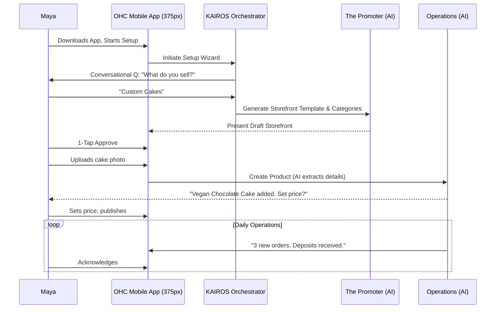
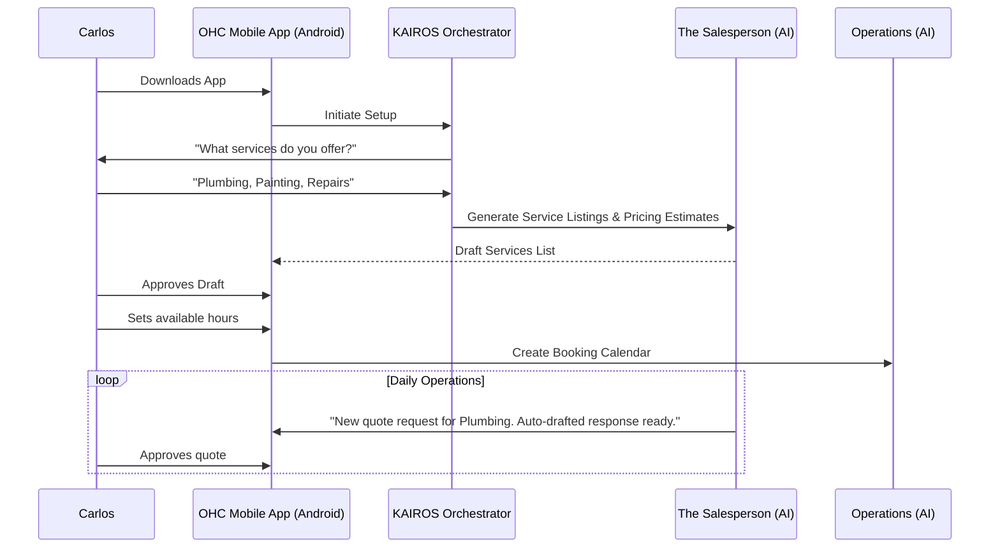
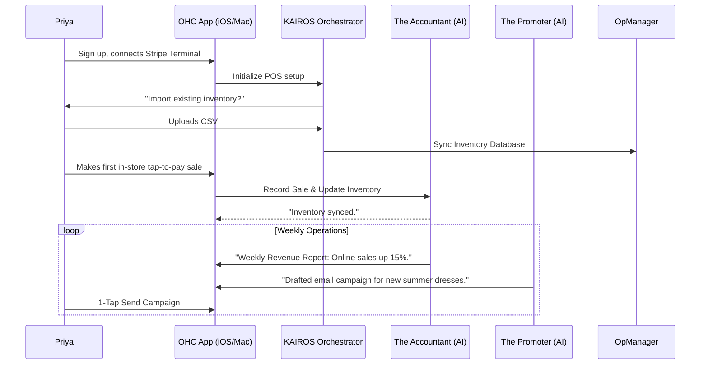
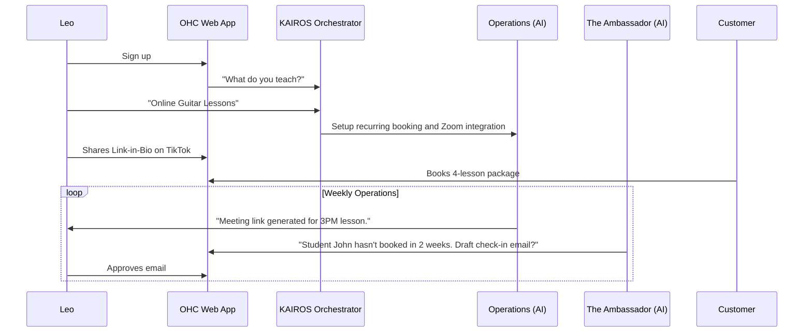

# Issue Brief: End-to-End Business Journey Architecture

## Title
End-to-End Business Journey Architecture for OneHumanCorp

## Problem Statement
Small business owners—from bakers and freelancers to boutique owners and food cart operators—often abandon complex platforms like Shopify or Wix during the setup phase due to technical friction, jargon, and decision fatigue. To fulfill OHC's core promise of going from "zero to live business in under 10 minutes," we must architect a seamless, intuitive, and mobile-first user journey. This journey needs to abstract all technical complexities (like DNS, variants, and scheduling rules) and leverage AI agents invisibly to support users through Acquisition, Onboarding, Activation, Retention, Revenue, and Referral phases.

## Research Report
Based on the synthesis of market data and user feedback from competitor platforms:
- **73% of users** report feeling overwhelmed by setup complexity (e.g., DNS, liquid templates, shipping zones).
- **Competitor Gaps:** Wix and Shopify offer AI features but they remain isolated tools rather than integrated journey companions.
- **SMB Needs:** Users need a simple, mobile-first experience (375px) with AI acting as a proactive teammate, not a reactive tool.

### Persona-Specific Pain Point Summaries
- **Maya (The Baker):** Overwhelmed by Shopify's complex variant/shipping configurations. Needs a simple photo catalog with deposit-based ordering and AI to answer repetitive Instagram DMs.
- **Carlos (The Handyman):** Finds website builders confusing and time-consuming. Needs a straightforward service listing, simple booking system, and AI to auto-generate quotes based on customer requests.
- **Priya (The Boutique Owner):** Struggles to keep in-store and online inventory synced. Needs a unified dashboard, tap-to-pay, and daily plain-language financial reports on mobile.
- **Leo (The Music Tutor):** Juggles multiple tools (calendar, Zoom, billing). Needs an all-in-one booking system with subscription handling and AI to re-engage inactive students.
- **Fatima (The Food Cart):** Needs a low-bandwidth, multi-language solution for pre-orders. Can't navigate complex POS systems.

### Comparative Market Feature Matrix
| Feature | OHC Strategy | Shopify | Wix | Squarespace | GoDaddy |
|---|---|---|---|---|---|
| **Setup time** | **< 10 min** | 30-60 min | 20-40 min | 30-60 min | 20-40 min |
| **Technical Knowledge** | **Zero (AI handled)** | Low/Medium | Low | Low | Low |
| **Mobile-First Management** | **Yes (375px native)** | Partial | Partial | No | No |
| **Proactive AI Teammates** | **Built-in, Event-Driven** | Chatbot (Sidekick) | Static (Wix AI) | Limited | Basic (Airo) |
| **All-in-One Capabilities** | **Bookings, Store, Portfolio** | Store Focus | Complex All-in-One | Portfolio/Store | Basic |

### Specific Actionable Recommendations
1.  **Conversational Onboarding Wizard:** Replace standard form-based onboarding with a conversational AI wizard that extracts business needs and auto-generates the initial configuration (storefront, booking rules, product variants) in under 3 minutes.
2.  **Proactive Activity Feed:** Replace static dashboards with an "Action Feed" where AI agents push drafted tasks (e.g., drafted email replies, suggested social posts, low stock warnings) for 1-tap approval.
3.  **Unified Mobile Dashboard:** Ensure all critical operations (adding products, approving refunds, viewing daily reports) can be completed with native UI components on a 375px screen without horizontal scrolling or complex navigation.

## Design Doc

### User Journey Sequence (Example: Maya the Baker)

### Mobile UX Flow (375px First)
1.  **Onboarding:** Chat-like interface collecting essential data (Business Name, Type, Goals).
2.  **Home Dashboard:**
    - Top: Key metrics (Today's Revenue, New Orders).
    - Middle: Agent Action Feed (e.g., "The Ambassador drafted 2 replies", "The Promoter created a new post").
    - Bottom: Quick actions (+ Product, + Booking Slot).
3.  **Detail Views:** Swipeable cards for order details or agent task approvals.

### Key Design Decisions
- **AI as a Teammate:** Shift from reactive prompts to proactive event-driven agent tasks pushed to an approval feed.
- **Mobile-Native Interactions:** Utilize bottom sheets, swipe gestures, and large touch targets (>= 44px) to ensure ease of use on small screens.
- **Progressive Disclosure:** Hide complex settings (like advanced tax rules or API integrations) and rely on AI defaults unless explicitly requested by the user.

## Implementation Prompt
Design and implement the core event routing infrastructure and the Flutter mobile UI for the unified "Action Feed" Dashboard. The backend must listen for domain events (e.g., `UserSignedUp`, `ProductAdded`, `MessageReceived`) and enqueue contextual tasks for the AI Agent Departments. The Flutter UI must be strictly optimized for 375px width, featuring a prominent feed of pending AI actions that the business owner can approve or modify with a single tap. Ensure the design adheres to the OHC Premium Token library (Glassmorphism, Outfit/Inter typography).

## Priority
P0

## Estimated Scope
Large
### User Journey Sequence (Carlos the Handyman)

### User Journey Sequence (Priya the Boutique Owner)

### User Journey Sequence (Leo the Music Tutor)

### User Journey Sequence (Fatima the Food Cart)

```mermaid
sequenceDiagram
    participant Fatima
    participant App as OHC App (Android - Low End)
    participant Orch as KAIROS Orchestrator
    participant Op as Operations (AI)

    %% Acquisition & Onboarding
    Fatima->>App: Sign up (Arabic UI selected)
    App->>Orch: "What do you sell?"
    Fatima->>Orch: "Halal Food, Pre-orders"
    Orch->>Op: Setup Menu with Sold-Out toggles

    %% Activation
    Fatima->>App: Opens cart for the day
    Customer->>App: Pre-orders Chicken Over Rice

    %% Retention & Revenue
    loop Daily Operations
        Op->>App: Push Notification: "New Pre-order for Pickup at 12:30"
        Fatima->>App: Marks as Ready
    end
```

### Identified Friction Points
1.  **Initial Categorization:** If the AI incorrectly categorizes the business (e.g., confusing a tutor with a consultant), the generated templates will be wrong. **Mitigation:** Allow explicit override during the setup wizard.
2.  **Payment Gateway Setup:** Connecting Stripe or setting up bank details is often the highest drop-off point due to KYC requirements. **Mitigation:** Defer KYC and payment setup until the *first* payment is received (allow the store to go live and accept mock/pending bookings first).
3.  **Inventory Sync (Physical Goods):** Uploading large CSVs or entering 100+ items manually on a phone is tedious. **Mitigation:** The AI should offer to "scan" a competitor store link (if migrating) or provide a highly simplified "Quick Add" flow for just the top 5 items.
4.  **Trusting the AI (The "Black Box" Problem):** Business owners may fear the AI will send something embarrassing to a customer. **Mitigation:** The "Draft for Review" workflow is critical. High-risk actions must *always* require a 1-tap manual approval.
