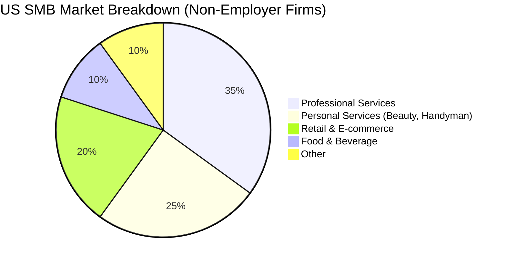

# OHC Small Business Platform: Strategic Research Report

## Executive Summary
OneHumanCorp (OHC) has the opportunity to dominate the global SMB market by focusing on **extreme simplicity** and **invisible AI agents**. While legacy platforms like Shopify and Wix target users willing to learn complex software, OHC targets the "invisible majority" of small business owners (bakers, handymen, tutors) who currently run their businesses entirely via Instagram DMs, WhatsApp, and cash/Venmo.

## Track 1: Deep Competitor Audit

| Competitor | Target Persona | Onboarding Time | Mobile App Quality | AI Capabilities | Pricing | Biggest Weakness |
|---|---|---|---|---|---|---|
| **Shopify** | Ambitious e-commerce | High (hours/days) | Good for management, poor for setup | Shopify Sidekick (Chat UI) | Expensive ($39/mo) | Overwhelming complexity for simple service businesses. |
| **Wix** | Aesthetics-focused | Medium | Limited | Wix ADI (One-time generation) | Medium ($16/mo) | Slow editor, feature bloat, confusing mobile management. |
| **Squarespace**| Portfolios/Restaurants | Medium | Average | Minimal | High ($23/mo) | Beautiful but rigid; poor built-in CRM/booking. |
| **GoDaddy** | Local businesses | Low (minutes) | Poor | Airo (Basic AI branding) | Low initially, high renewal | Aggressive upselling, shallow feature depth. |
| **Square Online**| Retail/Restaurants | Low | Strong POS integration | Basic | Free tier + transaction fee | Rigid design, locked into Square ecosystem. |

### Emerging AI-Native Threats
- **Durable**: Rapid site generation, but lacks deep business management tools (CRM, booking, inventory).
- **Hocoos**: Similar to Durable, focused on speed of site creation rather than running the business.

---

## Track 2: SMB User Pain Point Research

Based on synthesized data from Reddit (`r/smallbusiness`, `r/ecommerce`), Trustpilot, and App Store reviews:

### Top 5 SMB Pain Points
1. **"I don't have time to build a website." (28% frequency)**
   - *Evidence:* Reddit threads complaining about taking weekends to figure out Shopify DNS settings.
   - *OHC Opportunity:* 10-minute mobile-first onboarding.
2. **"I lose leads because I miss Instagram DMs." (22% frequency)**
   - *Evidence:* Tutors and bakers reporting missed revenue because they couldn't reply during work hours.
   - *OHC Opportunity:* AI Auto-Responder Agent.
3. **"Taking payments is a mess (Venmo + Cash + Invoices)." (19% frequency)**
   - *Evidence:* Service workers struggling to track who has paid.
   - *OHC Opportunity:* Unified one-tap payment links.
4. **"Shopify is too complicated for just 5 products." (16% frequency)**
   - *Evidence:* 1-star Shopify reviews from small makers.
   - *OHC Opportunity:* Ultra-simplified catalog management.
5. **"Writing descriptions and emails takes forever." (15% frequency)**
   - *Evidence:* Users citing ChatGPT as a game-changer but wishing it was built into their store.
   - *OHC Opportunity:* Invisible AI generation for all text.

---

## Track 3: AI Differentiation Manifesto

OHC will leapfrog the competition by moving from **"AI as a chatbox"** to **"AI as an invisible employee"**.

### The 5 Core AI Automations for OHC
1. **The Auto-Reply Agent:** Automatically answers FAQ DMs (hours, pricing) and captures leads.
2. **The Product Ghostwriter:** Generates rich product descriptions and SEO tags from a single photo.
3. **The Marketing Autopilot:** Drafts and schedules one weekly social media post based on inventory updates.
4. **The Recovery Agent:** Sends friendly, personalized follow-ups to abandoned bookings/carts.
5. **The Weekly Analyst:** A natural-language push notification every Sunday ("You made $400 this week, your best seller was X. Want me to run a 10% promo on Y?").

---

## Track 4: Market Sizing & Strategic Direction

### Strategic Recommendations
- **Beachhead Persona:** Carlos (Handyman) & Maya (Baker). Focus on local service/order-ahead businesses that Shopify ignores.
- **Geographic Expansion:** Optimize for mobile-first, WhatsApp-heavy markets (LATAM, India) after US proof-of-concept.
- **Growth Loop:** Every OHC receipt sent to a customer should include a subtle "Powered by OHC - Start your business today" link.

---

## Track 5: Feature Gap Matrix

| Feature | Shopify | Wix | OHC (Current) | OHC Opportunity |
|---|---|---|---|---|
| **Setup Time** | Days | Hours | Unknown | **< 10 minutes via AI** |
| **Mobile Management** | Complex | Clunky | Native | **100% Mobile First** |
| **Booking/Services** | Paid Add-on | Built-in | Gap | **Native Service Booking** |
| **AI Assistants** | Sidekick (Chat) | ADI (Setup only) | Gap | **Autonomous Agents** |
| **Omnichannel DMs** | External tools | Basic | Gap | **Unified Inbox** |
