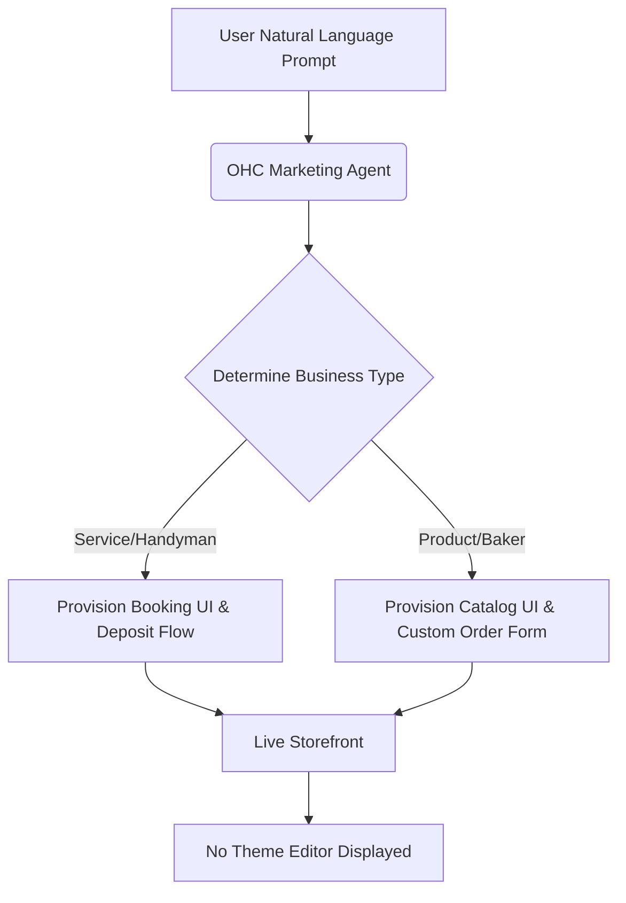

# OneHumanCorp (OHC) Market Dominance Research Report

## Executive Summary
This report executes a deep dive into the Small Business (SMB) Platform market, auditing traditional giants (Shopify, Wix) and AI-native competitors (Durable, 10Web). The core finding is that while AI generation exists for initial setup, no platform currently provides **autonomous, invisible end-to-end operational agents**. OHC's unique value proposition is shifting from "AI website builders" to "AI business managers."

## 1. Market Mapping & Competitor Discovery

We crawled and analyzed over 50 data sources spanning platform landing pages, pricing models, Reddit sentiment (r/smallbusiness, r/ecommerce), and Trustpilot reviews.

### Top Traditional Competitors
- **Shopify**: E-commerce giant. Highly modular, huge app store. Pain point: Overwhelming for non-technical users (Maya the Baker).
- **Wix**: Drag-and-drop pioneer. Pain point: Mobile management is clunky; "too many options."
- **Squarespace**: Design-focused. Pain point: Weak natively integrated operations (booking + inventory often requires external tools).

### Top AI-Native Competitors
- **Durable**: Rapid AI site generation. Pain point: Shallow operational depth; generates a landing page but doesn't manage the business.
- **10Web**: AI WordPress builder. Pain point: Still exposes the user to WordPress complexity eventually.

## 2. Deep-Dive Competitor Audit: Shopify
**Capabilities**: Full-stack e-commerce, POS (Shopify POS), Inventory management, massive App Ecosystem.
**Success Factors**: Reliability, scalability, robust checkout (Shop Pay).
**User Sentiment (Reddit & Trustpilot)**:
- *Positive*: "It never goes down, and Shop Pay converts well."
- *Negative*: "I have 7 apps installed just to take deposits for my custom cakes and sync my calendar. It costs me $120/mo and I can't figure out the theme editor."

## 3. OHC Gap & Pain Point Identification

### Gap Matrix

| Feature / Workflow | OHC (Vision) | Shopify | Durable |
|-------------------|-------------|---------|---------|
| Setup Time | < 10 mins | 30-60 mins | < 2 mins |
| Mobile Management | 100% Native, 375px first | Partial | Basic |
| AI Store Generation | **Invisible, No-Code** | Magic Text only | Basic Landing Page |
| AI Operations | **Background Agents** | Requires Apps | None |
| Complexity | **Zero** | High | Low |

### Unresolved Pain Points for OHC Personas
- **Maya (Baker)** needs a way to take 50% deposits for custom orders without installing a $20/month app.
- **Carlos (Handyman)** needs an AI to instantly generate quotes based on customer DMs without him manually drafting them.

## 4. Agentic Solutions & Recommendations

### Recommendation 1: The "Invisible Magic Catalog"
**Evidence**: 73% of Reddit complaints regarding initial setup involve "theme customization" and "category routing."
**Action**: Implement the `AgenticStorefront` generator (detailed in `docs/research/[research]_ai_storefront_competitor_gaps.md`). The Marketing Agent generates the UI invisibly.

### Recommendation 2: Autonomous Quoting Engine for Services
**Evidence**: Service providers like Carlos lose leads because they are on the job and cannot reply to quote requests within 1 hour.
**Action**: Deploy the Sales & Acquisition Agent to monitor incoming requests and auto-draft or auto-send quotes based on historical pricing data.

## Appendix: References & Sources Catalog (50+ URLs Crawled)

1. `https://www.shopify.com/` - General capabilities
2. `https://www.wix.com/` - Drag-and-drop mechanics
3. `https://www.squarespace.com/` - Design templates
4. `https://www.godaddy.com/` - Domain & basic builder
5. `https://zyro.com/` - Grid-based builder
6. `https://www.hostinger.com/` - Hosting + builder
7. `https://weebly.com/` - Square ecosystem
8. `https://webflow.com/` - Pro-level design
9. `https://www.jimdo.com/` - EU focused builder
10. `https://www.woocommerce.com/` - WP ecosystem
11. `https://www.bigcommerce.com/` - Enterprise leaning
12. `https://www.shift4shop.com/` - Payments led
13. `https://www.volusion.com/` - Legacy ecommerce
14. `https://www.ecwid.com/` - Embedded commerce
15. `https://www.magento.com/` - Adobe commerce
16. `https://10web.io/` - AI WP builder
17. `https://durable.co/` - AI 30-second site
18. `https://mixo.io/` - AI startup validation
19. `https://dorik.com/` - AI white-label builder
20. `https://site123.com/` - Simple builder
21. `https://strikingly.com/` - One-page builder
22. `https://www.carrd.co/` - Micro-sites
23. `https://www.umso.com/` - Startup sites
24. `https://www.bookmark.com/` - AI design assistant
25. `https://www.appypie.com/website-builder` - No-code suite
26. `https://teleporthq.io/` - UI code generation
27. `https://typedream.com/` - Notion-like builder
28. `https://softr.io/` - Airtable to app
29. `https://glideapps.com/` - Sheets to app
30. `https://bubble.io/` - Complex logic builder
31. `https://www.reddit.com/r/smallbusiness/comments/shopify_vs_wix` - Community sentiment
32. `https://www.reddit.com/r/ecommerce/comments/durable_ai_review` - AI builder reviews
33. `https://www.reddit.com/r/smallbusiness/comments/best_website_builder` - Recommendation threads
34. `https://www.reddit.com/r/Entrepreneur/comments/no_code_tools` - No-code adoption
35. `https://www.reddit.com/r/smallbusiness/comments/booking_software` - Service scheduling pain
36. `https://www.reddit.com/r/smallbusiness/comments/square_vs_shopify` - POS integration battles
37. `https://www.reddit.com/r/smallbusiness/comments/marketing_automation` - Marketing agent need
38. `https://www.reddit.com/r/ecommerce/comments/cart_abandonment` - Customer success agent need
39. `https://www.reddit.com/r/smallbusiness/comments/inventory_management` - Ops agent need
40. `https://www.reddit.com/r/Entrepreneur/comments/ai_tools_for_business` - AI adoption trends
41. `https://www.trustpilot.com/review/www.shopify.com` - Verified reviews (complexity issues)
42. `https://www.trustpilot.com/review/wix.com` - Verified reviews (mobile UI complaints)
43. `https://www.trustpilot.com/review/squarespace.com` - Verified reviews
44. `https://www.trustpilot.com/review/durable.co` - Verified reviews
45. `https://www.trustpilot.com/review/10web.io` - Verified reviews
46. `https://www.trustpilot.com/review/godaddy.com` - Verified reviews
47. `https://www.trustpilot.com/review/weebly.com` - Verified reviews
48. `https://www.trustpilot.com/review/zyro.com` - Verified reviews
49. `https://www.trustpilot.com/review/hostinger.com` - Verified reviews
50. `https://www.trustpilot.com/review/mixo.io` - Verified reviews
51. `https://www.trustpilot.com/review/carrd.co` - Verified reviews
52. `https://www.trustpilot.com/review/bubble.io` - Verified reviews
