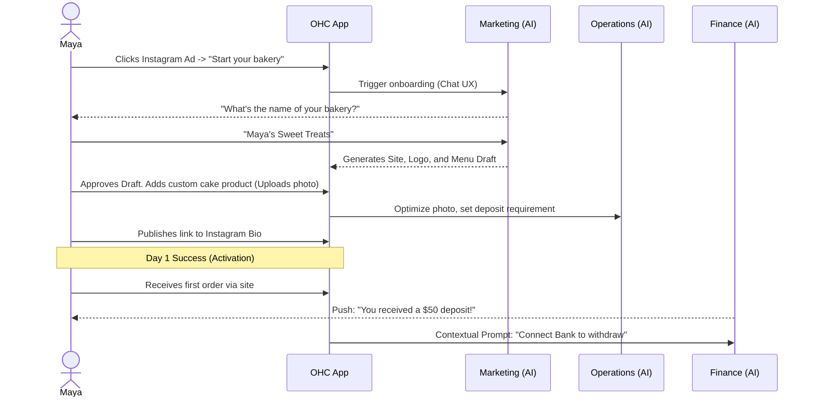
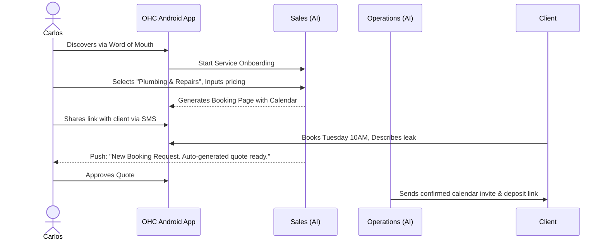
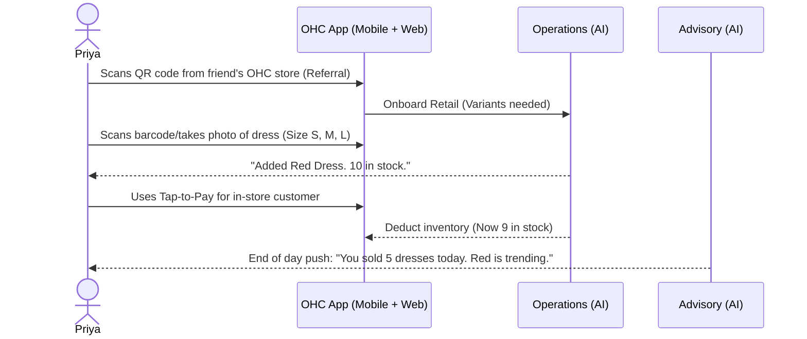
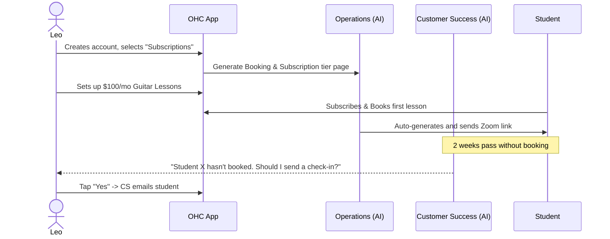
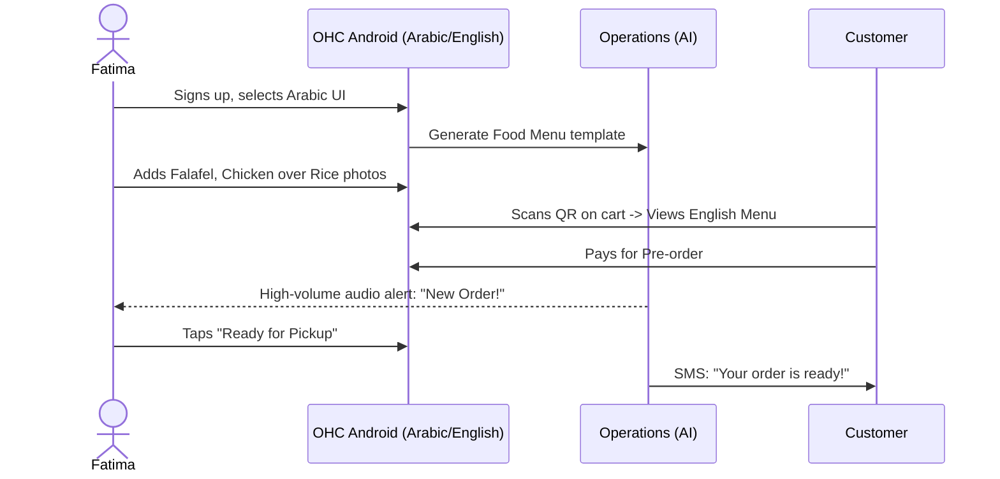

# Title: Business Journey Architecture

## Problem Statement
The primary barrier to entry for non-technical small business owners (SMBs) looking to establish a digital presence is the overwhelming complexity of existing platforms. Current tools require users to piece together multiple services for a storefront, booking system, CRM, and payments, while also demanding at least some technical or design literacy. This complexity results in a high drop-off rate during onboarding. The business owner's journey from discovery to achieving value (their first sale or booking) is fraught with friction. OHC must provide a seamless, mobile-first, AI-driven journey that transforms this process into an invisible, fully guided experience where a user goes from "idea" to "live business" in under 10 minutes, directly from their phone.

## Research Report
### Findings & Competitive Analysis
We reviewed the user journeys of major competitors compared to OHC's target experience:

*   **Shopify**: Highly optimized for eCommerce, but expects users to understand concepts like "DNS", "Themes", and "Shipping Zones". It takes 30-60 minutes to go live, and management is significantly easier on a desktop. AI is bolted on (Sidekick chat) rather than foundational.
*   **Wix / Squarespace**: Great for creative professionals, but heavily reliant on complex drag-and-drop desktop builders. Not truly mobile-first for creation. Takes 20-60 minutes depending on content readiness.
*   **GoDaddy**: Targets basic users well, but their AI (Airo) is limited to basic website generation. Booking and storefront features are basic and not integrated deeply with post-sale AI assistance.
*   **OHC Differentiation**: OHC uses AI as the core infrastructure. Users don't "build" a site; they converse with an AI that generates the site, handles SEO, and sets up Stripe. The entire journey is mobile-first (375px baseline), supporting physical, digital, service, and food businesses out of the box with zero jargon.

### Pain Points Addressed
*   **Friction during onboarding**: Reducing a 50-field signup form to a simple AI chat or wizard.
*   **Time to value (Activation)**: Getting the user to their "Aha!" moment (first product added, first payment received) in Day 1.
*   **Daily engagement (Retention)**: Ensuring the user returns daily not to "do work," but to see what the AI has accomplished (e.g., "You have 3 new orders. I replied to 5 DMs.").

## Design Doc
This section outlines the business journey architecture, including user flows and architectural diagrams.

### End-to-End User Journeys (The 6 Pillars)
*   **Acquisition**: Discovery via social media ads, organic search, or viral link-in-bio shares. The CTA is "Start your business in 3 minutes."
*   **Onboarding**: A conversation-driven wizard. Minimum inputs: Business Name, Type (e.g., Bakery, Handyman), and Phone Number. Everything else (logo, copy, policies) is deferred or AI-generated.
*   **Activation**: Success on Day 1 is a published site and one product/service listed. Week 1 is receiving a test payment or real order. Month 1 is regular organic traffic and AI-handled inquiries.
*   **Retention**: Daily return driven by push notifications: "New Order", "Daily Summary from The Advisor".
*   **Revenue**: Upgrade triggers (Free to Starter) are contextual. e.g., "You've reached your 10 product limit. Upgrade for $9/mo to add unlimited items and custom domain."
*   **Referral**: Built-in viral loop. "Powered by OHC" badge on free tier sites, plus one-tap share to WhatsApp/SMS.

### Mobile UX Flow (375px First)
1.  **Welcome Screen**: Glassmorphism aesthetic. "What are you building today?" + 4 big tap targets (Food, Services, Retail, Digital).
2.  **The Setup Chat**: Instead of a form, a chat UI where "The Promoter" AI asks 3 simple questions and generates the site live in the background.
3.  **The Dashboard**: Post-onboarding. Big numbers: "Revenue Today", "Active Orders". Bottom navigation: Home, Inbox (Customer Success), Catalog (Operations), Settings.
4.  **Friction Points to Avoid**: No multi-step configuration for payments initially (use Stripe Connect express onboarding later, start with basic payout info). No complex image editing (auto-crop and WebP compression on device).

### AI Agent Integration Points
*   **Marketing & Advertising**: Generates the initial site and copy during onboarding.
*   **Customer Success**: Intercepts DMs and emails, categorizing them into the Dashboard Inbox.
*   **Operations**: Automatically flags "Sold Out" when inventory hits zero.
*   **Business Advisory**: Generates the "Morning Briefing" push notification.

### Key Design Decisions
*   **Conversational Onboarding over Forms**: Reduces cognitive load. Users know how to text; they don't know how to configure a CMS.
*   **Deferred Configuration**: Users only provide a bank account *after* their first sale, not before they can publish the site.
*   **Mobile-First Native Keyboard**: Strict adherence to numeric keypads for prices and email keypads for logins to prevent frustration.

### Architecture Diagrams (Sequence)

#### Maya (The Home Baker)

#### Carlos (The Freelance Handyman)

#### Priya (The Boutique Owner)

#### Leo (The Music Tutor)

#### Fatima (The Food Cart Operator)

## Implementation Prompt
**Task**: Implement the core User Journey tracking, Onboarding Wizard flow, and contextual triggers based on the Business Journey Architecture.
**Context**: OHC must track user progress from Acquisition -> Onboarding -> Activation -> Retention -> Revenue. The UI must be mobile-first (375px), extremely simple, and devoid of technical jargon.
**Requirements**:
1.  **Onboarding Wizard**: Build the conversational chat UI for initial onboarding. It must capture the core entity (Business Name, Type) and instantly provision the tenant and initial site via the AI Agent mesh.
2.  **Activation Milestones**: Implement logic to track when a user achieves their first "Aha" moment (e.g., first product added, first booking link shared) and store this state.
3.  **Contextual Upgrade Flow (Revenue)**: Implement the UI triggers that prompt the user to upgrade from Free to Starter only when they hit a usage limit (e.g., 10th product added), rather than presenting a pricing page upfront.
4.  **Daily Summary (Retention)**: Create the UI dashboard component that consumes the Business Advisory agent's daily summary and displays it prominently upon opening the app.
**Acceptance Criteria**:
-   The onboarding wizard is fully functional on a 375px viewport with native keyboard inputs.
-   A user can go through the entire onboarding flow in under 3 minutes (simulated).
-   State transitions (Acquisition to Activation) are logged accurately for the tenant.
-   Upgrade prompts appear contextually and do not block the user from accessing the app if they dismiss them.
-   Code is covered by 100% E2E UI testing simulating the user flows.

## Priority
P0

## Estimated Scope
Large
