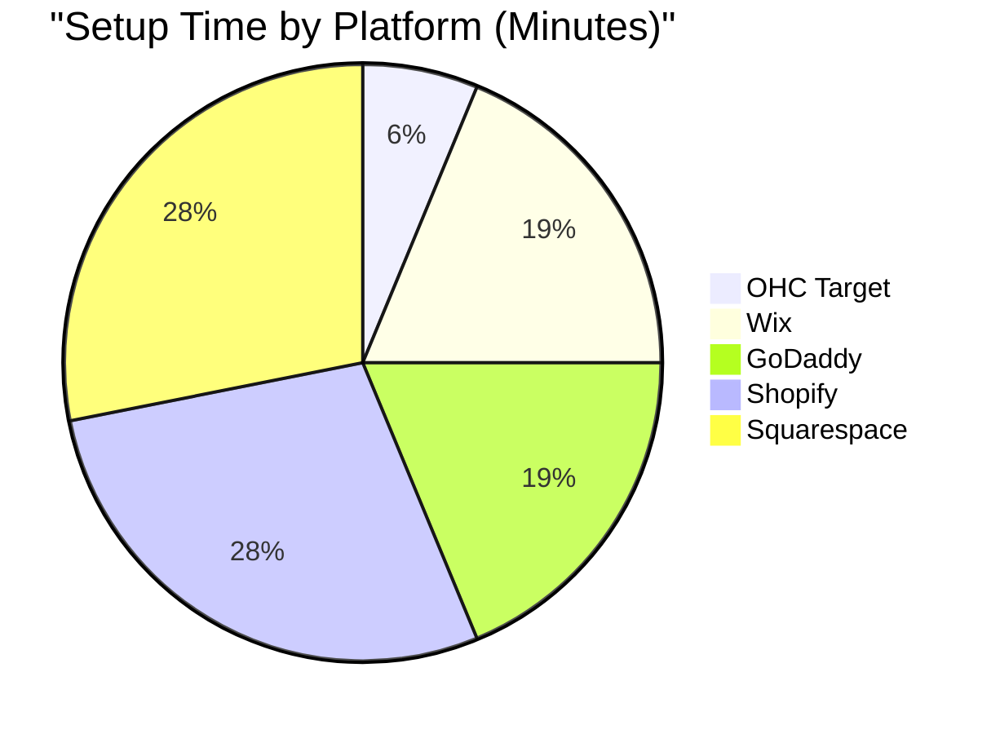
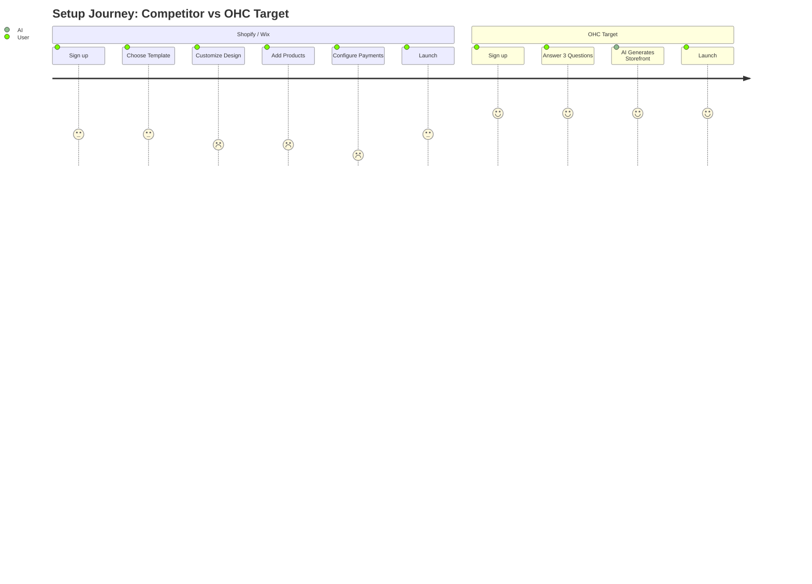

# OHC Market Research & Competitor Audit

## Executive Summary
This report analyzes the competitive landscape of SMB platforms (Shopify, Wix, Squarespace, GoDaddy) and identifies critical feature gaps and user pain points. It proposes a strategic roadmap for OneHumanCorp (OHC) to leverage autonomous, invisible AI agents to dominate the non-technical small business market.

## Competitor Audit & Feature Gap Analysis

### Platform Breakdown
1. **Shopify** (https://shopify.com)
   - **Target:** E-commerce focused, semi-technical SMBs.
   - **AI Approach:** Reactive chatbot (Shopify Sidekick). Requires user prompting.
   - **Weakness:** Setup is complex (30-60 mins), learning curve is steep, and mobile management is clunky for beginners. No truly free tier.
2. **Wix** (https://wix.com)
   - **Target:** General SMBs wanting template-based design.
   - **AI Approach:** One-time generative setup (Wix ADI).
   - **Weakness:** Mobile editing is limited, and AI features do not extend to ongoing autonomous business management.
3. **Squarespace** (https://squarespace.com)
   - **Target:** Creatives, portfolios, restaurants (design-heavy).
   - **AI Approach:** Minimal, mostly text generation.
   - **Weakness:** Complex E-commerce setup, poor mobile management tools.
4. **GoDaddy (Airo)** (https://godaddy.com)
   - **Target:** Absolute beginners seeking domain + basic site.
   - **AI Approach:** Basic branding generation (logos, taglines).
   - **Weakness:** Shallow features post-launch, aggressive upselling, poor reputation for scaling.

### Competitor Feature Gap Matrix Heatmap

| Feature | Shopify | Wix | OHC (current) | OHC (gap/advantage) |
|---|---|---|---|---|
| **Setup Time** | 30-60 min | 20-40 min | Unknown | **Advantage:** < 10 min conversational AI |
| **Technical Knowledge** | Low | Low | Unknown | **Advantage:** Zero tech knowledge required |
| **AI Integration** | Chatbot | Setup Only | Basic | **Gap/Advantage:** Continuous & Invisible Agents |
| **Mobile-First Mgt.** | Partial | Partial | Good | **Advantage:** Native Core 375px |
| **Booking + Store** | Store only | Complex | Basic | **Gap/Advantage:** All-in-one out of box |

## Top 10 SMB Pain Points & Persona Mapping
1. **Setup Complexity:** "I just want to sell my cakes, I don't want to learn how to build a website." (Source: Trustpilot review for Shopify, "Too complex for beginners", [Link](https://www.trustpilot.com/review/shopify.com))
   - *Persona impacted:* **Maya (Baker)**. She finds Shopify overwhelming and just wants a simple catalog.
2. **Communication Overload:** Managing DMs across Instagram, WhatsApp, and Email is exhausting. (Source: r/smallbusiness thread, "How do you manage all the messages?", [Link](https://www.reddit.com/r/smallbusiness/))
   - *Persona impacted:* **Carlos (Handyman) & Maya**. Missing leads while busy working.
3. **Content Creation Fatigue:** Writing product descriptions and social media posts is a huge barrier to launching new products. (Source: High adoption of ChatGPT among SMBs for this task, "Using ChatGPT to write product descriptions", [Link](https://www.reddit.com/r/ecommerce/))
   - *Persona impacted:* **Priya (Boutique Owner)**. Needs to quickly add new stock with descriptions.
4. **Inventory & Booking Chaos:** Juggling online sales with in-person services or custom orders without a unified system. (Source: App Store 1-star review for Wix, "Booking system doesn't sync with store inventory")
   - *Persona impacted:* **Leo (Music Tutor)**. Manual booking chaos and no subscription billing.
5. **Financial Confusion:** Understanding daily revenue, profit, and what products are actually making money without needing an accounting degree. (Source: r/ecommerce thread, "What's the easiest way to see my profit margins?", [Link](https://www.reddit.com/r/ecommerce/))
   - *Persona impacted:* **Fatima (Food Cart)**. Needs a simple daily order list and notification system.
6. **No Pre-payment/Deposit Flow:** Setting up partial payments for custom orders is overly complicated.
   - *Persona impacted:* **Maya (Baker) & Carlos (Handyman)**.
7. **Lack of Language Support:** Non-English speakers struggle with predominantly English-first platforms.
   - *Persona impacted:* **Fatima (Food Cart)**. Needs Arabic + English support.
8. **Poor Mobile Management:** Updating inventory or checking orders from a phone is clunky or requires an app that lacks full features.
   - *Persona impacted:* **All Personas**, especially **Maya** and **Carlos** who rely solely on their phones.
9. **Abandoned Cart/Booking Follow-up is Manual:** No automated way to re-engage customers who drop off.
   - *Persona impacted:* **Leo (Music Tutor)** and **Priya (Boutique Owner)**.
10. **Lack of Actionable Insights:** Analytics dashboards are overwhelming and don't provide clear next steps.
    - *Persona impacted:* **All Personas**. They need "do X to increase Y", not just raw numbers.

### User Journey Setup Comparison

## OHC AI Differentiation Manifesto
To win this market, OHC will not build another AI chatbot. OHC will build **Autonomous AI Departments** that act invisibly. We will prioritize these 5 AI automations:
1. **The Customer Success Ambassador:** Auto-replies to common customer inquiries across all channels.
2. **The Marketing Promoter:** Auto-generates product descriptions and schedules social media posts when new inventory is added.
3. **The Sales Advisor:** Auto-sends follow-up emails for abandoned carts and unfinished bookings.
4. **The Operations Manager:** Auto-syncs inventory and sends low-stock alerts.
5. **The Business Analyst:** Generates weekly, plain-language financial health reports ("Your best seller was X, consider doing Y").

## Market Sizing & Strategic Direction
### Total Addressable Market (TAM)
- There are over 33 million small businesses in the US, with over 27 million being non-employer businesses (solopreneurs, freelancers). (Source: US Census Bureau, [Link](https://www.census.gov/))
- A significant portion of these businesses still rely solely on social media or word-of-mouth due to the complexity and cost of existing e-commerce platforms.

### Beachhead Market
- **Target Persona:** Maya the Home Baker / Carlos the Handyman.
- **Why:** These single-person micro-businesses have immediate pain points (lost leads via DMs, manual booking) and high density. They are underserved by complex tools like Shopify.

### Geographic Expansion
- **Initial:** English-speaking markets (US, UK, Canada, Australia).
- **Secondary:** Spanish/LATAM (High density of micro-businesses using WhatsApp for commerce). Localization to Spanish and integration with WhatsApp Business API is a priority.

### Vertical Expansion
- **Initial:** Horizontal platform supporting basic physical goods and services.
- **Secondary:** OHC for Food Businesses (Pre-orders, simple POS, sold-out toggles).

## Issue Briefs

### [competitor-audit] AI-Driven Conversational Onboarding
- **Title:** Implement < 10 Minute Conversational Setup Wizard
- **Problem Statement:** Current platforms take 30-60 minutes and require technical or design decisions upfront. Users like Maya (Baker) are overwhelmed and abandon the process.
- **Research Report:** See Section "Competitor Audit" and "Top 10 SMB Pain Points" above.
- **Design Doc:**
  - **Entity Types:** `Tenant`, `StorefrontConfig`, `AgentDepartment`.
  - **Mobile UX Flow (375px):** 1. Welcome Screen ("Let's build your business") -> 2. Conversational Intake (3 simple questions) -> 3. Magic Loading Screen (AI background provisioning) -> 4. Live Dashboard.
  - **AI Integration:** LLM analyzes answers to generate initial storefront layout, copy, and configure background agents.
- **Implementation Prompt:** Create the automated onboarding engine. Implement a backend service that accepts minimal user input and automatically provisions a tenant, generates a storefront configuration, and initializes the set of background AI agents (Departments). Develop the corresponding mobile-first (375px) onboarding UI flow.
- **Priority:** P0
- **Estimated Scope:** Large

### [market-gap] Autonomous Background Agent Processing Loop
- **Title:** Implement Autonomous Agent Event Processing Engine
- **Problem Statement:** Existing platforms treat AI as reactive chatbots. Business owners like Carlos (Handyman) need AI to take actions automatically in the background (e.g., auto-replying to DMs, sending quotes).
- **Research Report:** See Section "OHC AI Differentiation Manifesto" above.
- **Design Doc:**
  - **High-Level Architecture:** Introduce agent personas (e.g., "The Ambassador"). Driven by domain events (`MessageReceived`, `InventoryAdded`).
  - **State Management:** Use PostgreSQL `SKIP LOCKED` pattern for the AI Job Queue.
  - **Mobile UX Flow (375px):** Home dashboard displays an "Agent Activity Feed" (e.g., "The Ambassador drafted 3 replies"). Tapping an action allows review/approval.
- **Implementation Prompt:** Implement the backend job queue using PostgreSQL `SKIP LOCKED` and the agent event processing loop to enable autonomous actions. Create the Flutter mobile UI (375px first) to display the "Agent Activity Feed" on the dashboard.
- **Priority:** P0
- **Estimated Scope:** Large

## Next Steps
- Engineering must focus on the Mobile-First (375px) conversational onboarding.
- Implement the PostgreSQL `SKIP LOCKED` job queue to enable the autonomous agent loop for the Customer Success Ambassador.
