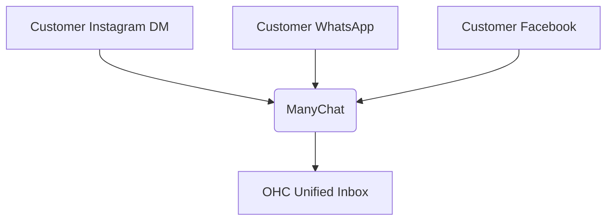
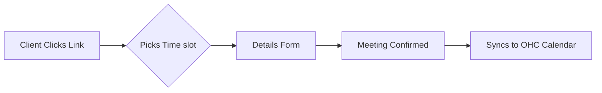
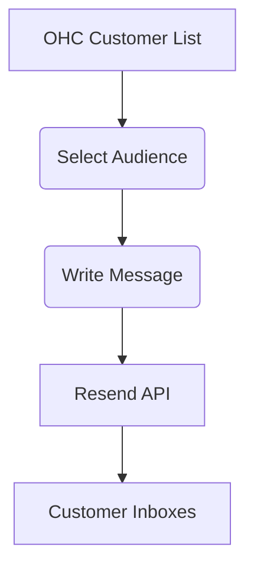
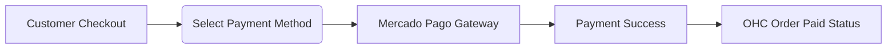
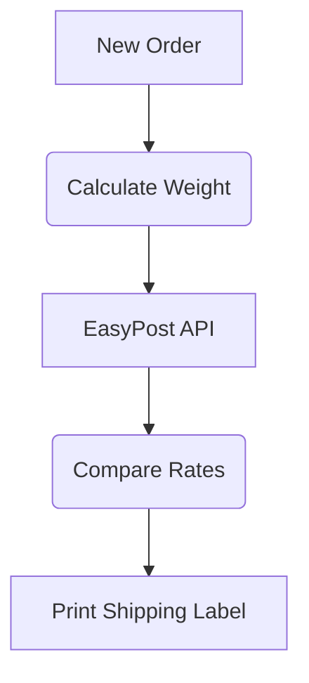
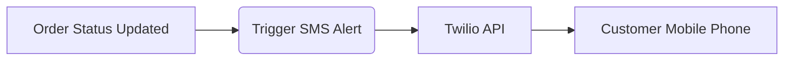
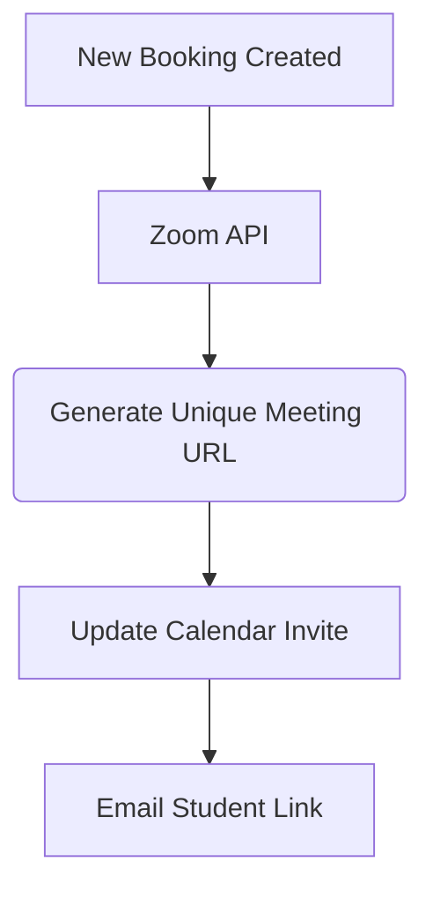

# Tool Integration Research Report

## 1. Social Media Integration: Unified Inbox

**Title**: Implement Unified Social Media Inbox via ManyChat

**Problem Statement**: Small business owners like Fatima struggle to keep up with customer inquiries scattered across Instagram DMs, Facebook Messenger, and WhatsApp. Missing a message often means missing a sale. They need one simple place to read and reply to all customer messages without juggling multiple apps.

**Research Report**:
ManyChat is a leading platform for consolidating social media messages.

| Feature | ManyChat | Meta Business Suite |
| --- | --- | --- |
| Channels | IG, FB, WhatsApp | IG, FB |
| Ease of Use | High | Medium |
| Automation | Visual flow builder | Basic auto-replies |
| Cost | Free tier, then $15/mo | Free |

**Persona Summary (Fatima)**: Fatima gets 50+ DMs a day on Instagram and WhatsApp asking for opening hours and cake prices. She needs a unified view to ensure no customer is ignored.

*Pricing Estimate*: Starts at $15/mo for Pro features.
*Environment Support*: Cloud and Standalone modes via API and webhooks.

**Design Doc**:
- **Trigger**: Customer sends a message on any connected social media platform.
- **Action**: The message is routed to the OHC Unified Inbox in real-time.
- **User Interface**: Business owner sees a single "Messages" tab in OHC. They can reply directly from OHC, and the reply is sent back to the customer's original platform.

**Implementation Prompt**:
Create a "Messages" page where users can view incoming messages from Instagram, Facebook, and WhatsApp. Users should be able to type a reply and send it. Acceptance criteria: Messages appear within 5 seconds of receipt, replies reach the customer's native app, and unread badges update correctly.

**Priority**: P0
**Estimated Scope**: Large

---

## 2. Calendar & Scheduling: Automated Booking

**Title**: Enable Automatic Meeting Scheduling with Calendly

**Problem Statement**: Business owners waste hours playing email ping-pong to find a time to meet with clients for consultations. They need a simple link they can share that lets clients pick an available time automatically.

**Research Report**:
Calendly provides an easy-to-use scheduling interface that syncs with personal calendars to prevent double-booking.

| Feature | Calendly | Cal.com |
| --- | --- | --- |
| Calendar Sync | Google, Outlook, Apple | Google, Outlook |
| Ease of Use | Extremely High | High |
| Customization | Good | Excellent |
| Cost | Free basic, $10/mo premium | Free for individuals |

**Persona Summary (Carlos)**: Carlos runs a consulting business and needs to schedule 30-minute discovery calls. He wants to send a link and have the meeting magically appear on his Google Calendar.

*Pricing Estimate*: $10/mo for premium features (custom branding, multiple event types).
*Environment Support*: Fully supported in Cloud. Standalone might require manual OAuth setup.

**Design Doc**:
- **Trigger**: Business owner copies their personal booking link from OHC and shares it.
- **Action**: Client books a time; the event is created on the owner's synced calendar.
- **User Interface**: OHC displays a "Booking Link" section on the dashboard and shows upcoming scheduled meetings in the daily agenda view.

**Implementation Prompt**:
Add a scheduling settings page where users can connect their calendar and set their working hours. Provide a shareable booking link. Acceptance criteria: Clients can visit the link, select a time, and the event appears in the OHC daily agenda view.

**Priority**: P1
**Estimated Scope**: Medium

---

## 3. Email Marketing: Customer Newsletters

**Title**: Integrated Email Newsletters via Resend

**Problem Statement**: Small businesses want to let their customers know about promotions and updates, but find tools like Mailchimp too complicated and expensive. They just want to send a nice-looking email to their customer list.

**Research Report**:
Resend offers a developer-friendly, highly reliable email sending API that can be simplified for end-users.

| Feature | Resend | Mailchimp |
| --- | --- | --- |
| Complexity | Low (API focus) | High (Marketing suite) |
| Deliverability | Excellent | Good |
| Cost | Free up to 3k/mo, then $20 | High at scale |

**Persona Summary (Sarah)**: Sarah runs a boutique and wants to email her 500 loyal customers about a summer sale without learning a complicated marketing platform.

*Pricing Estimate*: Free for most small businesses (under 3,000 emails/month).
*Environment Support*: Cloud and Standalone modes supported.

**Design Doc**:
- **Trigger**: Business owner clicks "Send Update" from their customer list.
- **Action**: Owner writes an email, and the system sends it to all selected customers.
- **User Interface**: A simple email composition window inside OHC, with a clean, branded template automatically applied. A dashboard shows how many people opened the email.

**Implementation Prompt**:
Build an "Email Update" feature on the Contacts page. Users can write a subject and message, then hit send. Acceptance criteria: Emails are delivered reliably to selected contacts, and the user can see basic open statistics on past updates.

**Priority**: P1
**Estimated Scope**: Medium

---

## 4. Payment Processing: Localized Payments

**Title**: Local Payment Processing Integration via Mercado Pago

**Problem Statement**: Stripe is not available or preferred everywhere. In LATAM, small businesses need to accept payments using popular local methods, but setting up a payment gateway is intimidating.

**Research Report**:
Mercado Pago is the dominant payment processor in Latin America, offering high conversion rates for local payment methods.

| Feature | Mercado Pago | Stripe |
| --- | --- | --- |
| LATAM Support | Excellent | Limited |
| Local Methods | Pix, Boleto, OXXO | Credit Cards mostly |
| Settlement Speed | Fast | Varies |

**Persona Summary (Diego)**: Diego runs an online store in Mexico and needs his customers to be able to pay in cash at OXXO or via local bank transfers.

*Pricing Estimate*: ~3.49% per transaction (varies by country).
*Environment Support*: Cloud and Standalone.

**Design Doc**:
- **Trigger**: Customer proceeds to checkout on an invoice or storefront.
- **Action**: Customer is presented with local payment options (e.g., Pix, OXXO).
- **User Interface**: Business owner links their Mercado Pago account via a simple login button in settings. Invoices clearly show "Pay with Mercado Pago".

**Implementation Prompt**:
Add Mercado Pago as a payment provider option in settings. Generate secure payment links for invoices. Acceptance criteria: Users can connect their account, and customers can successfully pay invoices using the generated Mercado Pago link, updating the invoice status to 'Paid'.

**Priority**: P2
**Estimated Scope**: Large

---

## 5. Shipping & Logistics: Simplified Shipping Labels

**Title**: Automated Shipping Label Generation with EasyPost

**Problem Statement**: Hand-writing shipping labels and waiting in line at the post office is a massive time sink for product-based businesses. They need a way to buy and print postage directly from their computer.

**Research Report**:
EasyPost aggregates dozens of shipping carriers into a single reliable platform, making it easy to compare rates and print labels.

| Feature | EasyPost | Shippo |
| --- | --- | --- |
| Carriers | 100+ Global | 80+ |
| Reliability | Extremely High | High |
| Cost | Pay-as-you-go | Monthly plans |

**Persona Summary (Emma)**: Emma ships 20 handmade candles a week. She wants to click one button to buy a USPS label and print it on her thermal printer.

*Pricing Estimate*: 1 cent per label printed + carrier postage costs.
*Environment Support*: Cloud and Standalone supported.

**Design Doc**:
- **Trigger**: Owner clicks "Fulfill Order" on a new purchase.
- **Action**: System fetches the cheapest shipping rate, purchases the label, and prepares it for printing.
- **User Interface**: An "Orders" view with a "Print Label" button. Once printed, the order status automatically changes to "Shipped" and the customer gets a tracking number.

**Implementation Prompt**:
Create a fulfillment workflow for product orders. Add functionality to enter package weight and dimensions, preview shipping costs, and generate a printable PDF label. Acceptance criteria: Users can purchase and print a valid shipping label, and tracking information is automatically saved to the order.

**Priority**: P2
**Estimated Scope**: Large

---

## 6. SMS & Notifications: Reliable Text Alerts

**Title**: Global SMS Notifications via Twilio

**Problem Statement**: Not all customers check their email. For urgent updates like appointment reminders or delivery notifications, business owners need a reliable way to send text messages.

**Research Report**:
Twilio is the industry standard for programmatic SMS, offering robust global delivery and compliance handling.

| Feature | Twilio | MessageBird |
| --- | --- | --- |
| Global Reach | Excellent | Excellent |
| Developer Tools | Industry Best | Good |
| Cost | ~$0.0079/msg (US) | Varies |

**Persona Summary (Liam)**: Liam runs a repair shop and wants to automatically text customers when their item is ready for pickup, as phone calls take too much time.

*Pricing Estimate*: Pay-as-you-go, roughly $0.01 per text message in the US.
*Environment Support*: Fully supported in both Cloud and Standalone modes.

**Design Doc**:
- **Trigger**: An appointment is approaching (24hr reminder) or an order status changes to "Ready".
- **Action**: System sends a brief text message to the customer's on-file phone number.
- **User Interface**: A simple toggle in settings: "Send SMS Reminders". Business owners can view a history of sent texts in the customer's profile.

**Implementation Prompt**:
Add automated SMS notifications for key events (e.g., appointment reminders). Provide a settings toggle to enable/disable SMS. Acceptance criteria: When enabled, a text message is delivered to the customer 24 hours before their scheduled appointment, and opt-out replies (e.g., "STOP") are handled automatically.

**Priority**: P1
**Estimated Scope**: Medium

---

## 7. Video Conferencing: One-Click Online Meetings

**Title**: Auto-Generate Zoom Links for Appointments

**Problem Statement**: Tutors, coaches, and consultants constantly have to manually create Zoom links and copy-paste them into calendar invites. They need this to happen automatically whenever an online meeting is booked.

**Research Report**:
Zoom remains the most recognized video conferencing tool for clients, despite strong competition from Google Meet.

| Feature | Zoom | Google Meet |
| --- | --- | --- |
| Client Familiarity | Universal | High |
| Connection Stability| High | High |
| Cost | Free for 40min, $15/mo | Included with Workspace |

**Persona Summary (Chloe)**: Chloe is an online language tutor. When a student books a lesson, she wants a unique Zoom link generated and sent to both of them instantly.

*Pricing Estimate*: Requires the user to have a Pro Zoom account ($15/mo) for API integration in some cases.
*Environment Support*: Cloud fully supported. Standalone supported via individual OAuth.

**Design Doc**:
- **Trigger**: A new appointment is scheduled with the location set to "Online".
- **Action**: A unique Zoom meeting room is created and the link is added to the appointment details.
- **User Interface**: The appointment detail page features a prominent "Join Video Call" button. The customer receives an email with a clean, clear "Join Meeting" button.

**Implementation Prompt**:
Integrate Zoom to auto-generate meeting links for virtual appointments. Acceptance criteria: When a user creates a new online appointment, a unique Zoom link is generated and attached to the event. A "Join" button appears in the UI that launches the meeting.

**Priority**: P2
**Estimated Scope**: Medium
