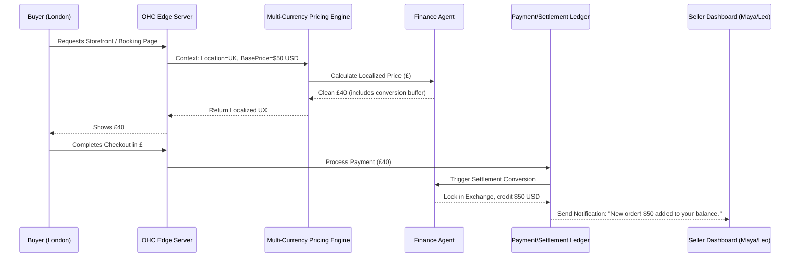

# [architecture] Invisible Cross-Border Multi-Currency Pricing & Settlement Engine

## Problem Statement

Small business owners like Leo (music tutor) and Maya (baker who ships non-perishable goods) increasingly operate globally. A student in London wants to book Leo (who is in the US), or a fan in Tokyo wants to buy Maya's cookies.

Currently, cross-border commerce involves a massive cognitive load: manually calculating exchange rates, struggling with confusing multi-currency pricing tiers, dealing with opaque cross-border transaction fees, and reconciling payouts in their home currency.

When non-technical small business owners face international buyers, they either lose the sale due to "sticker shock" from currency conversion fees at checkout, or they manually attempt to hack together different payment links (Stripe/PayPal) which breaks the unified business journey. They need a zero-configuration engine that automatically presents prices in the buyer's local currency, optimizes settlement fees, and ensures the seller gets exactly what they expect in their home currency, invisibly.

## Research Report

**Market Gap & Competitor Analysis:**

* **Shopify:** Offers Shopify Markets, but it is a complex configuration matrix. Setting up localized pricing requires understanding exchange rate buffers, manual rounding rules, and tax implications. It is built for dedicated e-commerce managers, not for Maya baking in her kitchen.
* **Wix / Squarespace:** Multi-currency support is often cosmetic (a dropdown that changes the display price) while checkout still happens in the primary store currency, leading to high cart abandonment from international buyers who see unexpected currency conversions at their bank.
* **Stripe (Raw):** Excellent underlying technology for multi-currency settlement, but exposes too much complexity (e.g., handling currency conversion fees, managing multiple settlement accounts) for the non-technical OHC user.

**The OHC Opportunity:**

OHC can abstract this entirely. We can leverage the KAIROS Orchestrator to intercept the buyer's localized context (via edge routing) and use the Finance Agent to dynamically present localized pricing. The seller (Leo/Maya) never configures exchange rates or rounding rules; they just set their base price (e.g., $50 USD), and the system ensures they receive $50 USD (minus standard OHC flat processing fees), while the buyer in London sees a clean, rounded £40.

## Design Doc

### Architecture Diagram

### Key Design Decisions

1. **Zero-Configuration for Seller:** The seller is never exposed to exchange rates, conversion buffers, or multi-currency ledger accounts. The "home currency" is the only currency the seller sees in their dashboard and payouts.
2. **Buyer-Centric Cosmetic Pricing:** The edge cache and pricing engine must automatically detect the buyer's locale and present "clean" rounded numbers (e.g., £40 instead of £39.87) to maximize conversion, with the Finance Agent absorbing micro-fluctuations in exchange rates via an automated buffer pool.
3. **Guaranteed Settlement:** The seller's base price is guaranteed. The buyer pays the dynamically calculated localized price, and OHC handles the internal conversion and routing seamlessly.

### Mobile UX Flow (375px First)

**Seller View (Maya/Leo):**

* **No "Multi-Currency" Settings Screen.** The feature is inherently invisible.
* **Dashboard Card:** When an international order is received, the activity feed simply shows: *"New Order from London! +$50.00 USD"* with a tiny tooltip: *"Paid in GBP, settled in USD automatically."*

**Buyer View:**

* **Seamless Localization:** The moment the buyer loads the storefront or booking calendar, all prices instantly display in their native currency with familiar formatting (e.g., £40). No confusing "Change Currency" dropdowns required, though one is available in the footer as a fallback.
* **Checkout Transparency:** At checkout, the total remains in their local currency. No warnings about "Your card may be charged in USD."

### AI Agent Integration Points

* **Finance Agent:** Continuously monitors exchange rate volatility. It dynamically calculates the necessary "conversion buffer" to add to the localized price to ensure the seller's base payout is protected against intra-day currency fluctuations.
* **Operations Agent:** Tags international orders correctly for customs/shipping logic, completely transparently to the seller until it's time to print a shipping label.

## Implementation Prompt

### Implementation Target: Implementer Swarm

**User-Facing Outcome:**

Implement a seamless Multi-Currency Pricing & Settlement Engine that guarantees zero-configuration for the small business owner while presenting perfectly localized, "clean" pricing to global buyers. Sellers only ever see and manage their base currency; buyers experience a fully localized checkout process.

**Core User Journeys (CUJ):**

1. **Buyer Discovery:** A buyer from the UK visits a US-based seller's store. The platform automatically detects their region and displays all products/services in GBP with clean, rounded pricing (e.g., £40 instead of £39.87).
2. **Buyer Checkout:** The buyer completes checkout in GBP without any warnings about cross-border conversion fees.
3. **Seller Settlement:** The seller receives an instant notification of the sale, with the payout credited entirely in their native currency (USD), exactly matching their base price.

**Acceptance Criteria:**

* The system must accurately detect buyer locale via the edge layer to serve the correct currency.
* The Finance Agent logic must automatically apply rounding and conversion buffers to present clean localized prices.
* The seller dashboard must remain 100% focused on their home currency; multi-currency complexity must be isolated from the seller UI.
* Ensure Zero-Trust tenant isolation applies to currency ledgers, securely associating the correct settlement payout to the correct tenant.
* The feature must be rigorously tested for 375px mobile viewports, ensuring the buyer checkout experience is pristine and the seller notifications are simple and understandable (passing the "Grandmother Test").

## Priority

**P1 (High)** - Crucial for unlocking global market access for digital products and services (Leo/Maya personas).

## Estimated Scope

**Large** - Involves edge caching updates, ledger modifications, and Finance Agent algorithmic integration.
