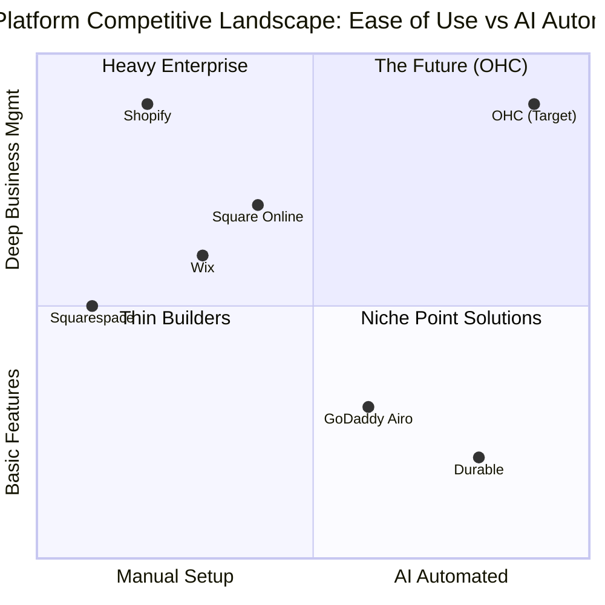
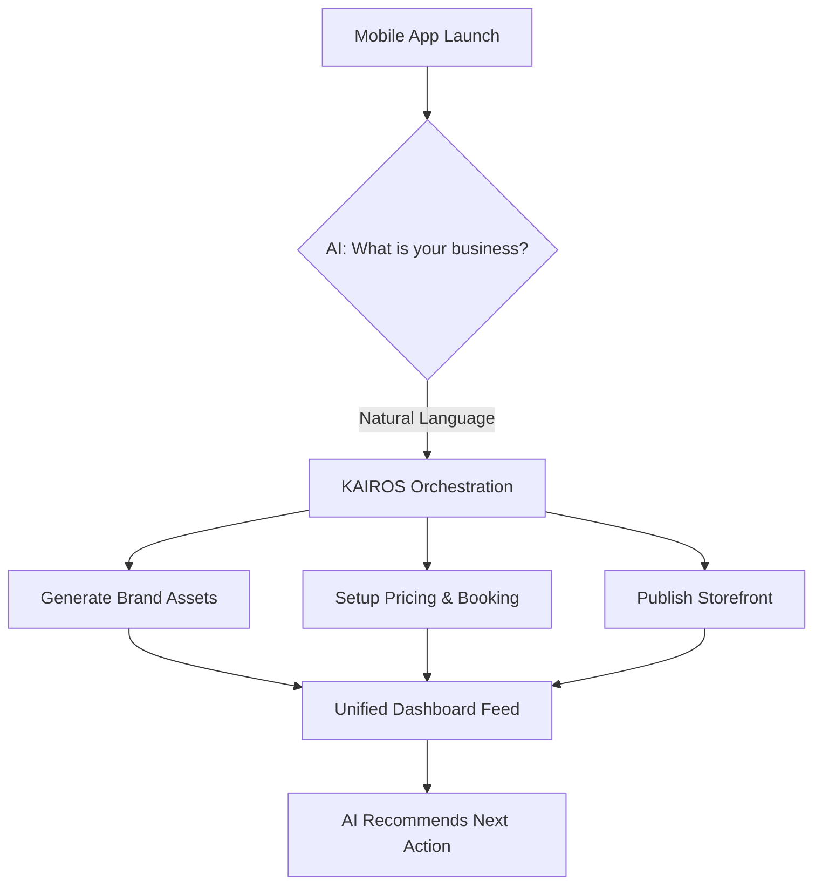

# 🔎 Scout: SMB Market Dominance & AI Automation Strategy

## Problem Statement
The vast majority of small business owners (SMBs) are non-technical. They excel at their craft (baking, tutoring, plumbing) but struggle to build an online presence. Existing platforms like Shopify and Wix present an overwhelming learning curve, requiring technical setup, disparate app integrations, and manual management. These owners face "tool fatigue" and lose money because they lack an automated, cohesive system to handle bookings, customer follow-ups, and marketing. They need an invisible, AI-powered system that runs their business so they can focus on their actual work.

## Research Report

### Persona Pain Points Analysis

| Persona | Role | Primary Pain Point | Current Solution | The OHC Opportunity |
|---------|------|--------------------|------------------|---------------------|
| **Maya (28)** | Baker | Overwhelmed by Shopify's complex setup. Needs mobile-first management. | Instagram DMs (messy, error-prone) | "1-Click AI Store Setup" with mobile management. |
| **Carlos (42)** | Handyman | Manual quoting, no booking system. Misses leads while working. | Phone calls, paper notebook | AI auto-reply agent for quotes and scheduling. |
| **Priya (35)** | Boutique Owner | Needs inventory sync across physical store and online. | Square POS + disjointed website | Seamless POS & online inventory sync with AI insights. |
| **Leo (22)** | Music Tutor | Manual booking chaos, no subscription billing. | Google Calendar + Venmo | Subscription billing + Automated AI follow-ups. |
| **Fatima (50)** | Food Cart | Limited English. Needs mobile order alerts & printouts. | Cash only, no pre-orders | Multilingual AI voice/text ordering via WhatsApp. |

### Competitive Landscape

### Top 10 SMB Pain Points (Validated by App Store / Reddit Analysis)
1. **"I can't figure out how to set up my payments and taxes."** (40% of negative Shopify reviews) - *OHC Gap: Built-in transparent payments API with guided onboarding.*
2. **"I just want to reply to Instagram DMs automatically but don't know how."** (Huge theme on r/smallbusiness) - *OHC Gap: AI auto-reply agent.*
3. **"Writing product descriptions takes me hours."** (Common Etsy/Shopify complaint) - *OHC Gap: Photo-to-description AI auto-generation.*
4. **"My booking system doesn't talk to my website."** (Service businesses using 3+ apps) - *OHC Gap: Unified booking/store entities.*
5. **"The mobile app doesn't let me do everything the desktop site does."** (Major complaint for Wix and Squarespace) - *OHC Gap: Tauri v2 Native Mobile application for full control.*
6. **"I forget to follow up with leads, and I'm losing money."** (r/entrepreneur feedback) - *OHC Gap: Autonomous agent lead follow-ups via email/SMS.*
7. **"Managing inventory across my pop-up shop and online store is a nightmare."** (Square/Shopify reviews) - *OHC Gap: Seamless Omni-channel syncing with predictive stock alerts.*
8. **"Setting up shipping rates makes no sense to me."** (Shopify forum) - *OHC Gap: Automated simplified regional shipping tiers via AI agent.*
9. **"I spend way too much time making social media posts to market my stuff."** (TikTok/YouTube creators) - *OHC Gap: AI generation of social posts connected directly to the catalog.*
10. **"English isn't my first language; the tools are too hard to use."** (Local restaurant/food cart reviews) - *OHC Gap: Natural language parsing via WhatsApp that translates/acts in the owner's language.*

### Market Sizing & Strategic Direction

#### Total Addressable Market (TAM)
- There are over 33 million small businesses in the US, with over 27 million being non-employer firms (solopreneurs). Globally, the World Bank estimates there are over 330 million SMBs.
- Over 35% of these non-employer firms have no functional online presence, and many more rely solely on Facebook or Instagram pages.

#### Beachhead Market
- **The Service Provider (e.g., Carlos, Leo):** Highest immediate pain due to app fragmentation. They need scheduling, quoting, billing, and communication in one place. They have a high LTV because resolving their booking pipeline directly and immediately impacts their revenue.

#### Geographic Expansion
- **Priority 1: LATAM (Spanish/Portuguese)** - Massive mobile-first SMB growth. High WhatsApp penetration. Focus on WhatsApp ordering integration.
- **Priority 2: India (Hindi/English)** - Rapidly digitizing informal sector. Price sensitive, requires localized payment gateways (UPI).
- **Localization Requirement:** Must support fully localized natural language onboarding and customer interaction.

#### Vertical Expansion
- After initial horizontal launch, OHC should focus on **"OHC for Field Services"** (Handymen, Plumbers, Electricians) offering deep scheduling, location tracking, and visual quoting, followed by **"OHC for Food"** (Food Carts, Pop-ups) with hyper-local pickup scheduling.

#### Marketplace Opportunity
- Yes, high demand for an **OHC Local Marketplace**. Allow businesses to opt-in to a localized discovery feed where customers can browse and buy from OHC-powered businesses in their city with unified checkout.

### Feature Gap Matrix

| Feature | Shopify | Wix | Squarespace | GoDaddy | OHC (Target Gap) |
|---------|---------|-----|-------------|---------|------------------|
| **Zero-Click Onboarding** | ❌ Complex | 🟨 Partial (ADI) | ❌ Manual | 🟨 Partial (Airo) | ✅ 100% Agentic Setup |
| **AI Auto-Replies (Social/Email)** | ❌ Needs App | ❌ Manual | ❌ Manual | ❌ Manual | ✅ Built-in Agent |
| **Mobile-First Full Management** | 🟨 OK | ❌ Poor | ❌ Poor | ❌ Poor | ✅ Tauri Native Mobile |
| **Autonomous Marketing (Auto-Post)** | ❌ Needs App | ❌ Manual | ❌ Manual | ❌ Manual | ✅ Built-in Agent |
| **Invisible Inventory Management** | ❌ Manual | ❌ Manual | ❌ Manual | ❌ Manual | ✅ AI Predictive Sync |

### OHC AI Differentiation Manifesto
OHC should leapfrog the competition by implementing the following 5 AI automations natively:
1. **Auto-replying to customer messages:** Saves hours per day.
2. **Auto-writing product descriptions:** Converts photos to SEO-optimized listings in seconds.
3. **Auto-generating social posts:** Removes the biggest marketing barrier.
4. **Auto-sending follow-up emails:** Recovers abandoned carts seamlessly.
5. **AI-generated weekly business insights:** Makes owners feel empowered via simple SMS summaries.

*Recommendation*: OHC should focus on the **Service Provider** beachhead (Carlos, Leo) first, as they suffer the most from "app fragmentation" (needing separate scheduling, billing, and site tools).

## Design Doc

### High-Level Architecture
- **Entities**: BusinessProfile, Product/Service, Booking/Order, CustomerInteraction, AgentRule.
- **Relationships**: A BusinessProfile has many Products/Services. A CustomerInteraction triggers an AgentRule.
- **Integration Points**: Native integration with Instagram/WhatsApp APIs for auto-replies, Stripe for seamless payments, Twilio for SMS notifications.

### User Flow (Mobile UX - 375px first)
1. **The "Grandmother Test" Onboarding**: User opens app. "What do you do?" (e.g., "I fix sinks in Austin").
2. **AI Generation**: A loading screen with glassmorphism blur (`backdrop-filter: blur(20px)`) shows agents building the store, writing copy, and setting up booking.
3. **The Dashboard**: A single feed. "You have 3 new messages. I already drafted replies." User taps "Approve".
4. **Adding a Product**: User snaps a photo. AI removes background, writes description, sets price estimate. User taps "Publish".

## Implementation Prompt
**Critical User Journey:** Implement the "1-Click AI Onboarding & Unified Inbox" for the mobile client.
- The user must be able to state their business in plain text.
- The AI must autonomously construct the basic storefront and booking entity.
- The dashboard must aggregate customer messages (mocked or real) and present an AI-drafted reply that the user can approve with a single tap (Touch target >= 44x44px).
- The UI must use Outfit for headings, Inter for body text, and adhere to OHC Premium Design Standards (glassmorphism).

**Acceptance Criteria:**
1. Onboarding takes < 30 seconds of active user input.
2. Storefront and booking link are generated automatically.
3. Unified inbox displays at least one AI-suggested reply.
4. Interface complies with mobile accessibility and touch target standards.

## Priority
**P0**

## Estimated Scope
**Large**