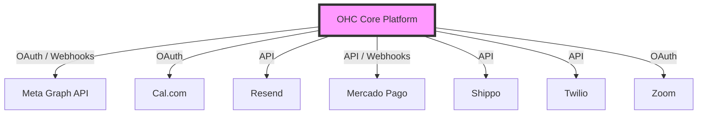

# Tool Integration Research Report: Q4

## Executive Summary
This report evaluates 7 critical tool categories to expand OHC's capabilities for small business owners. The focus is on tools that solve real-world pain points with minimal technical friction.

### Persona Analysis & Pain Points
| Persona | Business Type | Primary Pain Point | Proposed Category Solution |
|---------|---------------|--------------------|----------------------------|
| **Sarah** | Bakery Owner | Overwhelmed by IG/WhatsApp DMs, missing orders. | Social Media Integration |
| **John** | Consultant | Wastes hours emailing back-and-forth for scheduling. | Calendar & Scheduling |
| **Emma** | Boutique | Wants to send newsletters but finds Mailchimp complex. | Email Marketing |
| **Carlos** | LatAm Shop | Cannot use Stripe; customers prefer local payment methods. | Payment Processing |
| **Lisa** | Craft Seller | Manually copying addresses to USPS to print labels. | Shipping & Logistics |
| **Fatima** | Cleaning Service| Needs to send SMS reminders to clients who don't check email. | SMS & Notifications |
| **David** | Online Tutor | Manually creating Zoom links for every session. | Video Conferencing |

### Integration Architecture Overview

## Issue Briefs

### [Social Media Integration] Unified Inbox Integration via Meta Graph API
**Title:** Unified Inbox Integration via Meta Graph API
**Problem Statement:** Sarah (Bakery Owner) has to constantly switch between Instagram DMs, WhatsApp, and Facebook to respond to customer inquiries. It's overwhelming and she misses orders. She needs a single place to see all messages.
**Research Report:** Meta provides a unified Graph API to handle messages across Instagram, Facebook, and WhatsApp. It is highly rated for centralizing communications.
- *Ease of Use*: High for the user once connected.
- *Pricing*: Free to use the API.
- *Environment*: Cloud integration is straightforward via OAuth. Standalone mode requires users to set up a custom Meta app or use a cloud-proxy.
**Design Doc:** Integration is triggered when a user connects their Meta account in Settings. OHC will sync incoming messages via Webhooks into a new "Unified Inbox" view. OHC will send outgoing replies via the Graph API. The user sees a simple chat interface.
**Implementation Prompt:** Build a "Connect Meta" button in Settings. Create a Unified Inbox view where users can read and reply to messages from IG, FB, and WhatsApp. Acceptance criteria: A user can successfully connect their Meta account, receive an Instagram DM within OHC, and reply directly from the OHC interface.
**Priority:** P0
**Estimated Scope:** Large

### [Calendar & Scheduling] Automated Booking with Cal.com Integration
**Title:** Automated Booking with Cal.com Integration
**Problem Statement:** John (Consultant) spends hours going back and forth over email to find a time to meet with clients. He needs a simple link to share for instant booking.
**Research Report:** Cal.com is an open-source scheduling tool with a robust API and webhooks.
- *Ease of Use*: Very intuitive for non-technical users.
- *Pricing*: Free for basic scheduling.
- *Environment*: Excellent for both Cloud and Standalone (standalone can even self-host or connect to hosted API).
**Design Doc:** Users connect their Cal.com account. OHC generates scheduling links and embeds the booking page on the user's public OHC profile. Webhooks notify OHC of new bookings to update the internal OHC Calendar.
**Implementation Prompt:** Add a "Booking Link" field in the user profile. Integrate Cal.com webhooks to notify OHC of new bookings and display them on an internal OHC Dashboard Calendar. Acceptance criteria: A new booking made on a user's Cal.com page automatically creates an event in the OHC Calendar.
**Priority:** P1
**Estimated Scope:** Medium

### [Email Marketing] Simplified Customer Newsletters using Resend
**Title:** Simplified Customer Newsletters using Resend
**Problem Statement:** Emma (Boutique Owner) wants to email her customers about a new collection but finds traditional tools like Mailchimp too complex, bloated, and expensive.
**Research Report:** Resend is a modern, highly reliable email API.
- *Ease of Use*: We can abstract the API to provide a simple rich-text editor for users.
- *Pricing*: Very affordable, generous free tier.
- *Environment*: Cloud-friendly. Standalone would require users to provide their own Resend API keys.
**Design Doc:** OHC acts as a simplified campaign manager. Users select a customer segment, write a rich-text email, and click send. OHC formats the payload and dispatches it via the Resend API.
**Implementation Prompt:** Add a "Send Broadcast" feature in the Customer List view. Provide a minimal rich-text editor. Acceptance criteria: A user can select multiple customers and send them an email broadcast; emails are successfully delivered via Resend.
**Priority:** P1
**Estimated Scope:** Medium

### [Payment Processing] LATAM Payment Gateway Integration with Mercado Pago
**Title:** LATAM Payment Gateway Integration with Mercado Pago
**Problem Statement:** Carlos (Local shop owner in Mexico) cannot use Stripe because of high fees and his customers' preference for local payment methods like PIX or OXXO.
**Research Report:** Mercado Pago dominates LATAM and supports local cash payments, installments, and QR codes.
- *Ease of Use*: Standard checkout experience.
- *Pricing*: Moderate transaction fees.
- *Environment*: Fully supports both Cloud and Standalone environments.
**Design Doc:** Add Mercado Pago as a payment provider option in Billing Settings. OHC generates payment links or embeds a checkout widget for invoices. Webhooks listen for successful payments to update order status to "Paid".
**Implementation Prompt:** Add a "Connect Mercado Pago" option in Payment Settings. Allow users to generate invoices with a Mercado Pago payment link. Acceptance criteria: User generates an invoice, a customer pays via the MP link, and the OHC order status automatically updates to "Paid".
**Priority:** P1
**Estimated Scope:** Large

### [Shipping & Logistics] Automated Label Generation with Shippo
**Title:** Automated Label Generation with Shippo
**Problem Statement:** Lisa (Craft seller) manually copies addresses from orders into USPS to print shipping labels, wasting hours each week.
**Research Report:** Shippo aggregates multiple carriers (USPS, UPS, FedEx) into one API.
- *Ease of Use*: Drastically simplifies shipping for the merchant.
- *Pricing*: Very affordable for low-volume sellers.
- *Environment*: Fully supports both Cloud and Standalone via API integrations.
**Design Doc:** The OHC order detail page receives a "Create Shipping Label" button. When clicked, OHC sends package weight and dimensions to Shippo, and returns a printable PDF label and tracking number to the user.
**Implementation Prompt:** Add shipping settings (for default box sizes) and a "Buy Label" button on paid orders. Acceptance criteria: A user can click "Buy Label", select a shipping rate, download the resulting PDF label, and the order is updated with the tracking number.
**Priority:** P2
**Estimated Scope:** Medium

### [SMS & Notifications] Reliable SMS Reminders via Twilio
**Title:** Reliable SMS Reminders via Twilio
**Problem Statement:** Fatima (Cleaning Service) needs to send appointment reminders to her clients, many of whom don't check email or have smartphones.
**Research Report:** Twilio is the industry standard for SMS delivery with global coverage.
- *Ease of Use*: Abstracted for the user; they just toggle "Send SMS Reminders".
- *Pricing*: Pay-as-you-go per message.
- *Environment*: Cloud requires OHC to act as a proxy or bill users. Standalone requires users to input their own Twilio API keys.
**Design Doc:** OHC runs a background cron job that checks for appointments happening in 24 hours and dispatches an SMS via the Twilio API to the customer's phone number.
**Implementation Prompt:** Allow users to toggle SMS reminders in their notification settings. Acceptance criteria: The system successfully sends an automated SMS reminder via Twilio 24 hours before a scheduled event.
**Priority:** P1
**Estimated Scope:** Medium

### [Video Conferencing] Auto-generate Zoom Links for Consultations
**Title:** Auto-generate Zoom Links for Consultations
**Problem Statement:** David (Online Tutor) manually creates Zoom links and emails them to students for every session, leading to mistakes and lost time.
**Research Report:** Zoom API allows for automatic meeting creation upon booking.
- *Ease of Use*: High. Users connect once and forget it.
- *Pricing*: Free tier available (40 min limit).
- *Environment*: Cloud is straightforward via OAuth. Standalone needs a custom OAuth app setup.
**Design Doc:** When a virtual meeting is booked, OHC calls the Zoom API to create a meeting, retrieves the `join_url`, and attaches it to the appointment details and calendar invites.
**Implementation Prompt:** Add a "Connect Zoom" button in Integrations. When a virtual appointment is scheduled, auto-generate the meeting link. Acceptance criteria: User connects their Zoom account, and a new virtual booking automatically includes a valid Zoom link in the event details.
**Priority:** P2
**Estimated Scope:** Medium
