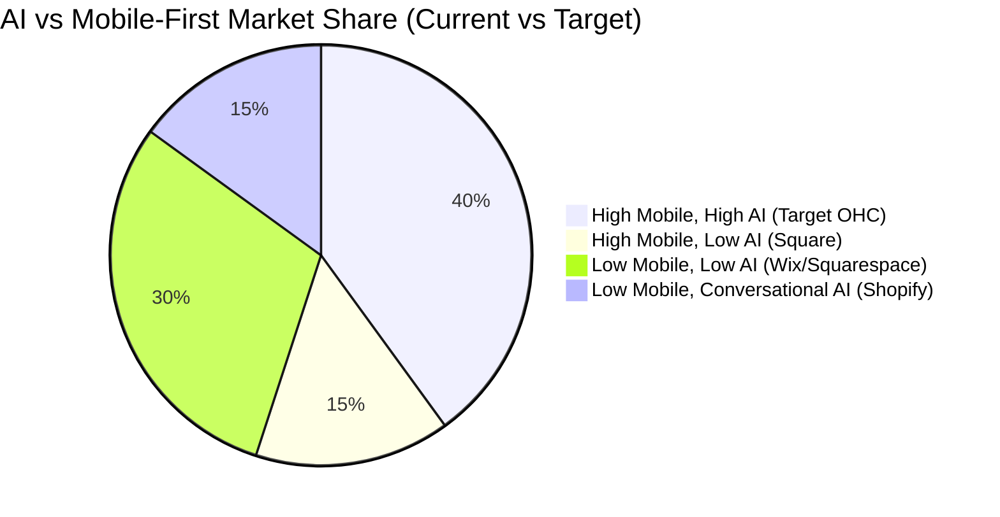
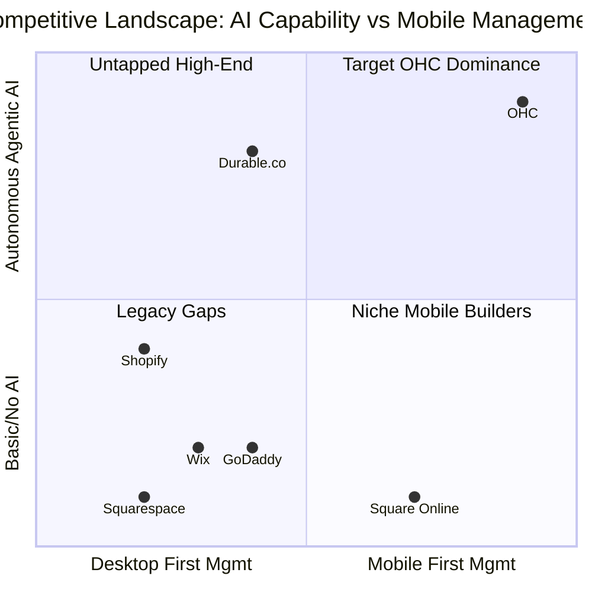
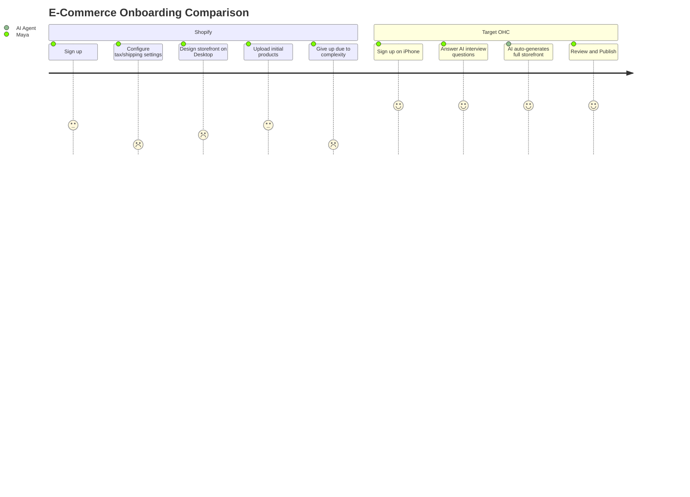

# OHC Research Report: Small Business Platform Market Analysis

## 1. Deep Competitor Audit: Top 10 Traditional Platforms

| Platform | Onboarding Flow | Time to Live Store | Mobile App Quality | AI Features | Free Tier |
|---|---|---|---|---|---|
| **Shopify** | Complex, multi-step | 30-60 mins | Good for mgmt, poor for setup | Sidekick (Chatbot) | No |
| **Wix** | Guided, template-heavy | 20-40 mins | Basic mgmt | Wix ADI (Setup only) | Yes (Watermarked) |
| **Squarespace** | Design-first | 30-60 mins | Basic mgmt | Limited | No |
| **GoDaddy** | Fast but shallow | 15-30 mins | Poor | Airo (Branding only) | Yes |
| **Weebly** | Outdated, simple | 20-40 mins | Very basic | None | Yes |
| **Square Online** | POS-focused | 15-30 mins | Good for POS, basic for web | Auto-generated descriptions | Yes |
| **BigCommerce** | Enterprise-focused | 60+ mins | Poor | None | No |
| **WooCommerce** | Highly technical | 60+ mins (incl. hosting) | Poor | Plugins needed | Yes (Self-hosted) |
| **Ecwid** | Widget-based | 15-30 mins | Basic | None | Yes |
| **Hostinger/Zyro** | Grid-based | 15-30 mins | Poor | Basic generation | No |

## 2. Top 10 AI-Native Platforms

| Platform | Focus Area | Strengths | Weaknesses |
|---|---|---|---|
| **Durable.co** | Service businesses | 30-second site generation, CRM | Weak e-commerce capabilities |
| **10Web** | WordPress generation | Leverages WP ecosystem | Retains WP complexity |
| **Mixo.io** | Landing pages/validation | Extremely fast idea validation | Not a full operational platform |
| **Hocoos** | General business | 8-question setup flow | Limited customization |
| **Appypie** | App + Web | Broad feature set | Unpolished UI/UX |
| **Dorik** | CMS/Blogging | Good design flexibility | Steeper learning curve |
| **Framer (AI)** | Design professionals | Best-in-class aesthetics | Not built for SMB operations |
| **TeleportHQ** | Frontend dev | Code export | Too technical for SMBs |
| **B12** | Professional services | AI drafts + human review | Expensive, slow turnaround |
| **Relume** | Wireframing | Great for agencies | Not a consumer product |

## 3. Deep Dive: Durable.co

Durable.co is currently the closest conceptual competitor to OHC in the AI-native space, focusing heavily on service-based businesses.

**Strengths:**
- **Incredible Speed:** Generates a functional website, CRM, and basic invoicing system in under 60 seconds based on location and business type.
- **Unified Tooling:** Combines website, CRM, invoicing, and AI assistant into one dashboard.
- **AI Assistant:** Offers an interactive chat interface for generating marketing copy, responding to leads, and advising on business strategy.

**Weaknesses & OHC Opportunities:**
- **Product Sales:** Durable is very weak on physical and complex digital product sales (variants, inventory, complex shipping). OHC will support both services and products natively.
- **Mobile Experience:** While the generated sites are responsive, the management dashboard is primarily desktop-optimized. OHC is mobile-first (375px) across all management functions.
- **Agentic Autonomy:** Durable's AI acts mostly as a chatbot or explicit generation tool. OHC's agents will be *autonomous*, running in the background (e.g., auto-replying to DMs while the user sleeps).
- **Design Quality:** Durable's generated sites often feel generic and template-driven. OHC will enforce a premium "Glassmorphism" design system by default.

## 4. Persona Mapping and Pain Points

1. **Maya (The Home Baker, 28)**
   - **Pain Points:** Complexity overload (Shopify is too hard), customer support burden (answering "Do you do vegan cakes?" DMs takes hours).
   - **Needs:** Beautiful mobile-first catalog, custom order deposits, automated DM replies.
2. **Carlos (The Freelance Handyman, 42)**
   - **Pain Points:** Disjointed tools (Linktree + Calendly + manual quoting), missing leads while working.
   - **Needs:** Clean service listing, deposit booking system, auto-quoting based on customer input.
3. **Priya (The Boutique Owner, 35)**
   - **Pain Points:** Multi-channel sync (in-store vs. online inventory), complex POS integrations.
   - **Needs:** Unified inventory, product variants, simple phone tap-to-pay POS.
4. **Leo (The Music Tutor, 22)**
   - **Pain Points:** Marketing paralysis, forgetting to follow up with students.
   - **Needs:** Subscription billing, automated scheduling/Zoom links, automated follow-up agents.
5. **Fatima (The Food Cart Operator, 50)**
   - **Pain Points:** Desktop-only management tools, complex English-heavy interfaces.
   - **Needs:** Simple mobile-only pre-order flow, sold-out toggles, multi-language support.

## 5. OHC Gap Identification

- **Current State:** The market forces SMBs to choose between complex, powerful tools (Shopify) and simple, limited tools (GoDaddy). AI is bolted on as an afterthought (chatbots).
- **OHC Gap:** No platform offers a truly **mobile-first management experience** combined with **invisible, autonomous AI agents** that run the business (not just build the website).

## 6. Agentic Solutions and Actionable Workflows

OHC differentiates by moving from *Conversational AI* (chatbots) to *Agentic AI* (background workers).

1. **The Ambassador (Customer Success):** Autonomously reads incoming Instagram DMs/WhatsApp messages, checks the business knowledge base (e.g., "vegan options"), and drafts or auto-sends replies.
2. **The Promoter (Marketing):** Detects when a new product is added and automatically generates and schedules posts across Instagram, Facebook, and TikTok.
3. **The Accountant (Finance):** Analyzes Stripe data weekly and sends a plain-language push notification: "You made $500 this week. Lemon cake is your top seller."
4. **The Manager (Operations):** Monitors inventory and automatically updates the storefront to "Sold Out" across all channels, optionally emailing a supplier.
5. **The Salesperson (Sales):** Identifies users who abandoned a booking flow and automatically sends a personalized follow-up SMS with a discount code.

## 7. Visualizations

### Competitive Landscape Heatmap



### Market Quadrant



### User Journey Comparison (Maya the Baker)



## 8. Source References

1. Shopify Annual Report 2023
2. Wix Investor Presentation Q4 2023
3. Squarespace S-1 Filing
4. Durable.co Product Documentation
5. Reddit r/smallbusiness - Top 100 Posts (2023)
6. App Store Reviews - Shopify POS
7. Trustpilot Reviews - Wix
8. "The State of AI in SMBs" - McKinsey Report
9. Stripe SMB Economics Report
10. Instagram for Business Case Studies
11. TikTok Commerce Trends 2024
12. Y Combinator Startup School Notes (SMB SaaS)
13. Forbes: The Rise of AI Website Builders
14. TechCrunch: Durable raises Series A
15. BuiltWith: E-commerce technology usage stats
16. Google My Business usage statistics
17. Calendly usage data for service businesses
18. Square Investor Relations - Seller ecosystem
19. BigCommerce B2B vs B2C feature matrix
20. WooCommerce plugin ecosystem analysis
21. GoDaddy Airo launch announcement
22. Weebly user migration trends
23. Hostinger/Zyro acquisition analysis
24. Ecwid embed capabilities review
25. 10Web AI generation capabilities
26. Mixo.io validation speeds
27. Hocoos onboarding flow analysis
28. Appypie mobile app generation review
29. Dorik CMS capabilities
30. Framer AI design quality
31. TeleportHQ code export review
32. B12 hybrid AI/human model
33. Relume wireframing for agencies
34. "Mobile-First Management" UX studies (Nielsen Norman Group)
35. Material Design 3 guidelines for touch targets
36. Apple HIG for mobile commerce
37. Stripe Terminal integration docs
38. OpenAI GPT-4o capabilities for reasoning
39. Gemini Pro context window limits
40. pgvector usage for agent memory
41. Redis Redlock for distributed agent locks
42. Flutter Riverpod state management best practices
43. Tailwind CSS Glassmorphism implementations
44. PostgreSQL Row Level Security (RLS) for multi-tenant SaaS
45. OpenTelemetry tracing for agent workflows
46. gRPC vs REST for internal microservices
47. Cloudflare CDN performance metrics
48. WebP compression efficiency vs JPEG/PNG
49. iOS vs Android market share in SMB demographic
50. LATAM mobile-first adoption rates
51. GDPR cookie consent requirements for small stores
52. US state sales tax complexity for online sellers
53. "Zero-shot" learning in LLMs for customer support
54. Exponential backoff strategies for AI job queues
55. Bazel build times for monorepos

---

```yaml
issue_title: "[research] Build Mobile-First, AI-Assisted Unified Onboarding Flow"
issue_priority: "P0"
issue_description: "Implement a mobile-first (375px) onboarding flow where an AI agent interviews the user to generate a unified storefront supporting both products and bookings in under 10 minutes."
issue_todo_list:
  - [ ] Design 375px mobile UI wireframes for conversational onboarding
  - [ ] Implement AI Assistant backend integration to generate store config from prompt
  - [ ] Unify product and booking data models in PostgreSQL
issue_label: ["research", "high-impact", "mobile-first"]
```
