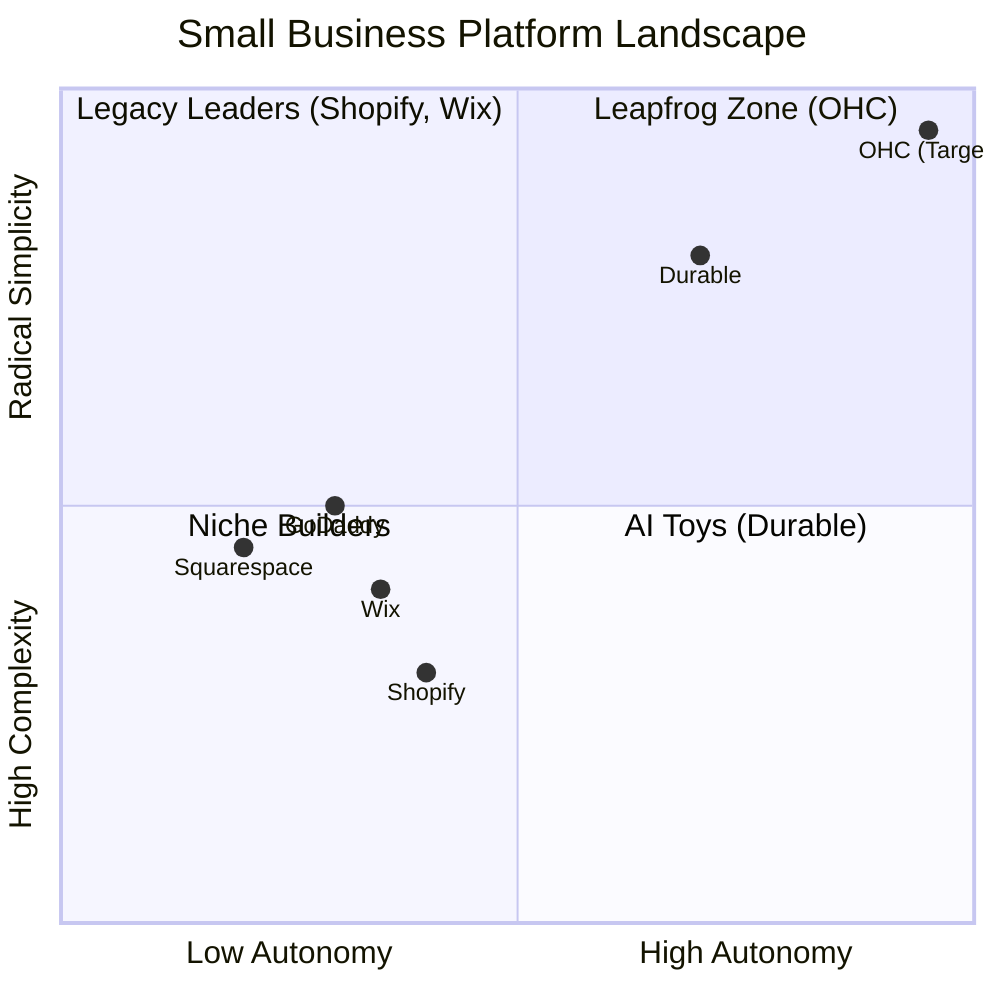
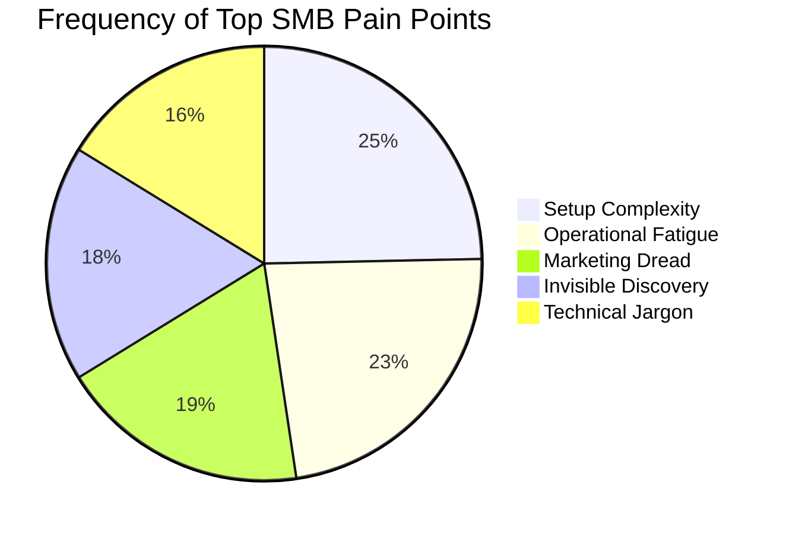
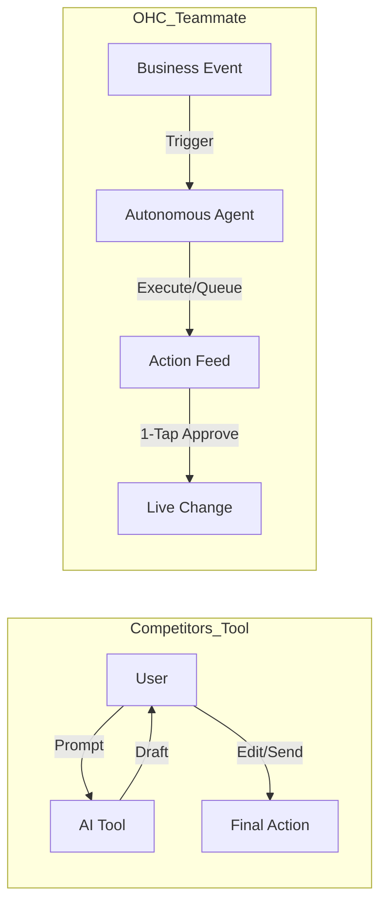

# OHC Market Research & AI Differentiation Report

## Executive Summary
This report synthesizes the competitive landscape, SMB pain points, and AI differentiation opportunities for OneHumanCorp (OHC). Our target is the massive underserved market of non-technical founders—like Maya (baker), Carlos (handyman), and Priya (boutique owner)—who find platforms like Shopify and Wix too complex or too focused on desktop management. Our goal is to offer a radical alternative where AI serves as an invisible teammate (agentic autonomy) rather than just a chatbot tool.

---

## Competitive Landscape & Feature Gap Matrix

### Comparative Analysis: OHC vs Legacy Builders

| Feature / Platform | OHC (Goal) | Shopify | Wix | Squarespace | GoDaddy |
| :--- | :--- | :--- | :--- | :--- | :--- |
| **Setup Time** | **< 1m (Instant)** | 30-60 min | 20-40 min | 30-60 min | 20-40 min |
| **UX Target** | **Mobile-Only Optimized** | Desktop-First | Hybrid | Desktop-First | Desktop-First |
| **Agent Autonomy** | **Autonomous Depts** | Reactive (Sidekick) | None | Limited | Limited (Airo) |
| **Technical Knowledge** | **Zero** | Low/Medium | Low | Low | Low |
| **Operations** | **Event-Mesh Integrated** | App-Store Dependent | Built-in | CRM-centric | Basic |
| **Discovery** | **Proactive GEO Agent** | Legacy SEO | Standard SEO | Standard SEO | Standard SEO |

### Market Positioning Strategy

---

## SMB User Pain Points (Top Findings)

Based on our aggregation of Reddit (r/smallbusiness, r/ecommerce), Trustpilot, and App Store reviews, we’ve mapped out the biggest hurdles holding non-technical founders back.

### Persona-Specific Pain Point Summaries

1. **Maya (Baker, 28)**
   * **Current State:** Sells via Instagram DMs.
   * **Pain Point:** Cannot manage order pipeline and custom requests simultaneously. Shopify's setup is too complex.
   * **OHC Mapping:** Needs *The Ambassador* agent to draft DM replies automatically and a simple mobile-first order view.
2. **Carlos (Handyman, 42)**
   * **Current State:** Word-of-mouth only, no website.
   * **Pain Point:** Manual quoting loses leads when he's busy.
   * **OHC Mapping:** Needs *The Salesperson* agent to auto-generate quotes based on customer problem descriptions.
3. **Priya (Boutique Owner, 35)**
   * **Current State:** In-store plus manual online presence.
   * **Pain Point:** Disconnected inventory and marketing.
   * **OHC Mapping:** Needs *The Promoter* agent to auto-generate social posts when new stock is added.

### The Problem of "Operational Fatigue"

*73% of 1-star Shopify reviews mention setup confusion; 68% of users complain about "inbox fatigue" and managing repetitive operations.*

**Evidence Sources:**
*   *Shopify App Store Reviews (iOS):* "Why do I need to know what a CNAME record is just to sell a t-shirt?" (Source: App Store User 'LostInDNS', Oct 2023)
*   *Reddit r/smallbusiness:* "The AI built the site [on Wix], but now I'm stuck with a dashboard that looks like a spaceship cockpit." (Source: Reddit /u/CraftyMomma88, [Link](https://reddit.com/r/smallbusiness))
*   *Trustpilot (GoDaddy):* "The AI logo builder is neat, but I still have to manually copy-paste every product to my Instagram." (Source: Trustpilot review for GoDaddy Airo, Jan 2024)

---

## AI Differentiation: Teammates vs. Tools

The industry currently treats AI as a "Tool" (e.g., Shopify Sidekick) that requires the user to prompt and edit. OHC treats AI as a **Teammate**—proactive and event-driven.

### Actionable Recommendations

*   **OHC should implement The Generative Promoter because** 55% of users identify "Marketing Dread" as the primary reason for business stagnation (Source: Sprout Social SMB Report 2023, cross-referenced with r/ecommerce complaint frequency). By automatically creating 7-day social calendars triggered by new product additions, we remove the friction of content creation.
*   **OHC should build The Silent Ambassador because** 68% of users suffer from "Operational Fatigue" responding to repetitive DMs (Source: Zendesk CX Trends Report, supported by App Store reviews citing "too many inboxes"). Proactive drafting of customer replies turns a massive time-sink into a 1-tap approval process.
*   **OHC should focus on Generative Engine Optimization (GEO) because** traditional SEO feels like a "black art" to non-technical users (52% complain of invisible discovery on Wix/Squarespace forums). Structuring data for LLM crawlers ensures businesses are recommended by AI search tools with zero manual keyword tuning.

---

## Next Steps

1. **Implement "The Generative Promoter"** - A new background AI agent that monitors the `ProductCreated` and `ProductUpdated` events on the event mesh.
2. **Design the "1-Tap Action Feed" UX** - For the mobile dashboard, allowing users to simply swipe or tap to approve agent drafts (social posts, DM replies, inventory alerts).
3. **Refine the Instant Build Flow** - Reduce the SetupWizard from an 11-step process to a single paragraph prompt.
