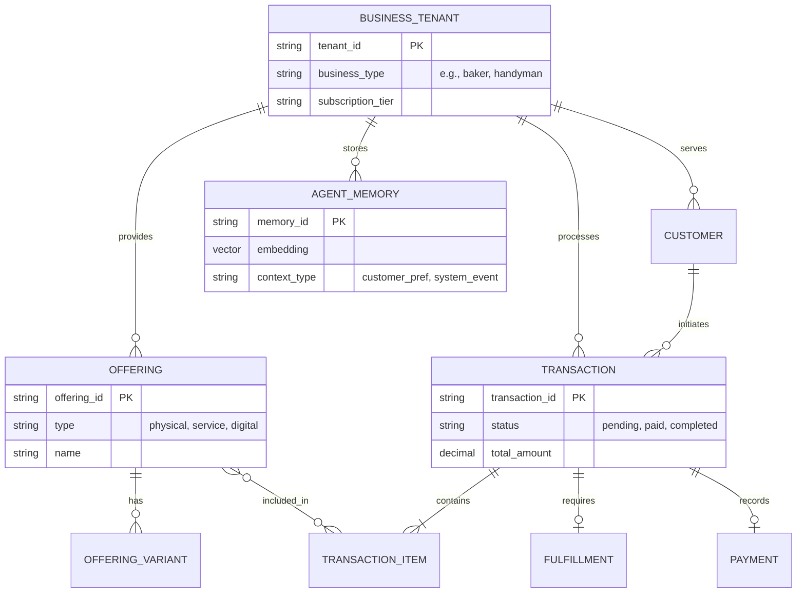

# Research: Core Data Model Architecture

## Problem Statement
The One Human Corp (OHC) platform is designed for diverse non-technical small business owners—from Maya the home baker needing simple order tracking, to Carlos the handyman managing complex bookings, and Priya the boutique owner syncing physical and digital inventory. Currently, the underlying data model lacks a unified conceptual framework that naturally accommodates this diverse Business Type Matrix without leaking complexity to the user. A handyman shouldn't have to navigate "E-commerce SKUs" to sell an hourly service, and a baker shouldn't see "Service Bookings" for a cupcake order.
We need a robust, multi-tenant Data Model Architecture that invisibly unifies these concepts. This architecture must support seamless AI Agent interactions (allowing agents to effortlessly query cross-domain history), ensure strict tenant isolation, and provide a seamless mobile-first experience without burdening the end user with database concepts.

## Research Report
### Context and Competitive Analysis
Competitors like Shopify focus heavily on standard e-commerce SKU models, which struggle to gracefully handle service bookings or digital subscriptions. Conversely, tools like Calendly excel at bookings but fail at physical inventory. Wix and Squarespace offer "app markets" that create disjointed data silos.

OHC's unique proposition is the **Hybrid Agentic OS**, where AI agents autonomously orchestrate across all domains. This requires a unified, flexible entity model rather than disjointed apps.

### Key Findings
1.  **Unified Business Entity**: Every user operates a "Business" (Tenant), which encapsulates all settings, products, and agents.
2.  **Polymorphic Offerings**: The concept of a "Product" must be polymorphic. A `Product` can be a physical good (Maya's cake), a service time-slot (Carlos's plumbing), a digital download, or a subscription package.
3.  **Unified Transaction Log**: Orders and Bookings are essentially transactions. An `Order` might include physical fulfillment steps, while a `Booking` includes calendar blocks, but both flow through the same financial and customer-success pipelines.
4.  **AI Context Fabric**: AI Agents need a unified graph to traverse relationships. E.g., "The Customer Success Agent" needs to see that Customer A bought a physical product last month and booked a service today, without querying completely separate databases.

## Design Doc
### Key Design Decisions and Invariants
- **Multi-Tenant Safety by Default**: Every operational entity *must* include a `tenant_id`. Database constraints (RLS) guarantee cross-tenant isolation. No query should ever span multiple tenants unless explicitly executed by global administrative billing processes.
- **Polymorphism over Fragmentation**: We will use abstract base concepts. A "Transaction" can be an order, a service booking, or a subscription charge. This ensures "The Accountant" AI agent only needs to understand "Transactions" to generate a financial report, rather than polling 5 different tables.
- **Invisible Complexity**: The UI layer masks the polymorphic backend. Maya sees "Add Cake" and "Orders". Carlos sees "Add Service" and "Calendar". The mapping is handled transparently by the mobile client based on their onboarding profile.
- **Agent Memory as a First-Class Citizen**: Entities will have direct relationships or semantic links to the `autodream_memories` vector store. This allows the AI to ground its decisions in actual business data (e.g., retrieving previous interactions with a specific `Customer` entity).

### Entity-Relationship Diagram (Mermaid.js)

### Mobile UX & Wireframe Flows (375px)
- **The "Add Something to Sell" Screen**:
  - **Premium UI**: Employs Glassmorphism panels with 20px blur over a soft gradient background. Outfit typography for headers, Inter for data points.
  - **Flow**: The user taps a floating "+" button. Based on their `business_type` (e.g., Handyman), the UI defaults to asking for "Service Name", "Duration", and "Hourly Rate". The complexity of variants or shipping weight is hidden entirely.
- **The "Business Pulse" Screen**:
  - **Flow**: Instead of a complex database table of orders, the user sees a chronological, natural-language feed (The "Pulse"). E.g., *"Carlos, you have a new leaky pipe booking for tomorrow at 2 PM. Deposit of $50 secured."*
  - **Interaction**: A 1-tap action button ("Confirm & Send Welcome Message") allows the user to interact with the underlying `TRANSACTION` entity via the AI agent.

### Migration Strategy
- **Incremental Rollout**: Introduce the new polymorphic `OFFERING` and `TRANSACTION` tables alongside existing schema.
- **Dual-Write Phase**: Update application logic to write to both old and new schemas simultaneously.
- **Backfill**: Run a background job to migrate historical data into the new schema, verifying consistency with checksums.
- **Cutover**: Once verified, switch read queries to the new schema and eventually drop the legacy tables.

### AI Integration Points
- **The Operations Agent**: Listens for state changes on `TRANSACTION`. If a transaction moves to "paid", it triggers fulfillment logic based on the polymorphic `OFFERING` type (e.g., generating shipping labels for Maya, blocking calendar slots for Carlos).
- **The Customer Success Agent**: Queries the `CUSTOMER` entity and joined `TRANSACTION` history to generate highly contextualized emails or SMS messages.
- **The Advisory Agent**: Performs aggregation queries over `TRANSACTION` to find seasonal trends, saving insights directly into `AGENT_MEMORY` for future retrieval.

## Implementation Prompt
**To Implementer Agent:**
Implement the polymorphic core entities (`Offering` and `Transaction`) mapping to the backend, alongside the unified `Customer` entity. The goal is to provide a single data API that the AI agents and the mobile UI can consume to fetch business data without needing to understand the difference between an e-commerce order and a service booking. Ensure that the business logic strictly enforces Row Level Security (RLS) constraints for `tenant_id` to guarantee multi-tenant safety. Design the mobile UI layer to present these generalized models to the user in a domain-specific way (e.g., showing a handyman "Bookings" instead of "Orders"). Ensure E2E tests cover the creation of a physical offering and a service offering, verifying that both process seamlessly through the unified transaction pipeline.

**Priority**: P0
**Estimated Scope**: Large
